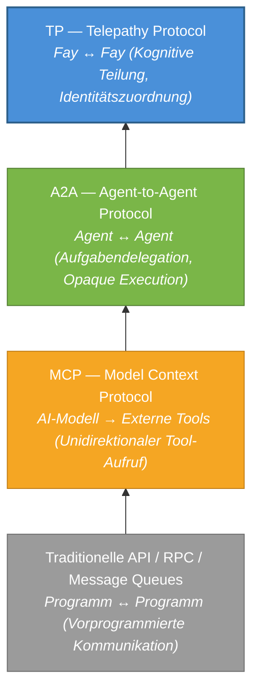
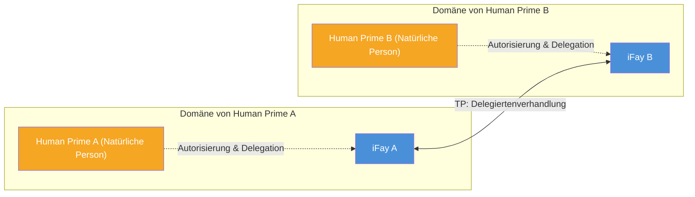

# Kapitel 1: Warum TP nötig ist

### 1.1 Analyse der Kommunikationsprotokoll-Schichten

In den vergangenen Jahrzehnten der Software-Engineering-Praxis hat sich die Entwicklung von Kommunikationsprotokollen stets um eine zentrale Fragestellung gedreht: **Wie können zwei Recheneinheiten effizienter Informationen austauschen?** Mit dem Aufstieg des AI-Agent-Ökosystems erfährt diese Fragestellung einen grundlegenden Paradigmenwechsel.

#### Traditionelle API / RPC / Message Queues: Vorprogrammierte Kommunikation zwischen Programmen

Traditionelle Kommunikationsprotokolle — ob RESTful APIs, gRPC oder Message Queues (wie Kafka, RabbitMQ) — lösen das Problem der **vorprogrammierten Kommunikation zwischen Programmen**. Ihr Kernmerkmal ist, dass der Aufrufer das Aufrufziel, die Aufrufmethode und die Parameter zur Entwicklungszeit festlegt. Der Interface Contract wird vor dem Deployment fixiert und lässt zur Laufzeit extrem wenig Flexibilität.

Dieses Modell funktioniert gut in deterministischen Systemen, aber seine Grenzen werden vollständig offengelegt, wenn es mit der Dynamik und Autonomie von AI Agents konfrontiert wird — Agents müssen zur Laufzeit Fähigkeiten entdecken, Absichten aushandeln und Dienste dynamisch zusammenstellen, anstatt alles zur Entwicklungszeit fest zu codieren.

> **Praxisbeispiel**: Ein Reiseplanungs-Agent muss gleichzeitig Flugsuche, Hotelbuchung, Wettervorhersage und Visaberatung aufrufen. Unter dem traditionellen API-Modell müssen Entwickler zur Entwicklungszeit den Endpoint, das Parameterformat und die Aufrufreihenfolge jedes Dienstes festlegen. Wenn der Benutzer spontan sein Reiseziel ändert, muss möglicherweise die gesamte Aufrufkette neu orchestriert werden — was zur Laufzeit extrem schwierig ist.

#### MCP (Model Context Protocol): Verbindung von AI-Modellen mit externen Tools

2024 veröffentlichte Anthropic das Model Context Protocol (MCP), das das Verbindungsproblem zwischen AI-Modellen und externen Tools lösen soll. MCPs Kernarchitektur folgt dem **Host → Client → Server**-Modell und bietet AI einen „Toolbox-Entdeckungsmechanismus" — Modelle können zur Laufzeit verfügbare Tools dynamisch entdecken, das Input/Output-Schema der Tools verstehen und Aufrufe initiieren.

Allerdings ist MCPs Kommunikationsrichtung **unidirektional**. Das AI-Modell ist immer die aktive Partei, und Tools sind immer passiv. Tools senden keine Informationen proaktiv an Modelle, noch verhandeln sie mit anderen Tools. MCP löste das Problem „wie AI Tools nutzt", adressierte aber nicht die Fragestellung „wie Agents miteinander zusammenarbeiten".

> **Praxisbeispiel**: Ein Kundenservice-Agent ist über MCP mit einem Wissensbasis-Suchtool und einem Ticketsystem verbunden. Wenn die Frage eines Benutzers die Fähigkeiten des Kundenservice-Agents übersteigt, muss er an einen technischen Support-Agent eskalieren. Aber MCP bietet keinen Mechanismus für die Kommunikation zwischen Agents — der Kundenservice-Agent kann nur Tools aufrufen, er kann nicht „einen Kollegen um Hilfe bitten".

#### A2A (Agent-to-Agent Protocol): Aufgabendelegation und Zusammenarbeit zwischen Agents

2025 veröffentlichte Google das Agent-to-Agent Protocol (A2A), das die Kommunikationsperspektive von „Modell und Tools" auf „Agent und Agent" hebt. A2A führte drei Schlüsselkonzepte ein:

- **AgentCard** (Fähigkeitskarte): Eine standardisierte Beschreibung, durch die ein Agent seine Fähigkeiten nach außen deklariert
- **Task**: Eine ausführbare Arbeitseinheit, die zwischen Agents übergeben wird
- **Message**: Ein Informationsaustauschträger während der Aufgabenausführung

A2A ermöglicht es verschiedenen Agents, gegenseitig ihre Fähigkeiten zu entdecken, Aufgaben zu delegieren und Fortschritte zu melden. Sein Kerndesignprinzip — **Opaque Execution** — legt jedoch ausdrücklich fest, dass Agents keinen internen Zustand, kein Gedächtnis und keine Tool-Implementierungsdetails teilen. Jeder Agent ist eine Black Box, die nur Input/Output-Schnittstellen exponiert.

> **Praxisbeispiel**: Ein Projektmanagement-Agent delegiert eine Code-Review-Aufgabe an einen Code-Review-Agent. Unter A2A muss der Projektmanagement-Agent den vollständigen Code-Diff, Projektspezifikationen und historische Review-Aufzeichnungen in eine Nachricht serialisieren. Der Code-Review-Agent gibt Ergebnisse zurück, aber der Projektmanagement-Agent kann die Reasoning-Logik während des Reviews nicht „sehen" — er sieht nur die endgültigen Review-Kommentare. Wenn er fragen möchte „warum wurde dieses Codesegment als riskant markiert", ist eine weitere vollständige Nachrichtenrunde erforderlich.

#### TP: Eine kognitive Teilungsschicht über MCP / A2A

Telepathy Protocol (TP) zielt nicht darauf ab, eines der oben genannten Protokolle zu ersetzen. Stattdessen etabliert es eine völlig neue **kognitive Teilungsschicht** auf deren Grundlage.

Das folgende Diagramm veranschaulicht die progressive Beziehung zwischen diesen vier Protokollschichten:

Jede Protokollschicht entstand, weil die vorherige neue Fragen nicht beantworten konnte. Traditionelle APIs können mit der Dynamik von AI nicht umgehen, MCP kann die Zusammenarbeit zwischen Agents nicht unterstützen, A2A kann keine kognitive Teilung erreichen — und TP ist genau dafür konzipiert, diese letzte Lücke zu füllen.

### 1.2 Das Delegiertenverhandlungs-Paradigma

#### Implizite Annahmen bestehender Protokolle

MCP, A2A und die überwiegende Mehrheit bestehender Kommunikationsprotokolle teilen eine gemeinsame implizite Annahme: **Die kommunizierenden Parteien sind unabhängige, nicht verbundene Dienstentitäten**.

In MCPs Welt ist ein Tool eine zustandslose Funktion — es spielt keine Rolle, wer es aufruft, und es kümmert sich nicht darum, wen der Aufrufer vertritt. In A2As Welt ist ein Agent ein autonomer Dienstknoten — er akzeptiert Aufgaben, führt sie aus und gibt Ergebnisse zurück, aber er kümmert sich nicht darum, wer der Auftraggeber hinter der Aufgabe ist, noch muss er jemandes Interessen schützen.

Diese Annahme ist in technischen Dienstszenarien vernünftig. Aber wenn AI Agents beginnen, im Namen realer Menschen zu handeln, gilt diese Annahme nicht mehr.

#### Die iFay-Weltanschauung: Jeder Fay hat einen Human Prime

Im iFay-System ist die Weltanschauung grundlegend anders. Jeder Fay — ob ein iFay, der eine Einzelperson vertritt, oder ein coFay, der eine öffentliche soziale Funktion erfüllt — hat einen klar definierten **Human Prime**. Ein Fay handelt im Namen seines Human Prime, schützt die Interessen des Human Prime und wahrt die Privatsphäre des Human Prime.

Das bedeutet, dass wenn zwei Fays kommunizieren, grundlegend kein Datenaustausch zwischen zwei Softwarediensten stattfindet, sondern vielmehr **eine Verhandlung zwischen zwei Delegierten, die im Namen ihrer jeweiligen Human Primes handeln** — ähnlich wie Anwälte im Namen ihrer Mandanten verhandeln oder Sekretäre Angelegenheiten im Namen ihrer Vorgesetzten koordinieren.

Dieses „Delegiertenverhandlungs"-Paradigma stellt völlig neue Anforderungen an Kommunikationsprotokolle:

- **Identitätszuordnung**: Das Protokoll muss klar identifizieren, wen jede kommunizierende Entität vertritt. Wenn beispielsweise ein Fay im Namen eines Patienten einen Termin bei einem Krankenhaus-coFay bucht, muss der Krankenhaus-coFay bestätigen können, dass „dieser Fay tatsächlich vom Patienten autorisiert ist, den Termin zu vereinbaren", anstatt dass jeder den Fay des Patienten imitieren kann.
- **Vertrauensgrenzen**: Der Informationsaustausch zwischen Delegierten muss innerhalb des von ihren Human Primes autorisierten Rahmens erfolgen. Beispielsweise autorisiert ein Patient seinen Fay, Allergiehistorie und aktuelle Symptome mit dem Krankenhaus zu teilen, erlaubt aber nicht das Teilen von psychologischen Beratungsaufzeichnungen — der Fay muss diese Grenze strikt einhalten.
- **Datenschutz**: Sensible Daten der Human Primes müssen während der Übertragung verschlüsselt sein, mit Unterstützung für selektive Offenlegung. Beispielsweise müssen bei einem Versicherungsanspruch nur der Diagnosecode und die Kostenaufschlüsselung offengelegt werden, ohne die vollständigen Krankenakten preiszugeben.
- **Auditierbarkeit**: Alle Delegiertenaktionen müssen nachverfolgbar sein, damit Human Primes sie im Nachhinein überprüfen können. Beispielsweise kann ein Human Prime überprüfen „mit welchen Fays mein Fay in der letzten Woche Daten geteilt hat und welche Daten geteilt wurden" — ähnlich wie die Überprüfung der Transaktionshistorie eines Bankkontos.

### 1.3 Blinde Flecken bestehender Protokolle

Zusammenfassend aus der obigen Analyse haben bestehende Protokolle drei fundamentale blinde Flecken bei „Delegiertenverhandlungs"-Szenarien:

#### Keine Identitätszuordnung

Weder MCP noch A2A befasst sich damit, wen ein Agent vertritt. Tools in MCP haben kein Konzept von „Zuordnung"; AgentCards in A2A beschreiben die eigenen Fähigkeiten des Agents, nicht die Identität und Autorisierung des dahinterstehenden Auftraggebers. Aus TPs Perspektive ist **Kommunikation ohne Identitätszuordnung unvollständig** — sie kann keine Vertrauensbasis schaffen und keine Verantwortungsgrenzen abgrenzen.

> **Praxisbeispiel**: Stellen Sie sich einen Immobilienmakler vor, der im Namen eines Käufers mit dem Makler des Verkäufers über den Preis verhandelt. Unter A2A kann der Makler des Verkäufers nicht verifizieren, dass „die Gegenseite wirklich einen Käufer mit Kaufabsicht vertritt", noch kann er bestätigen, „ob der Käufer diese Preisspanne für die Verhandlung autorisiert hat". Das ist wie ein Fremder ohne Vollmacht, der behauptet, jemanden bei einem Geschäft zu vertreten — es gibt keine Vertrauensbasis.

#### Kein Datenschutz

Bestehende Protokolle verfügen über keine systematischen Schutzmechanismen für die Privatsphäre-Daten des Human Prime. MCPs Tool-Aufrufe übertragen Parameter im Klartext; A2As Messages bieten ebenfalls keine Ende-zu-Ende-Verschlüsselung oder selektive Offenlegungsfähigkeiten. Wenn Agents im Namen ihrer Human Primes Gesundheitsdaten, Finanzdaten oder Identitätsnachweise übertragen müssen, können bestehende Protokolle keine ausreichenden Sicherheitsgarantien bieten.

> **Praxisbeispiel**: Der Fay eines Arbeitssuchenden reicht einen Lebenslauf bei einem coFay eines Personalvermittlers ein. Der Arbeitssuchende möchte nur Berufserfahrung und Fähigkeiten offenlegen, aber nicht sein aktuelles Gehalt und seine Privatadresse preisgeben. Unter A2A ist die Wahl entweder alles zu senden (Datenschutzverletzung) oder nichts zu senden (Bewerbung kann nicht abgeschlossen werden). Es gibt keinen Mechanismus für „die Gegenseite nur das sehen lassen, was ich erlaube".

#### Keine geteilte Kognition

A2A deklariert ausdrücklich das Opaque-Execution-Prinzip — Agents teilen keinen internen Zustand. Dieses Design ist in lose gekoppelten Service-Orchestrierungsszenarien vernünftig, wird aber in Szenarien, die tiefe Zusammenarbeit erfordern, zum Engpass.

Wenn zwei Fays dasselbe Dokument diskutieren, gemeinsam ein komplexes Problem durchdenken oder an derselben Ansicht zusammenarbeiten müssen, bedeutet „keinen internen Zustand teilen", dass jede Interaktionsrunde alle relevanten Informationen serialisieren und übertragen muss — das ist nicht nur ineffizient, sondern führt auch durch wiederholte Serialisierung und Deserialisierung zu Informationsverlust und semantischer Mehrdeutigkeit.

> **Praxisbeispiel**: Zwei Architekturdesign-Fays müssen gemeinsam ein Gebäude entwerfen. Unter A2A zeichnet Fay A einen Grundriss und serialisiert ihn in eine Nachricht an Fay B; Fay B schlägt Änderungen vor und serialisiert den gesamten Bauplan zurück; Fay A überarbeitet und sendet erneut... jede Runde beinhaltet die Übertragung des vollständigen Bauplans. Aber wenn beide Parteien dieselbe Designansicht teilen könnten (wie zwei Architekten, die vor derselben Zeichnung stehen), zeichnet einer eine Linie und der andere sieht sie sofort — die Effizienz würde um Größenordnungen steigen.

TP wurde genau geboren, um diese drei blinden Flecken zu füllen.
