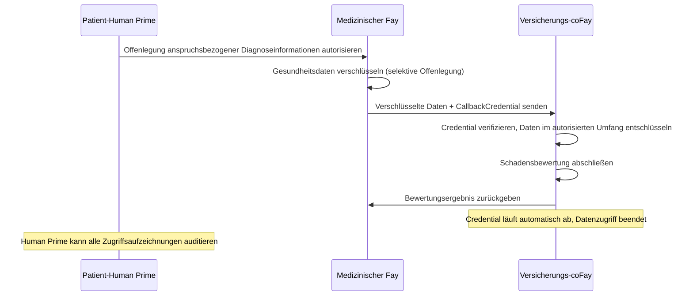
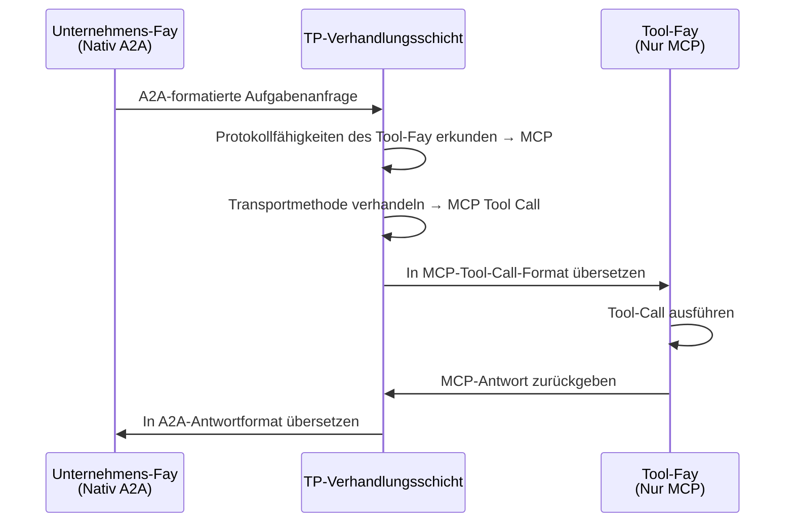
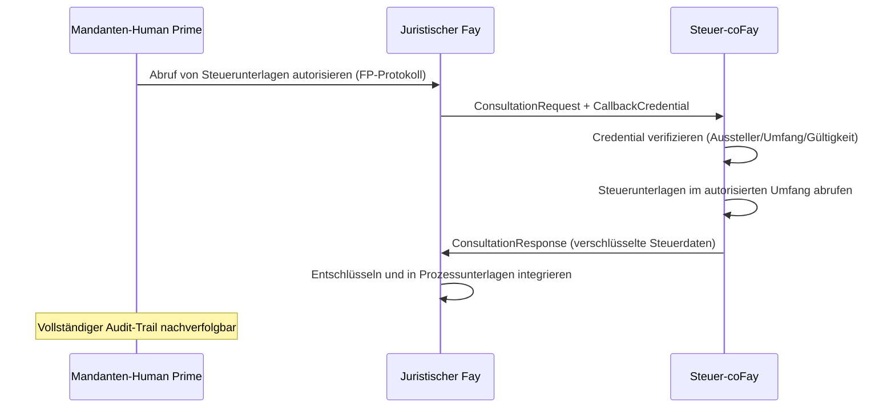
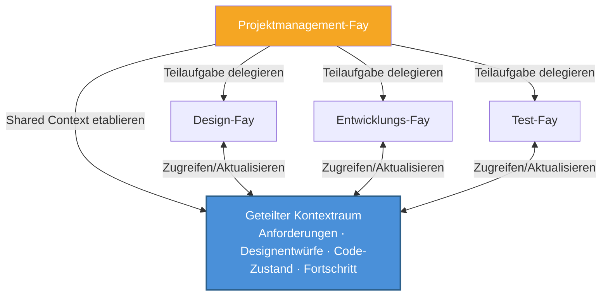
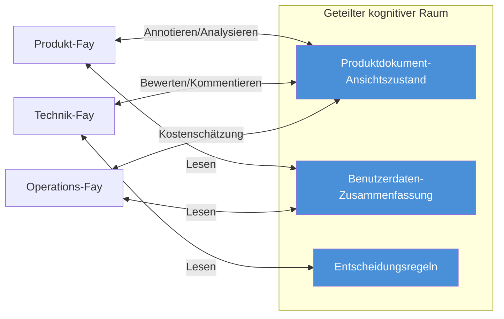

# Kapitel 4: Anwendungsszenarien

Die folgenden fünf Szenarien demonstrieren TPs praktische Anwendungen in verschiedenen Geschäftsbereichen und decken Kernfähigkeiten ab, darunter Datenschutzdelegation, protokollübergreifende Brückenbildung, Credential-Weitergabe, Multi-Fay-Zusammenarbeit und Shared-Context-Meetings.

### 4.1 Datenschutzdelegierte Konsultation

**Szenario**: Ein Patient-Human Prime benötigt seinen medizinischen Fay, um Gesundheitsdaten an einen Versicherungs-coFay zu übermitteln und eine Schadensbewertung zu erhalten.

Unter traditionellen Agent-Kommunikationsmodellen müsste der medizinische Agent die vollständigen Gesundheitsakten des Patienten in eine Nachricht serialisieren und an den Versicherungs-Agent senden — das bedeutet, alle Daten werden im Klartext über das Netzwerk übertragen, und der Empfänger erhält Zugang zu weit mehr Informationen als nötig.

Unter TPs kognitivem Teilungsmodell ist der Prozess grundlegend anders:

1. **Human Prime-Autorisierung**: Der Patient-Human Prime autorisiert den medizinischen Fay über das FP-Protokoll und spezifiziert ausdrücklich, dass nur für diesen Anspruch relevante Diagnoseinformationen offengelegt werden dürfen (wie Diagnosecodes, Behandlungsdaten, Kostenaufschlüsselungen), während andere Gesundheitsakten (wie psychologische Beratungsaufzeichnungen, genetische Testergebnisse) verschlüsselt und unsichtbar bleiben
2. **Selektive Offenlegung**: Der medizinische Fay nutzt TPs `SelectiveDisclosure`-Mechanismus, um autorisierte Daten in verschlüsselter Form an den Versicherungs-coFay zu übermitteln, zusammen mit einem zeitlich begrenzten `CallbackCredential`
3. **Kontrollierter Zugriff**: Der Versicherungs-coFay greift über das Callback-Credential in begrenztem Umfang auf autorisierte Daten zu und schließt die Schadensbewertung ab
4. **Automatischer Ablauf**: Nach Abschluss der Bewertung läuft das Callback-Credential automatisch ab, und der Versicherungs-coFay kann nicht mehr auf Patientendaten zugreifen
5. **Vollständige Auditierung**: Alle Datenzugriffsaufzeichnungen werden im Audit-Trail protokolliert, und der Patient-Human Prime kann sie jederzeit überprüfen

Dieses Szenario verkörpert TPs Prinzip der **Human Prime-souveränen Privatsphäre** — der Umfang der Datenoffenlegung wird immer vom Human Prime bestimmt, nicht vom eigenen Urteil des Fay.

### 4.2 Protokollübergreifende Übersetzung

**Szenario**: Ein Unternehmens-Fay, der nativ A2A unterstützt, muss einen spezialisierten Tool-Fay aufrufen, der nur MCP-Tool-Calls unterstützt.

In einer Welt ohne TP können diese beiden Fays einfach nicht direkt kommunizieren — sie „sprechen" völlig verschiedene Protokollsprachen. Die A2A-JSON-RPC-Anfragen des Unternehmens-Fay können vom Tool-Fay nicht geparst werden; die MCP-Tool-Call-Schnittstelle des Tool-Fay kann vom Unternehmens-Fay nicht aufgerufen werden. Entwickler müssten für jede Protokollkombination dedizierte Adapter schreiben.

TPs Protokollverhandlungs- und Übersetzungsmechanismus ändert diese Situation grundlegend:

1. **Fähigkeitserkundung**: Der Unternehmens-Fay initiiert eine Kommunikationsanfrage über TP, und die TP-Verhandlungsschicht erkundet automatisch die Protokollfähigkeiten des Tool-Fay und entdeckt, dass er nur MCP-Tool-Calls unterstützt
2. **Vertragsverhandlung**: TP verhandelt die Transportmethode zwischen beiden Parteien und bestimmt MCP-Tool-Call als den zugrunde liegenden Transportkanal
3. **Semantisches Mapping**: TP bildet Intent, Parameter und Context aus der A2A-formatierten Aufgabenanfrage des Unternehmens-Fay in das MCP-Tool-Call-Eingabeformat ab
4. **Transparente Übersetzung**: Der Tool-Fay empfängt eine Standard-MCP-Tool-Call-Anfrage, völlig unbewusst von TPs Existenz; nach der Ausführung übersetzt TP die MCP-Antwort zurück in A2A-Format für den Unternehmens-Fay

Der Schlüsselwert dieses Szenarios ist: **Protokollunterschiede sind für die übergeordnete Geschäftslogik vollständig transparent**. Der Unternehmens-Fay muss nicht wissen, welches Protokoll die Gegenseite verwendet, noch muss er Adaptercode für jedes Protokoll schreiben. TPs adaptive Übersetzungsschicht ermöglicht Fays in einem heterogenen Protokoll-Ökosystem nahtlose Zusammenarbeit.

### 4.3 Credential-Weitergabe-Konsultation

**Szenario**: Ein juristischer Fay (der einen Mandanten-Human Prime vertritt) initiiert eine Konsultation mit einem Steuer-coFay und muss die Steuerunterlagen des Mandanten erhalten, um die Prozessvorbereitung zu unterstützen.

Dieses Szenario ist analog zu einer realen Situation, in der ein Anwalt im Namen eines Mandanten Unterlagen von einer Steuerbehörde anfordert — der Anwalt muss die Vollmacht des Mandanten vorlegen, die Steuerbehörde stellt nach Überprüfung der Autorisierung Unterlagen in begrenztem Umfang bereit, und der gesamte Prozess wird dokumentiert.

TPs Konsultationsmodus (Consultation) und Callback-Credential-Mechanismus (CallbackCredential) bilden diesen realen Prozess präzise ab:

1. **Human Prime-Delegation**: Der Mandanten-Human Prime autorisiert den juristischen Fay über das FP-Protokoll, ihm zu erlauben, Steuerunterlagen in seinem Namen zu erhalten
2. **Konsultationsinitiierung**: Der juristische Fay sendet eine `ConsultationRequest` an den Steuer-coFay, begleitet von einem zeitlich begrenzten `CallbackCredential`, das den Steuer-coFay autorisiert, in begrenztem Umfang auf die Finanzdaten des Mandanten zuzugreifen
3. **Credential-Verifizierung**: Der Steuer-coFay verifiziert die Gültigkeit des Callback-Credentials — prüft die Identität des Ausstellers, den Autorisierungsumfang und die Gültigkeitsdauer
4. **Kontrollierter Datenabruf**: Der Steuer-coFay greift über das Credential auf die Steuerunterlagen des Mandanten zu, aber nur innerhalb der im `scope` des Credentials spezifizierten Jahre und Steuerarten
5. **Ende-zu-Ende-Verschlüsselung**: Der gesamte Datenübertragungsprozess nutzt TPs `EncryptedPayload`-Mechanismus für Ende-zu-Ende-Verschlüsselung
6. **Audit-Trail**: Alle Credential-Nutzungs- und Datenzugriffsaufzeichnungen werden in das Audit-Log geschrieben, und der Mandanten-Human Prime kann sie jederzeit überprüfen

Dieses Szenario demonstriert, wie TP das reale Muster „ein Delegierter erledigt Geschäfte mit einer Vollmacht" digitalisiert — Credentials sind zeitlich begrenzt, umfangsbeschränkt, widerrufbar und auditierbar und schützen vollständig die Interessen des Human Prime.

### 4.4 Multi-Fay-Kollaborationsaufgabe

**Szenario**: Ein Projektmanagement-Fay zerlegt ein komplexes Produktentwicklungsprojekt in mehrere Teilaufgaben und delegiert sie jeweils an einen Design-Fay, einen Entwicklungs-Fay und einen Test-Fay.

Unter A2As Opaque-Execution-Modell muss der Projektmanagement-Fay bei jeder Interaktion mit einem Teilaufgaben-Fay den vollständigen Projektkontext (Anforderungsdokumente, Designentwürfe, Code-Repository-Zustand, Fortschrittsberichte) serialisieren und übertragen. Mit fortschreitendem Projekt wächst der Kontext kontinuierlich, das Informationsübertragungsvolumen steigt mit jeder Interaktion, und Detailinformationen erleiden durch wiederholte Serialisierung und Deserialisierung unvermeidlich Verluste.

TPs Shared-Context-Mechanismus transformiert dieses Zusammenarbeitsmodell grundlegend:

1. **Geteilter Projektkontext**: Der Projektmanagement-Fay etabliert einen geteilten Kontextraum und integriert die kognitiven Kernressourcen des Projekts — strukturierte Darstellungen der Anforderungsdokumente, Versionszustände der Designentwürfe, Änderungszusammenfassungen des Code-Repositorys sowie Fortschritt und Abhängigkeitsbeziehungen jeder Teilaufgabe
2. **Aufgabenzerlegung und Delegation**: Der Projektmanagement-Fay nutzt TPs `TaskMessage`, um das Projekt in Teilaufgaben zu zerlegen und sie an den Design-Fay (UI/UX-Design), Entwicklungs-Fay (Code-Implementierung) und Test-Fay (Qualitätsverifikation) zu delegieren
3. **Kontextvererbung**: Jede Teilaufgabe erbt automatisch relevanten Kontext aus dem geteilten Raum, wodurch der Projektmanagement-Fay nicht mehr jedes Mal vollständige Projektinformationen wiederholt übertragen muss
4. **Echtzeit-Synchronisation**: Wenn der Design-Fay einen Designentwurf aktualisiert, „nehmen" der Entwicklungs-Fay und der Test-Fay die Änderung sofort über den geteilten Kontext „wahr", ohne auf eine Weiterleitung durch den Projektmanagement-Fay warten zu müssen
5. **Abhängigkeitsmanagement**: Abhängigkeiten zwischen Teilaufgaben (wie „Entwicklung hängt von Design-Abschluss ab", „Test hängt von Entwicklungs-Abschluss ab") werden automatisch über TPs `SubtaskReference`-Mechanismus verwaltet

Dieses Szenario demonstriert den Kernvorteil von Shared Context gegenüber Nachrichtenübermittlung: **Der Projektkontext ist „lebendig"** — er aktualisiert sich kontinuierlich mit dem Projektfortschritt, und alle Teilnehmer arbeiten stets auf derselben aktuellen kognitiven Grundlage zusammen, anstatt sich auf veraltete Nachrichten-Snapshots zu verlassen.

### 4.5 Shared-Context-Meeting

**Szenario**: Ein Produkt-Fay, ein Technik-Fay und ein Operations-Fay müssen gemeinsam einen neuen Produktvorschlag diskutieren, wobei alle drei Parteien in Echtzeit am selben Produktdokument zusammenarbeiten.

In der menschlichen Welt erfordern Remote-Meetings die Koordination mehrerer Tools — Bildschirmfreigabe, Instant Messaging, Dokumentenkollaboration — und Informationen erleiden unvermeidlich Verzögerungen und Verluste beim Übergang zwischen verschiedenen Medien. In der Agent-Welt macht die Verwendung traditioneller Nachrichtenübermittlungsmodelle die Dinge noch komplexer — jeder Agent pflegt seine eigene Kopie des Dokuments, synchronisiert Änderungen über Nachrichten, und Konfliktlösung sowie Zustandskonsistenz werden zu enormen Engineering-Herausforderungen.

TPs Shared-Context-Mechanismus macht Multi-Fay-Echtzeit-Zusammenarbeit natürlich und effizient:

1. **Etablierung eines geteilten kognitiven Raums**: Die drei Fays etablieren eine Shared-Context-Sitzung über TP und integrieren folgende kognitive Ressourcen in den geteilten Raum:
   - Strukturierter Ansichtszustand des Produktdokuments (Kapitel, Annotationen, Kommentare)
   - Relevante Benutzerdaten-Zusammenfassungen (anonymisierte Nutzungsstatistiken, Feedback-Analyse)
   - Entscheidungsregeln (Produktprioritätsmatrix, technische Machbarkeitsbewertungskriterien, operatives Kostenmodell)

2. **Kognitive Echtzeit-Synchronisation**: Wenn der Produkt-Fay das Dokument mit „dieser Abschnitt muss neu gestaltet werden" annotiert, „sehen" der Technik-Fay und der Operations-Fay sofort die Position und den Inhalt der Annotation — nicht durch Nachrichtenbenachrichtigungen, sondern durch direkten Zugriff auf den geteilten Kontextraum. Dies ist die konkrete Verwirklichung der „Telepathie"-Metapher

3. **Multi-Perspektiven-Zusammenarbeit**: Die drei Fays analysieren und annotieren dasselbe Dokument aus ihren jeweiligen fachlichen Perspektiven — der Produkt-Fay konzentriert sich auf Benutzererfahrung, der Technik-Fay bewertet Implementierungskomplexität, und der Operations-Fay schätzt operative Kosten. Alle Annotationen und Analyseergebnisse sind in Echtzeit im geteilten Raum sichtbar

4. **Entscheidungsaufzeichnung**: Alle Diskussionen, Annotationen und Entscheidungen während des Meetings werden im geteilten Kontext aufgezeichnet und bilden eine nachverfolgbare Entscheidungskette

Dieses Szenario ist die vollständigste Verkörperung von TPs „Telepathie"-Philosophie — mehrere Fays müssen sich nicht mehr gegenseitig „Nachrichten weiterleiten", sondern „denken gemeinsam" in einem geteilten kognitiven Raum. Informationsübertragung wandelt sich vom seriellen Prozess „Kodieren → Übertragen → Dekodieren" zu „direkter Wahrnehmung im geteilten Raum".
