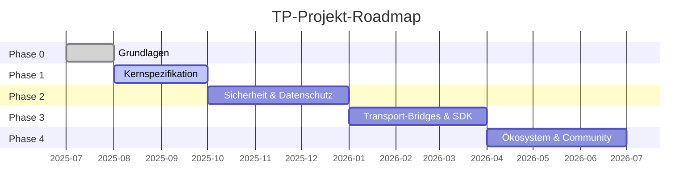

# Kapitel 7: Lieferobjekte und Roadmap

### 7.1 Dreistufiger Lieferobjekt-Katalog

Alle Lieferobjekte des TP-Projekts sind in drei Prioritätsstufen organisiert:

#### Stufe 1 — Kern-Lieferobjekte (Must-Have)

| Lieferobjekt | Zielphase | Abhängigkeiten |
|--------|---------|------|
| Blueprint-Dokument (zh-CN + en) | Phase 0 | Keine |
| TP-Protokollspezifikation Entwurf | Phase 1 | Blueprint-Dokument |
| JSON Schema Definitionen (MessageEnvelope, Intent, Capability, Task, Context, SharedContext) | Phase 1 | Protokollspezifikation |
| TypeScript-Typdefinitionen | Phase 1 | JSON Schema |
| TypeScript-Referenz-SDK | Phase 3 | Schema + Protokollspezifikation |

#### Stufe 2 — Wichtige Lieferobjekte (Should-Have)

| Lieferobjekt | Zielphase | Abhängigkeiten |
|--------|---------|------|
| MDX menschenlesbare Dokumentation | Phase 1 | JSON Schema |
| Mehrsprachige Protokolldokumente (9 Sprachen) | Phase 4 | Quellsprachendokumente |
| Entwicklerhandbuch (Quick Start + Architekturübersicht) | Phase 1 | Blueprint-Dokument |
| SDK-Nutzungshandbuch und API-Referenz | Phase 3 | TypeScript SDK |

#### Stufe 3 — Erweiterungs-Lieferobjekte (Nice-to-Have)

| Lieferobjekt | Zielphase | Abhängigkeiten |
|--------|---------|------|
| Community-Beitragshandbuch und Governance-Dokumente | Phase 0 | Keine |
| Protokoll-Konformitäts-Testsuite | Phase 4 | SDK + Schema |
| Beispiel-Anwendungsprojekte | Phase 4 | SDK |

### 7.2 Roadmap

#### Phase 0: Grundlagen

Das Kernziel von Phase 0 ist die Etablierung der Projektinfrastruktur und der übergeordneten Erzählung. Wichtige Meilensteine umfassen: Veröffentlichung des Blueprint-Dokuments in Chinesisch und Englisch, Etablierung von TPs Kernpositionierung als kognitives Teilungsprotokoll; Finalisierung der Projektverzeichnisstruktur und Namenskonventionen; Erstellung von Open-Source-Governance-Dateien einschließlich README.md, CONTRIBUTING.md und CODE_OF_CONDUCT.md; Etablierung von Schema-Versionsverwaltungskonventionen (datumsbasierte Benennung, Drei-Dateien-Synchronisation, Abwärtskompatibilitätsregeln); Markierung der früheren agent-to-agent-protocol Spezifikation als veraltet, offiziell ersetzt durch die telepathy-protocol Spezifikation. Die Austrittskriterien für Phase 0 sind die zweisprachige Veröffentlichung des Blueprint-Dokuments und die Bereitschaft der Repository-Infrastruktur.

#### Phase 1: Kernspezifikation

Phase 1 konzentriert sich auf TPs technische Kernspezifikation. Wichtige Meilensteine umfassen: Veröffentlichung des TP-Protokollspezifikationsentwurfs, Definition der Shared-Context-Semantik und des transportagnostischen Nachrichtenumschlagformats; Lieferung von JSON Schema und TypeScript-Typdefinitionen für Kerndatenstrukturen einschließlich MessageEnvelope, Intent, Capability, Task, Context und SharedContext; Lieferung von MDX-Format menschenlesbarer Dokumentation; Veröffentlichung des Entwickler-Quick-Start-Handbuchs. Die Austrittskriterien für Phase 1 sind, dass das Kern-Schema-Drei-Dateien-Set (.json / .ts / .mdx) die Konsistenzvalidierung besteht und der Spezifikationsentwurf die Überprüfung abschließt.

#### Phase 2: Sicherheit, Datenschutz und Shared Context

Phase 2 vertieft sich in den Bereich Sicherheit und Datenschutz. Wichtige Meilensteine umfassen: Lieferung von Verschlüsselungs- und Credential-bezogenen Schema-Definitionen (EncryptedPayload, CallbackCredential); Veröffentlichung der Sicherheitsspezifikation zu Ende-zu-Ende-Verschlüsselung, Authentifizierungsmechanismen und Human Prime-delegierter Autorisierung; Definition des vollständigen Lebenszyklus-Managements von Shared Context — Erstellung, Umfangsdefinition, Ablauf und Widerruf; Etablierung des Technical Steering Committee (TSC) Governance-Mechanismus. Die Austrittskriterien für Phase 2 sind, dass das Sicherheits-Schema die Konsistenzvalidierung besteht und die TSC-Charta offiziell veröffentlicht wird.

#### Phase 3: Transport-Bridges und SDK

Phase 3 transformiert die Protokollspezifikation in ausführbaren Code. Wichtige Meilensteine umfassen: Lieferung des TypeScript-Referenz-SDK mit Implementierung der Kern-Nachrichtenverarbeitungslogik; Implementierung von Protokoll-Bridge-Schnittstellen für A2A und MCP, Validierung von Transportagnostik und Protokollverhandlungsfähigkeiten; Lieferung von Bridge-Schnittstellen für Schwesterprotokolle (ICP, SSP, CAP, DTP, FP); Veröffentlichung von SDK-Dokumentation und Nutzungsbeispielen. Die Austrittskriterien für Phase 3 sind, dass das SDK alle Unit-Tests und Property-Based-Tests besteht und Bridge-Schnittstellen Integrationstests bestehen.

#### Phase 4: Ökosystem und Community

Phase 4 erweitert TP von einem technischen Projekt zu einem offenen Ökosystem. Wichtige Meilensteine umfassen: Abschluss der mehrsprachigen Dokumentationsübersetzung für alle 9 Sprachen; Lieferung der Protokoll-Konformitäts-Testsuite für Drittanbieter-Implementierungen zur Compliance-Verifizierung; Veröffentlichung von Beispiel-Anwendungsprojekten, die Shared Context in realen Geschäftsszenarien demonstrieren; Etablierung des RFC-Prozesses zur community-getriebenen Governance für die fortlaufende Evolution des Protokolls. Die Austrittskriterien für Phase 4 sind, dass das Übersetzungsstatus-Dashboard zeigt, dass alle Stufe-1- und Stufe-2-Dokumentübersetzungen abgeschlossen sind.

