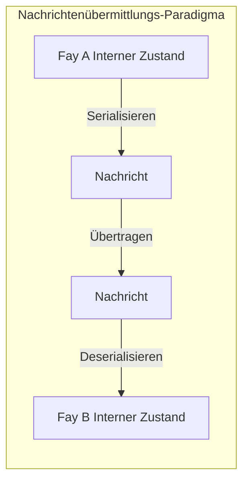
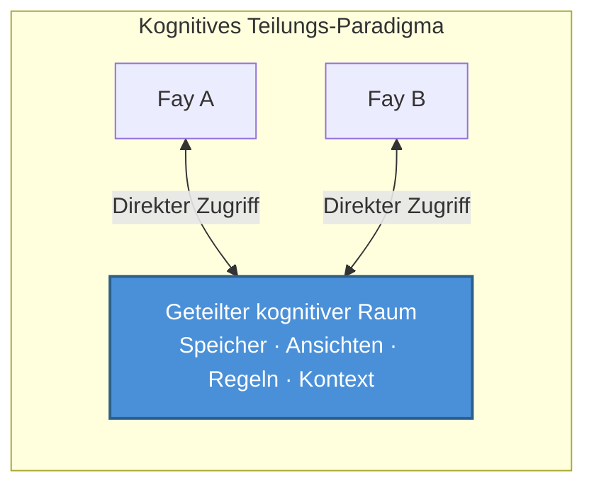

# Kapitel 2: TP-Kernpositionierung

### 2.1 Kognitives Teilungsprotokoll vs. Nachrichtenübermittlungsprotokoll

Um TPs Kernpositionierung zu verstehen, muss man zunächst zwei grundlegend verschiedene Kommunikationsparadigmen unterscheiden.

#### Das Nachrichtenübermittlungs-Paradigma: „Staffellauf"-Modus

Traditionelle Kommunikationsprotokolle — von HTTP bis gRPC, von MCP bis A2A — folgen alle grundlegend demselben Paradigma: **Serialisieren → Übertragen → Deserialisieren**.

Der Sender kodiert seinen internen Zustand in ein Übertragungsformat (JSON, Protobuf, XML), überträgt es über das Netzwerk an den Empfänger, und der Empfänger dekodiert das Übertragungsformat zurück in seine eigene interne Darstellung. Jede Kommunikation ist ein vollständiger Prozess des Verpackens und Auspackens von Informationen.

Dieses Modell ist wie „eine Nachricht weiterleiten" — ein Bote notiert die Bedeutung des Sprechers, läuft zu einer anderen Person und rezitiert sie. Informationen erleiden dabei unvermeidlich Verluste bei der Kodierung und Dekodierung: Kontext geht verloren, implizite Annahmen werden ausgelassen und die Ausdruckspräzision nimmt ab.

#### Das kognitive Teilungs-Paradigma: „Telepathie"-Modus

TP schlägt ein grundlegend anderes Paradigma vor: **Innerhalb autorisierter Grenzen einen gemeinsamen kognitiven Raum etablieren, in dem beide Parteien direkt auf geteilte kognitive Ressourcen zugreifen**.

Unter diesem Modell müssen kommunizierende Parteien nicht mehr alle Informationen in Nachrichten verpacken und hin und her senden. Stattdessen arbeiten sie in einem kontrollierten gemeinsamen Raum zusammen — geteilte Speicherfragmente, Ansichtszustände, Reasoning-Regeln und Umgebungskontext bilden die gemeinsame kognitive Grundlage für beide Parteien.

Das bedeutet nicht, dass TP die Nachrichtenübertragung vollständig eliminiert — die Etablierung des geteilten Raums selbst erfordert Verhandlung und Synchronisation. Aber sobald der geteilte Kontext etabliert ist, verbessert sich die nachfolgende Zusammenarbeitseffizienz dramatisch, weil beide Parteien nicht mehr wiederholt kognitive Ressourcen serialisieren und übertragen müssen, die bereits geteilt werden.

### 2.2 Interpretation der „Telepathie"-Metapher

Der Name „Telepathy" ist keine rhetorische Übertreibung, sondern eine präzise Metapher für TPs Kernmechanismus.

#### Ein konkretes Szenario

Stellen Sie sich zwei Personen vor, die von verschiedenen Standorten an einer Remote-Besprechung teilnehmen. Eine sagt: „Schauen Sie sich die Daten an, die ich mit einem roten Kasten markiert habe."

In der menschlichen Welt muss eine Reihe von Medienwerkzeugen diesen Satz unterstützen, damit er sinnvoll ist: Bildschirmfreigabe-Software überträgt den Bildschirm des Sprechers in Echtzeit auf das Display der anderen Person; die andere Person muss den roten Kasten auf ihrem eigenen Bildschirm lokalisieren; bei Netzwerklatenz oder Bildunschärfe sieht sie möglicherweise das vorherige Bild, und die Position des roten Kastens hat sich möglicherweise bereits geändert.

Der gesamte Prozess ist voller Informationsübertragungsreibung: Kodierung (Bildschirmpixel → Videostream), Übertragung (Netzwerkbandbreite und Latenz), Dekodierung (Videostream → Bildschirmpixel), kognitive Ausrichtung (die andere Person muss den roten Kasten in ihrem eigenen visuellen Raum lokalisieren).

Aber wenn beide Parteien „Telepathie" besäßen, wäre die Situation völlig anders — beide würden direkt dieselbe Ansicht „sehen", und die Position des roten Kastens, der Inhalt der Daten, sogar die Absicht des Sprechers beim Markieren des roten Kastens wären alle sofort im geteilten kognitiven Raum sichtbar. Kein Kodierungsverlust, keine Übertragungslatenz, keine Kosten für kognitive Ausrichtung.

#### Implementierung in Fay-zu-Fay-Szenarien

Unter Menschen ist „Telepathie" ein Science-Fiction-Konzept. Aber in Fay-zu-Fay-Szenarien ist dieser geteilte Kontext **technisch realisierbar**.

Der kognitive Zustand eines Fay ist grundlegend strukturierte Daten — Speicher ist ein indizierbarer Wissensgraph, Ansichten sind serialisierbare Zustandsbäume, und Reasoning-Regeln sind teilbare Logik-Engines. Wenn zwei Fays eine TP-Sitzung etablieren, können sie im Rahmen der Host-Autorisierung Teile ihrer kognitiven Ressourcen in einen geteilten Raum einbringen:

- **Sitzungsebene partielles Langzeitgedächtnis**: Wissensfragmente, die für das aktuelle Zusammenarbeitsthema relevant sind
- **Ansichts-Schnittstellenzustand**: Echtzeitzustand der Schnittstelle oder Datenansichten, die beide Parteien bedienen
- **Regeln oder Reasoning-Engines**: Reasoning-Logik und Entscheidungsregeln für die aktuelle Aufgabe
- **Umgebungskontext**: Dynamische Umgebungsinformationen wie Zeit, Ort und Gerätezustand

Dies ist genau der Ursprung des Namens „Telepathy Protocol" — es hebt die Kommunikation zwischen Fays von „Nachrichten weiterleiten" auf „Gedanken synchronisieren".
