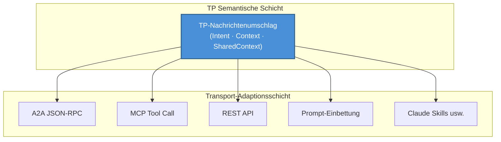
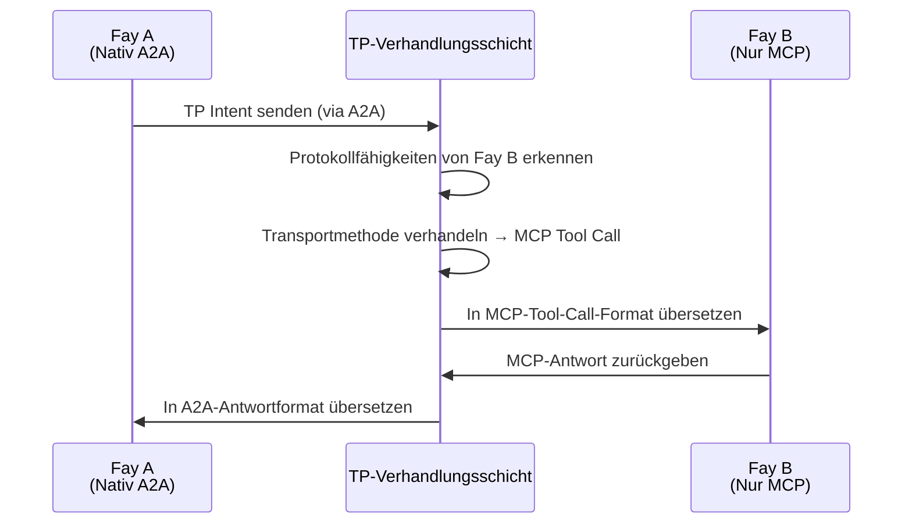

# Kapitel 3: Drei einzigartige Fähigkeiten

TPs Design dreht sich um drei einzigartige Fähigkeiten, die zusammen TPs zentralen Wettbewerbsvorteil bilden und es von allen bestehenden Kommunikationsprotokollen unterscheiden.

### 3.1 Transportagnostik

#### Designphilosophie

TP ersetzt weder MCP noch A2A; stattdessen etabliert es eine **einheitliche semantische Abstraktion** auf deren Grundlage.

Die Kernerkenntnis dieser Designphilosophie ist: Für kognitive Teilung kommt es nicht darauf an, über welchen Kanal Nachrichten übertragen werden, sondern welche Semantik die Nachrichten tragen. TP-Nachrichten können über jede der folgenden Transportmethoden zugestellt werden:

| Transportmethode | Beschreibung |
|---------|------|
| A2As JSON-RPC | TP-Semantik über A2A-Protokolls Standard-Nachrichtenkanal liefern |
| MCPs Tool Call | TP-Nachrichten als Parameter von MCP-Tool-Aufrufen kapseln |
| Traditionelle REST API | TP-Nachrichtenumschläge über HTTP-Request-Bodies liefern |
| Prompt-Zustellung | TP-Semantik in natürlichsprachliche Prompts einbetten (degradierter Modus) |
| Aufkommende Methoden wie Claude Skills | Kompatibel mit neuen AI-Interaktionsparadigmen, die in Zukunft entstehen könnten |

#### Analogie

Dieses Design kann mit der Beziehung zwischen HTTP und der Transportschicht verglichen werden. Das HTTP-Protokoll kann auf TCP oder auf QUIC laufen — HTTP kümmert sich um Request-Response-Semantik, nicht um den zugrunde liegenden Transportmechanismus. Ebenso kümmert sich TP um die semantische Schicht der kognitiven Teilung, nicht um die Nachrichtentransportschicht.

Transportagnostik stellt sicher, dass TP nicht an ein einzelnes zugrunde liegendes Protokoll gebunden ist. Wenn neue Transportmethoden entstehen, muss TP nur einen Transportadapter hinzufügen, ohne die eigenen semantischen Definitionen des Protokolls zu ändern.

### 3.2 Protokollverhandlung und -übersetzung

#### Problemszenario

Im realen AI-Ökosystem können verschiedene Fays unterschiedliche Protokollsprachen „sprechen". Ein Fay unterstützt möglicherweise nativ A2A, ein anderer versteht nur MCPs Tool-Call-Format, und wieder andere unterstützen nur traditionelle REST-API-Aufrufe.

Wenn diese Fays mit unterschiedlichen „Muttersprachen" zusammenarbeiten müssen, können sie ohne einen einheitlichen Verhandlungs- und Übersetzungsmechanismus nicht kommunizieren — genau wie zwei Menschen, die nur verschiedene Sprachen sprechen, sich gegenüberstehen und dennoch nicht miteinander reden können.

#### TPs Lösung

TP fungiert als **adaptive Übersetzungsschicht** und erreicht protokollübergreifende Kommunikation durch folgende Schritte:

1. **Fähigkeitserkundung**: TP erkundet zunächst, welche Transportprotokolle der Gegenseite-Fay unterstützt
2. **Vertragsverhandlung**: Beide Parteien einigen sich auf eine „Vertragsvorlage" — sie bestimmen, ob MCP, A2A, API-Aufrufe oder Prompt als zugrunde liegende Transportmethode verwendet werden
3. **Semantisches Mapping**: Auf der vereinbarten Transportmethode werden Zuordnungsregeln von TP-Semantik zum zugrunde liegenden Protokollformat etabliert
4. **Transparente Übersetzung**: In der nachfolgenden Kommunikation übersetzt TP automatisch semantische Absichten in ein Format, das die Gegenseite verstehen kann

Der Schlüsselwert dieses Mechanismus ist: Selbst wenn der Gegenseite-Fay ein bestimmtes Protokoll noch nicht „gelernt" hat, kann TP durch Übersetzung eine reibungslose Kommunikation zwischen beiden Parteien ermöglichen. Protokollunterschiede sind für die übergeordnete kognitive Teilungslogik vollständig transparent.

### 3.3 Shared Context

#### Kernstatus

Shared Context ist TPs zentralste Fähigkeit und der fundamentale Grund hinter dem Namen „Telepathy". Wenn Transportagnostik das Problem löst „über welchen Kanal kommuniziert wird" und Protokollverhandlung das Problem löst „in welcher Sprache kommuniziert wird", dann löst Shared Context das Problem „was das Wesen der Kommunikation ist".

#### Mechanismusbeschreibung

Wenn zwei Fays eine TP-Sitzung initiieren, treten beide Parteien in den **Shared-Context-Modus** ein. In diesem Modus tauschen beide Parteien nicht mehr nur Nachrichten aus, sondern pflegen gemeinsam einen kontrollierten kognitiven Raum.

Teilbare kognitive Ressourcen umfassen:

| Kognitiver Ressourcentyp | Beschreibung | Typisches Szenario |
|------------|------|---------|
| Sitzungsebene partielles Langzeitgedächtnis | Wissensfragmente relevant für das aktuelle Zusammenarbeitsthema | Medizinischer Fay teilt eine relevante Zusammenfassung der Krankengeschichte eines Patienten — wie Allergiehistorie, chronische Krankheitsaufzeichnungen und aktuelle Medikamentennutzung, damit der beratende Fay den Hintergrund des Patienten versteht, ohne erneut nachfragen zu müssen |
| Ansichts-Schnittstellenzustand | Schnittstelle oder Datenansichten, die beide Parteien bedienen | Mehrere Fays bearbeiten gemeinsam denselben Vertragstext — der juristische Fay markiert Klauseln, die geändert werden müssen, und der Finanz-Fay sieht sofort die markierten Positionen und bewertet die finanziellen Auswirkungen, ohne Dokumentversionen hin und her zu senden |
| Regeln oder Reasoning-Engines | Reasoning-Logik für die aktuelle Aufgabe | Juristischer Fay teilt anwendbare Rechtsvorschriften und Reasoning-Ketten — der Steuer-Fay kann diese Vorschriften direkt referenzieren, um steuerliche Auswirkungen zu berechnen, ohne dass der juristische Fay jedes Mal relevante Gesetze in Nachrichten kopieren und einfügen muss |
| Umgebungskontext | Dynamische Informationen wie Zeit, Ort, Gerätezustand | Fay auf einer Drohne teilt GPS-Echtzeitkoordinaten, Batteriestand und Kamerawinkel mit dem Bodenkontroll-Fay — der Boden-Fay kann den Zustand der Drohne direkt „wahrnehmen", anstatt auf periodische Statusberichtsnachrichten zu warten |

#### Host-Autorisierung und Auditierung

Der Umfang des Shared Context wird strikt durch die **Host-Autorisierung** bestimmt. Ein Fay kann nicht einseitig entscheiden, welche kognitiven Ressourcen geteilt werden — jede Teilungsaktion muss innerhalb der vom Host vorab autorisierten Grenzen erfolgen. Zusätzlich ist jeder Zugriff auf den Shared Context **auditierbar**, sodass der Host im Nachhinein überprüfen kann, welche Informationen geteilt wurden, von wem sie abgerufen wurden und zu welchem Zeitpunkt.

Dieses Design bildet einen scharfen Kontrast zu A2As Opaque-Execution-Prinzip:

| Dimension | A2A (Opaque Execution) | TP (Shared Context) |
|------|------------------------|---------------------|
| Interner Zustand | Nicht geteilt; Agent ist eine Black Box | Selektiv geteilt im autorisierten Rahmen |
| Zusammenarbeitstiefe | Aufgabenebene (Delegation und Berichterstattung) | Kognitive Ebene (geteiltes Gedächtnis und Reasoning) |
| Informationsübertragung | Jedes Mal vollständige Serialisierung | Direkter Zugriff im geteilten Raum |
| Datenschutzkontrolle | Kein systematischer Mechanismus | Host-Autorisierung + vollständige Auditierung |
| Anwendbare Szenarien | Lose gekoppelte Service-Orchestrierung | Tiefe Zusammenarbeit und kognitive Fusion |

Shared Context hebt die Zusammenarbeit zwischen Fays von „Nachrichten weiterleiten" auf „gemeinsam denken" — dies ist der Kernwert von TP als kognitives Teilungsprotokoll.
