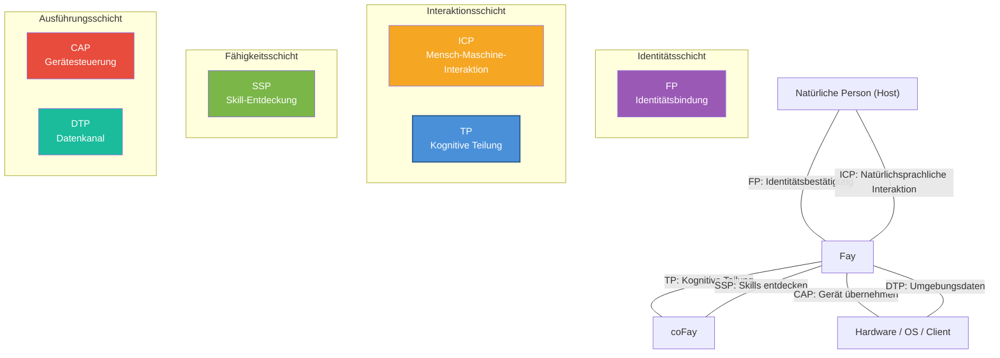

# Kapitel 5: Ökosystem-Positionierung

### 5.1 iFay Sechs-Protokoll-Beziehungsdiagramm

TP existiert nicht isoliert; es ist eines von sechs Protokollen im iFay-Ökosystem. Jedes Protokoll erfüllt seine eigene Funktion, und zusammen bilden sie ein vollständiges AI-Agent-Kommunikationsframework.

| Protokoll | Vollständiger Name | Kernverantwortung | Domäne |
|------|------|---------|---------|
| **ICP** | Interactive Conversation Protocol | Zwischensprache für Mensch ↔ Fay Interaktion | Mensch-Maschine-Schnittstelle |
| **TP** | Telepathy Protocol | Kognitive Teilung zwischen Fay ↔ Fay | Inter-Fay-Zusammenarbeit |
| **CAP** | Control Authority Protocol | Fay → Hardware/Client-Übernahme | Gerätesteuerung |
| **SSP** | Skill Sharing Protocol | Fay-Skill-Entdeckung | Fähigkeitsmarktplatz |
| **DTP** | Data Tunnel Protocol | Hardware/OS → Fay-Datenkanal | Umgebungswahrnehmung |
| **FP** | Faying Protocol | Natürliche Person ↔ iFay Identitätsbindung | Identitätsbestätigung |

Die Interaktionsbeziehungen zwischen den sechs Protokollen werden im folgenden Diagramm dargestellt:

**Inter-Protokoll-Zusammenarbeitsbeziehungen:**

- **FP → TP**: FP etabliert die Identitätsbindungsbeziehung zwischen Host und Fay; TP referenziert die FP-Autorisierung während der Kommunikation, um die Legitimität der Host-Delegation zu verifizieren. Wenn beispielsweise der iFay eines Patienten eine Terminanfrage an einen Krankenhaus-coFay initiiert, bestätigt der Krankenhaus-coFay über die FP-Autorisierungsreferenz, dass „dieser iFay tatsächlich vom Patienten autorisiert ist, den Termin zu vereinbaren."
- **ICP → TP**: Der Host erteilt seinem Fay Anweisungen über ICP; der Fay delegiert Aufgaben über TP an andere Fays zur Ausführung. Beispielsweise sagt ein Benutzer seinem iFay „buche mir nächste Woche einen Flug nach Tokio" (ICP-Interaktion), und der iFay kontaktiert dann den coFay der Fluggesellschaft über TP, um die Buchung abzuschließen.
- **SSP ↔ TP**: Ein Fay entdeckt über SSP die verfügbaren Skills anderer Fays und initiiert dann über TP spezifische Zusammenarbeitsanfragen. Beispielsweise entdeckt ein iFay über SSP einen auf Steuerplanung spezialisierten coFay und etabliert dann über TP einen geteilten Kontext, wobei die Finanzdaten des Hosts (im autorisierten Rahmen) in den geteilten Raum eingebunden werden.
- **TP → CAP**: Wenn eine TP-Zusammenarbeitsaufgabe die Steuerung von Hardware oder Clients erfordert, erhält der Fay die Gerätesteuerungsberechtigung über CAP-Credentials. Beispielsweise muss eine manuell gesteuerte Drohne an einen Fay zur Übernahme übergeben werden — der iFay des Bodenoperators verhandelt die Steuerungsübergabe mit dem Fay auf der Drohne über TP und schließt dann die tatsächliche Steuerungsübertragung über das CAP-Protokoll ab.
- **DTP → TP**: Hardware und Betriebssysteme senden Umgebungsdaten über DTP an Fays; Fays integrieren diese Daten in den TP-Shared-Context für die Nutzung durch zusammenarbeitende Parteien. Beispielsweise sendet ein Smart-Home-System Innentemperatur, Luftfeuchtigkeit und Luftqualitätsdaten über DTP an den iFay, und der iFay bindet diese Umgebungsdaten in den geteilten Kontext mit einem Gesundheitsmanagement-coFay ein, um bei der Erstellung von Gesundheitsempfehlungen zu helfen.

### 5.2 Vergleich mit MCP/A2A

TP und MCP/A2A stehen nicht in Konkurrenz, sondern sind komplementär — TP kann auf MCP oder A2A aufsetzen. Die folgende Vergleichstabelle zeigt die Positionierungsunterschiede über mehrere Dimensionen:

| Dimension | MCP | A2A | TP |
|------|-----|-----|-----|
| **Herausgeber** | Anthropic | Google | iFay Open Source Community |
| **Erscheinungsjahr** | 2024 | 2025 | 2025 |
| **Kernpositionierung** | Verbindungsprotokoll zwischen AI-Modellen und externen Tools | Aufgabendelegations- und Zusammenarbeitsprotokoll zwischen Agents | Kognitives Teilungsprotokoll zwischen Fays |
| **Kommunikationsrichtung** | Unidirektional (AI → Tools) | Bidirektional (Agent ↔ Agent) | Bidirektional + Geteilter Raum (Fay ↔ Shared Context ↔ Fay) |
| **Identitätszuordnung** | Keine (Tools haben kein Zuordnungskonzept) | Keine (Agents sind autonome Dienstknoten) | Ja (jeder Fay handelt im Namen eines Hosts) |
| **Datenschutz** | Kein systematischer Mechanismus (Klartext-Parameterübergabe) | Kein systematischer Mechanismus | Ende-zu-Ende-Verschlüsselung + Selektive Offenlegung + Host-Autorisierung |
| **Interner Zustandsaustausch** | Nicht anwendbar (Tools sind zustandslose Funktionen) | Nicht geteilt (Opaque Execution) | Selektiv geteilt im autorisierten Rahmen (Shared Context) |
| **Transportmethode** | Gebunden an Tool Call (JSON-RPC) | Gebunden an JSON-RPC über HTTP | Transportagnostisch (lieferbar via A2A/MCP/API/Prompt) |
| **Protokollverhandlung** | Keine | Keine | Adaptive Verhandlung und Übersetzung |
| **Anwendbare Szenarien** | AI ruft externe Tools und Datenquellen auf | Lose gekoppelte Agent-Service-Orchestrierung | Tiefe Zusammenarbeit, Datenschutzdelegation, kognitive Fusion |

Die Beziehung zwischen den dreien lässt sich in einem Satz zusammenfassen: **MCP lässt AI Tools nutzen, A2A lässt Agents Nachrichten weiterleiten, TP lässt Fays Telepathie erreichen**.

TPs Transportagnostik bedeutet, dass es auf MCP oder A2A „aufsetzen" kann — wenn der zugrunde liegende Transport A2A verwendet, fügt TP Identitätszuordnung, Datenschutz und Shared-Context-Fähigkeiten hinzu; wenn der zugrunde liegende Transport MCP verwendet, hebt TP unidirektionale Tool-Aufrufe auf bidirektionale kognitive Teilung.
