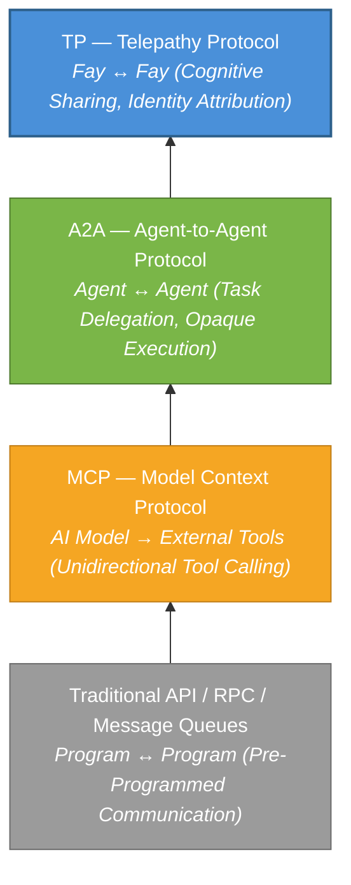
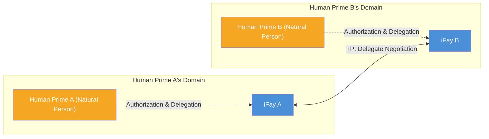

# Chapter 1: Why TP is Needed

### 1.1 Communication Protocol Layer Analysis

Over the past several decades of software engineering practice, the evolution of communication protocols has consistently revolved around a central proposition: **how to enable two computing entities to exchange information more efficiently**. With the rise of the AI Agent ecosystem, this proposition is undergoing a fundamental paradigm shift.

#### Traditional API / RPC / Message Queues: Pre-Programmed Communication Between Programs

Traditional communication protocols — whether RESTful APIs, gRPC, or message queues (such as Kafka, RabbitMQ) — address the problem of **pre-programmed communication between programs**. Their core characteristic is that the caller determines the call target, invocation method, and parameters at coding time. The Interface Contract is solidified before deployment, leaving extremely limited runtime flexibility.

This model works well in deterministic systems, but its limitations are fully exposed when confronted with the dynamism and autonomy of AI Agents — Agents need to discover capabilities at runtime, negotiate intent, and dynamically compose services, rather than hard-coding everything at development time.

> **Real-world example**: A travel planning Agent needs to simultaneously call flight search, hotel booking, weather forecast, and visa consultation services. Under the traditional API model, developers must determine each service's endpoint, parameter format, and call sequence at coding time. If the user changes their destination on the fly, the entire call chain may need to be re-orchestrated — which is extremely difficult at runtime.

#### MCP (Model Context Protocol): Connecting AI Models to External Tools

In 2024, Anthropic released the Model Context Protocol (MCP), designed to solve the connection problem between AI models and external tools. MCP's core architecture follows the **Host → Client → Server** model, providing AI with a "toolbox discovery mechanism" — models can dynamically discover available tools at runtime, understand the input/output Schema of tools, and initiate calls.

However, MCP's communication direction is **unidirectional**. The AI model is always the active party, and tools are always passive. Tools do not proactively push information to models, nor do they negotiate with other tools. MCP solved the problem of "how AI uses tools" but did not address the proposition of "how Agents collaborate with each other."

> **Real-world example**: A customer service Agent connects to a knowledge base search tool and a ticketing system via MCP. When a user's question exceeds the customer service Agent's capabilities, it needs to escalate to a technical support Agent. But MCP provides no mechanism for inter-Agent communication — the customer service Agent can only call tools, it cannot "ask a colleague for help."

#### A2A (Agent-to-Agent Protocol): Task Delegation and Collaboration Between Agents

In 2025, Google released the Agent-to-Agent Protocol (A2A), elevating the communication perspective from "model and tools" to "Agent and Agent." A2A introduced three key concepts:

- **AgentCard** (Capability Card): A standardized description through which an Agent declares its capabilities to the outside world
- **Task**: An executable unit of work passed between Agents
- **Message**: An information exchange carrier during task execution

A2A enables different Agents to discover each other's capabilities, delegate tasks, and report progress. However, its core design principle — **Opaque Execution** — explicitly stipulates that Agents do not share internal state, memory, or tool implementation details. Each Agent is a black box, exposing only input/output interfaces.

> **Real-world example**: A project management Agent delegates a code review task to a code review Agent. Under A2A, the project management Agent must serialize the complete code diff, project specifications, and historical review records into a message. The code review Agent returns results, but the project management Agent cannot "see" the reasoning logic during the review — it only sees the final review comments. If it needs to ask "why was this code segment flagged as risky," another full round-trip of messages is required.

#### TP: A Cognitive Sharing Layer Above MCP / A2A

Telepathy Protocol (TP) does not aim to replace any of the above protocols. Instead, it establishes an entirely new **cognitive sharing layer** on top of them.

The following diagram illustrates the progressive relationship among these four protocol layers:

Each protocol layer emerged because the previous one could not answer new questions. Traditional APIs cannot cope with AI's dynamism, MCP cannot support inter-Agent collaboration, A2A cannot achieve cognitive sharing — and TP is designed precisely to fill this final gap.

### 1.2 The Delegate Negotiation Paradigm

#### Implicit Assumptions of Existing Protocols

MCP, A2A, and the vast majority of existing communication protocols share a common implicit assumption: **the communicating parties are independent, unaffiliated service entities**.

In MCP's world, a tool is a stateless function — it doesn't matter who calls it, and it doesn't care whom the caller represents. In A2A's world, an Agent is an autonomous service node — it accepts tasks, executes them, and returns results, but it doesn't care who the principal behind the task is, nor does it need to protect anyone's interests.

This assumption is reasonable in technical service scenarios. But when AI Agents begin acting on behalf of real humans, this assumption no longer holds.

#### The iFay Worldview: Every Fay Has a Human Prime

In the iFay system, the worldview is fundamentally different. Every Fay — whether an iFay representing an individual or a coFay serving a public social function — has a clearly defined **Human Prime**. A Fay acts on behalf of its Human Prime, safeguards the Human Prime's interests, and protects the Human Prime's privacy.

This means that when two Fays communicate, what is fundamentally occurring is not a data exchange between two software services, but rather **a negotiation between two delegates acting on behalf of their respective Human Primes** — much like lawyers negotiating on behalf of their clients, or secretaries coordinating affairs on behalf of their executives.

This "delegate negotiation" paradigm imposes entirely new requirements on communication protocols:

- **Identity Attribution**: The protocol must clearly identify whom each communicating entity represents. For example, when a Fay books an appointment with a hospital's coFay on behalf of a patient, the hospital coFay needs to confirm that "this Fay is indeed authorized by the patient to make the appointment," rather than allowing anyone to impersonate the patient's Fay.
- **Trust Boundaries**: Information sharing between delegates must occur within the scope authorized by their Human Primes. For example, a patient authorizes their Fay to share allergy history and current symptoms with the hospital, but does not allow sharing of psychological counseling records — the Fay must strictly respect this boundary.
- **Privacy Protection**: Human Primes' sensitive data must be encrypted during transmission, with support for selective disclosure. For example, during an insurance claim, only the diagnosis code and cost breakdown need to be disclosed, without exposing the complete medical records.
- **Auditability**: All delegate actions must be traceable, enabling Human Primes to review them after the fact. For example, a Human Prime can review "which Fays my Fay shared data with over the past week, and what data was shared" — just like reviewing a bank account's transaction history.

### 1.3 Blind Spots of Existing Protocols

Synthesizing the above analysis, existing protocols have three fundamental blind spots when facing "delegate negotiation" scenarios:

#### No Identity Attribution

Neither MCP nor A2A concerns itself with whom an Agent represents. Tools in MCP have no concept of "attribution"; AgentCards in A2A describe the Agent's own capabilities, not the identity and authorization of the principal behind it. From TP's perspective, **communication without identity attribution is incomplete** — it cannot establish a foundation of trust, nor can it delineate boundaries of responsibility.

> **Real-world example**: Imagine a real estate Agent representing a buyer negotiating price with a seller's Agent. Under A2A, the seller's Agent cannot verify that "the other party truly represents a buyer with purchase intent," nor can it confirm "whether the buyer has authorized this price range for negotiation." This is like a stranger without a power of attorney claiming to represent someone in a business deal — there is no foundation of trust.

#### No Privacy Protection

Existing protocols lack systematic protection mechanisms for Human Prime privacy data. MCP's tool calls transmit parameters in plaintext; A2A's Messages likewise provide no end-to-end encryption or selective disclosure capabilities. When Agents need to transmit health records, financial data, or identity credentials on behalf of their Human Primes, existing protocols cannot provide adequate security guarantees.

> **Real-world example**: A job seeker's Fay submits a resume to a recruiting company's coFay. The job seeker only wants to disclose work experience and skills, but does not want to expose their current salary and home address. Under A2A, the choice is either to send everything (privacy breach) or send nothing (unable to complete the job application). There is no mechanism for "only letting the other party see what I allow them to see."

#### No Shared Cognition

A2A explicitly declares the Opaque Execution principle — Agents do not share internal state. This design is reasonable in loosely-coupled service orchestration scenarios, but becomes a bottleneck in scenarios requiring deep collaboration.

When two Fays need to discuss the same document, jointly reason through a complex problem, or collaborate on the same view, "not sharing internal state" means that every round of interaction must serialize and transmit all relevant information — this is not only inefficient but also introduces information loss and semantic ambiguity through repeated serialization and deserialization.

> **Real-world example**: Two architectural design Fays need to collaborate on designing a building. Under A2A, Fay A draws a floor plan and serializes it into a message to send to Fay B; Fay B proposes modifications and serializes the entire blueprint back; Fay A revises and sends again... each round involves transmitting the complete blueprint. But if both parties could share the same design view (like two architects standing in front of the same drawing), one draws a line and the other sees it immediately — efficiency would improve by orders of magnitude.

TP was born precisely to fill these three blind spots.
