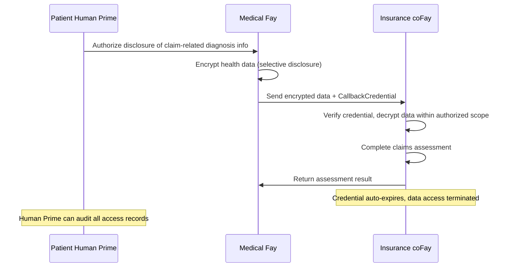
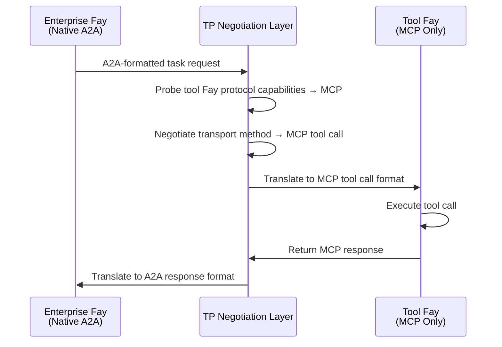
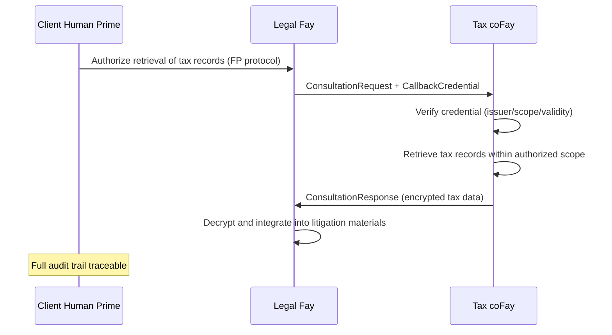
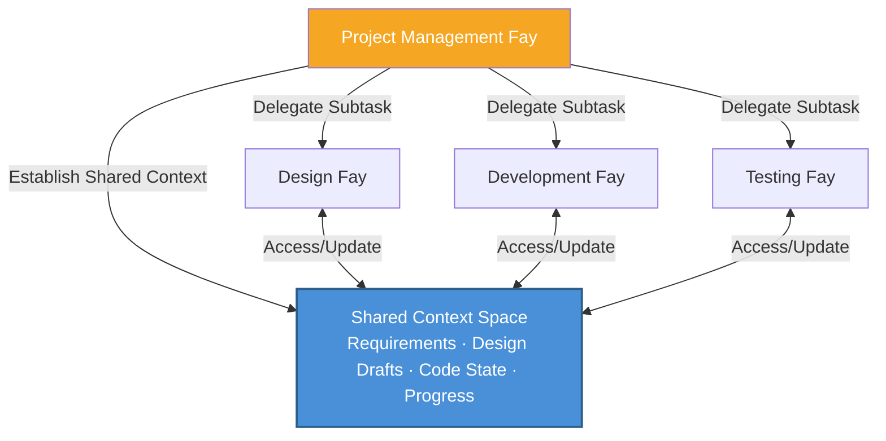
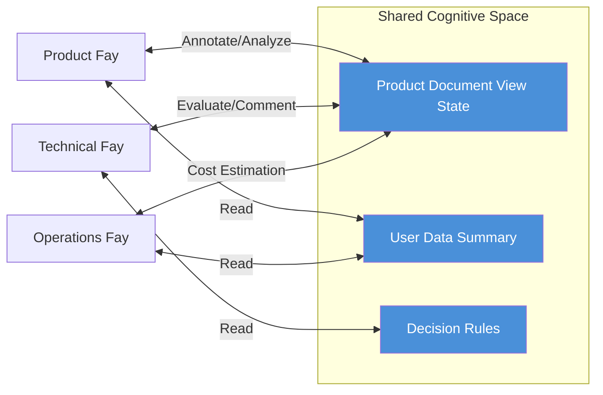

# Chapter 4: Application Scenarios

The following five scenarios demonstrate TP's practical applications across different business domains, covering core capabilities including privacy delegation, cross-protocol bridging, credential passing, multi-Fay collaboration, and shared context meetings.

### 4.1 Privacy-Delegated Consultation

**Scenario**: A patient Human Prime needs their medical Fay to submit health data to an insurance coFay to obtain a claims assessment.

Under traditional Agent communication models, the medical Agent would need to serialize the patient's complete health records into a message and send it to the insurance Agent — meaning all data is transmitted in plaintext over the network, and the receiver gains access to information far beyond what is necessary.

Under TP's cognitive sharing model, the process is fundamentally different:

1. **Human Prime Authorization**: The patient Human Prime authorizes the medical Fay through the FP protocol, explicitly specifying that only diagnosis information relevant to this claim may be disclosed (such as diagnosis codes, treatment dates, cost breakdowns), while other health records (such as psychological counseling records, genetic test results) remain encrypted and invisible
2. **Selective Disclosure**: The medical Fay uses TP's `SelectiveDisclosure` mechanism to transmit authorized data in encrypted form to the insurance coFay, along with a time-limited `CallbackCredential`
3. **Controlled Access**: The insurance coFay accesses authorized data within a limited scope through the callback credential, completing the claims assessment
4. **Automatic Expiration**: After the assessment is complete, the callback credential automatically expires, and the insurance coFay can no longer access any patient data
5. **Full Auditing**: All data access records are logged in the audit trail, and the patient Human Prime can review them at any time

This scenario embodies TP's **Human Prime-sovereign privacy** principle — the scope of data disclosure is always determined by the Human Prime, not by the Fay's own judgment.

### 4.2 Cross-Protocol Translation

**Scenario**: An enterprise Fay that natively supports A2A needs to invoke a specialized tool Fay that only supports MCP tool calls.

In a world without TP, these two Fays simply cannot communicate directly — they "speak" completely different protocol languages. The enterprise Fay's A2A JSON-RPC requests cannot be parsed by the tool Fay; the tool Fay's MCP tool call interface cannot be invoked by the enterprise Fay. Developers would have to write dedicated adapters for every pair of protocol combinations.

TP's protocol negotiation and translation mechanism fundamentally changes this situation:

1. **Capability Probing**: The enterprise Fay initiates a communication request through TP, and the TP negotiation layer automatically probes the tool Fay's protocol capabilities, discovering it only supports MCP tool calls
2. **Contract Negotiation**: TP negotiates the transport method between both parties, determining MCP tool call as the underlying transport channel
3. **Semantic Mapping**: TP maps the Intent, Parameters, and Context from the enterprise Fay's A2A-formatted task request into MCP tool call input format
4. **Transparent Translation**: The tool Fay receives a standard MCP tool call request, completely unaware of TP's existence; after execution, TP translates the MCP response back into A2A format for the enterprise Fay

The key value of this scenario is: **protocol differences are completely transparent to upper-layer business logic**. The enterprise Fay doesn't need to know what protocol the counterpart uses, nor does it need to write adapter code for each protocol. TP's adaptive translation layer enables Fays in a heterogeneous protocol ecosystem to collaborate seamlessly.

### 4.3 Credential-Passing Consultation

**Scenario**: A legal Fay (representing a client Human Prime) initiates a consultation with a tax coFay, needing to obtain the client's tax records to support litigation preparation.

This scenario is analogous to a real-world situation where a lawyer requests materials from a tax authority on behalf of a client — the lawyer needs to present the client's power of attorney, the tax authority provides materials within a limited scope after verifying the authorization, and the entire process is documented.

TP's consultation mode (Consultation) and callback credential mechanism (CallbackCredential) precisely map this real-world process:

1. **Human Prime Delegation**: The client Human Prime authorizes the legal Fay through the FP protocol, permitting it to obtain tax records on their behalf
2. **Consultation Initiation**: The legal Fay sends a `ConsultationRequest` to the tax coFay, accompanied by a time-limited `CallbackCredential` that authorizes the tax coFay to access the client's financial data within a limited scope
3. **Credential Verification**: The tax coFay verifies the callback credential's validity — checking the issuer's identity, authorization scope, and validity period
4. **Controlled Data Retrieval**: The tax coFay accesses the client's tax records through the credential, but only within the years and tax types specified in the credential's `scope`
5. **End-to-End Encryption**: The entire data transmission process uses TP's `EncryptedPayload` mechanism for end-to-end encryption
6. **Audit Trail**: All credential usage and data access records are written to the audit log, and the client Human Prime can review them at any time

This scenario demonstrates how TP digitizes the real-world pattern of "a delegate conducting business with a power of attorney" — credentials are time-limited, scoped, revocable, and auditable, fully protecting the Human Prime's interests.

### 4.4 Multi-Fay Collaborative Task

**Scenario**: A project management Fay decomposes a complex product development project into multiple subtasks, delegating them respectively to a design Fay, a development Fay, and a testing Fay.

Under A2A's Opaque Execution model, the project management Fay must serialize and transmit the complete project context (requirements documents, design drafts, code repository state, progress reports) every time it interacts with a subtask Fay. As the project progresses, the context continuously expands, the information transmission volume grows with each interaction, and detail information inevitably suffers loss through repeated serialization and deserialization.

TP's Shared Context mechanism fundamentally transforms this collaboration model:

1. **Shared Project Context**: The project management Fay establishes a shared context space, incorporating the project's core cognitive resources — structured representations of requirements documents, version states of design drafts, change summaries of the code repository, and progress and dependency relationships of each subtask
2. **Task Decomposition and Delegation**: The project management Fay uses TP's `TaskMessage` to decompose the project into subtasks, delegating them to the design Fay (UI/UX design), development Fay (code implementation), and testing Fay (quality verification)
3. **Context Inheritance**: Each subtask automatically inherits relevant context from the shared space, eliminating the need for the project management Fay to repeatedly transmit complete project information each time
4. **Real-Time Synchronization**: When the design Fay updates a design draft, the development Fay and testing Fay immediately "perceive" the change through the shared context, without waiting for the project management Fay to forward a notification
5. **Dependency Management**: Dependencies between subtasks (such as "development depends on design completion," "testing depends on development completion") are automatically managed through TP's `SubtaskReference` mechanism

This scenario demonstrates the core advantage of Shared Context over message passing: **the project context is "alive"** — it continuously updates as the project progresses, and all participants always collaborate based on the same up-to-date cognitive foundation, rather than relying on stale message snapshots.

### 4.5 Shared Context Meeting

**Scenario**: A product Fay, a technical Fay, and an operations Fay need to jointly discuss a new product proposal, with all three parties collaborating in real-time on the same product document.

In the human world, remote meetings require the coordination of multiple tools — screen sharing, instant messaging, document collaboration — and information inevitably suffers delay and loss as it passes between different media. In the Agent world, using traditional message passing models makes things even more complex — each Agent maintains its own copy of the document, synchronizes changes through messages, and conflict resolution and state consistency become enormous engineering challenges.

TP's Shared Context mechanism makes multi-Fay real-time collaboration natural and efficient:

1. **Establishing a Shared Cognitive Space**: The three Fays establish a shared context session through TP, incorporating the following cognitive resources into the shared space:
   - Structured view state of the product document (chapters, annotations, comments)
   - Relevant user data summaries (anonymized usage statistics, feedback analysis)
   - Decision rules (product priority matrix, technical feasibility assessment criteria, operational cost model)

2. **Real-Time Cognitive Synchronization**: When the product Fay annotates the document with "this section needs redesign," the technical Fay and operations Fay immediately "see" the annotation's location and content — not through message notifications, but through direct access to the shared context space. This is the concrete realization of the "telepathy" metaphor

3. **Multi-Perspective Collaboration**: The three Fays analyze and annotate the same document from their respective professional perspectives — the product Fay focuses on user experience, the technical Fay evaluates implementation complexity, and the operations Fay estimates operational costs. All annotations and analysis results are visible in real-time within the shared space

4. **Decision Recording**: All discussions, annotations, and decisions during the meeting are recorded in the shared context, forming a traceable decision chain

This scenario is the most complete embodiment of TP's "telepathy" philosophy — multiple Fays no longer need to "relay messages" to each other but instead "think together" in a shared cognitive space. Information transfer transforms from the serial process of "encode → transmit → decode" into "direct perception within the shared space."