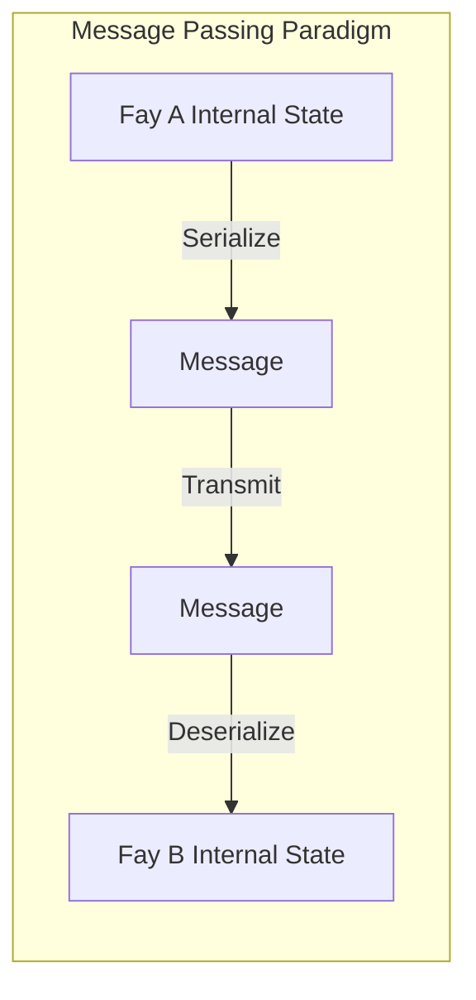
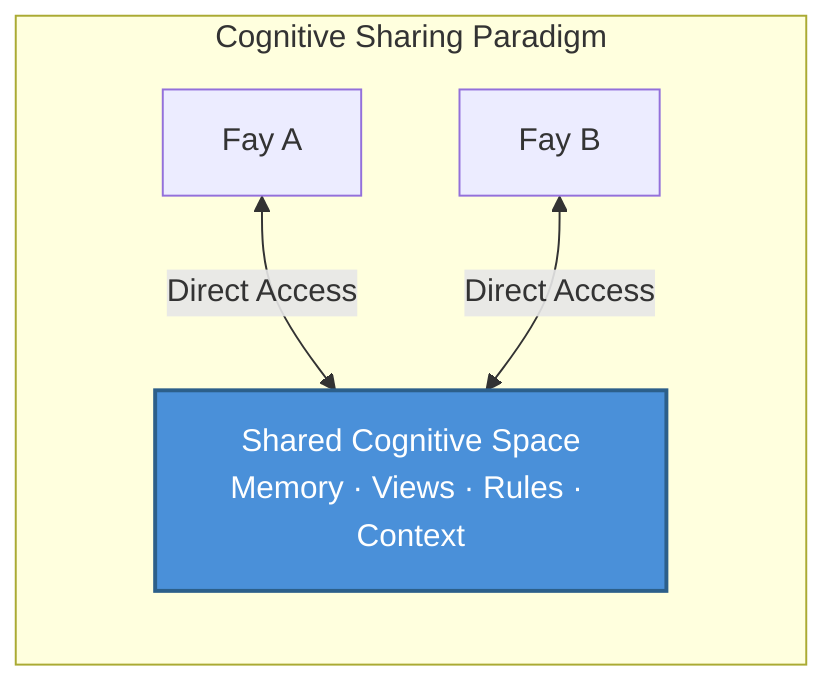

# Chapter 2: TP's Core Positioning

### 2.1 Cognitive Sharing Protocol vs. Message Passing Protocol

Understanding TP's core positioning requires first distinguishing between two fundamentally different communication paradigms.

#### The Message Passing Paradigm: "Relay" Mode

Traditional communication protocols — from HTTP to gRPC, from MCP to A2A — all fundamentally follow the same paradigm: **serialize → transmit → deserialize**.

The sender encodes its internal state into some wire format (JSON, Protobuf, XML), transmits it over the network to the receiver, and the receiver decodes the wire format back into its own internal representation. Every communication is a complete process of packing and unpacking information.

This model is like "relaying a message" — a messenger records the speaker's meaning, runs to another person, and recites it. Information inevitably suffers loss during encoding and decoding: context is lost, implicit assumptions are omitted, and expression precision degrades.

#### The Cognitive Sharing Paradigm: "Telepathy" Mode

TP proposes a fundamentally different paradigm: **establishing a shared cognitive space within authorized boundaries, where both parties directly access shared cognitive resources**.

Under this model, communicating parties no longer need to package all information into messages and pass them back and forth. Instead, they collaborate within a controlled shared space — shared memory fragments, view states, reasoning rules, and environmental context form the common cognitive foundation for both parties.

This does not mean TP completely eliminates message transmission — establishing the shared space itself requires negotiation and synchronization. But once the shared context is established, subsequent collaboration efficiency improves dramatically, because both parties no longer need to repeatedly serialize and transmit cognitive resources that are already shared.

### 2.2 Interpreting the "Telepathy" Metaphor

The name "Telepathy" is not rhetorical exaggeration but a precise metaphor for TP's core mechanism.

#### A Concrete Scenario

Imagine two people attending a remote meeting from different locations. One says: "Look at the data I've highlighted with a red box."

In the human world, for this sentence to be meaningful, a series of media tools must support it: screen-sharing software transmits the speaker's screen in real-time to the other person's display; the other person needs to locate the red box on their own screen; if there's network latency or image blur, they might see the previous frame, and the red box's position may have already changed.

The entire process is filled with information transmission friction: encoding (screen pixels → video stream), transmission (network bandwidth and latency), decoding (video stream → screen pixels), cognitive alignment (the other person needs to locate the red box in their own visual space).

But if both parties possessed "telepathy," the situation would be entirely different — both would directly "see" the same view, and the red box's position, the data's content, even the speaker's intent when marking the red box, would all be instantly visible in the shared cognitive space. No encoding loss, no transmission latency, no cognitive alignment cost.

#### Implementation in Fay-to-Fay Scenarios

Among humans, "telepathy" is a science fiction concept. But in Fay-to-Fay scenarios, this shared context is **engineerable**.

A Fay's cognitive state is fundamentally structured data — memory is an indexable knowledge graph, views are serializable state trees, and reasoning rules are shareable logic engines. When two Fays establish a TP session, they can, within the scope of Host authorization, incorporate portions of their cognitive resources into a shared space:

- **Session-level partial long-term memory**: Knowledge fragments relevant to the current collaboration topic
- **View interface state**: Real-time state of the interface or data views both parties are operating on
- **Rules or reasoning engines**: Reasoning logic and decision rules for the current task
- **Environmental context**: Dynamic environmental information such as time, location, and device state

This is precisely the origin of the "Telepathy Protocol" name — it upgrades communication between Fays from "relaying messages" to "minds in sync."
