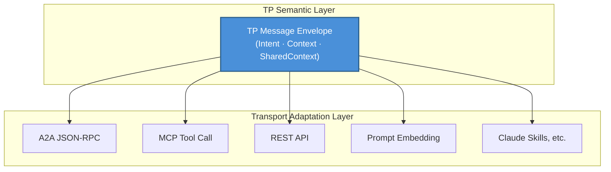
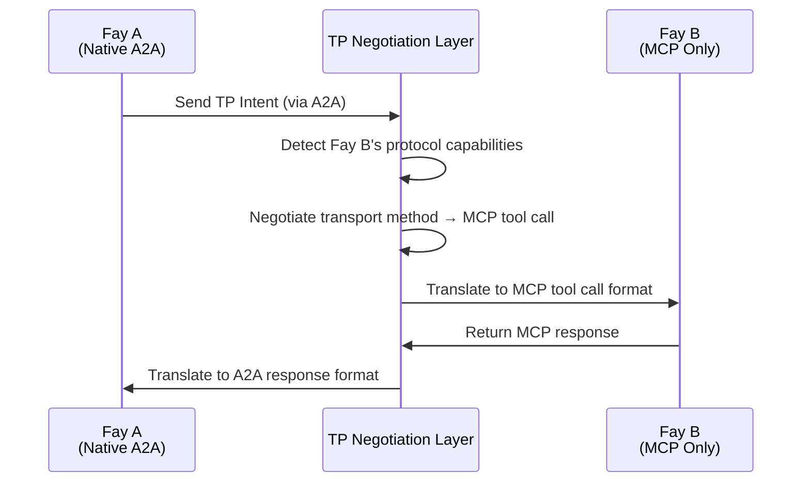

# Chapter 3: Three Unique Capabilities

TP's design revolves around three unique capabilities that together constitute TP's core competitive advantage, distinguishing it from all existing communication protocols.

### 3.1 Transport Agnosticism

#### Design Philosophy

TP does not replace MCP or A2A; instead, it establishes a **unified semantic abstraction** on top of them.

The core insight of this design philosophy is: for cognitive sharing, what matters is not through which channel messages are transmitted, but what semantics the messages carry. TP messages can be delivered through any of the following transport methods:

| Transport Method | Description |
|---------|------|
| A2A's JSON-RPC | Deliver TP semantics through A2A protocol's standard message channel |
| MCP's tool call | Encapsulate TP messages as parameters of MCP tool calls |
| Traditional REST API | Deliver TP message envelopes through HTTP request bodies |
| Prompt delivery | Embed TP semantics in natural language Prompts (degraded mode) |
| Emerging methods such as Claude Skills | Compatible with new AI interaction paradigms that may emerge in the future |

#### Analogy

This design can be analogized to the relationship between HTTP and the transport layer. The HTTP protocol can run on top of TCP or on top of QUIC — HTTP cares about request-response semantics, not the underlying transport mechanism. Similarly, TP cares about the semantic layer of cognitive sharing, not the message transport layer.

Transport agnosticism ensures that TP is not bound to any single underlying protocol. When new transport methods emerge, TP only needs to add a transport adapter without modifying the protocol's own semantic definitions.

### 3.2 Protocol Negotiation and Translation

#### Problem Scenario

In the real-world AI ecosystem, different Fays may "speak" different protocol languages. One Fay might natively support A2A, another might only understand MCP's tool call format, and still others might only support traditional REST API calls.

When these Fays with different "native languages" need to collaborate, without a unified negotiation and translation mechanism, they cannot communicate — just like two people who only speak different languages standing face to face yet unable to converse.

#### TP's Solution

TP acts as an **adaptive translation layer**, achieving cross-protocol communication through the following steps:

1. **Capability Probing**: TP first probes which transport protocols the counterpart Fay supports
2. **Contract Negotiation**: Both parties agree on a "contract template" — determining whether to use MCP, A2A, API calls, or Prompt as the underlying transport method
3. **Semantic Mapping**: On top of the agreed transport method, establish mapping rules from TP semantics to the underlying protocol format
4. **Transparent Translation**: In subsequent communications, TP automatically translates semantic intent into a format the counterpart can understand

The key value of this mechanism is: even if the counterpart Fay has not yet "learned" a particular protocol, TP can still enable smooth communication between both parties through translation. Protocol differences are completely transparent to the upper-layer cognitive sharing logic.

### 3.3 Shared Context

#### Core Status

Shared Context is TP's most central capability and the fundamental reason behind the "Telepathy" name. If transport agnosticism solves the problem of "through which channel to communicate," and protocol negotiation solves the problem of "in which language to communicate," then Shared Context solves the problem of "what is the essence of communication."

#### Mechanism Description

When two Fays initiate a TP session, both parties enter **Shared Context mode**. In this mode, both parties no longer merely exchange messages but jointly maintain a controlled cognitive space.

Shareable cognitive resources include:

| Cognitive Resource Type | Description | Typical Scenario |
|------------|------|---------|
| Session-level partial long-term memory | Knowledge fragments relevant to the current collaboration topic | Medical Fay sharing a patient's relevant medical history summary — such as allergy history, chronic disease records, and recent medication usage, enabling the consulting Fay to understand the patient's background without re-asking |
| View interface state | Interface or data views both parties are operating on | Multiple Fays collaboratively editing the same contract text — the legal Fay marks clauses that need modification, and the financial Fay immediately sees the marked positions and assesses the financial impact, without sending document versions back and forth |
| Rules or reasoning engines | Reasoning logic for the current task | Legal Fay sharing applicable legal provisions and reasoning chains — the tax Fay can directly reference these provisions to calculate tax implications, without the legal Fay having to copy and paste relevant statutes into messages each time |
| Environmental context | Dynamic information such as time, location, device state | Fay on a drone sharing real-time GPS coordinates, battery level, and camera angle with the ground control Fay — the ground Fay can directly "perceive" the drone's state rather than waiting for periodic status report messages |

#### Host Authorization and Auditing

The scope of Shared Context is strictly determined by **Host authorization**. A Fay cannot unilaterally decide which cognitive resources to share — every sharing action must occur within the boundaries pre-authorized by the Host. Additionally, all access to the Shared Context is **auditable**, allowing the Host to review after the fact which information was shared, by whom it was accessed, and at what point in time.

This design forms a sharp contrast with A2A's Opaque Execution principle:

| Dimension | A2A (Opaque Execution) | TP (Shared Context) |
|------|------------------------|---------------------|
| Internal State | Not shared; Agent is a black box | Selectively shared within authorized scope |
| Collaboration Depth | Task level (delegation and reporting) | Cognitive level (shared memory and reasoning) |
| Information Transfer | Full serialization each time | Direct access within shared space |
| Privacy Control | No systematic mechanism | Host authorization + full auditing |
| Applicable Scenarios | Loosely-coupled service orchestration | Deep collaboration and cognitive fusion |

Shared Context upgrades collaboration between Fays from "relaying messages" to "thinking together" — this is the core value of TP as a cognitive sharing protocol.
