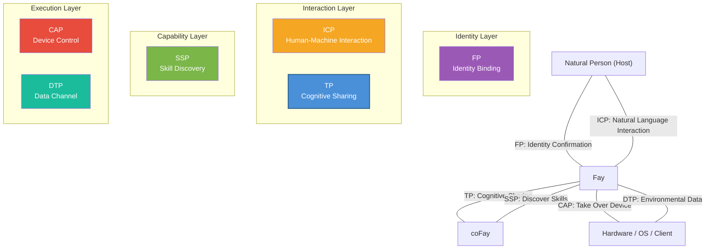

# Chapter 5: Ecosystem Positioning

### 5.1 iFay Six-Protocol Relationship Diagram

TP does not exist in isolation; it is one of six protocols in the iFay ecosystem. Each protocol serves its own function, and together they form a complete AI agent communication framework.

| Protocol | Full Name | Core Responsibility | Domain |
|------|------|---------|---------|
| **ICP** | Interactive Conversation Protocol | Intermediate language for Human ↔ Fay interaction | Human-machine interface |
| **TP** | Telepathy Protocol | Cognitive sharing between Fay ↔ Fay | Inter-Fay collaboration |
| **CAP** | Control Authority Protocol | Fay → Hardware/Client takeover | Device control |
| **SSP** | Skill Sharing Protocol | Fay skill discovery | Capability marketplace |
| **DTP** | Data Tunnel Protocol | Hardware/OS → Fay data channel | Environmental perception |
| **FP** | Faying Protocol | Natural person ↔ iFay identity binding | Identity confirmation |

The interaction relationships among the six protocols are illustrated in the following diagram:

**Inter-Protocol Collaboration Relationships:**

- **FP → TP**: FP establishes the identity binding relationship between Host and Fay; TP references FP authorization during communication to verify the legitimacy of Host delegation. For example, when a patient's iFay initiates an appointment request with a hospital coFay, the hospital coFay confirms through the FP authorization reference that "this iFay is indeed authorized by the patient to make the appointment."
- **ICP → TP**: The Host issues instructions to their Fay through ICP; the Fay delegates tasks to other Fays for execution through TP. For example, a user tells their iFay "book me a flight to Tokyo next week" (ICP interaction), and the iFay then contacts the airline's coFay through TP to complete the booking.
- **SSP ↔ TP**: A Fay discovers other Fays' available skills through SSP, then initiates specific collaboration requests through TP. For example, an iFay discovers a coFay specializing in tax planning through SSP, then establishes a shared context through TP, mounting the Host's financial data (within the authorized scope) into the shared space for consultation.
- **TP → CAP**: When a TP collaboration task requires controlling hardware or clients, the Fay obtains device control authority through CAP credentials. For example, a manually controlled drone needs to be handed over to a Fay for takeover — the ground operator's iFay negotiates the control handover with the Fay on the drone through TP, then completes the actual control transfer through the CAP protocol.
- **DTP → TP**: Hardware and operating systems push environmental data to Fays through DTP; Fays incorporate this data into the TP shared context for collaborating parties to use. For example, a smart home system pushes indoor temperature, humidity, and air quality data to the iFay through DTP, and the iFay mounts this environmental data into the shared context with a health management coFay to assist in generating health recommendations.

### 5.2 Comparison with MCP/A2A

TP and MCP/A2A are not in competition but are complementary — TP can run on top of MCP or A2A. The following comparison table shows the positioning differences across multiple dimensions:

| Dimension | MCP | A2A | TP |
|------|-----|-----|-----|
| **Publisher** | Anthropic | Google | iFay Open Source Community |
| **Release Year** | 2024 | 2025 | 2025 |
| **Core Positioning** | Connection protocol between AI models and external tools | Task delegation and collaboration protocol between Agents | Cognitive sharing protocol between Fays |
| **Communication Direction** | Unidirectional (AI → Tools) | Bidirectional (Agent ↔ Agent) | Bidirectional + Shared Space (Fay ↔ Shared Context ↔ Fay) |
| **Identity Attribution** | None (tools have no attribution concept) | None (Agents are autonomous service nodes) | Yes (every Fay acts on behalf of a Host) |
| **Privacy Protection** | No systematic mechanism (plaintext parameter passing) | No systematic mechanism | End-to-end encryption + Selective disclosure + Host authorization |
| **Internal State Sharing** | Not applicable (tools are stateless functions) | Not shared (Opaque Execution) | Selectively shared within authorized scope (Shared Context) |
| **Transport Method** | Bound to tool call (JSON-RPC) | Bound to JSON-RPC over HTTP | Transport agnostic (deliverable via A2A/MCP/API/Prompt) |
| **Protocol Negotiation** | None | None | Adaptive negotiation and translation |
| **Applicable Scenarios** | AI calling external tools and data sources | Loosely-coupled Agent service orchestration | Deep collaboration, privacy delegation, cognitive fusion |

The relationship among the three can be summarized in one sentence: **MCP lets AI use tools, A2A lets Agents relay messages, TP lets Fays achieve telepathy**.

TP's transport agnosticism means it can "ride" on top of MCP or A2A — when the underlying transport uses A2A, TP adds identity attribution, privacy protection, and shared context capabilities; when the underlying transport uses MCP, TP upgrades unidirectional tool calling into bidirectional cognitive sharing.
