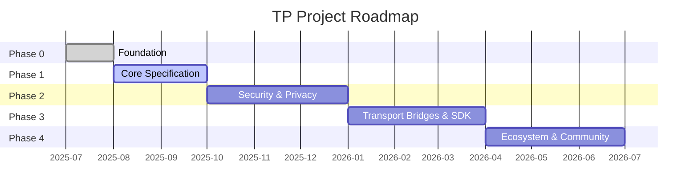

# Chapter 7: Deliverables and Roadmap

### 7.1 Three-Tier Deliverable Catalog

All deliverables of the TP project are organized into three priority tiers:

#### Tier 1 — Core Deliverables (Must-Have)

| Deliverable | Target Phase | Dependencies |
|--------|---------|------|
| Blueprint document (zh-CN + en) | Phase 0 | None |
| TP protocol specification draft | Phase 1 | Blueprint document |
| JSON Schema definitions (MessageEnvelope, Intent, Capability, Task, Context, SharedContext) | Phase 1 | Protocol specification |
| TypeScript type definitions | Phase 1 | JSON Schema |
| TypeScript reference SDK | Phase 3 | Schema + Protocol specification |

#### Tier 2 — Important Deliverables (Should-Have)

| Deliverable | Target Phase | Dependencies |
|--------|---------|------|
| MDX human-readable documentation | Phase 1 | JSON Schema |
| Multi-language protocol documents (9 languages) | Phase 4 | Source language documents |
| Developer guide (Quick Start + Architecture Overview) | Phase 1 | Blueprint document |
| SDK usage guide and API reference | Phase 3 | TypeScript SDK |

#### Tier 3 — Enhancement Deliverables (Nice-to-Have)

| Deliverable | Target Phase | Dependencies |
|--------|---------|------|
| Community contribution guide and governance documents | Phase 0 | None |
| Protocol conformance test suite | Phase 4 | SDK + Schema |
| Example application projects | Phase 4 | SDK |

### 7.2 Roadmap

#### Phase 0: Foundation

The core objective of Phase 0 is to establish the project's infrastructure and top-level narrative. Key milestones include: publishing the blueprint document in both Chinese and English, establishing TP's core positioning as a cognitive sharing protocol; finalizing the project directory structure and naming conventions; creating open-source governance files including README.md, CONTRIBUTING.md, and CODE_OF_CONDUCT.md; establishing Schema version management conventions (date-based naming, three-file synchronization, backward compatibility rules); marking the earlier agent-to-agent-protocol spec as deprecated, officially superseded by the telepathy-protocol spec. The exit criteria for Phase 0 are the bilingual publication of the blueprint document and readiness of the repository infrastructure.

#### Phase 1: Core Specification

Phase 1 focuses on TP's core technical specification. Key milestones include: publishing the TP protocol specification draft, defining shared context semantics and transport-agnostic message envelope format; delivering JSON Schema and TypeScript type definitions covering core data structures including MessageEnvelope, Intent, Capability, Task, Context, and SharedContext; delivering MDX-format human-readable documentation; publishing the developer quick-start guide. The exit criteria for Phase 1 are that the core Schema three-file set (.json / .ts / .mdx) passes consistency validation, and the specification draft completes review.

#### Phase 2: Security, Privacy and Shared Context

Phase 2 delves into the security and privacy domain. Key milestones include: delivering encryption and credential-related Schema definitions (EncryptedPayload, CallbackCredential); publishing the security specification covering end-to-end encryption, authentication mechanisms, and Host-delegated authorization; defining the complete lifecycle management of Shared Context — creation, scope definition, expiration, and revocation; establishing the Technical Steering Committee (TSC) governance mechanism. The exit criteria for Phase 2 are that the security Schema passes consistency validation and the TSC charter is officially published.

#### Phase 3: Transport Bridges and SDK

Phase 3 transforms the protocol specification into runnable code. Key milestones include: delivering the TypeScript reference SDK implementing core message processing logic; implementing protocol bridge interfaces for A2A and MCP, validating transport agnosticism and protocol negotiation capabilities; delivering bridge interfaces for sibling protocols (ICP, SSP, CAP, DTP, FP); publishing SDK documentation and usage examples. The exit criteria for Phase 3 are that the SDK passes all unit tests and property-based tests, and bridge interfaces pass integration tests.

#### Phase 4: Ecosystem and Community

Phase 4 expands TP from a technical project into an open ecosystem. Key milestones include: completing multi-language documentation translation for all 9 languages; delivering the protocol conformance test suite for third-party implementations to verify compliance; publishing example application projects demonstrating shared context in real-world business scenarios; establishing the RFC process to provide community-driven governance for the protocol's ongoing evolution. The exit criteria for Phase 4 are that the translation status dashboard shows all Tier 1 and Tier 2 document translations are complete.

