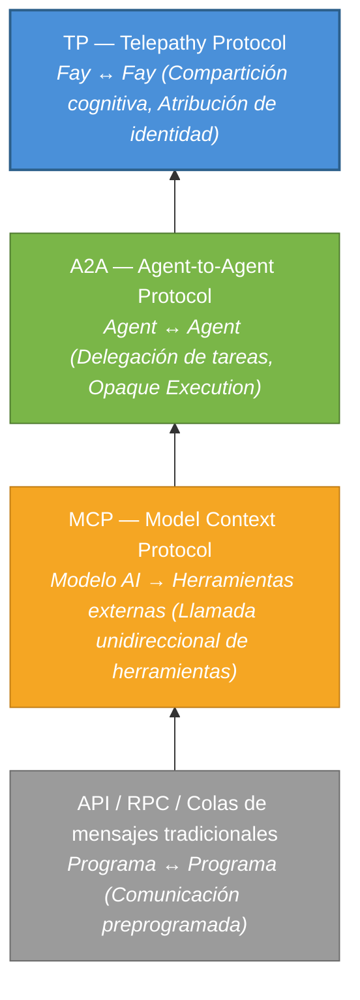
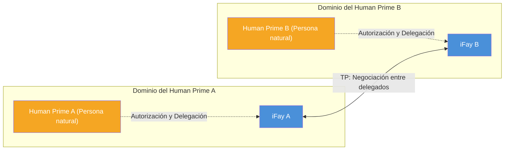

# Capítulo 1: Por qué se necesita TP

### 1.1 Análisis de las capas de protocolos de comunicación

A lo largo de las últimas décadas de práctica en ingeniería de software, la evolución de los protocolos de comunicación ha girado constantemente en torno a una proposición central: **cómo permitir que dos entidades computacionales intercambien información de manera más eficiente**. Con el auge del ecosistema AI Agent, esta proposición está experimentando un cambio de paradigma fundamental.

#### API / RPC / Colas de mensajes tradicionales: Comunicación preprogramada entre programas

Los protocolos de comunicación tradicionales — ya sean APIs RESTful, gRPC o colas de mensajes (como Kafka, RabbitMQ) — resuelven el problema de la **comunicación preprogramada entre programas**. Su característica principal es que el llamador determina el objetivo de la llamada, el método de invocación y los parámetros en tiempo de desarrollo. El contrato de interfaz se solidifica antes del despliegue, dejando una flexibilidad extremadamente limitada en tiempo de ejecución.

Este modelo funciona bien en sistemas deterministas, pero sus limitaciones quedan completamente expuestas cuando se enfrenta al dinamismo y la autonomía de los AI Agents — los Agents necesitan descubrir capacidades en tiempo de ejecución, negociar intenciones y componer servicios dinámicamente, en lugar de codificar todo en tiempo de desarrollo.

> **Ejemplo práctico**: Un Agent de planificación de viajes necesita llamar simultáneamente a servicios de búsqueda de vuelos, reserva de hoteles, pronóstico del tiempo y consulta de visados. Bajo el modelo API tradicional, los desarrolladores deben determinar en tiempo de desarrollo el endpoint, el formato de parámetros y la secuencia de llamadas de cada servicio. Si el usuario cambia su destino sobre la marcha, toda la cadena de llamadas puede necesitar ser reorquestada — lo cual es extremadamente difícil en tiempo de ejecución.

#### MCP (Model Context Protocol): Conectando modelos AI con herramientas externas

En 2024, Anthropic publicó el Model Context Protocol (MCP), diseñado para resolver el problema de conexión entre modelos AI y herramientas externas. La arquitectura central de MCP sigue el modelo **Host → Client → Server**, proporcionando a la AI un "mecanismo de descubrimiento de caja de herramientas" — los modelos pueden descubrir dinámicamente herramientas disponibles en tiempo de ejecución, comprender el Schema de entrada/salida de las herramientas e iniciar llamadas.

Sin embargo, la dirección de comunicación de MCP es **unidireccional**. El modelo AI es siempre la parte activa, y las herramientas son siempre pasivas. Las herramientas no envían información proactivamente a los modelos, ni negocian con otras herramientas. MCP resolvió el problema de "cómo la AI usa herramientas" pero no abordó la proposición de "cómo los Agents colaboran entre sí".

> **Ejemplo práctico**: Un Agent de servicio al cliente está conectado a una herramienta de búsqueda en base de conocimientos y a un sistema de tickets a través de MCP. Cuando la pregunta de un usuario excede las capacidades del Agent de servicio al cliente, necesita escalar a un Agent de soporte técnico. Pero MCP no proporciona ningún mecanismo para la comunicación entre Agents — el Agent de servicio al cliente solo puede llamar herramientas, no puede "pedir ayuda a un colega".

#### A2A (Agent-to-Agent Protocol): Delegación de tareas y colaboración entre Agents

En 2025, Google publicó el Agent-to-Agent Protocol (A2A), elevando la perspectiva de comunicación de "modelo y herramientas" a "Agent y Agent". A2A introdujo tres conceptos clave:

- **AgentCard** (Tarjeta de capacidades): Una descripción estandarizada mediante la cual un Agent declara sus capacidades al mundo exterior
- **Task**: Una unidad de trabajo ejecutable que se pasa entre Agents
- **Message**: Un portador de intercambio de información durante la ejecución de tareas

A2A permite a diferentes Agents descubrir mutuamente sus capacidades, delegar tareas e informar sobre el progreso. Sin embargo, su principio de diseño central — **Opaque Execution** — estipula explícitamente que los Agents no comparten estado interno, memoria ni detalles de implementación de herramientas. Cada Agent es una caja negra, exponiendo solo interfaces de entrada/salida.

> **Ejemplo práctico**: Un Agent de gestión de proyectos delega una tarea de revisión de código a un Agent de revisión de código. Bajo A2A, el Agent de gestión de proyectos debe serializar el diff de código completo, las especificaciones del proyecto y los registros históricos de revisión en un mensaje. El Agent de revisión de código devuelve resultados, pero el Agent de gestión de proyectos no puede "ver" la lógica de razonamiento durante la revisión — solo ve los comentarios de revisión finales. Si necesita preguntar "por qué se marcó este segmento de código como riesgoso", se requiere otra ronda completa de mensajes.

#### TP: Una capa de compartición cognitiva sobre MCP / A2A

Telepathy Protocol (TP) no pretende reemplazar ninguno de los protocolos anteriores. En cambio, establece una **capa de compartición cognitiva** completamente nueva sobre ellos.

El siguiente diagrama ilustra la relación progresiva entre estas cuatro capas de protocolos:

Cada capa de protocolo surgió porque la anterior no podía responder a nuevas preguntas. Las APIs tradicionales no pueden hacer frente al dinamismo de la AI, MCP no puede soportar la colaboración entre Agents, A2A no puede lograr la compartición cognitiva — y TP está diseñado precisamente para llenar esta última brecha.

### 1.2 El paradigma de negociación entre delegados

#### Suposiciones implícitas de los protocolos existentes

MCP, A2A y la gran mayoría de los protocolos de comunicación existentes comparten una suposición implícita común: **las partes comunicantes son entidades de servicio independientes y no afiliadas**.

En el mundo de MCP, una herramienta es una función sin estado — no importa quién la llame, y no le importa a quién representa el llamador. En el mundo de A2A, un Agent es un nodo de servicio autónomo — acepta tareas, las ejecuta y devuelve resultados, pero no le importa quién es el principal detrás de la tarea, ni necesita proteger los intereses de nadie.

Esta suposición es razonable en escenarios de servicios técnicos. Pero cuando los AI Agents comienzan a actuar en nombre de humanos reales, esta suposición ya no se sostiene.

#### La visión del mundo iFay: Cada Fay tiene un Human Prime

En el sistema iFay, la visión del mundo es fundamentalmente diferente. Cada Fay — ya sea un iFay que representa a un individuo o un coFay que sirve una función social pública — tiene un **Human Prime** claramente definido. Un Fay actúa en nombre de su Human Prime, salvaguarda los intereses del Human Prime y protege la privacidad del Human Prime.

Esto significa que cuando dos Fays se comunican, lo que ocurre fundamentalmente no es un intercambio de datos entre dos servicios de software, sino más bien **una negociación entre dos delegados que actúan en nombre de sus respectivos Human Primes** — muy similar a abogados negociando en nombre de sus clientes, o secretarios coordinando asuntos en nombre de sus ejecutivos.

Este paradigma de "negociación entre delegados" impone requisitos completamente nuevos a los protocolos de comunicación:

- **Atribución de identidad**: El protocolo debe identificar claramente a quién representa cada entidad comunicante. Por ejemplo, cuando un Fay reserva una cita con un coFay de hospital en nombre de un paciente, el coFay del hospital necesita confirmar que "este Fay está efectivamente autorizado por el paciente para hacer la cita", en lugar de permitir que cualquiera suplante al Fay del paciente.
- **Fronteras de confianza**: El intercambio de información entre delegados debe ocurrir dentro del alcance autorizado por sus Human Primes. Por ejemplo, un paciente autoriza a su Fay a compartir el historial de alergias y los síntomas actuales con el hospital, pero no permite compartir registros de asesoramiento psicológico — el Fay debe respetar estrictamente esta frontera.
- **Protección de privacidad**: Los datos sensibles de los Human Primes deben estar cifrados durante la transmisión, con soporte para divulgación selectiva. Por ejemplo, durante una reclamación de seguro, solo el código de diagnóstico y el desglose de costos necesitan ser divulgados, sin exponer los registros médicos completos.
- **Auditabilidad**: Todas las acciones de los delegados deben ser rastreables, permitiendo a los Human Primes revisarlas después del hecho. Por ejemplo, un Human Prime puede revisar "con qué Fays compartió datos mi Fay durante la última semana, y qué datos se compartieron" — igual que revisar el historial de transacciones de una cuenta bancaria.

### 1.3 Puntos ciegos de los protocolos existentes

Sintetizando el análisis anterior, los protocolos existentes tienen tres puntos ciegos fundamentales al enfrentar escenarios de "negociación entre delegados":

#### Sin atribución de identidad

Ni MCP ni A2A se preocupa por a quién representa un Agent. Las herramientas en MCP no tienen concepto de "atribución"; las AgentCards en A2A describen las capacidades propias del Agent, no la identidad y autorización del principal detrás de él. Desde la perspectiva de TP, **la comunicación sin atribución de identidad es incompleta** — no puede establecer una base de confianza, ni puede delimitar fronteras de responsabilidad.

> **Ejemplo práctico**: Imagine un agente inmobiliario representando a un comprador negociando el precio con el agente del vendedor. Bajo A2A, el agente del vendedor no puede verificar que "la otra parte realmente representa a un comprador con intención de compra", ni puede confirmar "si el comprador ha autorizado este rango de precios para la negociación". Esto es como un extraño sin poder notarial afirmando representar a alguien en un negocio — no hay base de confianza.

#### Sin protección de privacidad

Los protocolos existentes carecen de mecanismos de protección sistemáticos para los datos de privacidad del Human Prime. Las llamadas de herramientas de MCP transmiten parámetros en texto plano; los Messages de A2A tampoco proporcionan cifrado de extremo a extremo ni capacidades de divulgación selectiva. Cuando los Agents necesitan transmitir registros de salud, datos financieros o credenciales de identidad en nombre de sus Human Primes, los protocolos existentes no pueden proporcionar garantías de seguridad adecuadas.

> **Ejemplo práctico**: El Fay de un buscador de empleo envía un currículum al coFay de una empresa de reclutamiento. El buscador de empleo solo quiere divulgar experiencia laboral y habilidades, pero no quiere exponer su salario actual y dirección de domicilio. Bajo A2A, la elección es enviar todo (violación de privacidad) o no enviar nada (imposible completar la solicitud de empleo). No existe ningún mecanismo para "solo dejar que la otra parte vea lo que yo permito".

#### Sin cognición compartida

A2A declara explícitamente el principio de Opaque Execution — los Agents no comparten estado interno. Este diseño es razonable en escenarios de orquestación de servicios débilmente acoplados, pero se convierte en un cuello de botella en escenarios que requieren colaboración profunda.

Cuando dos Fays necesitan discutir el mismo documento, razonar conjuntamente sobre un problema complejo o colaborar en la misma vista, "no compartir estado interno" significa que cada ronda de interacción debe serializar y transmitir toda la información relevante — esto no solo es ineficiente sino que también introduce pérdida de información y ambigüedad semántica a través de la serialización y deserialización repetidas.

> **Ejemplo práctico**: Dos Fays de diseño arquitectónico necesitan colaborar en el diseño de un edificio. Bajo A2A, el Fay A dibuja un plano de planta y lo serializa en un mensaje para el Fay B; el Fay B propone modificaciones y serializa todo el plano de vuelta; el Fay A revisa y envía de nuevo... cada ronda implica transmitir el plano completo. Pero si ambas partes pudieran compartir la misma vista de diseño (como dos arquitectos parados frente al mismo dibujo), uno traza una línea y el otro la ve inmediatamente — la eficiencia mejoraría en órdenes de magnitud.

TP nació precisamente para llenar estos tres puntos ciegos.
