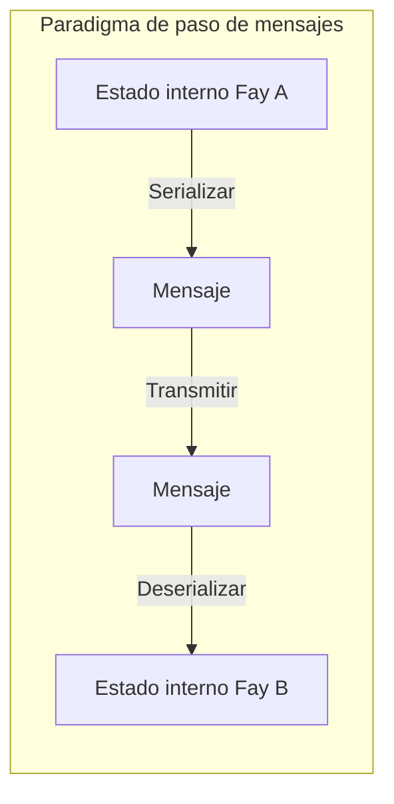
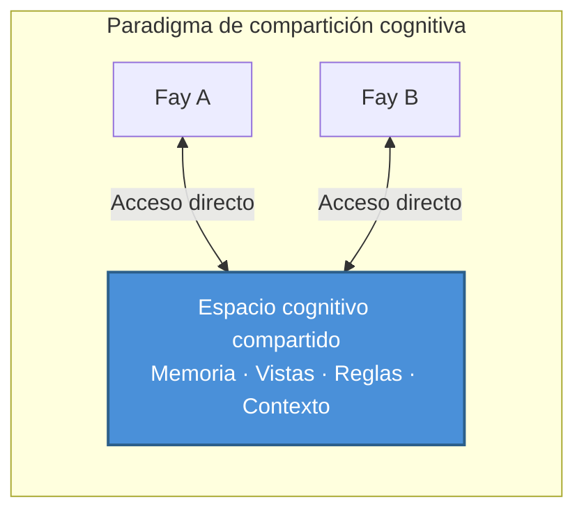

# Capítulo 2: Posicionamiento central de TP

### 2.1 Protocolo de compartición cognitiva vs. Protocolo de paso de mensajes

Comprender el posicionamiento central de TP requiere primero distinguir entre dos paradigmas de comunicación fundamentalmente diferentes.

#### El paradigma de paso de mensajes: Modo "relevo"

Los protocolos de comunicación tradicionales — desde HTTP hasta gRPC, desde MCP hasta A2A — todos siguen fundamentalmente el mismo paradigma: **serializar → transmitir → deserializar**.

El emisor codifica su estado interno en algún formato de transmisión (JSON, Protobuf, XML), lo transmite a través de la red al receptor, y el receptor decodifica el formato de transmisión de vuelta a su propia representación interna. Cada comunicación es un proceso completo de empaquetar y desempaquetar información.

Este modelo es como "pasar un mensaje" — un mensajero registra el significado del hablante, corre hacia otra persona y lo recita. La información inevitablemente sufre pérdidas durante la codificación y decodificación: el contexto se pierde, las suposiciones implícitas se omiten y la precisión de expresión se degrada.

#### El paradigma de compartición cognitiva: Modo "telepatía"

TP propone un paradigma fundamentalmente diferente: **establecer un espacio cognitivo compartido dentro de límites autorizados, donde ambas partes acceden directamente a recursos cognitivos compartidos**.

Bajo este modelo, las partes comunicantes ya no necesitan empaquetar toda la información en mensajes y pasarlos de un lado a otro. En cambio, colaboran dentro de un espacio compartido controlado — fragmentos de memoria compartidos, estados de vista, reglas de razonamiento y contexto ambiental forman la base cognitiva común para ambas partes.

Esto no significa que TP elimine completamente la transmisión de mensajes — establecer el espacio compartido en sí requiere negociación y sincronización. Pero una vez que el contexto compartido está establecido, la eficiencia de colaboración subsiguiente mejora dramáticamente, porque ambas partes ya no necesitan serializar y transmitir repetidamente recursos cognitivos que ya están compartidos.

### 2.2 Interpretación de la metáfora "Telepatía"

El nombre "Telepathy" no es una exageración retórica sino una metáfora precisa del mecanismo central de TP.

#### Un escenario concreto

Imagine dos personas asistiendo a una reunión remota desde diferentes ubicaciones. Una dice: "Miren los datos que he resaltado con un recuadro rojo."

En el mundo humano, para que esta frase tenga sentido, una serie de herramientas mediáticas deben soportarla: software de compartición de pantalla transmite la pantalla del hablante en tiempo real al display de la otra persona; la otra persona necesita localizar el recuadro rojo en su propia pantalla; si hay latencia de red o desenfoque de imagen, podría ver el fotograma anterior, y la posición del recuadro rojo puede haber cambiado ya.

Todo el proceso está lleno de fricción en la transferencia de información: codificación (píxeles de pantalla → flujo de video), transmisión (ancho de banda y latencia de red), decodificación (flujo de video → píxeles de pantalla), alineación cognitiva (la otra persona necesita localizar el recuadro rojo en su propio espacio visual).

Pero si ambas partes poseyeran "telepatía", la situación sería completamente diferente — ambas "verían" directamente la misma vista, y la posición del recuadro rojo, el contenido de los datos, incluso la intención del hablante al marcar el recuadro rojo, todo sería instantáneamente visible en el espacio cognitivo compartido. Sin pérdida de codificación, sin latencia de transmisión, sin costo de alineación cognitiva.

#### Implementación en escenarios Fay-a-Fay

Entre humanos, la "telepatía" es un concepto de ciencia ficción. Pero en escenarios Fay-a-Fay, este contexto compartido es **técnicamente realizable**.

El estado cognitivo de un Fay es fundamentalmente datos estructurados — la memoria es un grafo de conocimiento indexable, las vistas son árboles de estado serializables, y las reglas de razonamiento son motores lógicos compartibles. Cuando dos Fays establecen una sesión TP, pueden, dentro del alcance de la autorización del Human Prime, incorporar porciones de sus recursos cognitivos en un espacio compartido:

- **Memoria a largo plazo parcial a nivel de sesión**: Fragmentos de conocimiento relevantes para el tema de colaboración actual
- **Estado de interfaz de vista**: Estado en tiempo real de la interfaz o vistas de datos que ambas partes están operando
- **Reglas o motores de razonamiento**: Lógica de razonamiento y reglas de decisión para la tarea actual
- **Contexto ambiental**: Información ambiental dinámica como tiempo, ubicación y estado del dispositivo

Este es precisamente el origen del nombre "Telepathy Protocol" — eleva la comunicación entre Fays de "pasar mensajes" a "mentes sincronizadas".
