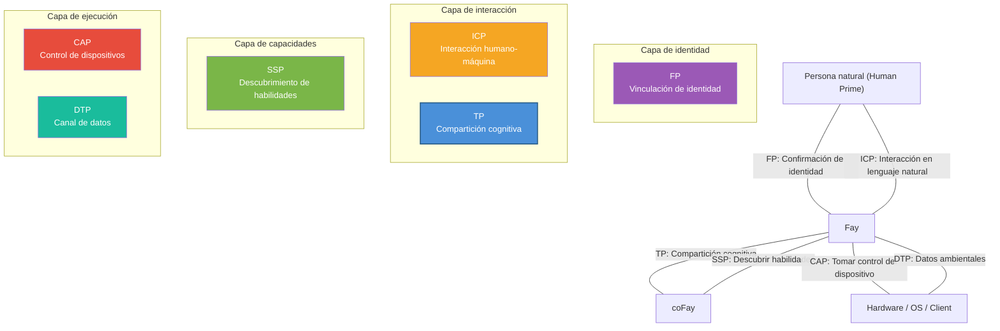

# Capítulo 5: Posicionamiento en el ecosistema

### 5.1 Diagrama de relaciones de los seis protocolos iFay

TP no existe de forma aislada; es uno de los seis protocolos en el ecosistema iFay. Cada protocolo cumple su propia función, y juntos forman un marco completo de comunicación para agentes AI.

| Protocolo | Nombre completo | Responsabilidad principal | Dominio |
|------|------|---------|---------|
| **ICP** | Interactive Conversation Protocol | Lenguaje intermedio para la interacción Humano ↔ Fay | Interfaz humano-máquina |
| **TP** | Telepathy Protocol | Compartición cognitiva entre Fay ↔ Fay | Colaboración inter-Fay |
| **CAP** | Control Authority Protocol | Fay → Toma de control de Hardware/Client | Control de dispositivos |
| **SSP** | Skill Sharing Protocol | Descubrimiento de habilidades Fay | Mercado de capacidades |
| **DTP** | Data Tunnel Protocol | Canal de datos Hardware/OS → Fay | Percepción ambiental |
| **FP** | Faying Protocol | Vinculación de identidad Persona natural ↔ iFay | Confirmación de identidad |

Las relaciones de interacción entre los seis protocolos se ilustran en el siguiente diagrama:

**Relaciones de colaboración entre protocolos:**

- **FP → TP**: FP establece la relación de vinculación de identidad entre Human Prime y Fay; TP referencia la autorización FP durante la comunicación para verificar la legitimidad de la delegación del Human Prime. Por ejemplo, cuando el iFay de un paciente inicia una solicitud de cita con un coFay de hospital, el coFay del hospital confirma a través de la referencia de autorización FP que "este iFay está efectivamente autorizado por el paciente para hacer la cita."
- **ICP → TP**: El Human Prime emite instrucciones a su Fay a través de ICP; el Fay delega tareas a otros Fays para ejecución a través de TP. Por ejemplo, un usuario le dice a su iFay "resérvame un vuelo a Tokio la próxima semana" (interacción ICP), y el iFay luego contacta al coFay de la aerolínea a través de TP para completar la reserva.
- **SSP ↔ TP**: Un Fay descubre las habilidades disponibles de otros Fays a través de SSP, luego inicia solicitudes de colaboración específicas a través de TP. Por ejemplo, un iFay descubre un coFay especializado en planificación fiscal a través de SSP, luego establece un contexto compartido a través de TP, montando los datos financieros del Human Prime (dentro del alcance autorizado) en el espacio compartido para consulta.
- **TP → CAP**: Cuando una tarea de colaboración TP requiere controlar hardware o clients, el Fay obtiene la autoridad de control del dispositivo a través de credentials CAP. Por ejemplo, un dron controlado manualmente necesita ser transferido a un Fay para toma de control — el iFay del operador terrestre negocia la transferencia de control con el Fay en el dron a través de TP, luego completa la transferencia de control real a través del protocolo CAP.
- **DTP → TP**: El hardware y los sistemas operativos envían datos ambientales a los Fays a través de DTP; los Fays incorporan estos datos en el Shared Context de TP para uso de las partes colaborantes. Por ejemplo, un sistema de hogar inteligente envía datos de temperatura interior, humedad y calidad del aire al iFay a través de DTP, y el iFay monta estos datos ambientales en el contexto compartido con un coFay de gestión de salud para ayudar a generar recomendaciones de salud.

### 5.2 Comparación con MCP/A2A

TP y MCP/A2A no están en competencia sino que son complementarios — TP puede ejecutarse sobre MCP o A2A. La siguiente tabla comparativa muestra las diferencias de posicionamiento en múltiples dimensiones:

| Dimensión | MCP | A2A | TP |
|------|-----|-----|-----|
| **Editor** | Anthropic | Google | Comunidad Open Source iFay |
| **Año de publicación** | 2024 | 2025 | 2025 |
| **Posicionamiento central** | Protocolo de conexión entre modelos AI y herramientas externas | Protocolo de delegación de tareas y colaboración entre Agents | Protocolo de compartición cognitiva entre Fays |
| **Dirección de comunicación** | Unidireccional (AI → Herramientas) | Bidireccional (Agent ↔ Agent) | Bidireccional + Espacio compartido (Fay ↔ Shared Context ↔ Fay) |
| **Atribución de identidad** | Ninguna (las herramientas no tienen concepto de atribución) | Ninguna (los Agents son nodos de servicio autónomos) | Sí (cada Fay actúa en nombre de un Human Prime) |
| **Protección de privacidad** | Sin mecanismo sistemático (paso de parámetros en texto plano) | Sin mecanismo sistemático | Cifrado de extremo a extremo + Divulgación selectiva + Autorización del Human Prime |
| **Compartición de estado interno** | No aplicable (las herramientas son funciones sin estado) | No compartido (Opaque Execution) | Compartido selectivamente dentro del alcance autorizado (Shared Context) |
| **Método de transporte** | Vinculado a tool call (JSON-RPC) | Vinculado a JSON-RPC sobre HTTP | Agnóstico de transporte (entregable vía A2A/MCP/API/Prompt) |
| **Negociación de protocolo** | Ninguna | Ninguna | Negociación y traducción adaptativas |
| **Escenarios aplicables** | AI llamando herramientas externas y fuentes de datos | Orquestación de servicios Agent débilmente acoplados | Colaboración profunda, delegación de privacidad, fusión cognitiva |

La relación entre los tres puede resumirse en una frase: **MCP permite a la AI usar herramientas, A2A permite a los Agents pasar mensajes, TP permite a los Fays alcanzar la telepatía**.

El agnosticismo de transporte de TP significa que puede "montarse" sobre MCP o A2A — cuando el transporte subyacente usa A2A, TP agrega atribución de identidad, protección de privacidad y capacidades de contexto compartido; cuando el transporte subyacente usa MCP, TP eleva la llamada unidireccional de herramientas a compartición cognitiva bidireccional.
