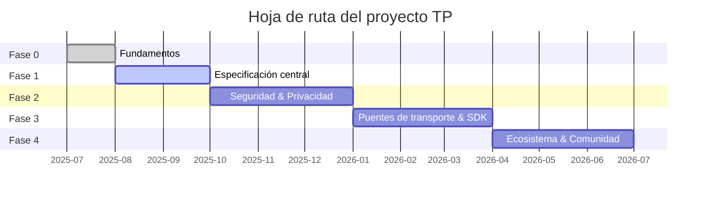

# Capítulo 7: Entregables y hoja de ruta

### 7.1 Catálogo de entregables de tres niveles

Todos los entregables del proyecto TP están organizados en tres niveles de prioridad:

#### Nivel 1 — Entregables esenciales (Must-Have)

| Entregable | Fase objetivo | Dependencias |
|--------|---------|------|
| Documento Blueprint (zh-CN + en) | Fase 0 | Ninguna |
| Borrador de especificación del protocolo TP | Fase 1 | Documento Blueprint |
| Definiciones JSON Schema (MessageEnvelope, Intent, Capability, Task, Context, SharedContext) | Fase 1 | Especificación del protocolo |
| Definiciones de tipos TypeScript | Fase 1 | JSON Schema |
| SDK de referencia TypeScript | Fase 3 | Schema + Especificación del protocolo |

#### Nivel 2 — Entregables importantes (Should-Have)

| Entregable | Fase objetivo | Dependencias |
|--------|---------|------|
| Documentación legible en formato MDX | Fase 1 | JSON Schema |
| Documentos de protocolo multilingües (9 idiomas) | Fase 4 | Documentos en idioma fuente |
| Guía del desarrollador (Quick Start + Visión general de la arquitectura) | Fase 1 | Documento Blueprint |
| Guía de uso del SDK y referencia API | Fase 3 | SDK TypeScript |

#### Nivel 3 — Entregables de mejora (Nice-to-Have)

| Entregable | Fase objetivo | Dependencias |
|--------|---------|------|
| Guía de contribución comunitaria y documentos de gobernanza | Fase 0 | Ninguna |
| Suite de pruebas de conformidad del protocolo | Fase 4 | SDK + Schema |
| Proyectos de aplicaciones de ejemplo | Fase 4 | SDK |

### 7.2 Hoja de ruta

#### Fase 0: Fundamentos

El objetivo central de la Fase 0 es establecer la infraestructura del proyecto y la narrativa de alto nivel. Los hitos clave incluyen: publicación del documento Blueprint en chino e inglés, establecimiento del posicionamiento central de TP como protocolo de compartición cognitiva; finalización de la estructura de directorios del proyecto y convenciones de nomenclatura; creación de archivos de gobernanza open source incluyendo README.md, CONTRIBUTING.md y CODE_OF_CONDUCT.md; establecimiento de convenciones de gestión de versiones del Schema (nomenclatura basada en fechas, sincronización de tres archivos, reglas de compatibilidad hacia atrás); marcado de la especificación anterior agent-to-agent-protocol como obsoleta, oficialmente reemplazada por la especificación telepathy-protocol. Los criterios de salida de la Fase 0 son la publicación bilingüe del documento Blueprint y la preparación de la infraestructura del repositorio.

#### Fase 1: Especificación central

La Fase 1 se enfoca en la especificación técnica central de TP. Los hitos clave incluyen: publicación del borrador de especificación del protocolo TP, definición de la semántica del contexto compartido y el formato de sobre de mensaje agnóstico de transporte; entrega de definiciones JSON Schema y TypeScript cubriendo estructuras de datos centrales incluyendo MessageEnvelope, Intent, Capability, Task, Context y SharedContext; entrega de documentación legible en formato MDX; publicación de la guía de inicio rápido para desarrolladores. Los criterios de salida de la Fase 1 son que el conjunto de tres archivos del Schema central (.json / .ts / .mdx) pase la validación de consistencia, y que el borrador de especificación complete la revisión.

#### Fase 2: Seguridad, privacidad y Shared Context

La Fase 2 profundiza en el dominio de seguridad y privacidad. Los hitos clave incluyen: entrega de definiciones Schema relacionadas con cifrado y credentials (EncryptedPayload, CallbackCredential); publicación de la especificación de seguridad cubriendo cifrado de extremo a extremo, mecanismos de autenticación y autorización delegada por el Human Prime; definición de la gestión completa del ciclo de vida del Shared Context — creación, definición de alcance, expiración y revocación; establecimiento del mecanismo de gobernanza del Technical Steering Committee (TSC). Los criterios de salida de la Fase 2 son que el Schema de seguridad pase la validación de consistencia y que la carta del TSC sea publicada oficialmente.

#### Fase 3: Puentes de transporte y SDK

La Fase 3 transforma la especificación del protocolo en código ejecutable. Los hitos clave incluyen: entrega del SDK de referencia TypeScript implementando la lógica central de procesamiento de mensajes; implementación de interfaces de puente de protocolo para A2A y MCP, validando el agnosticismo de transporte y las capacidades de negociación de protocolo; entrega de interfaces de puente para protocolos hermanos (ICP, SSP, CAP, DTP, FP); publicación de documentación del SDK y ejemplos de uso. Los criterios de salida de la Fase 3 son que el SDK pase todas las pruebas unitarias y pruebas basadas en propiedades, y que las interfaces de puente pasen las pruebas de integración.

#### Fase 4: Ecosistema y comunidad

La Fase 4 expande TP de un proyecto técnico a un ecosistema abierto. Los hitos clave incluyen: completar la traducción de documentación multilingüe para los 9 idiomas; entrega de la suite de pruebas de conformidad del protocolo para que implementaciones de terceros verifiquen su cumplimiento; publicación de proyectos de aplicaciones de ejemplo demostrando el contexto compartido en escenarios de negocio reales; establecimiento del proceso RFC para proporcionar gobernanza impulsada por la comunidad para la evolución continua del protocolo. Los criterios de salida de la Fase 4 son que el panel de estado de traducción muestre que todas las traducciones de documentos de Nivel 1 y Nivel 2 están completas.

