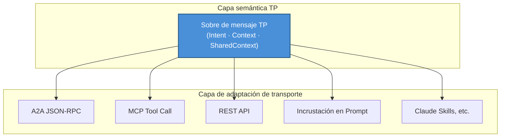
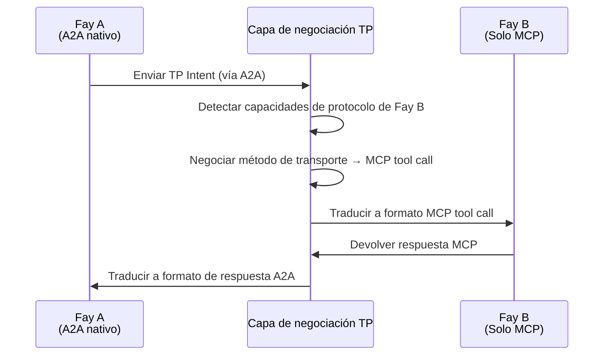

# Capítulo 3: Tres capacidades únicas

El diseño de TP gira en torno a tres capacidades únicas que juntas constituyen la ventaja competitiva central de TP, distinguiéndolo de todos los protocolos de comunicación existentes.

### 3.1 Agnosticismo de transporte

#### Filosofía de diseño

TP no reemplaza a MCP ni a A2A; en cambio, establece una **abstracción semántica unificada** sobre ellos.

La idea central de esta filosofía de diseño es: para la compartición cognitiva, lo que importa no es a través de qué canal se transmiten los mensajes, sino qué semántica llevan los mensajes. Los mensajes TP pueden entregarse a través de cualquiera de los siguientes métodos de transporte:

| Método de transporte | Descripción |
|---------|------|
| JSON-RPC de A2A | Entregar semántica TP a través del canal de mensajes estándar del protocolo A2A |
| Tool call de MCP | Encapsular mensajes TP como parámetros de llamadas de herramientas MCP |
| API REST tradicional | Entregar sobres de mensajes TP a través de cuerpos de solicitudes HTTP |
| Entrega por Prompt | Incrustar semántica TP en Prompts de lenguaje natural (modo degradado) |
| Métodos emergentes como Claude Skills | Compatible con nuevos paradigmas de interacción AI que puedan surgir en el futuro |

#### Analogía

Este diseño puede compararse con la relación entre HTTP y la capa de transporte. El protocolo HTTP puede ejecutarse sobre TCP o sobre QUIC — HTTP se preocupa por la semántica de solicitud-respuesta, no por el mecanismo de transporte subyacente. De manera similar, TP se preocupa por la capa semántica de la compartición cognitiva, no por la capa de transporte de mensajes.

El agnosticismo de transporte asegura que TP no está vinculado a ningún protocolo subyacente único. Cuando surgen nuevos métodos de transporte, TP solo necesita agregar un adaptador de transporte sin modificar las definiciones semánticas propias del protocolo.

### 3.2 Negociación y traducción de protocolo

#### Escenario problemático

En el ecosistema AI del mundo real, diferentes Fays pueden "hablar" diferentes lenguajes de protocolo. Un Fay puede soportar nativamente A2A, otro puede entender solo el formato tool call de MCP, y otros más pueden soportar solo llamadas API REST tradicionales.

Cuando estos Fays con diferentes "lenguas nativas" necesitan colaborar, sin un mecanismo unificado de negociación y traducción, no pueden comunicarse — igual que dos personas que solo hablan idiomas diferentes paradas frente a frente sin poder conversar.

#### La solución de TP

TP actúa como una **capa de traducción adaptativa**, logrando comunicación entre protocolos a través de los siguientes pasos:

1. **Sondeo de capacidades**: TP primero sondea qué protocolos de transporte soporta el Fay contraparte
2. **Negociación de contrato**: Ambas partes acuerdan una "plantilla de contrato" — determinando si usar MCP, A2A, llamadas API o Prompt como método de transporte subyacente
3. **Mapeo semántico**: Sobre el método de transporte acordado, establecer reglas de correspondencia de la semántica TP al formato del protocolo subyacente
4. **Traducción transparente**: En las comunicaciones subsiguientes, TP traduce automáticamente la intención semántica a un formato que la contraparte puede entender

El valor clave de este mecanismo es: incluso si el Fay contraparte aún no ha "aprendido" un protocolo particular, TP puede permitir una comunicación fluida entre ambas partes a través de la traducción. Las diferencias de protocolo son completamente transparentes para la lógica de compartición cognitiva de nivel superior.

### 3.3 Shared Context

#### Estatus central

Shared Context es la capacidad más central de TP y la razón fundamental detrás del nombre "Telepathy". Si el agnosticismo de transporte resuelve el problema de "a través de qué canal comunicarse", y la negociación de protocolo resuelve el problema de "en qué idioma comunicarse", entonces Shared Context resuelve el problema de "cuál es la esencia de la comunicación".

#### Descripción del mecanismo

Cuando dos Fays inician una sesión TP, ambas partes entran en **modo Shared Context**. En este modo, ambas partes ya no simplemente intercambian mensajes sino que mantienen conjuntamente un espacio cognitivo controlado.

Los recursos cognitivos compartibles incluyen:

| Tipo de recurso cognitivo | Descripción | Escenario típico |
|------------|------|---------|
| Memoria a largo plazo parcial a nivel de sesión | Fragmentos de conocimiento relevantes para el tema de colaboración actual | Un Fay médico comparte un resumen relevante del historial médico de un paciente — como historial de alergias, registros de enfermedades crónicas y uso reciente de medicamentos, permitiendo al Fay consultor entender el contexto del paciente sin tener que volver a preguntar |
| Estado de interfaz de vista | Interfaz o vistas de datos que ambas partes están operando | Múltiples Fays editando colaborativamente el mismo texto de contrato — el Fay legal marca cláusulas que necesitan modificación, y el Fay financiero ve inmediatamente las posiciones marcadas y evalúa el impacto financiero, sin enviar versiones de documentos de ida y vuelta |
| Reglas o motores de razonamiento | Lógica de razonamiento para la tarea actual | Un Fay legal comparte disposiciones legales aplicables y cadenas de razonamiento — el Fay fiscal puede referenciar directamente estas disposiciones para calcular implicaciones fiscales, sin que el Fay legal tenga que copiar y pegar estatutos relevantes en mensajes cada vez |
| Contexto ambiental | Información dinámica como tiempo, ubicación, estado del dispositivo | Un Fay en un dron comparte coordenadas GPS en tiempo real, nivel de batería y ángulo de cámara con el Fay de control terrestre — el Fay terrestre puede "percibir" directamente el estado del dron en lugar de esperar mensajes periódicos de informe de estado |

#### Autorización del Host y auditoría

El alcance del Shared Context está estrictamente determinado por la **autorización del Host**. Un Fay no puede decidir unilateralmente qué recursos cognitivos compartir — cada acción de compartición debe ocurrir dentro de los límites preautorizados por el Host. Además, todo acceso al Shared Context es **auditable**, permitiendo al Host revisar después del hecho qué información se compartió, por quién fue accedida y en qué momento.

Este diseño forma un contraste marcado con el principio de Opaque Execution de A2A:

| Dimensión | A2A (Opaque Execution) | TP (Shared Context) |
|------|------------------------|---------------------|
| Estado interno | No compartido; el Agent es una caja negra | Compartido selectivamente dentro del alcance autorizado |
| Profundidad de colaboración | Nivel de tarea (delegación e informes) | Nivel cognitivo (memoria y razonamiento compartidos) |
| Transferencia de información | Serialización completa cada vez | Acceso directo en el espacio compartido |
| Control de privacidad | Sin mecanismo sistemático | Autorización del Host + auditoría completa |
| Escenarios aplicables | Orquestación de servicios débilmente acoplados | Colaboración profunda y fusión cognitiva |

Shared Context eleva la colaboración entre Fays de "pasar mensajes" a "pensar juntos" — este es el valor central de TP como protocolo de compartición cognitiva.
