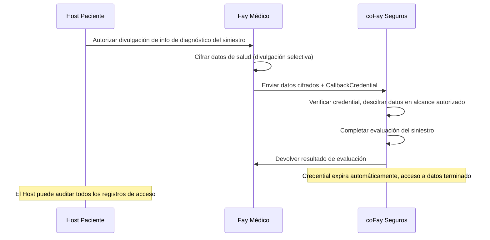
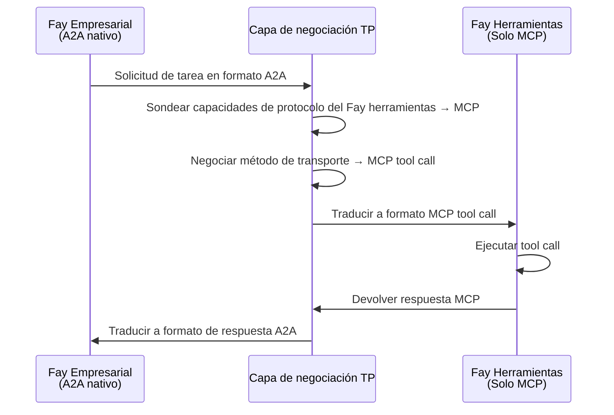
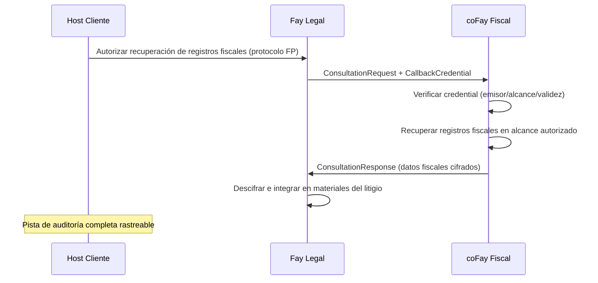
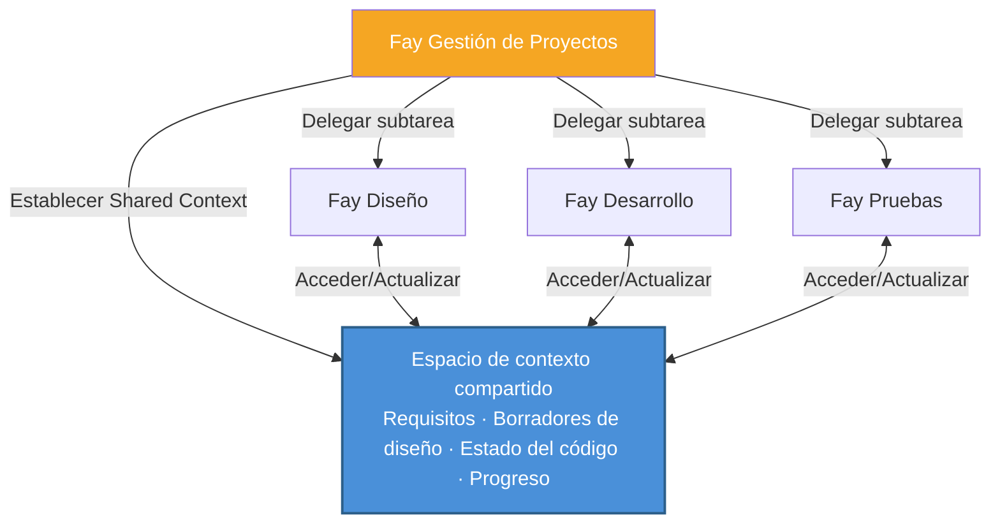
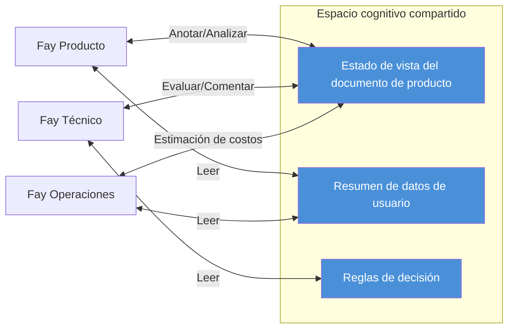

# Capítulo 4: Escenarios de aplicación

Los siguientes cinco escenarios demuestran las aplicaciones prácticas de TP en diferentes dominios de negocio, cubriendo capacidades centrales que incluyen delegación de privacidad, puente entre protocolos, transmisión de credentials, colaboración multi-Fay y reuniones con contexto compartido.

### 4.1 Consulta con delegación de privacidad

**Escenario**: Un Host paciente necesita que su Fay médico envíe datos de salud a un coFay de seguros para obtener una evaluación de siniestro.

Bajo los modelos de comunicación Agent tradicionales, el Agent médico necesitaría serializar los registros de salud completos del paciente en un mensaje y enviarlo al Agent de seguros — lo que significa que todos los datos se transmiten en texto plano por la red, y el receptor obtiene acceso a información mucho más allá de lo necesario.

Bajo el modelo de compartición cognitiva de TP, el proceso es fundamentalmente diferente:

1. **Autorización del Host**: El Host paciente autoriza al Fay médico a través del protocolo FP, especificando explícitamente que solo la información de diagnóstico relevante para este siniestro puede ser divulgada (como códigos de diagnóstico, fechas de tratamiento, desgloses de costos), mientras que otros registros de salud (como registros de asesoramiento psicológico, resultados de pruebas genéticas) permanecen cifrados e invisibles
2. **Divulgación selectiva**: El Fay médico usa el mecanismo `SelectiveDisclosure` de TP para transmitir datos autorizados en forma cifrada al coFay de seguros, junto con un `CallbackCredential` de tiempo limitado
3. **Acceso controlado**: El coFay de seguros accede a datos autorizados dentro de un alcance limitado a través del callback credential, completando la evaluación del siniestro
4. **Expiración automática**: Después de completar la evaluación, el callback credential expira automáticamente, y el coFay de seguros ya no puede acceder a ningún dato del paciente
5. **Auditoría completa**: Todos los registros de acceso a datos se registran en la pista de auditoría, y el Host paciente puede revisarlos en cualquier momento

Este escenario encarna el principio de **soberanía del Host sobre la privacidad** de TP — el alcance de la divulgación de datos siempre es determinado por el Host, no por el juicio propio del Fay.

### 4.2 Traducción entre protocolos

**Escenario**: Un Fay empresarial que soporta nativamente A2A necesita invocar un Fay de herramientas especializado que solo soporta tool calls de MCP.

En un mundo sin TP, estos dos Fays simplemente no pueden comunicarse directamente — "hablan" lenguajes de protocolo completamente diferentes. Las solicitudes A2A JSON-RPC del Fay empresarial no pueden ser parseadas por el Fay de herramientas; la interfaz MCP tool call del Fay de herramientas no puede ser invocada por el Fay empresarial. Los desarrolladores tendrían que escribir adaptadores dedicados para cada par de combinaciones de protocolos.

El mecanismo de negociación y traducción de protocolo de TP cambia fundamentalmente esta situación:

1. **Sondeo de capacidades**: El Fay empresarial inicia una solicitud de comunicación a través de TP, y la capa de negociación TP sondea automáticamente las capacidades de protocolo del Fay de herramientas, descubriendo que solo soporta MCP tool calls
2. **Negociación de contrato**: TP negocia el método de transporte entre ambas partes, determinando MCP tool call como el canal de transporte subyacente
3. **Mapeo semántico**: TP mapea el Intent, Parameters y Context de la solicitud de tarea en formato A2A del Fay empresarial al formato de entrada MCP tool call
4. **Traducción transparente**: El Fay de herramientas recibe una solicitud MCP tool call estándar, completamente inconsciente de la existencia de TP; después de la ejecución, TP traduce la respuesta MCP de vuelta al formato A2A para el Fay empresarial

El valor clave de este escenario es: **las diferencias de protocolo son completamente transparentes para la lógica de negocio de nivel superior**. El Fay empresarial no necesita saber qué protocolo usa la contraparte, ni necesita escribir código adaptador para cada protocolo. La capa de traducción adaptativa de TP permite a los Fays en un ecosistema de protocolos heterogéneo colaborar sin problemas.

### 4.3 Consulta con transmisión de credentials

**Escenario**: Un Fay legal (representando a un Host cliente) inicia una consulta con un coFay fiscal, necesitando obtener los registros fiscales del cliente para apoyar la preparación del litigio.

Este escenario es análogo a una situación del mundo real donde un abogado solicita materiales a una autoridad fiscal en nombre de un cliente — el abogado necesita presentar el poder notarial del cliente, la autoridad fiscal proporciona materiales dentro de un alcance limitado después de verificar la autorización, y todo el proceso queda documentado.

El modo de consulta (Consultation) y el mecanismo de callback credential (CallbackCredential) de TP mapean precisamente este proceso del mundo real:

1. **Delegación del Host**: El Host cliente autoriza al Fay legal a través del protocolo FP, permitiéndole obtener registros fiscales en su nombre
2. **Iniciación de consulta**: El Fay legal envía una `ConsultationRequest` al coFay fiscal, acompañada de un `CallbackCredential` de tiempo limitado que autoriza al coFay fiscal a acceder a los datos financieros del cliente dentro de un alcance limitado
3. **Verificación de credential**: El coFay fiscal verifica la validez del callback credential — comprobando la identidad del emisor, el alcance de autorización y el período de validez
4. **Recuperación controlada de datos**: El coFay fiscal accede a los registros fiscales del cliente a través del credential, pero solo dentro de los años y tipos de impuestos especificados en el `scope` del credential
5. **Cifrado de extremo a extremo**: Todo el proceso de transmisión de datos usa el mecanismo `EncryptedPayload` de TP para cifrado de extremo a extremo
6. **Pista de auditoría**: Todos los registros de uso de credentials y acceso a datos se escriben en el log de auditoría, y el Host cliente puede revisarlos en cualquier momento

Este escenario demuestra cómo TP digitaliza el patrón del mundo real de "un delegado realizando gestiones con un poder notarial" — los credentials son de tiempo limitado, con alcance definido, revocables y auditables, protegiendo completamente los intereses del Host.

### 4.4 Tarea colaborativa multi-Fay

**Escenario**: Un Fay de gestión de proyectos descompone un proyecto complejo de desarrollo de producto en múltiples subtareas, delegándolas respectivamente a un Fay de diseño, un Fay de desarrollo y un Fay de pruebas.

Bajo el modelo Opaque Execution de A2A, el Fay de gestión de proyectos debe serializar y transmitir el contexto completo del proyecto (documentos de requisitos, borradores de diseño, estado del repositorio de código, informes de progreso) cada vez que interactúa con un Fay de subtarea. A medida que el proyecto avanza, el contexto se expande continuamente, el volumen de transmisión de información crece con cada interacción, y la información detallada inevitablemente sufre pérdidas a través de la serialización y deserialización repetidas.

El mecanismo Shared Context de TP transforma fundamentalmente este modelo de colaboración:

1. **Contexto de proyecto compartido**: El Fay de gestión de proyectos establece un espacio de contexto compartido, incorporando los recursos cognitivos centrales del proyecto — representaciones estructuradas de documentos de requisitos, estados de versión de borradores de diseño, resúmenes de cambios del repositorio de código, y progreso y relaciones de dependencia de cada subtarea
2. **Descomposición y delegación de tareas**: El Fay de gestión de proyectos usa el `TaskMessage` de TP para descomponer el proyecto en subtareas, delegándolas al Fay de diseño (diseño UI/UX), Fay de desarrollo (implementación de código) y Fay de pruebas (verificación de calidad)
3. **Herencia de contexto**: Cada subtarea hereda automáticamente el contexto relevante del espacio compartido, eliminando la necesidad de que el Fay de gestión de proyectos transmita repetidamente la información completa del proyecto cada vez
4. **Sincronización en tiempo real**: Cuando el Fay de diseño actualiza un borrador de diseño, el Fay de desarrollo y el Fay de pruebas "perciben" inmediatamente el cambio a través del contexto compartido, sin esperar a que el Fay de gestión de proyectos reenvíe una notificación
5. **Gestión de dependencias**: Las dependencias entre subtareas (como "el desarrollo depende de la finalización del diseño", "las pruebas dependen de la finalización del desarrollo") se gestionan automáticamente a través del mecanismo `SubtaskReference` de TP

Este escenario demuestra la ventaja central del Shared Context sobre el paso de mensajes: **el contexto del proyecto está "vivo"** — se actualiza continuamente a medida que el proyecto avanza, y todos los participantes siempre colaboran sobre la misma base cognitiva actualizada, en lugar de depender de instantáneas de mensajes obsoletas.

### 4.5 Reunión con contexto compartido

**Escenario**: Un Fay de producto, un Fay técnico y un Fay de operaciones necesitan discutir conjuntamente una nueva propuesta de producto, con las tres partes colaborando en tiempo real en el mismo documento de producto.

En el mundo humano, las reuniones remotas requieren la coordinación de múltiples herramientas — compartición de pantalla, mensajería instantánea, colaboración documental — y la información inevitablemente sufre retrasos y pérdidas al pasar entre diferentes medios. En el mundo Agent, usar modelos de paso de mensajes tradicionales hace las cosas aún más complejas — cada Agent mantiene su propia copia del documento, sincroniza cambios a través de mensajes, y la resolución de conflictos y la consistencia de estado se convierten en enormes desafíos de ingeniería.

El mecanismo Shared Context de TP hace que la colaboración multi-Fay en tiempo real sea natural y eficiente:

1. **Establecimiento de un espacio cognitivo compartido**: Los tres Fays establecen una sesión de contexto compartido a través de TP, incorporando los siguientes recursos cognitivos en el espacio compartido:
   - Estado de vista estructurado del documento de producto (capítulos, anotaciones, comentarios)
   - Resúmenes de datos de usuario relevantes (estadísticas de uso anonimizadas, análisis de retroalimentación)
   - Reglas de decisión (matriz de prioridad de producto, criterios de evaluación de viabilidad técnica, modelo de costos operativos)

2. **Sincronización cognitiva en tiempo real**: Cuando el Fay de producto anota el documento con "esta sección necesita rediseño", el Fay técnico y el Fay de operaciones "ven" inmediatamente la ubicación y contenido de la anotación — no a través de notificaciones de mensajes, sino a través del acceso directo al espacio de contexto compartido. Esta es la realización concreta de la metáfora "telepatía"

3. **Colaboración multi-perspectiva**: Los tres Fays analizan y anotan el mismo documento desde sus respectivas perspectivas profesionales — el Fay de producto se enfoca en la experiencia de usuario, el Fay técnico evalúa la complejidad de implementación, y el Fay de operaciones estima los costos operativos. Todas las anotaciones y resultados de análisis son visibles en tiempo real dentro del espacio compartido

4. **Registro de decisiones**: Todas las discusiones, anotaciones y decisiones durante la reunión se registran en el contexto compartido, formando una cadena de decisiones rastreable

Este escenario es la encarnación más completa de la filosofía "telepatía" de TP — múltiples Fays ya no necesitan "pasarse mensajes" entre sí sino que "piensan juntos" en un espacio cognitivo compartido. La transferencia de información se transforma del proceso serial de "codificar → transmitir → decodificar" a "percepción directa dentro del espacio compartido".
