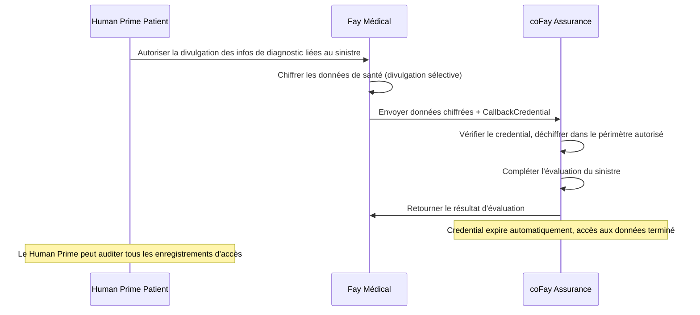
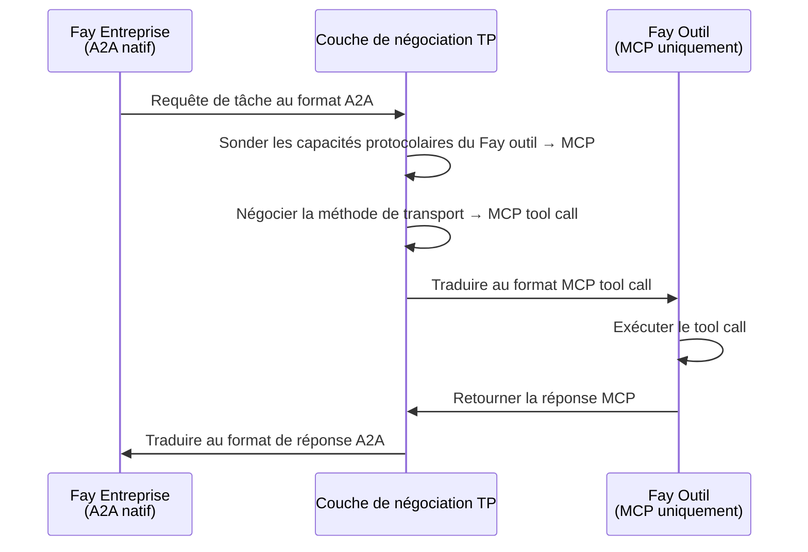
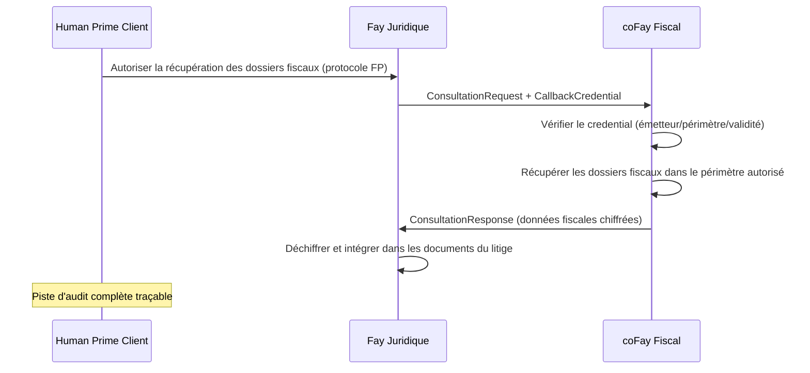
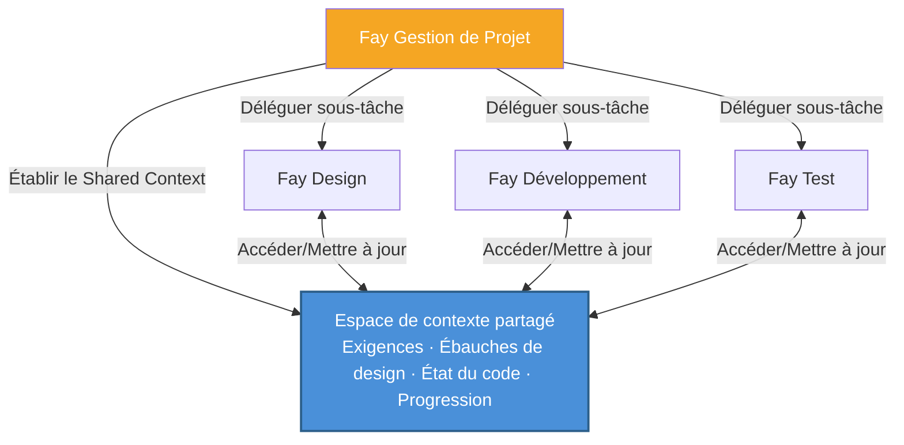
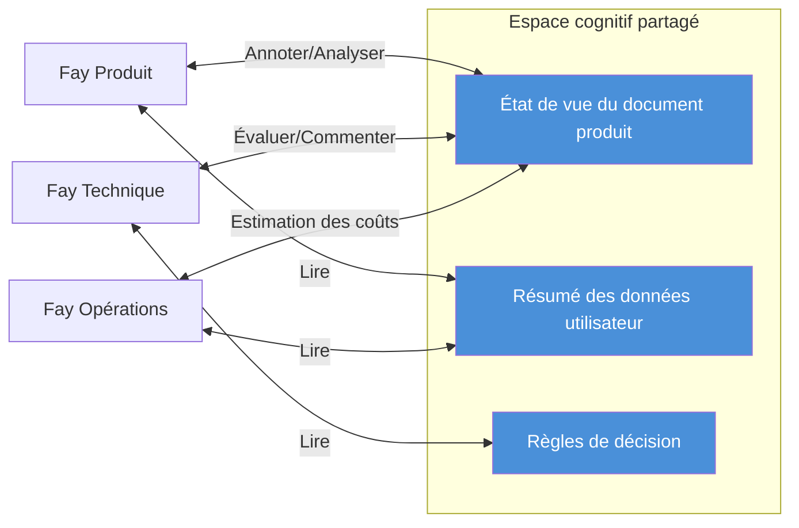

# Chapitre 4 : Scénarios d'application

Les cinq scénarios suivants démontrent les applications pratiques de TP dans différents domaines métier, couvrant les capacités centrales incluant la délégation de vie privée, le pontage inter-protocoles, la transmission de credentials, la collaboration multi-Fay et les réunions en contexte partagé.

### 4.1 Consultation avec délégation de vie privée

**Scénario** : Un Human Prime patient a besoin que son Fay médical soumette des données de santé à un coFay d'assurance pour obtenir une évaluation de sinistre.

Sous les modèles de communication Agent traditionnels, l'Agent médical devrait sérialiser les dossiers de santé complets du patient dans un message et l'envoyer à l'Agent d'assurance — ce qui signifie que toutes les données sont transmises en clair sur le réseau, et le récepteur obtient accès à des informations bien au-delà de ce qui est nécessaire.

Sous le modèle de partage cognitif de TP, le processus est fondamentalement différent :

1. **Autorisation du Human Prime** : Le Human Prime patient autorise le Fay médical via le protocole FP, spécifiant explicitement que seules les informations de diagnostic pertinentes pour ce sinistre peuvent être divulguées (comme les codes de diagnostic, dates de traitement, ventilations de coûts), tandis que les autres dossiers de santé (comme les dossiers de consultation psychologique, résultats de tests génétiques) restent chiffrés et invisibles
2. **Divulgation sélective** : Le Fay médical utilise le mécanisme `SelectiveDisclosure` de TP pour transmettre les données autorisées sous forme chiffrée au coFay d'assurance, accompagnées d'un `CallbackCredential` à durée limitée
3. **Accès contrôlé** : Le coFay d'assurance accède aux données autorisées dans un périmètre limité via le callback credential, complétant l'évaluation du sinistre
4. **Expiration automatique** : Après la fin de l'évaluation, le callback credential expire automatiquement, et le coFay d'assurance ne peut plus accéder à aucune donnée patient
5. **Audit complet** : Tous les enregistrements d'accès aux données sont consignés dans la piste d'audit, et le Human Prime patient peut les consulter à tout moment

Ce scénario incarne le principe de **souveraineté du Human Prime sur la vie privée** de TP — la portée de la divulgation des données est toujours déterminée par le Human Prime, pas par le jugement propre du Fay.

### 4.2 Traduction inter-protocoles

**Scénario** : Un Fay d'entreprise supportant nativement A2A doit invoquer un Fay outil spécialisé qui ne supporte que les tool calls MCP.

Dans un monde sans TP, ces deux Fays ne peuvent tout simplement pas communiquer directement — ils « parlent » des langages protocolaires complètement différents. Les requêtes A2A JSON-RPC du Fay d'entreprise ne peuvent pas être analysées par le Fay outil ; l'interface MCP tool call du Fay outil ne peut pas être invoquée par le Fay d'entreprise. Les développeurs devraient écrire des adaptateurs dédiés pour chaque paire de combinaisons de protocoles.

Le mécanisme de négociation et traduction de protocole de TP change fondamentalement cette situation :

1. **Sondage des capacités** : Le Fay d'entreprise initie une demande de communication via TP, et la couche de négociation TP sonde automatiquement les capacités protocolaires du Fay outil, découvrant qu'il ne supporte que les MCP tool calls
2. **Négociation de contrat** : TP négocie la méthode de transport entre les deux parties, déterminant MCP tool call comme canal de transport sous-jacent
3. **Mapping sémantique** : TP mappe l'Intent, les Parameters et le Context de la requête de tâche au format A2A du Fay d'entreprise vers le format d'entrée MCP tool call
4. **Traduction transparente** : Le Fay outil reçoit une requête MCP tool call standard, complètement inconscient de l'existence de TP ; après exécution, TP traduit la réponse MCP en format A2A pour le Fay d'entreprise

La valeur clé de ce scénario est : **les différences de protocole sont complètement transparentes pour la logique métier de niveau supérieur**. Le Fay d'entreprise n'a pas besoin de savoir quel protocole utilise le distant, ni d'écrire du code adaptateur pour chaque protocole. La couche de traduction adaptative de TP permet aux Fays dans un écosystème protocolaire hétérogène de collaborer de manière transparente.

### 4.3 Consultation avec transmission de credentials

**Scénario** : Un Fay juridique (représentant un Human Prime client) initie une consultation avec un coFay fiscal, ayant besoin d'obtenir les dossiers fiscaux du client pour soutenir la préparation du litige.

Ce scénario est analogue à une situation réelle où un avocat demande des documents à une autorité fiscale au nom d'un client — l'avocat doit présenter la procuration du client, l'autorité fiscale fournit des documents dans un périmètre limité après vérification de l'autorisation, et l'ensemble du processus est documenté.

Le mode consultation (Consultation) et le mécanisme de callback credential (CallbackCredential) de TP reproduisent précisément ce processus réel :

1. **Délégation du Human Prime** : Le Human Prime client autorise le Fay juridique via le protocole FP, lui permettant d'obtenir des dossiers fiscaux en son nom
2. **Initiation de la consultation** : Le Fay juridique envoie une `ConsultationRequest` au coFay fiscal, accompagnée d'un `CallbackCredential` à durée limitée qui autorise le coFay fiscal à accéder aux données financières du client dans un périmètre limité
3. **Vérification du credential** : Le coFay fiscal vérifie la validité du callback credential — vérifiant l'identité de l'émetteur, le périmètre d'autorisation et la période de validité
4. **Récupération contrôlée des données** : Le coFay fiscal accède aux dossiers fiscaux du client via le credential, mais uniquement dans les années et types d'impôts spécifiés dans le `scope` du credential
5. **Chiffrement de bout en bout** : L'ensemble du processus de transmission de données utilise le mécanisme `EncryptedPayload` de TP pour le chiffrement de bout en bout
6. **Piste d'audit** : Tous les enregistrements d'utilisation de credentials et d'accès aux données sont écrits dans le journal d'audit, et le Human Prime client peut les consulter à tout moment

Ce scénario démontre comment TP numérise le modèle réel de « un délégué effectuant des démarches avec une procuration » — les credentials sont à durée limitée, à périmètre défini, révocables et auditables, protégeant pleinement les intérêts du Human Prime.

### 4.4 Tâche collaborative multi-Fay

**Scénario** : Un Fay de gestion de projet décompose un projet complexe de développement produit en plusieurs sous-tâches, les déléguant respectivement à un Fay de design, un Fay de développement et un Fay de test.

Sous le modèle Opaque Execution d'A2A, le Fay de gestion de projet doit sérialiser et transmettre le contexte complet du projet (documents d'exigences, ébauches de design, état du dépôt de code, rapports de progression) à chaque interaction avec un Fay de sous-tâche. Au fur et à mesure que le projet avance, le contexte s'étend continuellement, le volume de transmission d'information croît à chaque interaction, et les informations détaillées subissent inévitablement des pertes par la sérialisation et désérialisation répétées.

Le mécanisme Shared Context de TP transforme fondamentalement ce modèle de collaboration :

1. **Contexte de projet partagé** : Le Fay de gestion de projet établit un espace de contexte partagé, incorporant les ressources cognitives centrales du projet — représentations structurées des documents d'exigences, états de version des ébauches de design, résumés des changements du dépôt de code, et progression et relations de dépendance de chaque sous-tâche
2. **Décomposition et délégation de tâches** : Le Fay de gestion de projet utilise le `TaskMessage` de TP pour décomposer le projet en sous-tâches, les déléguant au Fay de design (design UI/UX), Fay de développement (implémentation du code) et Fay de test (vérification qualité)
3. **Héritage de contexte** : Chaque sous-tâche hérite automatiquement du contexte pertinent de l'espace partagé, éliminant le besoin pour le Fay de gestion de projet de transmettre répétitivement les informations complètes du projet
4. **Synchronisation en temps réel** : Quand le Fay de design met à jour une ébauche de design, le Fay de développement et le Fay de test « perçoivent » immédiatement le changement via le contexte partagé, sans attendre que le Fay de gestion de projet transmette une notification
5. **Gestion des dépendances** : Les dépendances entre sous-tâches (comme « le développement dépend de la fin du design », « le test dépend de la fin du développement ») sont automatiquement gérées via le mécanisme `SubtaskReference` de TP

Ce scénario démontre l'avantage central du Shared Context par rapport à la transmission de messages : **le contexte du projet est « vivant »** — il se met à jour continuellement au fur et à mesure que le projet progresse, et tous les participants collaborent toujours sur la même base cognitive à jour, plutôt que de s'appuyer sur des instantanés de messages obsolètes.

### 4.5 Réunion en contexte partagé

**Scénario** : Un Fay produit, un Fay technique et un Fay opérations doivent discuter conjointement d'une nouvelle proposition de produit, les trois parties collaborant en temps réel sur le même document produit.

Dans le monde humain, les réunions à distance nécessitent la coordination de multiples outils — partage d'écran, messagerie instantanée, collaboration documentaire — et l'information subit inévitablement des retards et des pertes en passant entre différents médias. Dans le monde Agent, l'utilisation de modèles de transmission de messages traditionnels rend les choses encore plus complexes — chaque Agent maintient sa propre copie du document, synchronise les changements via des messages, et la résolution de conflits et la cohérence d'état deviennent d'énormes défis d'ingénierie.

Le mécanisme Shared Context de TP rend la collaboration multi-Fay en temps réel naturelle et efficace :

1. **Établissement d'un espace cognitif partagé** : Les trois Fays établissent une session de contexte partagé via TP, incorporant les ressources cognitives suivantes dans l'espace partagé :
   - État de vue structuré du document produit (chapitres, annotations, commentaires)
   - Résumés de données utilisateur pertinentes (statistiques d'utilisation anonymisées, analyse des retours)
   - Règles de décision (matrice de priorité produit, critères d'évaluation de faisabilité technique, modèle de coût opérationnel)

2. **Synchronisation cognitive en temps réel** : Quand le Fay produit annote le document avec « cette section nécessite une refonte », le Fay technique et le Fay opérations « voient » immédiatement l'emplacement et le contenu de l'annotation — non pas par des notifications de messages, mais par accès direct à l'espace de contexte partagé. C'est la réalisation concrète de la métaphore « télépathie »

3. **Collaboration multi-perspectives** : Les trois Fays analysent et annotent le même document depuis leurs perspectives professionnelles respectives — le Fay produit se concentre sur l'expérience utilisateur, le Fay technique évalue la complexité d'implémentation, et le Fay opérations estime les coûts opérationnels. Toutes les annotations et résultats d'analyse sont visibles en temps réel dans l'espace partagé

4. **Enregistrement des décisions** : Toutes les discussions, annotations et décisions pendant la réunion sont enregistrées dans le contexte partagé, formant une chaîne de décision traçable

Ce scénario est l'incarnation la plus complète de la philosophie « télépathie » de TP — plusieurs Fays n'ont plus besoin de se « relayer des messages » mais « pensent ensemble » dans un espace cognitif partagé. Le transfert d'information se transforme du processus sériel « encoder → transmettre → décoder » en « perception directe dans l'espace partagé ».
