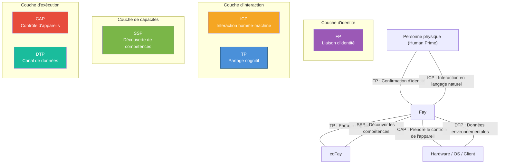

# Chapitre 5 : Positionnement dans l'écosystème

### 5.1 Diagramme des relations des six protocoles iFay

TP n'existe pas de manière isolée ; c'est l'un des six protocoles de l'écosystème iFay. Chaque protocole remplit sa propre fonction, et ensemble ils forment un cadre complet de communication pour agents AI.

| Protocole | Nom complet | Responsabilité principale | Domaine |
|------|------|---------|---------|
| **ICP** | Interactive Conversation Protocol | Langage intermédiaire pour l'interaction Humain ↔ Fay | Interface homme-machine |
| **TP** | Telepathy Protocol | Partage cognitif entre Fay ↔ Fay | Collaboration inter-Fay |
| **CAP** | Control Authority Protocol | Fay → Prise de contrôle Hardware/Client | Contrôle d'appareils |
| **SSP** | Skill Sharing Protocol | Découverte de compétences Fay | Marché de capacités |
| **DTP** | Data Tunnel Protocol | Canal de données Hardware/OS → Fay | Perception environnementale |
| **FP** | Faying Protocol | Liaison d'identité Personne physique ↔ iFay | Confirmation d'identité |

Les relations d'interaction entre les six protocoles sont illustrées dans le diagramme suivant :

**Relations de collaboration inter-protocoles :**

- **FP → TP** : FP établit la relation de liaison d'identité entre Human Prime et Fay ; TP référence l'autorisation FP pendant la communication pour vérifier la légitimité de la délégation du Human Prime. Par exemple, quand l'iFay d'un patient initie une demande de rendez-vous auprès d'un coFay d'hôpital, le coFay de l'hôpital confirme via la référence d'autorisation FP que « cet iFay est bien autorisé par le patient à prendre le rendez-vous. »
- **ICP → TP** : Le Human Prime donne des instructions à son Fay via ICP ; le Fay délègue des tâches à d'autres Fays pour exécution via TP. Par exemple, un utilisateur dit à son iFay « réserve-moi un vol pour Tokyo la semaine prochaine » (interaction ICP), et l'iFay contacte ensuite le coFay de la compagnie aérienne via TP pour compléter la réservation.
- **SSP ↔ TP** : Un Fay découvre les compétences disponibles d'autres Fays via SSP, puis initie des demandes de collaboration spécifiques via TP. Par exemple, un iFay découvre un coFay spécialisé en planification fiscale via SSP, puis établit un contexte partagé via TP, montant les données financières du Human Prime (dans le périmètre autorisé) dans l'espace partagé pour consultation.
- **TP → CAP** : Quand une tâche de collaboration TP nécessite le contrôle de hardware ou de clients, le Fay obtient l'autorité de contrôle de l'appareil via des credentials CAP. Par exemple, un drone contrôlé manuellement doit être transféré à un Fay pour prise de contrôle — l'iFay de l'opérateur au sol négocie le transfert de contrôle avec le Fay sur le drone via TP, puis complète le transfert de contrôle effectif via le protocole CAP.
- **DTP → TP** : Le hardware et les systèmes d'exploitation poussent des données environnementales vers les Fays via DTP ; les Fays incorporent ces données dans le Shared Context TP pour utilisation par les parties collaborantes. Par exemple, un système de maison intelligente pousse les données de température intérieure, d'humidité et de qualité de l'air vers l'iFay via DTP, et l'iFay monte ces données environnementales dans le contexte partagé avec un coFay de gestion de santé pour aider à générer des recommandations de santé.

### 5.2 Comparaison avec MCP/A2A

TP et MCP/A2A ne sont pas en compétition mais complémentaires — TP peut fonctionner au-dessus de MCP ou A2A. Le tableau comparatif suivant montre les différences de positionnement sur plusieurs dimensions :

| Dimension | MCP | A2A | TP |
|------|-----|-----|-----|
| **Éditeur** | Anthropic | Google | Communauté Open Source iFay |
| **Année de publication** | 2024 | 2025 | 2025 |
| **Positionnement central** | Protocole de connexion entre modèles AI et outils externes | Protocole de délégation de tâches et collaboration entre Agents | Protocole de partage cognitif entre Fays |
| **Direction de communication** | Unidirectionnelle (AI → Outils) | Bidirectionnelle (Agent ↔ Agent) | Bidirectionnelle + Espace partagé (Fay ↔ Shared Context ↔ Fay) |
| **Attribution d'identité** | Aucune (les outils n'ont pas de concept d'attribution) | Aucune (les Agents sont des nœuds de service autonomes) | Oui (chaque Fay agit au nom d'un Human Prime) |
| **Protection de la vie privée** | Pas de mécanisme systématique (passage de paramètres en clair) | Pas de mécanisme systématique | Chiffrement de bout en bout + Divulgation sélective + Autorisation du Human Prime |
| **Partage d'état interne** | Non applicable (les outils sont des fonctions sans état) | Non partagé (Opaque Execution) | Partagé sélectivement dans le périmètre autorisé (Shared Context) |
| **Méthode de transport** | Liée au tool call (JSON-RPC) | Liée à JSON-RPC sur HTTP | Agnostique de transport (livrable via A2A/MCP/API/Prompt) |
| **Négociation de protocole** | Aucune | Aucune | Négociation et traduction adaptatives |
| **Scénarios applicables** | AI appelant des outils et sources de données externes | Orchestration de services Agent faiblement couplés | Collaboration approfondie, délégation de vie privée, fusion cognitive |

La relation entre les trois peut être résumée en une phrase : **MCP permet à l'AI d'utiliser des outils, A2A permet aux Agents de relayer des messages, TP permet aux Fays d'atteindre la télépathie**.

L'agnosticisme de transport de TP signifie qu'il peut « chevaucher » MCP ou A2A — quand le transport sous-jacent utilise A2A, TP ajoute l'attribution d'identité, la protection de la vie privée et les capacités de contexte partagé ; quand le transport sous-jacent utilise MCP, TP fait passer l'appel d'outils unidirectionnel au partage cognitif bidirectionnel.
