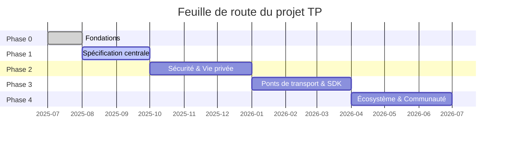

# Chapitre 7 : Livrables et feuille de route

### 7.1 Catalogue de livrables à trois niveaux

Tous les livrables du projet TP sont organisés en trois niveaux de priorité :

#### Niveau 1 — Livrables essentiels (Must-Have)

| Livrable | Phase cible | Dépendances |
|--------|---------|------|
| Document Blueprint (zh-CN + en) | Phase 0 | Aucune |
| Brouillon de spécification du protocole TP | Phase 1 | Document Blueprint |
| Définitions JSON Schema (MessageEnvelope, Intent, Capability, Task, Context, SharedContext) | Phase 1 | Spécification du protocole |
| Définitions de types TypeScript | Phase 1 | JSON Schema |
| SDK de référence TypeScript | Phase 3 | Schema + Spécification du protocole |

#### Niveau 2 — Livrables importants (Should-Have)

| Livrable | Phase cible | Dépendances |
|--------|---------|------|
| Documentation lisible en format MDX | Phase 1 | JSON Schema |
| Documents de protocole multilingues (9 langues) | Phase 4 | Documents en langue source |
| Guide développeur (Quick Start + Vue d'ensemble de l'architecture) | Phase 1 | Document Blueprint |
| Guide d'utilisation du SDK et référence API | Phase 3 | SDK TypeScript |

#### Niveau 3 — Livrables d'amélioration (Nice-to-Have)

| Livrable | Phase cible | Dépendances |
|--------|---------|------|
| Guide de contribution communautaire et documents de gouvernance | Phase 0 | Aucune |
| Suite de tests de conformité du protocole | Phase 4 | SDK + Schema |
| Projets d'applications exemples | Phase 4 | SDK |

### 7.2 Feuille de route

#### Phase 0 : Fondations

L'objectif central de la Phase 0 est d'établir l'infrastructure du projet et le récit de haut niveau. Les jalons clés incluent : publication du document Blueprint en chinois et en anglais, établissement du positionnement central de TP comme protocole de partage cognitif ; finalisation de la structure des répertoires du projet et des conventions de nommage ; création des fichiers de gouvernance open source incluant README.md, CONTRIBUTING.md et CODE_OF_CONDUCT.md ; établissement des conventions de gestion de versions du Schema (nommage basé sur la date, synchronisation à trois fichiers, règles de compatibilité ascendante) ; marquage de l'ancienne spécification agent-to-agent-protocol comme obsolète, officiellement remplacée par la spécification telepathy-protocol. Les critères de sortie de la Phase 0 sont la publication bilingue du document Blueprint et la préparation de l'infrastructure du dépôt.

#### Phase 1 : Spécification centrale

La Phase 1 se concentre sur la spécification technique centrale de TP. Les jalons clés incluent : publication du brouillon de spécification du protocole TP, définition de la sémantique du contexte partagé et du format d'enveloppe de message agnostique de transport ; livraison des définitions JSON Schema et TypeScript couvrant les structures de données centrales incluant MessageEnvelope, Intent, Capability, Task, Context et SharedContext ; livraison de la documentation lisible en format MDX ; publication du guide de démarrage rapide pour développeurs. Les critères de sortie de la Phase 1 sont que l'ensemble de trois fichiers du Schema central (.json / .ts / .mdx) passe la validation de cohérence, et que le brouillon de spécification complète la revue.

#### Phase 2 : Sécurité, vie privée et Shared Context

La Phase 2 approfondit le domaine de la sécurité et de la vie privée. Les jalons clés incluent : livraison des définitions Schema liées au chiffrement et aux credentials (EncryptedPayload, CallbackCredential) ; publication de la spécification de sécurité couvrant le chiffrement de bout en bout, les mécanismes d'authentification et l'autorisation déléguée par le Human Prime ; définition de la gestion complète du cycle de vie du Shared Context — création, définition de portée, expiration et révocation ; établissement du mécanisme de gouvernance du Technical Steering Committee (TSC). Les critères de sortie de la Phase 2 sont que le Schema de sécurité passe la validation de cohérence et que la charte du TSC est officiellement publiée.

#### Phase 3 : Ponts de transport et SDK

La Phase 3 transforme la spécification du protocole en code exécutable. Les jalons clés incluent : livraison du SDK de référence TypeScript implémentant la logique centrale de traitement des messages ; implémentation des interfaces de pont de protocole pour A2A et MCP, validant l'agnosticisme de transport et les capacités de négociation de protocole ; livraison des interfaces de pont pour les protocoles frères (ICP, SSP, CAP, DTP, FP) ; publication de la documentation du SDK et des exemples d'utilisation. Les critères de sortie de la Phase 3 sont que le SDK passe tous les tests unitaires et les tests basés sur les propriétés, et que les interfaces de pont passent les tests d'intégration.

#### Phase 4 : Écosystème et communauté

La Phase 4 étend TP d'un projet technique à un écosystème ouvert. Les jalons clés incluent : achèvement de la traduction de la documentation multilingue pour les 9 langues ; livraison de la suite de tests de conformité du protocole pour que les implémentations tierces vérifient leur conformité ; publication de projets d'applications exemples démontrant le contexte partagé dans des scénarios métier réels ; établissement du processus RFC pour fournir une gouvernance communautaire pour l'évolution continue du protocole. Les critères de sortie de la Phase 4 sont que le tableau de bord du statut de traduction montre que toutes les traductions de documents de Niveau 1 et Niveau 2 sont complètes.

