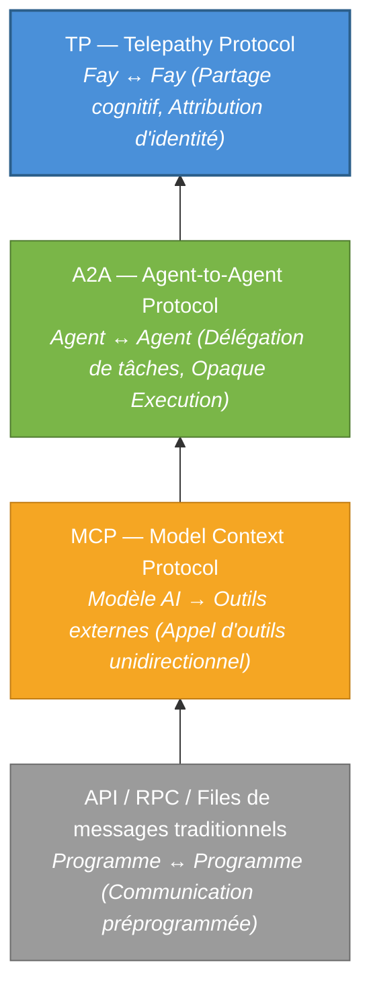
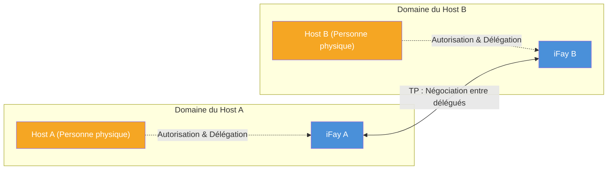

# Chapitre 1 : Pourquoi TP est nécessaire

### 1.1 Analyse des couches de protocoles de communication

Au cours des dernières décennies de pratique en ingénierie logicielle, l'évolution des protocoles de communication a constamment tourné autour d'une proposition centrale : **comment permettre à deux entités informatiques d'échanger des informations plus efficacement**. Avec l'essor de l'écosystème AI Agent, cette proposition connaît un changement de paradigme fondamental.

#### API / RPC / Files de messages traditionnels : Communication préprogrammée entre programmes

Les protocoles de communication traditionnels — qu'il s'agisse d'APIs RESTful, de gRPC ou de files de messages (comme Kafka, RabbitMQ) — résolvent le problème de la **communication préprogrammée entre programmes**. Leur caractéristique principale est que l'appelant détermine la cible d'appel, la méthode d'invocation et les paramètres au moment du développement. Le contrat d'interface est figé avant le déploiement, laissant une flexibilité extrêmement limitée à l'exécution.

Ce modèle fonctionne bien dans les systèmes déterministes, mais ses limites sont pleinement exposées face au dynamisme et à l'autonomie des AI Agents — les Agents doivent découvrir des capacités à l'exécution, négocier des intentions et composer dynamiquement des services, plutôt que de tout coder en dur au moment du développement.

> **Exemple concret** : Un Agent de planification de voyage doit simultanément appeler des services de recherche de vols, de réservation d'hôtels, de prévisions météo et de consultation de visas. Sous le modèle API traditionnel, les développeurs doivent déterminer au moment du développement le endpoint, le format des paramètres et la séquence d'appel de chaque service. Si l'utilisateur change sa destination en cours de route, toute la chaîne d'appels doit potentiellement être réorchestrée — ce qui est extrêmement difficile à l'exécution.

#### MCP (Model Context Protocol) : Connecter les modèles AI aux outils externes

En 2024, Anthropic a publié le Model Context Protocol (MCP), conçu pour résoudre le problème de connexion entre les modèles AI et les outils externes. L'architecture centrale de MCP suit le modèle **Host → Client → Server**, fournissant à l'AI un « mécanisme de découverte de boîte à outils » — les modèles peuvent découvrir dynamiquement les outils disponibles à l'exécution, comprendre le Schema d'entrée/sortie des outils et initier des appels.

Cependant, la direction de communication de MCP est **unidirectionnelle**. Le modèle AI est toujours la partie active, et les outils sont toujours passifs. Les outils ne poussent pas proactivement d'informations vers les modèles, ni ne négocient avec d'autres outils. MCP a résolu le problème de « comment l'AI utilise les outils » mais n'a pas abordé la proposition de « comment les Agents collaborent entre eux ».

> **Exemple concret** : Un Agent de service client est connecté à un outil de recherche dans une base de connaissances et à un système de tickets via MCP. Quand la question d'un utilisateur dépasse les capacités de l'Agent de service client, il doit escalader vers un Agent de support technique. Mais MCP ne fournit aucun mécanisme de communication inter-Agents — l'Agent de service client peut seulement appeler des outils, il ne peut pas « demander de l'aide à un collègue ».

#### A2A (Agent-to-Agent Protocol) : Délégation de tâches et collaboration entre Agents

En 2025, Google a publié l'Agent-to-Agent Protocol (A2A), élevant la perspective de communication de « modèle et outils » à « Agent et Agent ». A2A a introduit trois concepts clés :

- **AgentCard** (Carte de capacités) : Une description standardisée par laquelle un Agent déclare ses capacités au monde extérieur
- **Task** : Une unité de travail exécutable transmise entre Agents
- **Message** : Un support d'échange d'informations pendant l'exécution des tâches

A2A permet à différents Agents de découvrir mutuellement leurs capacités, de déléguer des tâches et de rapporter leur progression. Cependant, son principe de conception central — **Opaque Execution** — stipule explicitement que les Agents ne partagent pas leur état interne, leur mémoire ou les détails d'implémentation de leurs outils. Chaque Agent est une boîte noire, n'exposant que des interfaces d'entrée/sortie.

> **Exemple concret** : Un Agent de gestion de projet délègue une tâche de revue de code à un Agent de revue de code. Sous A2A, l'Agent de gestion de projet doit sérialiser le diff de code complet, les spécifications du projet et l'historique des revues dans un message. L'Agent de revue de code retourne des résultats, mais l'Agent de gestion de projet ne peut pas « voir » la logique de raisonnement pendant la revue — il ne voit que les commentaires de revue finaux. S'il a besoin de demander « pourquoi ce segment de code a-t-il été signalé comme risqué », un autre aller-retour complet de messages est nécessaire.

#### TP : Une couche de partage cognitif au-dessus de MCP / A2A

Telepathy Protocol (TP) ne vise pas à remplacer l'un des protocoles ci-dessus. Au contraire, il établit une toute nouvelle **couche de partage cognitif** au-dessus d'eux.

Le diagramme suivant illustre la relation progressive entre ces quatre couches de protocoles :

Chaque couche de protocole est apparue parce que la précédente ne pouvait pas répondre à de nouvelles questions. Les APIs traditionnelles ne peuvent pas faire face au dynamisme de l'AI, MCP ne peut pas supporter la collaboration inter-Agents, A2A ne peut pas réaliser le partage cognitif — et TP est conçu précisément pour combler cette dernière lacune.

### 1.2 Le paradigme de négociation entre délégués

#### Hypothèses implicites des protocoles existants

MCP, A2A et la grande majorité des protocoles de communication existants partagent une hypothèse implicite commune : **les parties communicantes sont des entités de service indépendantes et non affiliées**.

Dans le monde de MCP, un outil est une fonction sans état — peu importe qui l'appelle, et il ne se soucie pas de qui l'appelant représente. Dans le monde d'A2A, un Agent est un nœud de service autonome — il accepte des tâches, les exécute et retourne des résultats, mais il ne se soucie pas de qui est le mandant derrière la tâche, ni n'a besoin de protéger les intérêts de quiconque.

Cette hypothèse est raisonnable dans les scénarios de services techniques. Mais quand les AI Agents commencent à agir au nom de vrais humains, cette hypothèse ne tient plus.

#### La vision du monde iFay : Chaque Fay a un Host

Dans le système iFay, la vision du monde est fondamentalement différente. Chaque Fay — qu'il s'agisse d'un iFay représentant un individu ou d'un coFay servant une fonction sociale publique — a un **Host** clairement défini. Un Fay agit au nom de son Host, protège les intérêts du Host et préserve la vie privée du Host.

Cela signifie que lorsque deux Fays communiquent, ce qui se produit fondamentalement n'est pas un échange de données entre deux services logiciels, mais plutôt **une négociation entre deux délégués agissant au nom de leurs Hosts respectifs** — tout comme des avocats négociant au nom de leurs clients, ou des secrétaires coordonnant des affaires au nom de leurs dirigeants.

Ce paradigme de « négociation entre délégués » impose des exigences entièrement nouvelles aux protocoles de communication :

- **Attribution d'identité** : Le protocole doit clairement identifier qui chaque entité communicante représente. Par exemple, quand un Fay prend rendez-vous avec un coFay d'hôpital au nom d'un patient, le coFay de l'hôpital doit pouvoir confirmer que « ce Fay est bien autorisé par le patient à prendre le rendez-vous », plutôt que de permettre à n'importe qui d'usurper l'identité du Fay du patient.
- **Frontières de confiance** : Le partage d'informations entre délégués doit se faire dans le cadre autorisé par leurs Hosts. Par exemple, un patient autorise son Fay à partager l'historique des allergies et les symptômes actuels avec l'hôpital, mais n'autorise pas le partage des dossiers de consultation psychologique — le Fay doit strictement respecter cette frontière.
- **Protection de la vie privée** : Les données sensibles des Hosts doivent être chiffrées pendant la transmission, avec support de la divulgation sélective. Par exemple, lors d'une réclamation d'assurance, seuls le code de diagnostic et la ventilation des coûts doivent être divulgués, sans exposer les dossiers médicaux complets.
- **Auditabilité** : Toutes les actions des délégués doivent être traçables, permettant aux Hosts de les examiner après coup. Par exemple, un Host peut vérifier « avec quels Fays mon Fay a partagé des données au cours de la dernière semaine, et quelles données ont été partagées » — tout comme consulter l'historique des transactions d'un compte bancaire.

### 1.3 Angles morts des protocoles existants

En synthétisant l'analyse ci-dessus, les protocoles existants présentent trois angles morts fondamentaux face aux scénarios de « négociation entre délégués » :

#### Pas d'attribution d'identité

Ni MCP ni A2A ne se préoccupe de qui un Agent représente. Les outils dans MCP n'ont pas de concept d'« attribution » ; les AgentCards dans A2A décrivent les capacités propres de l'Agent, pas l'identité et l'autorisation du mandant derrière lui. Du point de vue de TP, **une communication sans attribution d'identité est incomplète** — elle ne peut pas établir de fondation de confiance, ni délimiter les frontières de responsabilité.

> **Exemple concret** : Imaginez un agent immobilier représentant un acheteur négociant le prix avec l'agent du vendeur. Sous A2A, l'agent du vendeur ne peut pas vérifier que « l'autre partie représente vraiment un acheteur avec une intention d'achat », ni confirmer « si l'acheteur a autorisé cette fourchette de prix pour la négociation ». C'est comme un inconnu sans procuration prétendant représenter quelqu'un dans une transaction — il n'y a pas de fondation de confiance.

#### Pas de protection de la vie privée

Les protocoles existants manquent de mécanismes de protection systématiques pour les données privées du Host. Les appels d'outils de MCP transmettent les paramètres en clair ; les Messages d'A2A ne fournissent pas non plus de chiffrement de bout en bout ni de capacités de divulgation sélective. Quand les Agents doivent transmettre des dossiers de santé, des données financières ou des justificatifs d'identité au nom de leurs Hosts, les protocoles existants ne peuvent pas fournir de garanties de sécurité adéquates.

> **Exemple concret** : Le Fay d'un chercheur d'emploi soumet un CV au coFay d'une entreprise de recrutement. Le chercheur d'emploi veut seulement divulguer son expérience professionnelle et ses compétences, mais ne veut pas exposer son salaire actuel et son adresse personnelle. Sous A2A, le choix est soit d'envoyer tout (violation de la vie privée) soit de n'envoyer rien (impossible de compléter la candidature). Il n'existe aucun mécanisme pour « ne laisser l'autre partie voir que ce que j'autorise ».

#### Pas de cognition partagée

A2A déclare explicitement le principe d'Opaque Execution — les Agents ne partagent pas leur état interne. Cette conception est raisonnable dans les scénarios d'orchestration de services faiblement couplés, mais devient un goulot d'étranglement dans les scénarios nécessitant une collaboration approfondie.

Quand deux Fays doivent discuter du même document, raisonner conjointement sur un problème complexe ou collaborer sur la même vue, « ne pas partager l'état interne » signifie que chaque tour d'interaction doit sérialiser et transmettre toutes les informations pertinentes — ce qui est non seulement inefficace mais introduit aussi une perte d'information et une ambiguïté sémantique par la sérialisation et désérialisation répétées.

> **Exemple concret** : Deux Fays de conception architecturale doivent collaborer pour concevoir un bâtiment. Sous A2A, le Fay A dessine un plan d'étage et le sérialise dans un message pour le Fay B ; le Fay B propose des modifications et sérialise le plan complet en retour ; le Fay A révise et renvoie... chaque tour implique la transmission du plan complet. Mais si les deux parties pouvaient partager la même vue de conception (comme deux architectes debout devant le même dessin), l'un trace une ligne et l'autre la voit immédiatement — l'efficacité s'améliorerait de plusieurs ordres de grandeur.

TP est né précisément pour combler ces trois angles morts.
