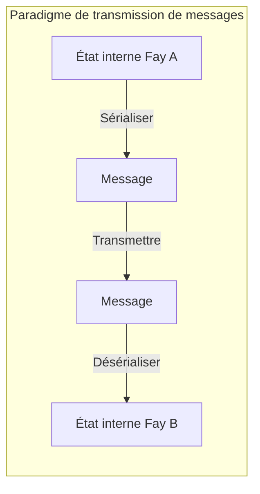
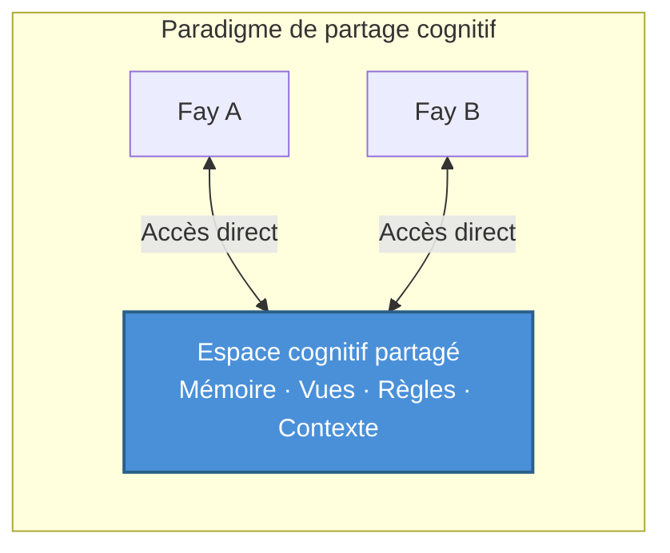

# Chapitre 2 : Positionnement central de TP

### 2.1 Protocole de partage cognitif vs. Protocole de transmission de messages

Comprendre le positionnement central de TP nécessite d'abord de distinguer deux paradigmes de communication fondamentalement différents.

#### Le paradigme de transmission de messages : Mode « relais »

Les protocoles de communication traditionnels — de HTTP à gRPC, de MCP à A2A — suivent tous fondamentalement le même paradigme : **sérialiser → transmettre → désérialiser**.

L'émetteur encode son état interne dans un format de transmission (JSON, Protobuf, XML), le transmet via le réseau au récepteur, et le récepteur décode le format de transmission en sa propre représentation interne. Chaque communication est un processus complet d'empaquetage et de dépaquetage d'informations.

Ce modèle est comme « relayer un message » — un messager note la signification du locuteur, court vers une autre personne et la récite. L'information subit inévitablement des pertes lors de l'encodage et du décodage : le contexte est perdu, les hypothèses implicites sont omises et la précision d'expression se dégrade.

#### Le paradigme de partage cognitif : Mode « télépathie »

TP propose un paradigme fondamentalement différent : **établir un espace cognitif partagé dans des limites autorisées, où les deux parties accèdent directement aux ressources cognitives partagées**.

Sous ce modèle, les parties communicantes n'ont plus besoin d'empaqueter toutes les informations dans des messages et de les faire circuler. Au lieu de cela, elles collaborent dans un espace partagé contrôlé — des fragments de mémoire partagés, des états de vue, des règles de raisonnement et un contexte environnemental forment la fondation cognitive commune pour les deux parties.

Cela ne signifie pas que TP élimine complètement la transmission de messages — l'établissement de l'espace partagé lui-même nécessite une négociation et une synchronisation. Mais une fois le contexte partagé établi, l'efficacité de la collaboration ultérieure s'améliore considérablement, car les deux parties n'ont plus besoin de sérialiser et transmettre de manière répétée des ressources cognitives déjà partagées.

### 2.2 Interprétation de la métaphore « Télépathie »

Le nom « Telepathy » n'est pas une exagération rhétorique mais une métaphore précise du mécanisme central de TP.

#### Un scénario concret

Imaginez deux personnes participant à une réunion à distance depuis des lieux différents. L'une dit : « Regardez les données que j'ai surlignées avec un cadre rouge. »

Dans le monde humain, pour que cette phrase ait un sens, une série d'outils médiatiques doit la supporter : un logiciel de partage d'écran transmet l'écran du locuteur en temps réel sur l'affichage de l'autre personne ; l'autre personne doit localiser le cadre rouge sur son propre écran ; en cas de latence réseau ou de flou d'image, elle pourrait voir l'image précédente, et la position du cadre rouge a peut-être déjà changé.

L'ensemble du processus est rempli de friction de transmission d'information : encodage (pixels d'écran → flux vidéo), transmission (bande passante et latence réseau), décodage (flux vidéo → pixels d'écran), alignement cognitif (l'autre personne doit localiser le cadre rouge dans son propre espace visuel).

Mais si les deux parties possédaient la « télépathie », la situation serait entièrement différente — les deux « verraient » directement la même vue, et la position du cadre rouge, le contenu des données, même l'intention du locuteur en marquant le cadre rouge, seraient tous instantanément visibles dans l'espace cognitif partagé. Pas de perte d'encodage, pas de latence de transmission, pas de coût d'alignement cognitif.

#### Implémentation dans les scénarios Fay-à-Fay

Parmi les humains, la « télépathie » est un concept de science-fiction. Mais dans les scénarios Fay-à-Fay, ce contexte partagé est **réalisable techniquement**.

L'état cognitif d'un Fay est fondamentalement constitué de données structurées — la mémoire est un graphe de connaissances indexable, les vues sont des arbres d'état sérialisables, et les règles de raisonnement sont des moteurs logiques partageables. Quand deux Fays établissent une session TP, ils peuvent, dans le cadre de l'autorisation du Host, incorporer des portions de leurs ressources cognitives dans un espace partagé :

- **Mémoire à long terme partielle au niveau de la session** : Fragments de connaissances pertinents pour le sujet de collaboration en cours
- **État de l'interface de vue** : État en temps réel de l'interface ou des vues de données que les deux parties manipulent
- **Règles ou moteurs de raisonnement** : Logique de raisonnement et règles de décision pour la tâche en cours
- **Contexte environnemental** : Informations environnementales dynamiques telles que l'heure, le lieu et l'état de l'appareil

C'est précisément l'origine du nom « Telepathy Protocol » — il fait passer la communication entre Fays de « relayer des messages » à « esprits synchronisés ».
