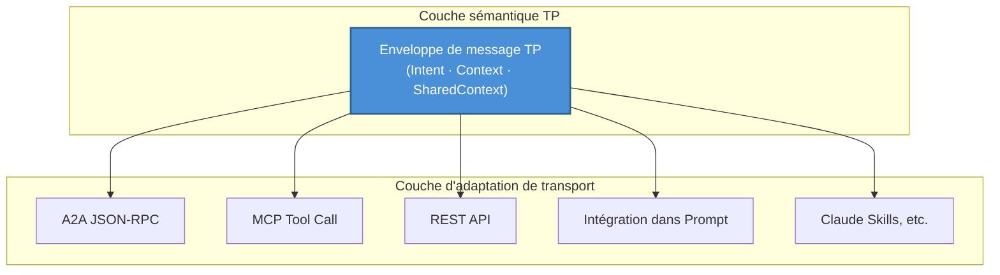
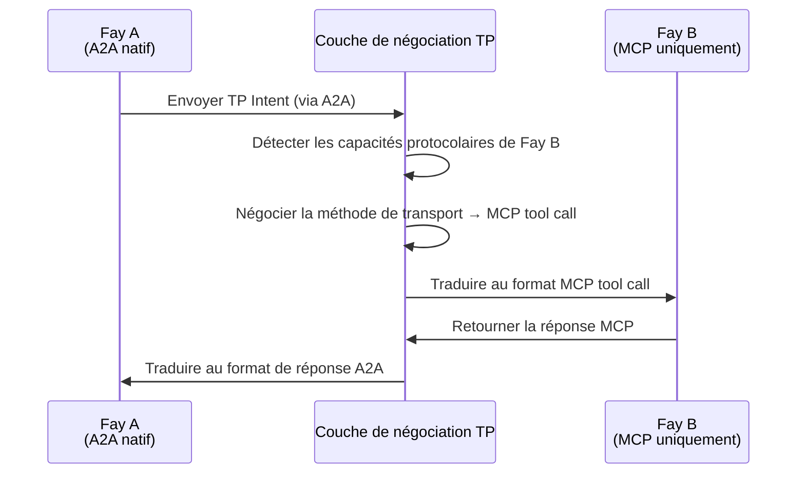

# Chapitre 3 : Trois capacités uniques

La conception de TP s'articule autour de trois capacités uniques qui constituent ensemble l'avantage compétitif central de TP, le distinguant de tous les protocoles de communication existants.

### 3.1 Agnosticisme de transport

#### Philosophie de conception

TP ne remplace ni MCP ni A2A ; il établit plutôt une **abstraction sémantique unifiée** au-dessus d'eux.

L'insight central de cette philosophie de conception est : pour le partage cognitif, ce qui compte n'est pas par quel canal les messages sont transmis, mais quelle sémantique les messages portent. Les messages TP peuvent être délivrés par n'importe laquelle des méthodes de transport suivantes :

| Méthode de transport | Description |
|---------|------|
| JSON-RPC d'A2A | Délivrer la sémantique TP via le canal de messages standard du protocole A2A |
| Tool call de MCP | Encapsuler les messages TP comme paramètres d'appels d'outils MCP |
| API REST traditionnelle | Délivrer les enveloppes de messages TP via les corps de requêtes HTTP |
| Délivrance par Prompt | Intégrer la sémantique TP dans des Prompts en langage naturel (mode dégradé) |
| Méthodes émergentes comme Claude Skills | Compatible avec les nouveaux paradigmes d'interaction AI qui pourraient émerger à l'avenir |

#### Analogie

Cette conception peut être comparée à la relation entre HTTP et la couche de transport. Le protocole HTTP peut fonctionner sur TCP ou sur QUIC — HTTP se soucie de la sémantique requête-réponse, pas du mécanisme de transport sous-jacent. De même, TP se soucie de la couche sémantique du partage cognitif, pas de la couche de transport des messages.

L'agnosticisme de transport garantit que TP n'est pas lié à un seul protocole sous-jacent. Quand de nouvelles méthodes de transport émergent, TP n'a besoin que d'ajouter un adaptateur de transport sans modifier les définitions sémantiques propres du protocole.

### 3.2 Négociation et traduction de protocole

#### Scénario problématique

Dans l'écosystème AI réel, différents Fays peuvent « parler » différents langages protocolaires. Un Fay peut supporter nativement A2A, un autre ne comprend que le format tool call de MCP, et d'autres encore ne supportent que les appels API REST traditionnels.

Quand ces Fays avec différentes « langues maternelles » doivent collaborer, sans un mécanisme unifié de négociation et de traduction, ils ne peuvent pas communiquer — tout comme deux personnes qui ne parlent que des langues différentes se tenant face à face sans pouvoir converser.

#### La solution de TP

TP agit comme une **couche de traduction adaptative**, réalisant la communication inter-protocoles à travers les étapes suivantes :

1. **Sondage des capacités** : TP sonde d'abord quels protocoles de transport le Fay distant supporte
2. **Négociation de contrat** : Les deux parties conviennent d'un « modèle de contrat » — déterminant s'il faut utiliser MCP, A2A, des appels API ou Prompt comme méthode de transport sous-jacente
3. **Mapping sémantique** : Au-dessus de la méthode de transport convenue, établir des règles de correspondance de la sémantique TP vers le format du protocole sous-jacent
4. **Traduction transparente** : Dans les communications suivantes, TP traduit automatiquement l'intention sémantique dans un format que le distant peut comprendre

La valeur clé de ce mécanisme est : même si le Fay distant n'a pas encore « appris » un protocole particulier, TP peut toujours permettre une communication fluide entre les deux parties grâce à la traduction. Les différences de protocole sont complètement transparentes pour la logique de partage cognitif de niveau supérieur.

### 3.3 Shared Context

#### Statut central

Shared Context est la capacité la plus centrale de TP et la raison fondamentale derrière le nom « Telepathy ». Si l'agnosticisme de transport résout le problème de « par quel canal communiquer », et la négociation de protocole résout le problème de « dans quelle langue communiquer », alors Shared Context résout le problème de « quelle est l'essence de la communication ».

#### Description du mécanisme

Quand deux Fays initient une session TP, les deux parties entrent en **mode Shared Context**. Dans ce mode, les deux parties n'échangent plus simplement des messages mais maintiennent conjointement un espace cognitif contrôlé.

Les ressources cognitives partageables incluent :

| Type de ressource cognitive | Description | Scénario typique |
|------------|------|---------|
| Mémoire à long terme partielle au niveau session | Fragments de connaissances pertinents pour le sujet de collaboration en cours | Un Fay médical partage un résumé pertinent de l'historique médical d'un patient — comme l'historique des allergies, les dossiers de maladies chroniques et l'utilisation récente de médicaments, permettant au Fay consultant de comprendre le contexte du patient sans avoir à reposer les questions |
| État de l'interface de vue | Interface ou vues de données que les deux parties manipulent | Plusieurs Fays éditent collaborativement le même texte de contrat — le Fay juridique marque les clauses nécessitant modification, et le Fay financier voit immédiatement les positions marquées et évalue l'impact financier, sans envoyer des versions de documents dans les deux sens |
| Règles ou moteurs de raisonnement | Logique de raisonnement pour la tâche en cours | Un Fay juridique partage les dispositions légales applicables et les chaînes de raisonnement — le Fay fiscal peut directement référencer ces dispositions pour calculer les implications fiscales, sans que le Fay juridique ait à copier-coller les statuts pertinents dans les messages à chaque fois |
| Contexte environnemental | Informations dynamiques comme l'heure, le lieu, l'état de l'appareil | Un Fay sur un drone partage les coordonnées GPS en temps réel, le niveau de batterie et l'angle de caméra avec le Fay de contrôle au sol — le Fay au sol peut directement « percevoir » l'état du drone plutôt que d'attendre des messages de rapport d'état périodiques |

#### Autorisation du Host et audit

La portée du Shared Context est strictement déterminée par l'**autorisation du Host**. Un Fay ne peut pas décider unilatéralement quelles ressources cognitives partager — chaque action de partage doit se produire dans les limites pré-autorisées par le Host. De plus, tout accès au Shared Context est **auditable**, permettant au Host de vérifier après coup quelles informations ont été partagées, par qui elles ont été consultées et à quel moment.

Cette conception forme un contraste marqué avec le principe d'Opaque Execution d'A2A :

| Dimension | A2A (Opaque Execution) | TP (Shared Context) |
|------|------------------------|---------------------|
| État interne | Non partagé ; l'Agent est une boîte noire | Partagé sélectivement dans le cadre autorisé |
| Profondeur de collaboration | Niveau tâche (délégation et rapport) | Niveau cognitif (mémoire et raisonnement partagés) |
| Transfert d'information | Sérialisation complète à chaque fois | Accès direct dans l'espace partagé |
| Contrôle de la vie privée | Pas de mécanisme systématique | Autorisation du Host + audit complet |
| Scénarios applicables | Orchestration de services faiblement couplés | Collaboration approfondie et fusion cognitive |

Shared Context fait passer la collaboration entre Fays de « relayer des messages » à « penser ensemble » — c'est la valeur centrale de TP en tant que protocole de partage cognitif.
