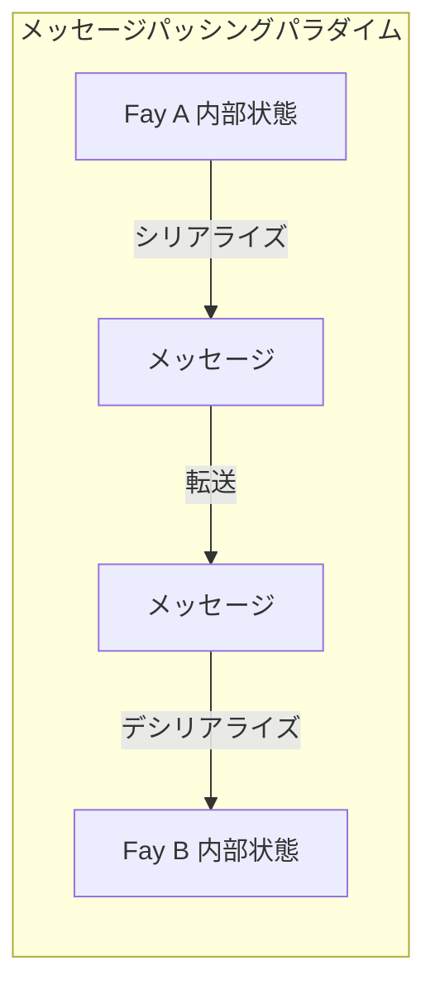
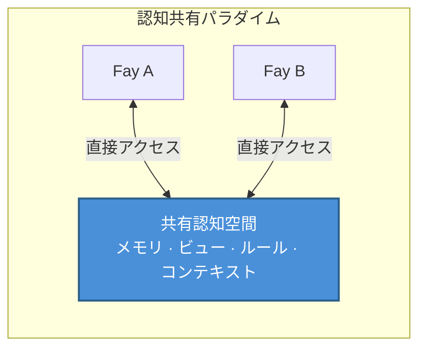

# 第二章 TP のコアポジショニング

### 2.1 認知共有プロトコル vs メッセージパッシングプロトコル

TP のコアポジショニングを理解するには、まず二つの根本的に異なる通信パラダイムを区別する必要がある。

#### メッセージパッシングパラダイム：「伝言」モデル

従来の通信プロトコル——HTTP から gRPC、MCP から A2A に至るまで——は本質的に同一のパラダイムに従っている：**シリアライズ → 転送 → デシリアライズ**。

送信側は内部状態を何らかのワイヤーフォーマット（JSON、Protobuf、XML）にエンコードし、ネットワークを介して受信側に転送する。受信側はワイヤーフォーマットを自身の内部表現にデコードする。通信のたびに、完全な情報のパッキングとアンパッキングが行われる。

このモデルは「伝言」に似ている——伝令が話し手の意図を記録し、もう一人のもとへ走って復唱する。情報はエンコードとデコードの過程で、不可避的に劣化する：コンテキストの喪失、暗黙の前提の欠落、表現精度の低下。

#### 認知共有パラダイム：「テレパシー」モデル

TP は根本的に異なるパラダイムを提案する：**認可された範囲内で共有認知空間を確立し、双方が共有認知リソースに直接アクセスする**。

このモデルでは、通信する双方はすべての情報をメッセージにパッキングしてやり取りする必要がなくなる。代わりに、制御された共有空間で協調する——共有されたメモリフラグメント、ビューステート、推論ルール、環境コンテキストが双方の共通の認知基盤を構成する。

これは TP がメッセージ転送を完全に排除するという意味ではない——共有空間の確立自体にはネゴシエーションと同期が必要である。しかし、共有コンテキストが確立されれば、以降の協調効率は大幅に向上する。双方はすでに共有されている認知リソースを繰り返しシリアライズして転送する必要がなくなるからである。

### 2.2 「テレパシー」メタファーの解説

「Telepathy（テレパシー）」という命名は修辞的な誇張ではなく、TP のコアメカニズムに対する正確なメタファーである。

#### 具体的なシナリオ

二人が異なる場所からリモート会議に参加している場面を想像してほしい。一方が「赤枠で囲んだデータの部分を見て」と言う。

人間の世界では、この発言が意味を持つためには一連のメディア手段が必要となる：画面共有ソフトウェアが話し手の画面をリアルタイムで相手のディスプレイに転送する。相手は自分の画面上で赤枠の位置を見つける必要がある。ネットワーク遅延や画面のぼやけがあれば、相手が見ているのは前のフレームかもしれず、赤枠の位置はすでに変わっている可能性がある。

プロセス全体が情報伝達の摩擦に満ちている：エンコード（画面ピクセル → 動画ストリーム）、転送（ネットワーク帯域幅と遅延）、デコード（動画ストリーム → 画面ピクセル）、認知アラインメント（相手は自分の視覚空間で赤枠を特定する必要がある）。

しかし双方が「テレパシー」能力を持っていれば、状況はまったく異なる——双方は同一のビューを直接「見る」ことができ、赤枠の位置、データの内容、さらには話し手が赤枠を付けた意図さえも、共有認知空間で即座に可視化される。エンコードの劣化なし、転送遅延なし、認知アラインメントのコストなし。

#### Fay-to-Fay シナリオにおける実現

人間の間では「テレパシー」はSFの概念である。しかし Fay-to-Fay のシナリオでは、この共有コンテキストは**エンジニアリングによって実現可能**である。

Fay の認知状態は本質的に構造化データである——メモリはインデックス可能なナレッジグラフであり、ビューはシリアライズ可能なステートツリーであり、推論ルールは共有可能なロジックエンジンである。二つの Fay が TP セッションを確立する際、Host の認可範囲内で、認知リソースの一部を共有空間に組み込むことができる：

- **セッションレベルの部分的長期メモリ**：現在の協調テーマに関連するナレッジフラグメント
- **ビューインターフェースステート**：双方が操作しているインターフェースやデータビューのリアルタイム状態
- **ルールまたは推論エンジン**：現在のタスクに使用される推論ロジックと意思決定ルール
- **環境コンテキスト**：時間、場所、デバイス状態などの動的環境情報

これこそが「Telepathy Protocol」という命名の由来である——Fay 間の通信を「伝言」から「心の通じ合い」へと昇格させるのである。
