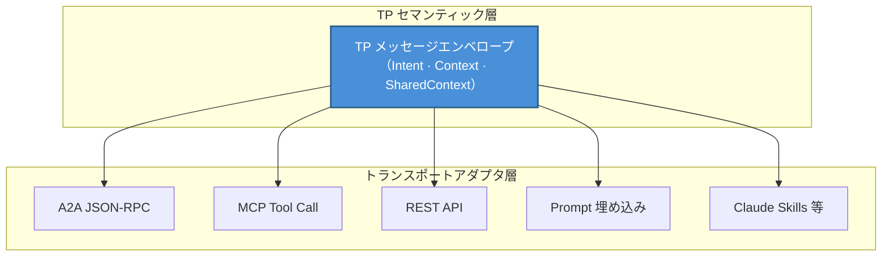
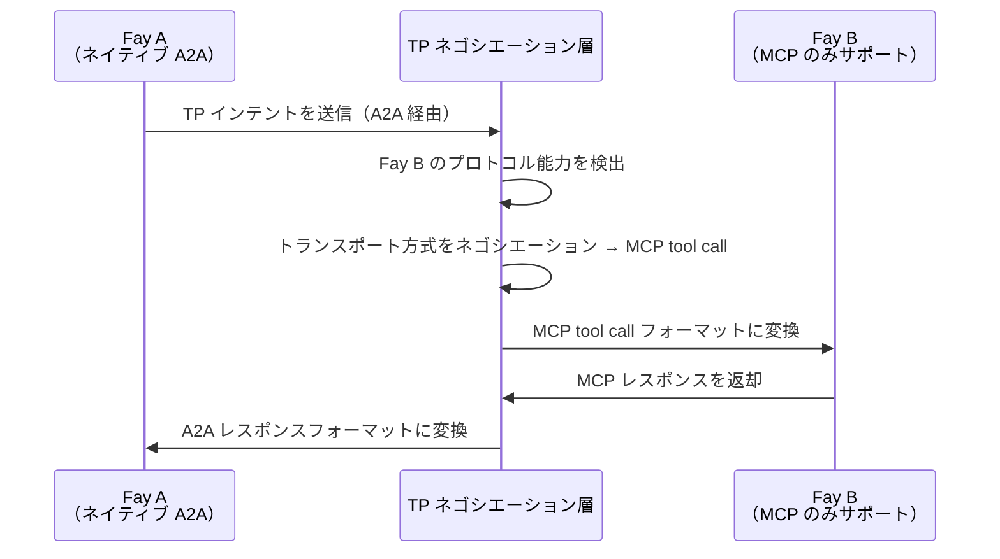

# 第三章 三つのユニークな能力

TP の設計は三つのユニークな能力を中心に展開されており、これらが共に TP を既存のすべての通信プロトコルと差別化するコア競争力を構成している。

### 3.1 Transport Agnosticism（トランスポート非依存性）

#### 設計哲学

TP は MCP や A2A を置き換えるのではなく、それらの上に**統一されたセマンティック抽象**を構築する。

この設計哲学の核心的洞察は次の点にある：認知共有にとって重要なのは、メッセージがどのパイプラインを通じて転送されるかではなく、メッセージがどのようなセマンティクスを運ぶかである。TP メッセージは以下のいずれのトランスポート方式でも伝達可能である：

| トランスポート方式 | 説明 |
|---------|------|
| A2A の JSON-RPC | A2A プロトコルの標準メッセージチャネルを通じて TP セマンティクスを伝達 |
| MCP の tool call | TP メッセージを MCP ツールコールのパラメータとしてカプセル化 |
| 従来の REST API | HTTP リクエストボディを通じて TP メッセージエンベロープを伝達 |
| Prompt 伝達 | TP セマンティクスを自然言語 Prompt に埋め込む（デグレードモード） |
| Claude Skills 等の新興方式 | 将来登場しうる新しい AI インタラクションパラダイムとの互換性を確保 |

#### アナロジー

この設計は HTTP とトランスポート層の関係に例えることができる。HTTP プロトコルは TCP 上でも QUIC 上でも動作可能である——HTTP が関心を持つのはリクエスト-レスポンスのセマンティクスであり、下位のトランスポートメカニズムではない。同様に、TP が関心を持つのは認知共有のセマンティック層であり、メッセージのトランスポート層ではない。

Transport Agnosticism により、TP は特定の下位プロトコルに束縛されることがない。新しいトランスポート方式が登場した際、TP はトランスポートアダプタを追加するだけでよく、プロトコル自体のセマンティック定義を変更する必要はない。

### 3.2 Protocol Negotiation（プロトコルネゴシエーションと変換）

#### 問題シナリオ

現実の AI エコシステムでは、異なる Fay が異なるプロトコル言語を「話す」可能性がある。ある Fay は A2A をネイティブサポートし、別の Fay は MCP の tool call フォーマットしか理解せず、さらに別の Fay は従来の REST API コールのみをサポートするかもしれない。

これらの「母語」が異なる Fay が協調する必要がある場合、統一されたネゴシエーションと変換メカニズムがなければ通信は不可能となる——まるで異なる言語しか話せない二人が対面しても会話できないのと同じである。

#### TP のソリューション

TP は**自己適応型の翻訳層**として機能し、以下のステップでクロスプロトコル通信を実現する：

1. **能力探査**：TP はまず相手の Fay がどのトランスポートプロトコルをサポートしているかを探査する
2. **コントラクトネゴシエーション**：双方が「コントラクトテンプレート」を合意する——MCP、A2A、API コール、または Prompt のいずれを下位トランスポート方式として使用するかを決定する
3. **セマンティックマッピング**：合意されたトランスポート方式の上に、TP セマンティクスから下位プロトコルフォーマットへのマッピングルールを確立する
4. **透過的変換**：以降の通信において、TP はセマンティックインテントを相手が理解可能なフォーマットに自動変換する

このメカニズムの重要な価値は次の点にある：相手の Fay がまだ特定のプロトコルを「習得」していなくても、TP は変換を通じて双方のスムーズな通信を可能にする。プロトコルの差異は上位の認知共有ロジックに対して完全に透過的である。

### 3.3 Shared Context（共有コンテキスト）

#### コアとしての位置づけ

Shared Context は TP の最もコアな能力であり、「テレパシー」という命名の根本的な由来でもある。Transport Agnosticism が「どのパイプラインで通信するか」の問題を解決し、Protocol Negotiation が「どの言語で通信するか」の問題を解決するとすれば、Shared Context が解決するのは「通信の本質とは何か」という問題である。

#### メカニズムの説明

二つの Fay が TP セッションを有効化すると、双方は **Shared Context モード**に入る。このモードでは、双方は単にメッセージを交換するのではなく、制御された認知空間を共同で維持する。

共有可能な認知リソースには以下が含まれる：

| 認知リソースタイプ | 説明 | 典型的なシナリオ |
|------------|------|---------|
| セッションレベルの部分的長期メモリ | 現在の協調テーマに関連するナレッジフラグメント | 医療 Fay が患者の関連病歴サマリー——アレルギー歴、慢性疾患記録、直近の服薬状況を共有し、コンサルティング Fay が再度問診することなく患者の背景を把握可能にする |
| ビューインターフェースステート | 双方が操作しているインターフェースやデータビュー | 複数の Fay が同一の契約書テキストを協調編集——法務 Fay が修正すべき条項をマークし、財務 Fay がマーク位置を即座に確認して財務的影響を評価する。ドキュメントバージョンのやり取りは不要 |
| ルールまたは推論エンジン | 現在のタスクに使用される推論ロジック | 法務 Fay が適用される法規条文と推論チェーンを共有——税務 Fay はこれらの法規を直接参照して税務影響を計算でき、法務 Fay が毎回関連法条をメッセージにコピー＆ペーストする必要がない |
| 環境コンテキスト | 時間、場所、デバイス状態などの動的情報 | ドローン上の Fay がリアルタイム GPS 座標、バッテリー残量、カメラアングルを地上制御 Fay に共有——地上 Fay はドローンの状態を直接「感知」でき、定期的なステータスレポートメッセージを待つ必要がない |

#### Host 認可と監査

Shared Context の範囲は厳密に **Host 認可**によって決定される。Fay はどの認知リソースを共有するかを自ら決定することはできない——すべての共有は Host が事前に認可した境界内で行われなければならない。同時に、Shared Context へのすべてのアクセスは**監査可能**であり、Host はどの情報が共有され、誰がアクセスし、いつ発生したかを事後に確認できる。

この設計は A2A の Opaque Execution 原則と鮮明な対比を形成する：

| 次元 | A2A（Opaque Execution） | TP（Shared Context） |
|------|------------------------|---------------------|
| 内部状態 | 非共有、Agent はブラックボックス | 認可範囲内で選択的に共有 |
| 協調の深度 | タスクレベル（委任と報告） | 認知レベル（メモリと推論の共有） |
| 情報伝達 | 毎回完全にシリアライズして転送 | 共有空間内で直接アクセス |
| プライバシー制御 | 体系的なメカニズムなし | Host 認可 + 全プロセス監査 |
| 適用シナリオ | 疎結合のサービスオーケストレーション | 深い協調と認知融合 |

Shared Context により、Fay 間の協調は「伝言」から「共同思考」へと昇格する——これが認知共有プロトコルとしての TP のコアバリューである。
