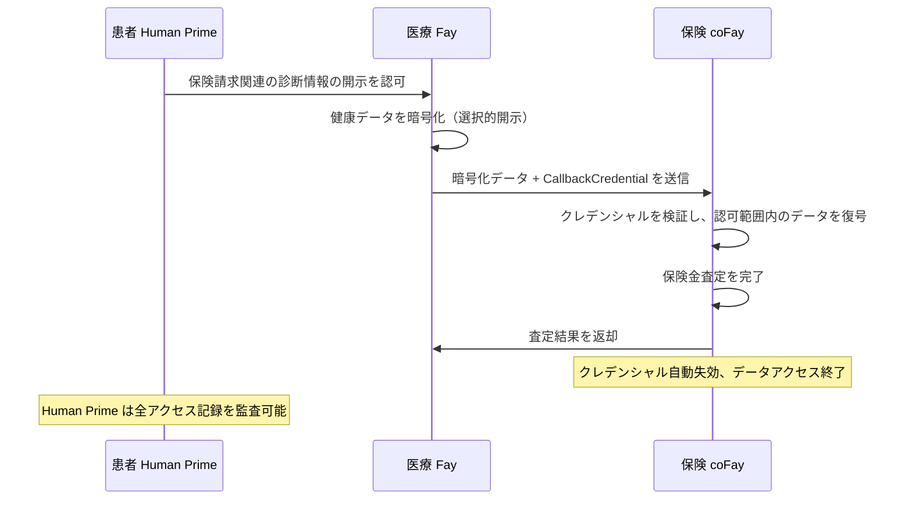
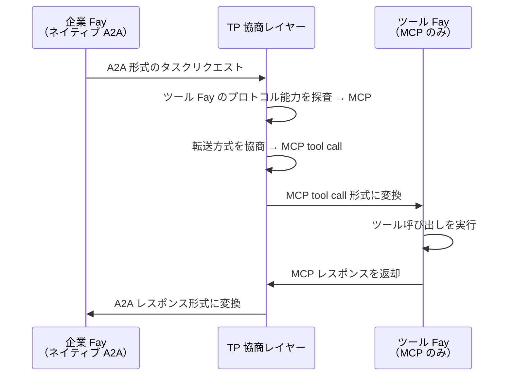
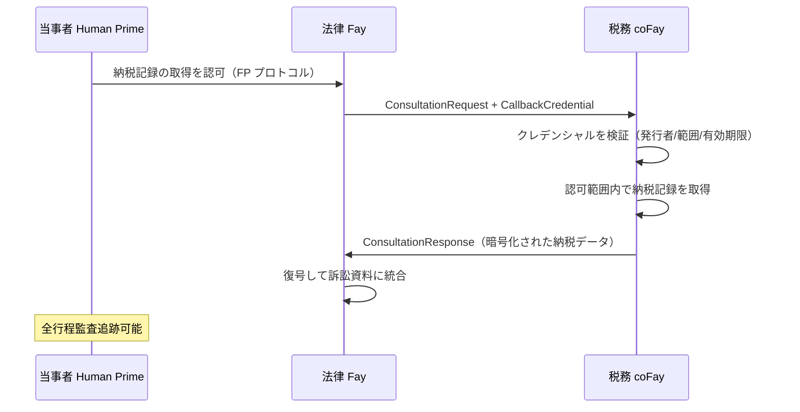
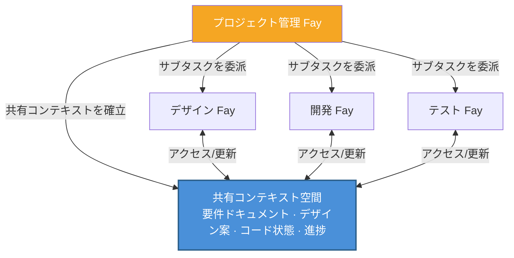
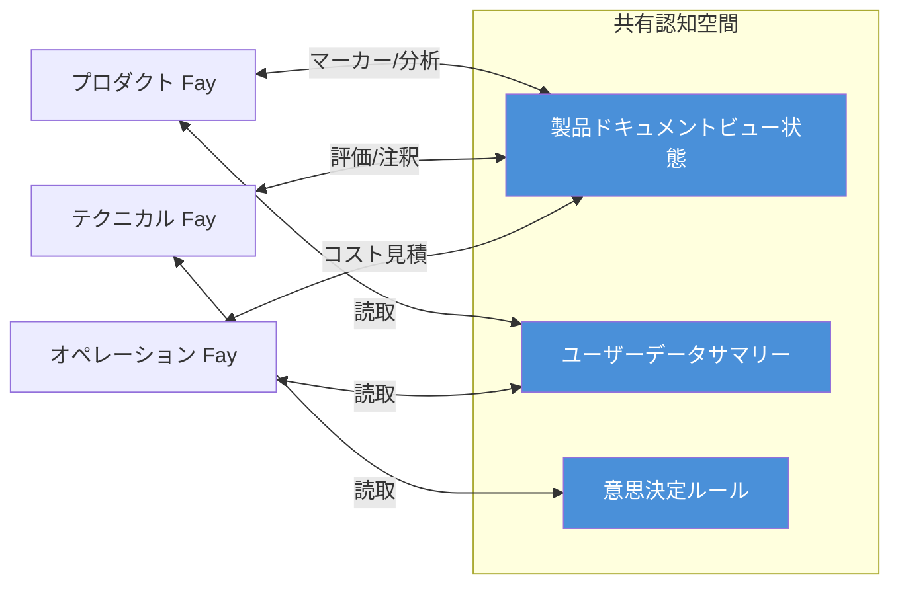

# 第四章 応用シナリオ

以下の5つのシナリオは、TP がさまざまなビジネス領域で実際にどのように活用されるかを示しており、プライバシー委託、クロスプロトコルブリッジ、クレデンシャル受け渡し、マルチ Fay 協調、共有コンテキスト会議といったコア機能を網羅しています。

### 4.1 プライバシー委託コンサルテーション

**シナリオ**：患者の Human Prime が、自身の医療 Fay を通じて保険 coFay に健康データを提出し、保険金査定を受ける必要がある。

従来の Agent 通信モデルでは、医療 Agent は患者の完全な健康記録をシリアライズしてメッセージとして保険 Agent に送信する必要がありました。これはすべてのデータが平文でネットワーク上を伝送されることを意味し、受信側は必要範囲をはるかに超える情報へのアクセス権を得てしまいます。

TP の認知共有モデルでは、プロセスはまったく異なります：

1. **Human Prime 認可**：患者の Human Prime が FP プロトコルを通じて医療 Fay に認可を与え、今回の保険請求に関連する診断情報（診断コード、治療日、費用明細など）のみの開示を明示的に指定する。その他の健康記録（心理カウンセリング記録、遺伝子検査結果など）は暗号化されたまま不可視に保たれる
2. **選択的開示**：医療 Fay は TP の `SelectiveDisclosure` メカニズムを使用し、認可範囲内のデータを暗号化して保険 coFay に送信するとともに、有効期限付きの `CallbackCredential` を添付する
3. **制御されたアクセス**：保険 coFay はコールバッククレデンシャルを通じて、限定された範囲内で認可データにアクセスし、保険金査定を完了する
4. **自動失効**：査定完了後、コールバッククレデンシャルは自動的に失効し、保険 coFay は患者データに一切アクセスできなくなる
5. **全行程監査**：すべてのデータアクセス記録は監査ログに記録され、患者の Human Prime はいつでも閲覧可能

このシナリオは TP の**Human Prime 主権プライバシー**原則を体現しています——データの開示範囲は常に Human Prime が決定し、Fay が独自に判断するものではありません。

### 4.2 クロスプロトコル変換

**シナリオ**：A2A をネイティブサポートする企業 Fay が、MCP tool call のみをサポートする専門ツール Fay を呼び出す必要がある。

TP がない世界では、この2つの Fay は直接通信することがまったくできません——まったく異なるプロトコル言語を「話して」いるからです。企業 Fay が発行する A2A JSON-RPC リクエストをツール Fay は解析できず、ツール Fay が公開する MCP tool call インターフェースを企業 Fay は呼び出せません。開発者はプロトコルの組み合わせごとに専用のアダプターを書かざるを得ませんでした。

TP のプロトコル協商と変換メカニズムは、この状況を根本的に変えます：

1. **能力探査**：企業 Fay が TP を通じて通信リクエストを発行し、TP 協商レイヤーがツール Fay のプロトコル能力を自動探査して、MCP tool call のみをサポートしていることを検出する
2. **コントラクト協商**：TP が双方間で転送方式を協商し、MCP tool call を下位の転送チャネルとして使用することを決定する
3. **セマンティックマッピング**：TP が企業 Fay から発行された A2A 形式のタスクリクエスト内の Intent、Parameters、Context を MCP tool call の入力形式にマッピングする
4. **透過的変換**：ツール Fay が受け取るのは標準的な MCP tool call リクエストであり、TP の存在をまったく意識しない。実行完了後、TP は MCP レスポンスを A2A 形式に変換して企業 Fay に返却する

このシナリオの核心的な価値は、**プロトコルの差異が上位のビジネスロジックに対して完全に透過的である**ことです。企業 Fay は相手がどのプロトコルを使用しているかを知る必要がなく、各プロトコル向けのアダプターコードを書く必要もありません。TP の自適応変換レイヤーにより、異種プロトコルエコシステム内の Fay がシームレスに協調できます。

### 4.3 クレデンシャル受け渡しコンサルテーション

**シナリオ**：法律 Fay（当事者の Human Prime を代理）が税務 coFay にコンサルテーションを発行し、訴訟準備のために当事者の納税記録を取得する必要がある。

このシナリオは、現実世界で弁護士が当事者を代理して税務当局から資料を取り寄せる場面に類似しています——弁護士は当事者の委任状を提示し、税務当局は認可を確認した上で限定範囲内の資料を提供し、プロセス全体が記録に残ります。

TP のコンサルテーションモード（Consultation）とコールバッククレデンシャルメカニズム（CallbackCredential）は、この現実のプロセスを正確にマッピングしています：

1. **Human Prime 委託**：当事者の Human Prime が FP プロトコルを通じて法律 Fay に認可を与え、納税記録の代理取得を許可する
2. **コンサルテーション発行**：法律 Fay が税務 coFay に `ConsultationRequest` を送信し、有効期限付きの `CallbackCredential` を添付して、税務 coFay が限定範囲内で当事者の財務データにアクセスすることを認可する
3. **クレデンシャル検証**：税務 coFay がコールバッククレデンシャルの有効性を検証する——発行者の身元、認可範囲、有効期限を確認
4. **制御されたデータ取得**：税務 coFay がクレデンシャルを通じて当事者の納税記録にアクセスするが、クレデンシャルの `scope` で指定された年度と税目に限定される
5. **エンドツーエンド暗号化**：データ伝送プロセス全体が TP の `EncryptedPayload` メカニズムによるエンドツーエンド暗号化で保護される
6. **監査追跡**：すべてのクレデンシャル使用とデータアクセスの記録が監査ログに書き込まれ、当事者の Human Prime はいつでも閲覧可能

このシナリオは、TP が現実世界の「代理人が委任状を持って業務を遂行する」モデルをいかにデジタル化するかを示しています——クレデンシャルには有効期限があり、範囲が限定され、取り消し可能で、監査可能であり、Human Prime の権益を完全に保護します。

### 4.4 マルチ Fay 協調タスク

**シナリオ**：プロジェクト管理 Fay が複雑な製品開発プロジェクトを複数のサブタスクに分解し、それぞれをデザイン Fay、開発 Fay、テスト Fay に委派する。

A2A の Opaque Execution モデルでは、プロジェクト管理 Fay がサブタスク Fay とやり取りするたびに、完全なプロジェクトコンテキスト（要件ドキュメント、デザイン案、コードリポジトリの状態、進捗レポート）をシリアライズして転送する必要があります。プロジェクトが進むにつれてコンテキストは膨張し続け、各ラウンドのやり取りにおける情報転送量はますます増大し、繰り返されるシリアライズとデシリアライズの過程で詳細情報の損失が避けられません。

TP の共有コンテキストメカニズムは、この協調モデルを根本的に変えます：

1. **プロジェクトコンテキストの共有**：プロジェクト管理 Fay が共有コンテキスト空間を確立し、プロジェクトのコア認知リソースを格納する——要件ドキュメントの構造化表現、デザイン案のバージョン状態、コードリポジトリの変更サマリー、各サブタスクの進捗と依存関係
2. **タスク分解と委派**：プロジェクト管理 Fay が TP の `TaskMessage` を通じてプロジェクトをサブタスクに分解し、それぞれをデザイン Fay（UI/UX デザイン）、開発 Fay（コード実装）、テスト Fay（品質検証）に委派する
3. **コンテキスト継承**：各サブタスクは共有コンテキスト内の関連コンテキストを自動的に継承し、プロジェクト管理 Fay が毎回完全なプロジェクト情報を繰り返し伝達する必要がない
4. **リアルタイム同期**：デザイン Fay がデザイン案を更新すると、開発 Fay とテスト Fay は共有コンテキストを通じて即座に変更を「感知」し、プロジェクト管理 Fay からの通知転送を待つ必要がない
5. **依存関係管理**：サブタスク間の依存関係（「開発はデザイン完了に依存」「テストは開発完了に依存」など）は TP の `SubtaskReference` メカニズムにより自動管理される

このシナリオは、メッセージパッシングに対する共有コンテキストのコア優位性を体現しています：**プロジェクトコンテキストは「生きている」**——プロジェクトの進行とともに継続的に更新され、すべての参加者は常に同一の最新の認知基盤に基づいて協調し、遅延したメッセージスナップショットに依存しません。

### 4.5 共有コンテキスト会議

**シナリオ**：プロダクト Fay、テクニカル Fay、オペレーション Fay が新製品プランについて共同で議論する必要があり、三者が同一の製品ドキュメント上でリアルタイムに協調する必要がある。

人間の世界では、リモート会議には画面共有、インスタントメッセージング、ドキュメントコラボレーションなど複数のツールの連携が必要であり、情報が異なるメディア間で伝達される際に遅延と損失が避けられません。Agent の世界では、従来のメッセージパッシングモデルを使用する場合、状況はさらに複雑になります——各 Agent が自身のドキュメントコピーを保持し、メッセージを通じて変更を同期するため、コンフリクト解決と状態一貫性が巨大なエンジニアリング課題となります。

TP の共有コンテキストメカニズムにより、マルチ Fay のリアルタイム協調が自然かつ効率的になります：

1. **共有認知空間の確立**：3つの Fay が TP を通じて共有コンテキストセッションを確立し、以下の認知リソースを共有空間に格納する：
   - 製品ドキュメントの構造化ビュー状態（セクション、マーカー、注釈）
   - 関連するユーザーデータサマリー（匿名化された利用統計、フィードバック分析）
   - 意思決定ルール（製品優先度マトリクス、技術実現可能性評価基準、運用コストモデル）

2. **リアルタイム認知同期**：プロダクト Fay がドキュメント上に「この部分は再設計が必要」とマーカーを付けると、テクニカル Fay とオペレーション Fay は即座にマーカーの位置と内容を「見る」ことができる——メッセージ通知を通じてではなく、共有コンテキスト空間への直接アクセスを通じて。これこそが「テレパシー」メタファーの具体的な実現である

3. **多視点協調**：3つの Fay がそれぞれの専門的視点から同一のドキュメントを分析し注釈を付ける——プロダクト Fay はユーザー体験に注目し、テクニカル Fay は実装の複雑さを評価し、オペレーション Fay は運用コストを見積もる。すべての注釈と分析結果は共有空間内でリアルタイムに可視化される

4. **意思決定記録**：会議プロセス中のすべての議論、注釈、意思決定が共有コンテキストに記録され、追跡可能な意思決定チェーンを形成する

このシナリオは TP の「テレパシー」理念の最も完全な体現です——複数の Fay はもはやメッセージを通じて「伝言」する必要がなく、共有された認知空間で「共に思考」します。情報の伝達は「エンコード → 転送 → デコード」のシリアルプロセスから、「共有空間における直接的な知覚」へと変わります。
