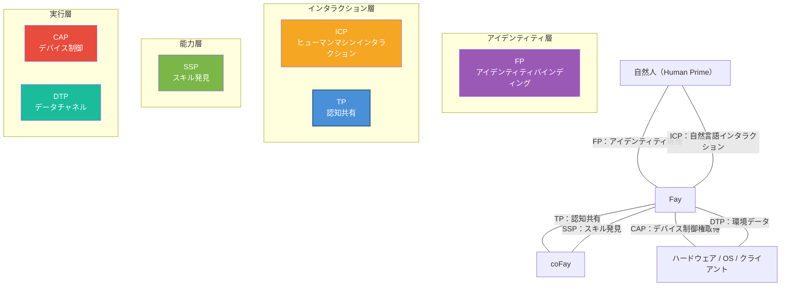

# 第五章 エコシステムにおける位置づけ

### 5.1 iFay 六プロトコル関係図

TP は孤立して存在するものではなく、iFay エコシステムにおける6大プロトコルの1つです。各プロトコルはそれぞれの役割を担い、共に完全な AI エージェント通信フレームワークを構成しています。

| プロトコル | 正式名称 | コア責務 | 対象領域 |
|------|------|---------|---------|
| **ICP** | Interactive Conversation Protocol | 人 ↔ Fay のインタラクション中間言語 | ヒューマンマシンインターフェース |
| **TP** | Telepathy Protocol | Fay ↔ Fay の認知共有 | Fay 間協調 |
| **CAP** | Control Authority Protocol | Fay → ハードウェア/クライアントの制御権取得 | デバイス制御 |
| **SSP** | Skill Sharing Protocol | Fay のスキル発見 | 能力マーケット |
| **DTP** | Data Tunnel Protocol | ハードウェア/OS → Fay のデータチャネル | 環境認識 |
| **FP** | Faying Protocol | 自然人 ↔ iFay のアイデンティティバインディング | アイデンティティ確権 |

6大プロトコルのインタラクション関係を以下の図に示します：

**プロトコル間の協調関係：**

- **FP → TP**：FP は Human Prime と Fay のアイデンティティバインディング関係を確立し、TP は通信において FP 認可を参照して Human Prime 委託の正当性を検証します。例えば、患者の iFay が病院の coFay に予約リクエストを発行する際、病院の coFay は FP 認可参照を通じて「この iFay は確かにこの患者から予約代行の認可を受けている」ことを確認します。
- **ICP → TP**：Human Prime は ICP を通じて自身の Fay に指示を出し、Fay は TP を通じてタスクを他の Fay に委派して実行させます。例えば、ユーザーが自身の iFay に「来週の東京行きの航空券を予約して」と言い（ICP インタラクション）、iFay はその後 TP を通じて航空会社の coFay に連絡して予約を完了します。
- **SSP ↔ TP**：Fay は SSP を通じて他の Fay の利用可能なスキルを発見し、その後 TP を通じて具体的な協調リクエストを発行します。例えば、iFay が SSP を通じて税務計画に長けた coFay を発見し、その後 TP を通じて共有コンテキストを確立し、Human Prime の財務データ（認可範囲内で）を共有空間にマウントしてコンサルテーションを行います。
- **TP → CAP**：TP 協調タスクがハードウェアやクライアントの操作を必要とする場合、Fay は CAP クレデンシャルを通じてデバイス制御権を取得します。例えば、手動制御されているドローンをある Fay に引き継ぐ必要がある場合——地上オペレーターの iFay が TP を通じてドローン上の Fay と制御権の引き継ぎを協商し、その後 CAP プロトコルを通じて実際の制御権移転を完了します。
- **DTP → TP**：ハードウェアとオペレーティングシステムが DTP を通じて Fay に環境データをプッシュし、Fay はこれらのデータを TP 共有コンテキストに取り込んで協調相手が利用できるようにします。例えば、スマートホームシステムが DTP を通じて iFay に室内温度、湿度、空気品質データをプッシュし、iFay がこれらの環境データを健康管理 coFay との共有コンテキストにマウントして、健康アドバイスの生成を支援します。

### 5.2 MCP/A2A との比較

TP と MCP、A2A は競合関係ではなく、補完関係にあります——TP は MCP または A2A の上で動作できます。以下の比較表は、複数の観点から三者のポジショニングの違いを示しています：

| 観点 | MCP | A2A | TP |
|------|-----|-----|-----|
| **発行元** | Anthropic | Google | iFay オープンソースコミュニティ |
| **発行時期** | 2024 | 2025 | 2025 |
| **コアポジショニング** | AI モデルと外部ツールの接続プロトコル | Agent 間のタスク委派・協調プロトコル | Fay 間の認知共有プロトコル |
| **通信方向** | 単方向（AI → ツール） | 双方向（Agent ↔ Agent） | 双方向 + 共有空間（Fay ↔ 共有コンテキスト ↔ Fay） |
| **アイデンティティ帰属** | なし（ツールに帰属概念なし） | なし（Agent は自律サービスノード） | あり（各 Fay は Human Prime を代理して行動） |
| **プライバシー保護** | 体系的メカニズムなし（平文パラメータ伝送） | 体系的メカニズムなし | エンドツーエンド暗号化 + 選択的開示 + Human Prime 認可 |
| **内部状態共有** | 該当なし（ツールはステートレス関数） | 共有なし（Opaque Execution） | 認可範囲内での選択的共有（Shared Context） |
| **転送方式** | tool call にバインド（JSON-RPC） | JSON-RPC over HTTP にバインド | 転送非依存（A2A/MCP/API/Prompt を通じて伝達可能） |
| **プロトコル協商** | なし | なし | 自適応協商と変換 |
| **適用シナリオ** | AI が外部ツールやデータソースを呼び出す | 疎結合な Agent サービスオーケストレーション | 深い協調、プライバシー委託、認知融合 |

三者の関係は一言で要約できます：**MCP は AI がツールを使えるようにし、A2A は Agent が伝言できるようにし、TP は Fay がテレパシーで通じ合えるようにする**。

TP の転送非依存性は、MCP または A2A の「上に乗る」ことができることを意味します——下位レイヤーで A2A 転送を使用する場合、TP はアイデンティティ帰属、プライバシー保護、共有コンテキスト能力を追加します。下位レイヤーで MCP 転送を使用する場合、TP は単方向のツール呼び出しを双方向の認知共有にアップグレードします。
