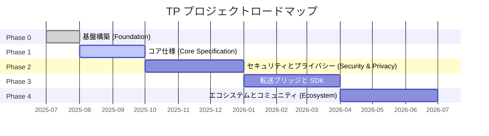

# 第七章 成果物とロードマップ

### 7.1 三段階成果物一覧

TP プロジェクトのすべての成果物は優先度に応じて3つの段階に分類されます：

#### Tier 1 — コア成果物（Must-Have）

| 成果物 | 目標フェーズ | 依存関係 |
|--------|---------|------|
| ブループリントドキュメント（zh-CN + en） | Phase 0 | なし |
| TP プロトコル仕様ドラフト | Phase 1 | ブループリントドキュメント |
| JSON Schema 定義（MessageEnvelope, Intent, Capability, Task, Context, SharedContext） | Phase 1 | プロトコル仕様 |
| TypeScript 型定義 | Phase 1 | JSON Schema |
| TypeScript リファレンス SDK | Phase 3 | Schema + プロトコル仕様 |

#### Tier 2 — 重要成果物（Should-Have）

| 成果物 | 目標フェーズ | 依存関係 |
|--------|---------|------|
| MDX 人間可読ドキュメント | Phase 1 | JSON Schema |
| 多言語プロトコルドキュメント（9言語） | Phase 4 | ソース言語ドキュメント |
| 開発者ガイド（クイックスタート + アーキテクチャ概要） | Phase 1 | ブループリントドキュメント |
| SDK 使用ガイドと API リファレンス | Phase 3 | TypeScript SDK |

#### Tier 3 — 拡張成果物（Nice-to-Have）

| 成果物 | 目標フェーズ | 依存関係 |
|--------|---------|------|
| コミュニティ貢献ガイドとガバナンスドキュメント | Phase 0 | なし |
| プロトコル適合性テストスイート | Phase 4 | SDK + Schema |
| サンプルアプリケーションプロジェクト | Phase 4 | SDK |

### 7.2 ロードマップ

#### Phase 0: Foundation（基盤構築）

Phase 0 のコア目標は、プロジェクトのインフラストラクチャとトップレベルのナラティブを確立することです。主要マイルストーンには以下が含まれます：ブループリントドキュメントの中英バイリンガル版を公開し、認知共有プロトコルとしての TP のコアポジショニングを確立する。プロジェクトのディレクトリ構造と命名規則を決定する。README.md、CONTRIBUTING.md、CODE_OF_CONDUCT.md などのオープンソースガバナンスファイルを作成する。Schema バージョン管理規則（日付命名、三ファイル同期、後方互換性ルール）を確立する。初期の agent-to-agent-protocol spec を deprecated としてマークし、正式に telepathy-protocol spec に置き換える。Phase 0 の完了基準は、ブループリントドキュメントのバイリンガル公開とリポジトリインフラストラクチャの準備完了です。

#### Phase 1: Core Specification（コア仕様）

Phase 1 は TP プロトコルのコア技術仕様に焦点を当てます。主要マイルストーンには以下が含まれます：TP プロトコル仕様ドラフトを公開し、共有コンテキストのセマンティクスと転送非依存のメッセージエンベロープ形式を定義する。JSON Schema と TypeScript 型定義を納品し、MessageEnvelope、Intent、Capability、Task、Context、SharedContext などのコアデータ構造をカバーする。MDX 形式の人間可読ドキュメントを納品する。開発者クイックスタートガイドを公開する。Phase 1 の完了基準は、コア Schema の三ファイル（.json / .ts / .mdx）が適合性検証に合格し、仕様ドラフトのレビューが完了することです。

#### Phase 2: Security, Privacy and Shared Context（セキュリティ、プライバシーと共有コンテキスト）

Phase 2 はセキュリティとプライバシーの領域を深掘りします。主要マイルストーンには以下が含まれます：暗号化とクレデンシャル関連の Schema 定義（EncryptedPayload、CallbackCredential）を納品する。セキュリティ仕様を公開し、エンドツーエンド暗号化、認証メカニズム、Human Prime 委託認可をカバーする。共有コンテキストの完全なライフサイクル管理——作成、スコープ設定、有効期限、取り消しを定義する。Technical Steering Committee（TSC）ガバナンスメカニズムを確立する。Phase 2 の完了基準は、セキュリティ Schema が適合性検証に合格し、TSC 憲章が正式に公開されることです。

#### Phase 3: Transport Bridges and SDK（転送ブリッジと SDK）

Phase 3 はプロトコル仕様を実行可能なコードに変換します。主要マイルストーンには以下が含まれます：TypeScript リファレンス SDK を納品し、コアメッセージ処理ロジックを実装する。A2A と MCP のプロトコルブリッジインターフェースを実装し、転送非依存性とプロトコル協商能力を検証する。姉妹プロトコル（ICP、SSP、CAP、DTP、FP）のブリッジインターフェースを納品する。SDK ドキュメントと使用例を公開する。Phase 3 の完了基準は、SDK がすべてのユニットテストとプロパティテストに合格し、ブリッジインターフェースが統合テストに合格することです。

#### Phase 4: Ecosystem and Community（エコシステムとコミュニティ）

Phase 4 は TP を技術プロジェクトからオープンエコシステムへと拡張します。主要マイルストーンには以下が含まれます：9言語の多言語ドキュメント翻訳を完了する。プロトコル適合性テストスイートを納品し、サードパーティ実装がコンプライアンスを検証できるようにする。サンプルアプリケーションプロジェクトを公開し、実際のビジネスシナリオにおける共有コンテキストの活用を示す。RFC プロセスを確立し、プロトコルの継続的な進化のためのコミュニティ駆動型ガバナンスメカニズムを提供する。Phase 4 の完了基準は、翻訳ステータスダッシュボードがすべての Tier 1 および Tier 2 ドキュメントの翻訳完了を表示することです。

