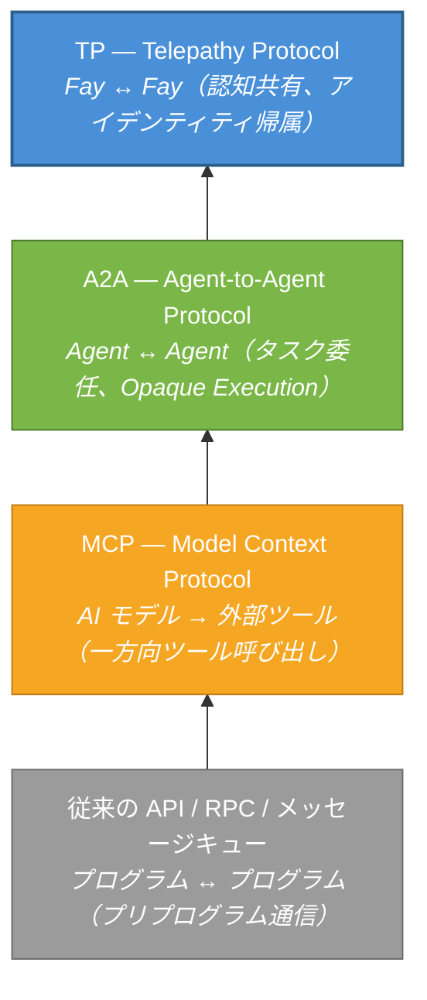
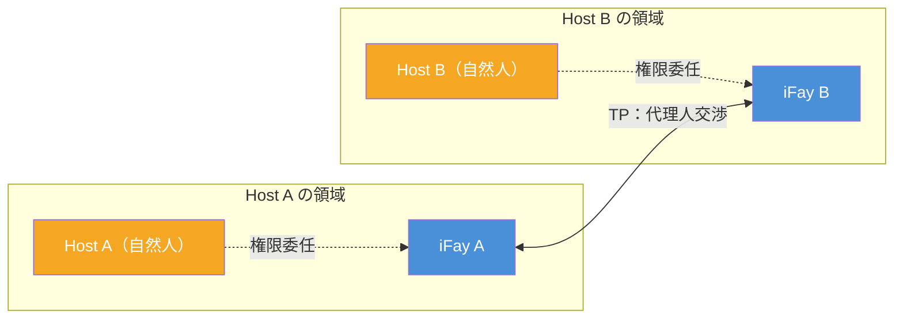

# 第1章 なぜ TP が必要なのか

### 1.1 通信プロトコルの階層分析

過去数十年にわたるソフトウェアエンジニアリングの実践において、通信プロトコルの進化は常に一つの核心命題を中心に展開されてきた：**二つの計算エンティティがいかに効率的に情報を交換するか**。AI Agent エコシステムの台頭に伴い、この命題は根本的なパラダイムシフトを迎えている。

#### 従来の API / RPC / メッセージキュー：プログラム間のプリプログラム通信

従来の通信プロトコル——RESTful API、gRPC、あるいはメッセージキュー（Kafka、RabbitMQ など）——が解決するのは、**プログラム間のプリプログラム通信**の問題である。その核心的特徴は、呼び出し側がコーディング段階で既に呼び出し先、呼び出し方法、渡すパラメータを確定していることにある。インターフェース契約（Interface Contract）はデプロイ前に固定化され、ランタイムの柔軟性は極めて限定的である。

このモデルは決定論的システムにおいては良好に機能するが、AI Agent の動的性と自律性に直面すると、その限界が露呈する——Agent はランタイムで能力を発見し、意図を交渉し、サービスを動的に組み合わせる必要があり、コーディング時にすべてをハードコードするのではない。

> **現実の例**：旅行プランニング Agent が航空便検索、ホテル予約、天気予報、ビザ相談など複数のサービスを同時に呼び出す必要がある場合を考えよう。従来の API モデルでは、開発者はコーディング時に各サービスの endpoint、パラメータ形式、呼び出し順序を確定しなければならない。ユーザーが急に目的地を変更した場合、呼び出しチェーン全体の再編成が必要になる可能性がある——これはランタイムでは極めて困難である。

#### MCP（Model Context Protocol）：AI モデルと外部ツールの接続

2024年、Anthropic は Model Context Protocol（MCP）を発表し、AI モデルと外部ツール間の接続問題の解決を目指した。MCP のコアアーキテクチャは **Host → Client → Server** モデルに従い、AI に「ツールボックス発見メカニズム」を提供する——モデルはランタイムで利用可能なツールを動的に発見し、ツールの入出力 Schema を理解し、呼び出しを発行できる。

しかし、MCP の通信方向は**一方向**である。AI モデルは常に能動側であり、ツールは常に受動側である。ツールがモデルに対して能動的に情報をプッシュすることはなく、他のツールと交渉することもない。MCP は「AI がツールをどう使うか」という問題を解決したが、「Agent 間でどう協力するか」という命題には触れていない。

> **現実の例**：カスタマーサービス Agent が MCP を通じてナレッジベース検索ツールとチケットシステムに接続している場合を考えよう。ユーザーの問題がカスタマーサービス Agent の能力範囲を超えた場合、テクニカルサポート Agent に問題を引き継ぐ必要がある。しかし MCP は Agent 間の通信メカニズムを提供していない——カスタマーサービス Agent はツールを呼び出すことしかできず、「同僚に助けを求める」ことはできない。

#### A2A（Agent-to-Agent Protocol）：Agent 間のタスク委任と協力

2025年、Google は Agent-to-Agent Protocol（A2A）を発表し、通信の視点を「モデルとツール」から「Agent と Agent」へと引き上げた。A2A は三つの重要な概念を導入した：

- **AgentCard**（能力カード）：Agent が外部に対して自身の能力を宣言する標準化された記述
- **Task**（タスク）：Agent 間で受け渡される実行可能な作業単位
- **Message**（メッセージ）：タスク実行過程における情報交換の媒体

A2A により、異なる Agent が互いの能力を発見し、タスクを委任し、進捗を報告できるようになった。しかし、そのコア設計原則——**Opaque Execution（不透明実行）**——は明確に規定している：Agent 間で内部状態、記憶、ツール実装の詳細を共有しない。各 Agent はブラックボックスであり、入出力インターフェースのみを公開する。

> **現実の例**：プロジェクト管理 Agent がコードレビュー Agent にコードレビュータスクを委任する場合を考えよう。A2A モデルでは、プロジェクト管理 Agent は完全なコード差分、プロジェクト仕様、過去のレビュー記録をすべてシリアライズしてメッセージとして送信しなければならない。コードレビュー Agent が完了後に結果を返すが、プロジェクト管理 Agent はレビュー過程の推論ロジックを「見る」ことができない——最終的なレビュー意見しか見えない。「なぜこのコードがリスクありとマークされたのか」を追加質問するには、また完全なメッセージの往復が必要になる。

#### TP：MCP / A2A の上位にある認知共有レイヤー

Telepathy Protocol（TP）は上記のいずれのプロトコルも置き換えるものではなく、それらの上に全く新しい**認知共有レイヤー**を構築するものである。

以下の図は、これら四層のプロトコルの段階的関係を示している：

各レイヤーのプロトコルが登場したのは、前のレイヤーが新たな問題に答えられなかったからである。従来の API は AI の動的性に対応できず、MCP は Agent 間の協力を支えられず、A2A は認知共有を実現できない——TP はまさにこの最後の空白を埋めるために設計されたのである。

### 1.2 代理人交渉パラダイム

#### 既存プロトコルの暗黙の前提

MCP、A2A、および大多数の既存通信プロトコルは、共通の暗黙の前提を含んでいる：**通信の両者は独立した、所有者のないサービスエンティティである**。

MCP の世界では、ツールはステートレスな関数である——誰が呼び出しても同じであり、呼び出し側が誰を代表しているかは関知しない。A2A の世界では、Agent は自律的なサービスノードである——タスクを受け取り、実行し、結果を返すが、タスクの背後にいる委託者が誰であるかは関知せず、誰かの利益を保護する必要もない。

この前提は技術サービスのシナリオでは合理的である。しかし、AI Agent が実際の人間を代表して行動し始めると、この前提はもはや成立しない。

#### iFay の世界観：すべての Fay には Host がいる

iFay 体系では、世界観は全く異なる。すべての Fay（個人を代表する iFay であれ、社会的公共機能を担う coFay であれ）には明確な**Host（宿主）**が存在する。Fay は Host を代表して行動し、Host の利益を守り、Host のプライバシーを保護する。

これは、二つの Fay が通信を行う際、本質的に起きているのは二つのソフトウェアサービス間のデータ交換ではなく、**二人の Host の代理人間の交渉**であることを意味する——弁護士が当事者を代表して交渉し、秘書が上司を代表して事務を調整するように。

この「代理人交渉」パラダイムは、通信プロトコルに対して全く新しい要件を提示する：

- **アイデンティティ帰属**：プロトコルは各通信エンティティが誰を代表しているかを明確にしなければならない。例えば、ある Fay が患者を代表して病院の coFay に予約を取る場合、病院の coFay は「この Fay が確かにその患者から予約の代行を委任されている」ことを確認する必要がある——誰でも患者の Fay を装って操作できるわけではない。
- **信頼境界**：代理人間の情報共有は Host が許可した範囲内で行われなければならない。例えば、患者がその Fay にアレルギー歴と現在の症状を病院と共有することを許可したが、心理カウンセリング記録の共有は許可していない場合——Fay はこの境界を厳格に遵守しなければならない。
- **プライバシー保護**：Host の機密データは転送過程で暗号化保護を受けなければならず、選択的開示をサポートする必要がある。例えば、保険請求時には診断コードと費用明細のみを開示すればよく、完全なカルテ内容を公開する必要はない。
- **監査可能性**：すべての代理人の行動は追跡可能でなければならず、Host が事後に確認できるようにする。例えば、Host は「過去一週間に自分の Fay がどの Fay にどのデータを共有したか」を確認できる——銀行口座の取引履歴を確認するように。

### 1.3 既存プロトコルの盲点

以上の分析を総合すると、既存プロトコルは「代理人交渉」シナリオに直面した際、三つの根本的な盲点が存在する：

#### アイデンティティ帰属の欠如

MCP と A2A はいずれも Agent が誰を代表しているかを関知しない。MCP のツールには「帰属」の概念がなく、A2A の AgentCard が記述するのは Agent 自身の能力であり、その背後にいる委託者のアイデンティティや権限ではない。TP の視点では、**アイデンティティ帰属のない通信は不完全である**——信頼の基盤を構築できず、責任の境界も画定できない。

> **現実の例**：不動産仲介 Agent が買い手を代表して売り手の Agent と価格交渉する場面を想像してほしい。A2A モデルでは、売り手 Agent は「相手が本当に購入意思のある買い手を代表している」ことを検証できず、「買い手がこの価格帯での交渉を許可しているか」も確認できない。これは委任状を提示しない見知らぬ人が誰かを代表してビジネスの話をしに来たようなものである——信頼の基盤が欠如している。

#### プライバシー保護の欠如

既存プロトコルには Host のプライバシーデータに対する体系的な保護メカニズムが欠けている。MCP の tool call はパラメータを平文で伝送し、A2A の Message も同様にエンドツーエンド暗号化や選択的開示の能力を提供しない。Agent が Host を代表して健康記録、財務データ、身分証明を伝送する必要がある場合、既存プロトコルは十分なセキュリティ保証を提供できない。

> **現実の例**：求職者の Fay が採用企業の coFay に履歴書を提出する場合を考えよう。求職者は職歴とスキルのみを開示したいが、現在の給与や自宅住所は公開したくない。A2A モデルでは、すべて送信する（プライバシー漏洩）か、送信しない（求職を完了できない）かの二択になる。「相手に自分が見せてもよい部分だけを見せる」メカニズムが存在しない。

#### 共有認知の欠如

A2A は Opaque Execution 原則を明確に宣言している——Agent 間で内部状態を共有しない。この設計は疎結合のサービスオーケストレーションシナリオでは合理的だが、深い協力が必要なシナリオではボトルネックとなる。

二つの Fay が同一のドキュメントについて議論し、複雑な問題を共同で推論し、あるいは同一のビューで協力する必要がある場合、「内部状態を共有しない」ということは、各インタラクションのたびにすべての関連情報をシリアライズして転送しなければならないことを意味する——これは非効率であるだけでなく、繰り返しのシリアライズとデシリアライズの過程で情報の損失とセマンティックな曖昧さを引き起こす。

> **現実の例**：二つの建築設計 Fay が一棟の建物を協力して設計する必要がある場合を考えよう。A2A モデルでは、Fay A が平面図を描き、メッセージとしてシリアライズして Fay B に送信する。Fay B が修正意見を出し、図面全体をシリアライズして送り返す。Fay A がまた修正し、また送信する……各ラウンドが完全な図面の転送である。もし双方が同一の設計ビューを共有できれば（二人の建築家が同じ図面の前に立つように）、一方が線を引けば、もう一方が即座に見える——効率は桁違いに向上する。

TP の誕生は、まさにこれら三つの盲点を埋めるためである。
