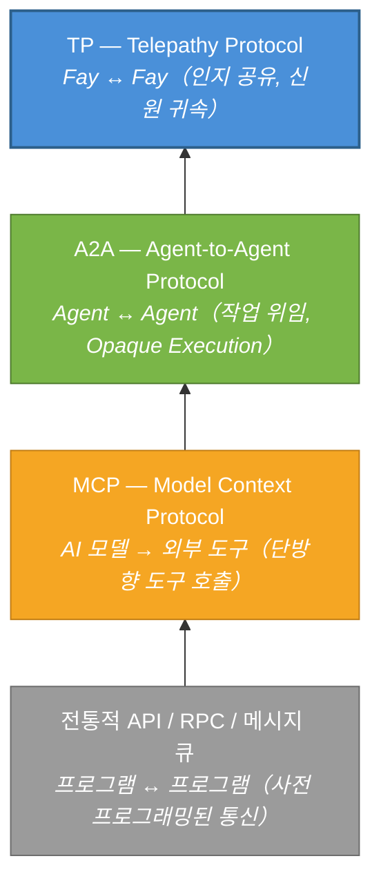
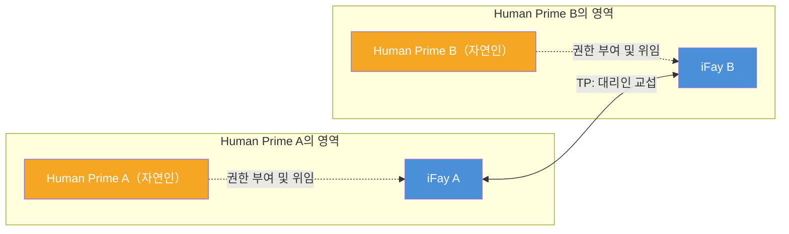

# 제1장 TP가 필요한 이유

### 1.1 통신 프로토콜 계층 분석

지난 수십 년간의 소프트웨어 엔지니어링 실천에서, 통신 프로토콜의 진화는 항상 하나의 핵심 명제를 중심으로 전개되어 왔다: **두 개의 컴퓨팅 엔티티가 어떻게 더 효율적으로 정보를 교환할 수 있는가**. AI Agent 생태계의 부상과 함께, 이 명제는 근본적인 패러다임 전환을 겪고 있다.

#### 전통적 API / RPC / 메시지 큐: 프로그램과 프로그램 간의 사전 프로그래밍된 통신

전통적 통신 프로토콜——RESTful API, gRPC, 메시지 큐(Kafka, RabbitMQ 등)——이 해결하는 것은 **프로그램과 프로그램 간의 사전 프로그래밍된 통신** 문제이다. 그 핵심 특징은 호출자가 코딩 단계에서 이미 호출 대상, 호출 방식, 전달 매개변수를 확정한다는 점이다. 인터페이스 계약(Interface Contract)은 배포 전에 이미 고정되며, 런타임의 유연성은 극히 제한적이다.

이 모델은 결정론적 시스템에서는 잘 작동하지만, AI Agent의 동적성과 자율성에 직면하면 그 한계가 여실히 드러난다——Agent는 런타임에 능력을 발견하고, 의도를 협상하며, 서비스를 동적으로 조합해야 하지, 코딩 시점에 모든 것을 하드코딩하는 것이 아니다.

> **현실 사례**: 여행 계획 Agent가 항공편 조회, 호텔 예약, 날씨 예보, 비자 상담 등 여러 서비스를 동시에 호출해야 한다. 전통적 API 모델에서는 개발자가 코딩 시점에 각 서비스의 endpoint, 매개변수 형식, 호출 순서를 확정해야 한다. 사용자가 임시로 목적지를 변경하면 전체 호출 체인을 재편성해야 할 수 있는데——이는 런타임에서 극히 어려운 일이다.

#### MCP（Model Context Protocol）: AI 모델과 외부 도구의 연결

2024년, Anthropic은 AI 모델과 외부 도구 간의 연결 문제를 해결하기 위해 Model Context Protocol(MCP)을 발표했다. MCP의 핵심 아키텍처는 **Host → Client → Server** 모델을 따르며, AI에게 "도구 상자 발견 메커니즘"을 제공한다——모델이 런타임에 사용 가능한 도구를 동적으로 발견하고, 도구의 입출력 Schema를 이해하며, 호출을 시작할 수 있다.

그러나 MCP의 통신 방향은 **단방향**이다. AI 모델은 항상 능동적 측이고, 도구는 항상 수동적 측이다. 도구는 모델에게 능동적으로 정보를 푸시하지 않으며, 다른 도구와 협상하지도 않는다. MCP는 "AI가 도구를 어떻게 사용하는가"의 문제를 해결했지만, "Agent 간에 어떻게 협력하는가"라는 명제에는 닿지 못했다.

> **현실 사례**: 고객 서비스 Agent가 MCP를 통해 지식 베이스 검색 도구와 티켓 시스템에 연결되어 있다. 사용자의 문제가 고객 서비스 Agent의 능력 범위를 초과할 때, 기술 지원 Agent에게 문제를 이관해야 한다. 그러나 MCP는 Agent 간의 통신 메커니즘을 제공하지 않는다——고객 서비스 Agent는 도구만 호출할 수 있을 뿐, "동료에게 도움을 요청"할 수 없다.

#### A2A（Agent-to-Agent Protocol）: Agent 간의 작업 위임과 협력

2025년, Google은 통신의 관점을 "모델과 도구"에서 "Agent와 Agent"로 끌어올린 Agent-to-Agent Protocol(A2A)을 발표했다. A2A는 세 가지 핵심 개념을 도입했다:

- **AgentCard**（능력 명함）: Agent가 외부에 자신의 능력을 선언하는 표준화된 기술
- **Task**（작업）: Agent 간에 전달되는 실행 가능한 작업 단위
- **Message**（메시지）: 작업 실행 과정에서의 정보 교환 매체

A2A는 서로 다른 Agent가 상호 능력을 발견하고, 작업을 위임하며, 진행 상황을 보고할 수 있게 한다. 그러나 그 핵심 설계 원칙인 **Opaque Execution（불투명 실행）**은 명확히 규정한다: Agent 간에 내부 상태, 기억, 도구 구현 세부 사항을 공유하지 않는다. 각 Agent는 블랙박스로서 입출력 인터페이스만 노출한다.

> **현실 사례**: 프로젝트 관리 Agent가 코드 리뷰 Agent에게 코드 리뷰 작업을 위임한다. A2A 모델에서 프로젝트 관리 Agent는 완전한 코드 차이, 프로젝트 사양, 과거 리뷰 기록을 모두 직렬화하여 메시지로 전송해야 한다. 코드 리뷰 Agent가 완료 후 결과를 반환하지만, 프로젝트 관리 Agent는 리뷰 과정의 추론 로직을 "볼 수" 없다——최종 리뷰 의견만 볼 수 있다. "왜 이 코드가 위험하다고 표시되었는가"를 추가 질문하려면 또 한 차례의 완전한 메시지 왕복이 필요하다.

#### TP: MCP / A2A 위의 인지 공유 계층

Telepathy Protocol(TP)은 위의 어떤 프로토콜도 대체하려는 것이 아니라, 그 위에 완전히 새로운 **인지 공유 계층**을 구축하는 것이다.

아래 그림은 이 네 계층 프로토콜의 점진적 관계를 보여준다:

각 계층 프로토콜의 등장은 이전 계층이 새로운 문제에 답할 수 없었기 때문이다. 전통적 API는 AI의 동적성에 대응할 수 없고, MCP는 Agent 간 협력을 지원할 수 없으며, A2A는 인지 공유를 실현할 수 없다——TP는 바로 이 마지막 공백을 메우기 위해 설계되었다.

### 1.2 대리인 교섭 패러다임

#### 기존 프로토콜의 암묵적 가정

MCP, A2A 및 대부분의 기존 통신 프로토콜은 하나의 공통된 가정을 암묵적으로 내포하고 있다: **통신 양측은 독립적이고 소유자가 없는 서비스 엔티티**라는 것이다.

MCP의 세계에서 도구는 상태가 없는 함수이다——누가 호출하든 동일하며, 호출자가 누구를 대표하는지 관심이 없다. A2A의 세계에서 Agent는 자율적인 서비스 노드이다——작업을 수락하고, 실행하고, 결과를 반환하지만, 작업 뒤의 위임자가 누구인지 관심이 없으며, 누구의 이익도 보호할 필요가 없다.

이러한 가정은 기술 서비스 시나리오에서는 합리적이다. 그러나 AI Agent가 실제 인간을 대표하여 행동하기 시작하면, 이 가정은 더 이상 성립하지 않는다.

#### iFay의 세계관: 모든 Fay에는 Human Prime가 있다

iFay 체계에서 세계관은 완전히 다르다. 모든 Fay(개인을 대표하는 iFay든, 사회 공공 기능을 담당하는 coFay든)에는 명확한 **Human Prime**가 있다. Fay는 Human Prime를 대표하여 행동하고, Human Prime의 이익을 수호하며, Human Prime의 프라이버시를 보호한다.

이는 두 Fay가 통신할 때, 본질적으로 발생하는 것이 두 소프트웨어 서비스 간의 데이터 교환이 아니라, **두 Human Prime의 대리인 간의 교섭**임을 의미한다——마치 변호사가 의뢰인을 대표하여 협상하고, 비서가 상사를 대표하여 업무를 조율하는 것과 같다.

이러한 "대리인 교섭" 패러다임은 통신 프로토콜에 완전히 새로운 요구 사항을 제시한다:

- **신원 귀속**: 프로토콜은 각 통신 엔티티가 누구를 대표하는지 명확히 해야 한다. 예를 들어, 한 Fay가 환자를 대표하여 병원의 coFay에게 진료 예약을 할 때, 병원 coFay는 "이 Fay가 실제로 해당 환자로부터 대리 예약 권한을 부여받았는지" 확인해야 하며, 아무나 환자의 Fay를 사칭하여 조작할 수 없어야 한다.
- **신뢰 경계**: 대리인 간의 정보 공유는 Human Prime가 승인한 범위 내에서 이루어져야 한다. 예를 들어, 환자가 자신의 Fay에게 병원과 알레르기 이력 및 현재 증상을 공유하도록 승인했지만, 심리 상담 기록의 공유는 허용하지 않았다면——Fay는 이 경계를 엄격히 준수해야 한다.
- **프라이버시 보호**: Human Prime의 민감한 데이터는 전송 과정에서 암호화 보호를 받아야 하며, 선택적 공개를 지원해야 한다. 예를 들어, 보험 청구 시 진단 코드와 비용 명세만 공개하면 되며, 전체 의료 기록 내용을 노출할 필요가 없다.
- **감사 가능성**: 모든 대리인 행위는 추적 가능해야 하며, Human Prime가 사후에 검토할 수 있어야 한다. 예를 들어, Human Prime는 "내 Fay가 지난 한 주 동안 어떤 Fay에게 어떤 데이터를 공유했는지"를 은행 계좌의 거래 내역을 조회하듯 확인할 수 있어야 한다.

### 1.3 기존 프로토콜의 사각지대

위의 분석을 종합하면, 기존 프로토콜은 "대리인 교섭" 시나리오에 직면할 때 세 가지 근본적인 사각지대가 존재한다:

#### 신원 귀속 부재

MCP와 A2A 모두 Agent가 누구를 대표하는지 관심이 없다. MCP의 도구에는 "귀속" 개념이 없으며, A2A의 AgentCard가 기술하는 것은 Agent 자체의 능력이지, 그 뒤의 위임자의 신원과 권한이 아니다. TP의 관점에서 **신원 귀속이 없는 통신은 불완전하다**——신뢰 기반을 구축할 수 없고, 책임 경계를 정의할 수도 없다.

> **현실 사례**: 부동산 중개 Agent가 매수자를 대표하여 매도자의 Agent와 가격을 협상하는 상황을 상상해 보자. A2A 모델에서 매도자 Agent는 "상대방이 정말로 구매 의향이 있는 매수자를 대표하는지" 검증할 수 없으며, "매수자가 이 가격 범위의 협상을 승인했는지"도 확인할 수 없다. 이는 위임장을 제시하지 않은 낯선 사람이 누군가를 대표하여 거래를 논의하겠다고 주장하는 것과 같다——신뢰 기반이 결여되어 있다.

#### 프라이버시 보호 부재

기존 프로토콜은 Human Prime의 프라이버시 데이터에 대한 체계적인 보호 메커니즘이 부족하다. MCP의 tool call은 매개변수를 평문으로 전달하며, A2A의 Message 역시 종단 간 암호화나 선택적 공개 능력을 제공하지 않는다. Agent가 Human Prime를 대표하여 건강 기록, 재무 데이터, 신원 자격 증명을 전달해야 할 때, 기존 프로토콜은 충분한 보안 보장을 제공할 수 없다.

> **현실 사례**: 구직자의 Fay가 채용 회사의 coFay에게 이력서를 제출한다. 구직자는 경력과 기술만 공개하고 싶지만, 현재 급여와 자택 주소는 노출하고 싶지 않다. A2A 모델에서는 전부 전송하거나(프라이버시 유출), 전송하지 않거나(구직 불가) 둘 중 하나이다. "상대방이 내가 허용한 부분만 볼 수 있게 하는" 메커니즘이 없다.

#### 공유 인지 부재

A2A는 Opaque Execution 원칙을 명확히 선언했다——Agent 간에 내부 상태를 공유하지 않는다. 이 설계는 느슨하게 결합된 서비스 오케스트레이션 시나리오에서는 합리적이지만, 깊은 협력이 필요한 시나리오에서는 병목이 된다.

두 Fay가 동일한 문서에 대해 논의하거나, 복잡한 문제를 공동으로 추론하거나, 동일한 뷰에서 협력해야 할 때, "내부 상태를 공유하지 않는다"는 것은 매 상호작용마다 모든 관련 정보를 직렬화하여 전송해야 함을 의미한다——이는 비효율적일 뿐만 아니라, 반복적인 직렬화와 역직렬화 과정에서 정보 손실과 의미적 모호성을 초래한다.

> **현실 사례**: 두 건축 설계 Fay가 건물을 협력하여 설계해야 한다. A2A 모델에서 Fay A가 평면도를 그리고 메시지로 직렬화하여 Fay B에게 전송한다. Fay B가 수정 의견을 제시하고 전체 도면을 다시 직렬화하여 돌려보낸다. Fay A가 다시 수정하고 다시 전송한다…… 매 라운드마다 전체 도면의 전송이 이루어진다. 만약 양측이 동일한 설계 뷰를 공유할 수 있다면(마치 두 건축가가 같은 도면 앞에 서 있는 것처럼), 한쪽이 선을 그으면 다른 쪽이 즉시 볼 수 있어——효율이 수 배 이상 향상될 것이다.

TP의 탄생은 바로 이 세 가지 사각지대를 메우기 위한 것이다.
