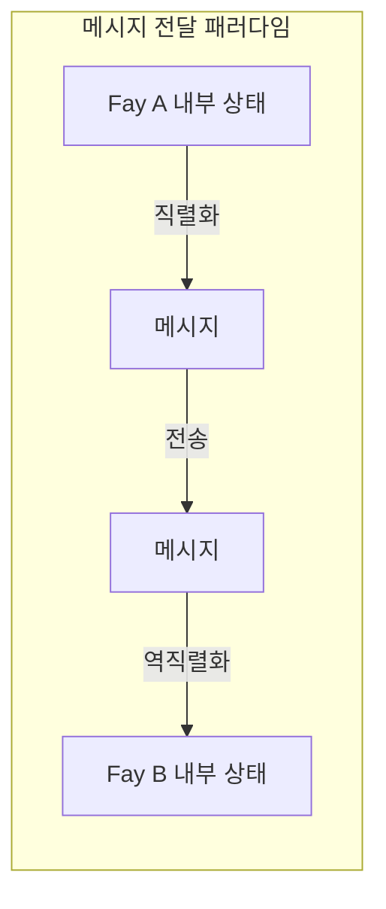
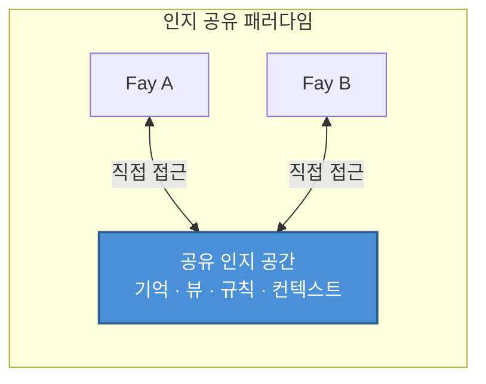

# 제2장 TP의 핵심 포지셔닝

### 2.1 인지 공유 프로토콜 vs 메시지 전달 프로토콜

TP의 핵심 포지셔닝을 이해하려면, 먼저 두 가지 근본적으로 다른 통신 패러다임을 구분해야 한다.

#### 메시지 전달 패러다임: "전언" 모드

전통적 통신 프로토콜——HTTP에서 gRPC까지, MCP에서 A2A까지——은 본질적으로 모두 동일한 패러다임을 따른다: **직렬화 → 전송 → 역직렬화**.

발신 측이 내부 상태를 특정 와이어 포맷(JSON, Protobuf, XML)으로 인코딩하고, 네트워크를 통해 수신 측에 전송하면, 수신 측이 와이어 포맷을 자신의 내부 표현으로 디코딩한다. 매 통신마다 완전한 정보 패킹과 언패킹 과정이 수반된다.

이 모드는 "전언"과 같다——전령이 화자의 의미를 기록하고, 상대방에게 달려가 복창한다. 정보는 인코딩과 디코딩 과정에서 불가피하게 손실이 발생한다: 맥락 유실, 암묵적 가정 누락, 표현 정밀도 저하.

#### 인지 공유 패러다임: "텔레파시" 모드

TP는 근본적으로 다른 패러다임을 제시한다: **권한 부여 범위 내에서 공유 인지 공간을 구축하고, 양측이 공유된 인지 자원에 직접 접근한다**.

이 모드에서 통신 양측은 더 이상 모든 정보를 메시지로 패킹하여 주고받을 필요가 없다. 대신, 제어된 공유 공간에서 협력한다——공유된 기억 조각, 뷰 상태, 추론 규칙, 환경 컨텍스트가 양측의 공통 인지 기반을 구성한다.

이것이 TP가 메시지 전송을 완전히 제거한다는 의미는 아니다——공유 공간을 구축하는 것 자체에 협상과 동기화가 필요하다. 그러나 일단 공유 컨텍스트가 수립되면, 이후의 협력 효율은 대폭 향상된다. 양측이 이미 공유된 인지 자원을 반복적으로 직렬화하고 전송할 필요가 없기 때문이다.

### 2.2 "텔레파시" 은유 해석

"Telepathy(텔레파시)"라는 명명은 수사적 과장이 아니라, TP의 핵심 메커니즘에 대한 정확한 은유이다.

#### 구체적인 시나리오

두 사람이 서로 다른 장소에서 원격 회의에 참여하는 상황을 상상해 보자. 한 사람이 말한다: "내가 빨간 박스로 표시한 데이터 부분을 봐."

인간 세계에서 이 말이 의미를 갖기 위해서는 일련의 미디어 수단이 뒷받침되어야 한다: 화면 공유 소프트웨어가 화자의 화면을 실시간으로 상대방의 디스플레이에 전송하고, 상대방은 자신의 화면에서 빨간 박스의 위치를 찾아야 한다. 네트워크 지연이나 화면이 흐릿하면, 상대방이 보는 것은 이전 프레임의 화면일 수 있고, 빨간 박스의 위치는 이미 변해 있을 수 있다.

전체 과정은 정보 전달의 마찰로 가득하다: 인코딩(화면 픽셀 → 비디오 스트림), 전송(네트워크 대역폭과 지연), 디코딩(비디오 스트림 → 화면 픽셀), 인지 정렬(상대방이 자신의 시각 공간에서 빨간 박스를 찾아야 함).

그러나 양측이 "텔레파시" 능력을 가지고 있다면, 상황은 완전히 달라진다——양측이 동일한 뷰를 직접 "보고", 빨간 박스의 위치, 데이터의 내용, 심지어 화자가 빨간 박스를 표시할 때의 의도까지 공유 인지 공간에서 즉시 가시화된다. 인코딩 손실도 없고, 전송 지연도 없으며, 인지 정렬 비용도 없다.

#### Fay-to-Fay 시나리오에서의 구현

인간 사이에서 "텔레파시"는 공상과학 개념이다. 그러나 Fay-to-Fay 시나리오에서 이러한 공유 컨텍스트는 **엔지니어링적으로 구현 가능하다**.

Fay의 인지 상태는 본질적으로 구조화된 데이터이다——기억은 인덱싱 가능한 지식 그래프이고, 뷰는 직렬화 가능한 상태 트리이며, 추론 규칙은 공유 가능한 로직 엔진이다. 두 Fay가 TP 세션을 수립할 때, Human Prime의 권한 부여 범위 내에서 일부 인지 자원을 공유 공간에 포함시킬 수 있다:

- **세션 수준의 부분 장기 기억**: 현재 협력 주제와 관련된 지식 조각
- **뷰 인터페이스 상태**: 양측이 조작 중인 인터페이스 또는 데이터 뷰의 실시간 상태
- **규칙 또는 추론 엔진**: 현재 작업에 사용되는 추론 로직과 의사결정 규칙
- **환경 컨텍스트**: 시간, 장소, 디바이스 상태 등 동적 환경 정보

이것이 바로 "Telepathy Protocol"이라는 명명의 유래이다——Fay 간의 통신을 "전언"에서 "마음의 소통"으로 격상시킨다.
