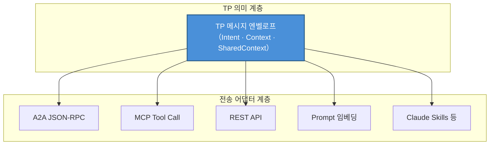
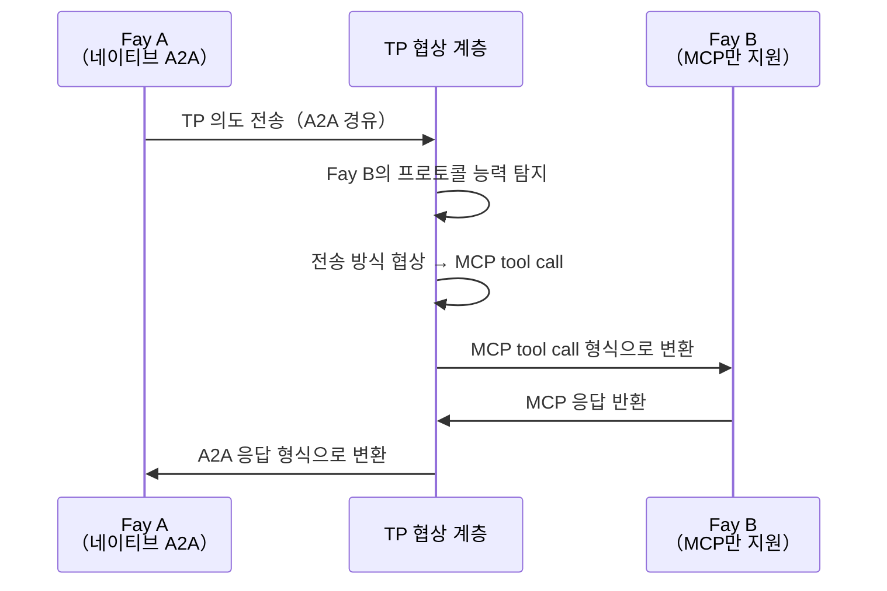

# 제3장 세 가지 고유한 능력

TP의 설계는 세 가지 고유한 능력을 중심으로 전개되며, 이들은 함께 TP를 기존의 모든 통신 프로토콜과 차별화하는 핵심 경쟁력을 구성한다.

### 3.1 전송 무관성（Transport Agnosticism）

#### 설계 철학

TP는 MCP나 A2A를 대체하는 것이 아니라, 그 위에 **통합된 의미 추상화**를 구축한다.

이 설계 철학의 핵심 통찰은 다음과 같다: 인지 공유에 있어 중요한 것은 메시지가 어떤 파이프라인을 통해 전송되는가가 아니라, 메시지가 어떤 의미를 담고 있는가이다. TP 메시지는 다음 중 어떤 전송 방식으로든 전달될 수 있다:

| 전송 방식 | 설명 |
|---------|------|
| A2A의 JSON-RPC | A2A 프로토콜의 표준 메시지 채널을 통해 TP 의미를 전달 |
| MCP의 tool call | TP 메시지를 MCP 도구 호출의 매개변수로 캡슐화 |
| 전통적 REST API | HTTP 요청 본문을 통해 TP 메시지 엔벨로프를 전달 |
| Prompt 전달 | TP 의미를 자연어 Prompt에 임베딩（다운그레이드 모드） |
| Claude Skills 등 신흥 방식 | 향후 등장할 수 있는 새로운 AI 상호작용 패러다임과 호환 |

#### 비유

이 설계는 HTTP와 전송 계층의 관계에 비유할 수 있다. HTTP 프로토콜은 TCP 위에서도, QUIC 위에서도 실행될 수 있다——HTTP가 관심을 갖는 것은 요청-응답 의미이지, 하위 전송 메커니즘이 아니다. 마찬가지로, TP가 관심을 갖는 것은 인지 공유의 의미 계층이지, 메시지의 전송 계층이 아니다.

전송 무관성은 TP가 어떤 단일 하위 프로토콜에도 종속되지 않도록 보장한다. 새로운 전송 방식이 등장하면, TP는 전송 어댑터만 추가하면 되며, 프로토콜 자체의 의미 정의를 수정할 필요가 없다.

### 3.2 프로토콜 협상 및 변환（Protocol Negotiation）

#### 문제 시나리오

현실의 AI 생태계에서 서로 다른 Fay는 서로 다른 프로토콜 "언어"를 "구사"할 수 있다. 한 Fay는 A2A를 네이티브로 지원하고, 다른 Fay는 MCP의 tool call 형식만 이해하며, 또 다른 Fay는 전통적인 REST API 호출만 지원할 수 있다.

이러한 "모국어"가 다른 Fay들이 협력해야 할 때, 통합된 협상 및 변환 메커니즘이 없으면 통신이 불가능하다——마치 서로 다른 언어만 구사하는 두 사람이 대면하고도 소통할 수 없는 것과 같다.

#### TP의 해결 방안

TP는 **자기 적응형 번역 계층**으로서, 다음 단계를 통해 크로스 프로토콜 통신을 구현한다:

1. **능력 탐지**: TP가 먼저 상대 Fay가 어떤 전송 프로토콜을 지원하는지 탐지
2. **계약 협상**: 양측이 "계약 템플릿"을 합의——MCP, A2A, API 호출, 또는 Prompt 중 어떤 것을 하위 전송 방식으로 사용할지 결정
3. **의미 매핑**: 합의된 전송 방식 위에 TP 의미에서 하위 프로토콜 형식으로의 매핑 규칙을 수립
4. **투명 변환**: 이후 통신에서 TP가 자동으로 의미적 의도를 상대방이 이해할 수 있는 형식으로 변환

이 메커니즘의 핵심 가치는 다음과 같다: 상대 Fay가 아직 특정 프로토콜을 "학습"하지 않았더라도, TP가 변환을 통해 양측의 원활한 통신을 가능하게 한다. 프로토콜의 차이는 상위 인지 공유 로직에 대해 완전히 투명하다.

### 3.3 공유 컨텍스트（Shared Context）

#### 핵심적 위상

공유 컨텍스트는 TP의 가장 핵심적인 능력이며, "텔레파시"라는 명명의 근본적 유래이기도 하다. 전송 무관성이 "어떤 파이프라인으로 통신하는가"의 문제를 해결하고, 프로토콜 협상이 "어떤 언어로 통신하는가"의 문제를 해결한다면, 공유 컨텍스트가 해결하는 것은 "통신의 본질이 무엇인가"의 문제이다.

#### 메커니즘 설명

두 Fay가 TP 세션을 활성화하면, 양측은 **공유 컨텍스트 모드**에 진입한다. 이 모드에서 양측은 더 이상 단순히 메시지를 교환하는 것이 아니라, 제어된 인지 공간을 공동으로 유지한다.

공유 가능한 인지 자원은 다음과 같다:

| 인지 자원 유형 | 설명 | 대표적 시나리오 |
|------------|------|---------|
| 세션 수준의 부분 장기 기억 | 현재 협력 주제와 관련된 지식 조각 | 의료 Fay가 환자의 관련 병력 요약을 공유——알레르기 이력, 만성 질환 기록, 최근 투약 상황 등을 공유하여, 회진 Fay가 재질문 없이 환자 배경을 파악 가능 |
| 뷰 인터페이스 상태 | 양측이 조작 중인 인터페이스 또는 데이터 뷰 | 여러 Fay가 동일한 계약서를 협력 편집——법률 Fay가 수정이 필요한 조항을 표시하면, 재무 Fay가 즉시 표시 위치를 확인하고 재무적 영향을 평가하며, 문서 버전을 주고받을 필요 없음 |
| 규칙 또는 추론 엔진 | 현재 작업에 사용되는 추론 로직 | 법률 Fay가 적용 가능한 법규 조문과 추론 체인을 공유——세무 Fay가 이 법규를 직접 인용하여 세무 영향을 계산할 수 있으며, 법률 Fay가 매번 관련 법조문을 메시지에 복사 붙여넣기할 필요 없음 |
| 환경 컨텍스트 | 시간, 장소, 디바이스 상태 등 동적 정보 | 드론 탑재 Fay가 실시간 GPS 좌표, 배터리 잔량, 카메라 시야각을 지상 제어 Fay에게 공유——지상 Fay가 드론의 상태를 직접 "감지"할 수 있으며, 정기적인 상태 보고 메시지를 기다릴 필요 없음 |

#### Host 권한 부여 및 감사

공유 컨텍스트의 범위는 엄격히 **Host 권한 부여**에 의해 결정된다. Fay는 어떤 인지 자원을 공유할지 스스로 결정할 수 없다——모든 공유는 Host가 사전에 승인한 경계 내에서 이루어져야 한다. 동시에, 공유 컨텍스트에 대한 모든 접근은 **감사 가능**하며, Host는 사후에 어떤 정보가 공유되었는지, 누가 접근했는지, 어떤 시점에 발생했는지를 열람할 수 있다.

이 설계는 A2A의 Opaque Execution 원칙과 뚜렷한 대비를 이룬다:

| 차원 | A2A（Opaque Execution） | TP（Shared Context） |
|------|------------------------|---------------------|
| 내부 상태 | 공유하지 않음, Agent는 블랙박스 | 권한 부여 범위 내에서 선택적 공유 |
| 협력 깊이 | 작업 수준（위임과 보고） | 인지 수준（기억과 추론 공유） |
| 정보 전달 | 매번 완전한 직렬화 전송 | 공유 공간 내 직접 접근 |
| 프라이버시 제어 | 체계적 메커니즘 없음 | Host 권한 부여 + 전 과정 감사 |
| 적용 시나리오 | 느슨하게 결합된 서비스 오케스트레이션 | 깊은 협력과 인지 융합 |

공유 컨텍스트는 Fay 간의 협력을 "전언"에서 "공동 사고"로 격상시킨다——이것이 TP가 인지 공유 프로토콜로서 갖는 핵심 가치이다.
