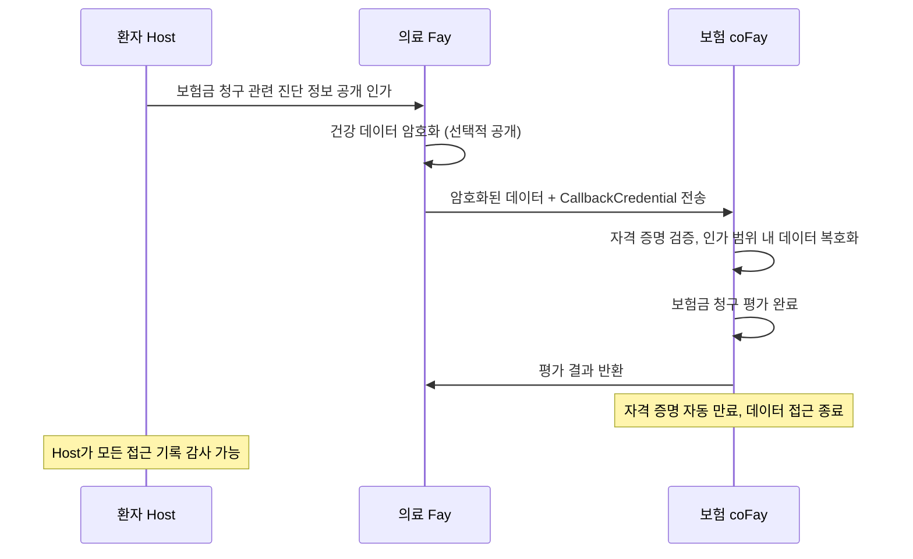
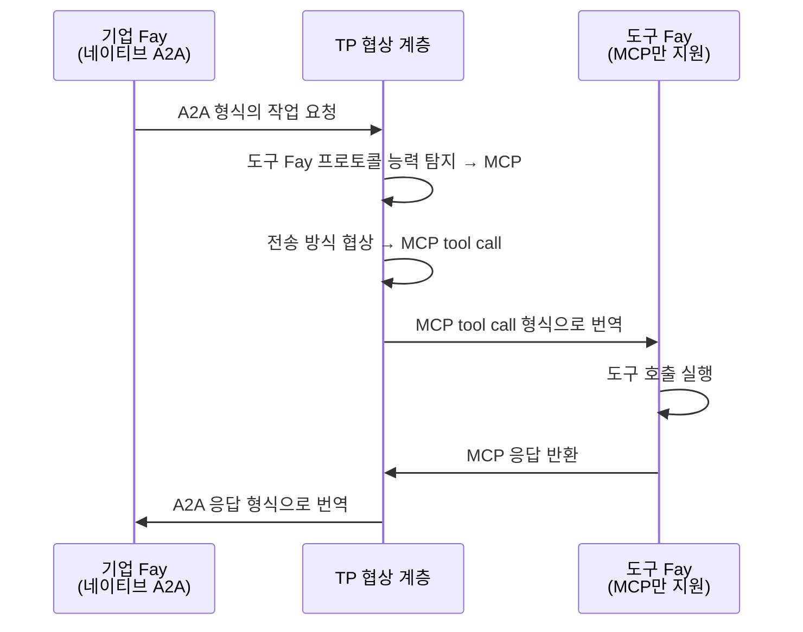
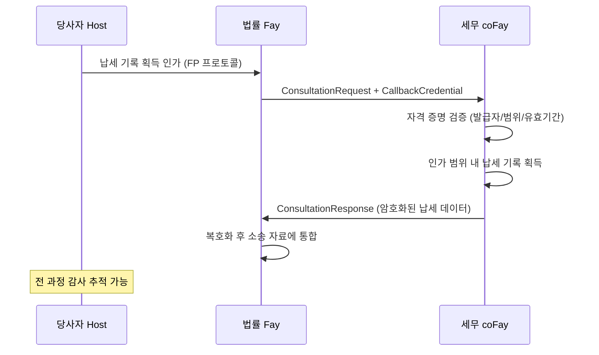
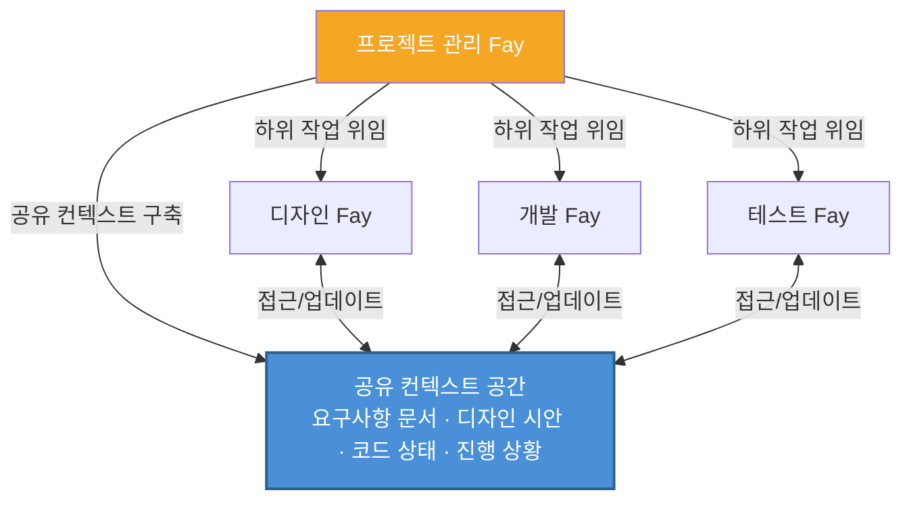
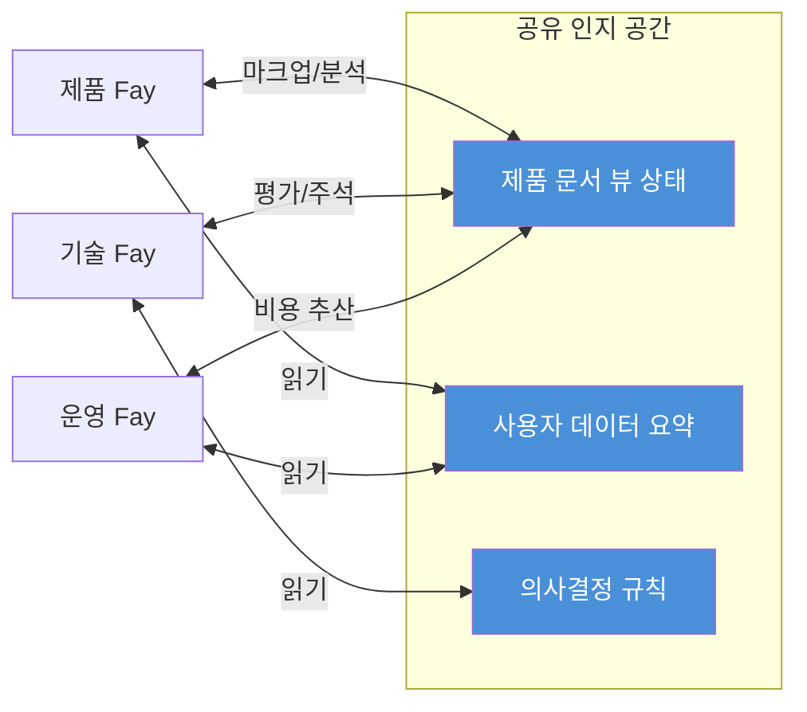

# 제4장 응용 시나리오

다음 다섯 가지 시나리오는 TP가 다양한 비즈니스 영역에서 실제로 적용되는 사례를 보여주며, 프라이버시 위임, 크로스 프로토콜 브리징, 자격 증명 전달, 다중 Fay 협업, 공유 컨텍스트 회의 등 핵심 기능을 포괄합니다.

### 4.1 프라이버시 위임 상담

**시나리오**: 환자 Host가 자신의 의료 Fay를 통해 보험 coFay에 건강 데이터를 제출하여 보험금 청구 평가를 받아야 합니다.

기존 Agent 통신 모드에서는 의료 Agent가 환자의 전체 건강 기록을 직렬화하여 보험 Agent에게 메시지로 전송해야 합니다. 이는 모든 데이터가 평문으로 네트워크를 통해 전송되며, 수신 측이 필요 범위를 훨씬 초과하는 정보 접근 권한을 갖게 됨을 의미합니다.

TP의 인지 공유 모드에서는 프로세스가 완전히 다릅니다:

1. **Host 인가**: 환자 Host가 FP 프로토콜을 통해 의료 Fay에 인가하며, 이번 보험금 청구와 관련된 진단 정보(진단 코드, 치료 날짜, 비용 명세)만 공개하도록 명시적으로 지정합니다. 나머지 건강 기록(심리 상담 기록, 유전자 검사 결과 등)은 암호화된 상태로 비공개 유지됩니다.
2. **선택적 공개**: 의료 Fay가 TP의 `SelectiveDisclosure` 메커니즘을 사용하여 인가 범위 내의 데이터를 암호화하여 보험 coFay에 전송하며, 동시에 유효 기간이 있는 `CallbackCredential`을 첨부합니다.
3. **통제된 접근**: 보험 coFay가 콜백 자격 증명을 통해 제한된 범위 내에서 인가된 데이터에 접근하여 보험금 청구 평가를 완료합니다.
4. **자동 만료**: 평가 완료 후 콜백 자격 증명이 자동으로 만료되어 보험 coFay는 더 이상 환자 데이터에 접근할 수 없습니다.
5. **전 과정 감사**: 모든 데이터 접근 기록이 감사 로그에 기록되며, 환자 Host는 언제든지 열람할 수 있습니다.

이 시나리오는 TP의 **Host 주권 프라이버시** 원칙을 구현합니다. 데이터 공개 범위는 항상 Host가 결정하며, Fay가 자체적으로 판단하지 않습니다.

### 4.2 크로스 프로토콜 번역

**시나리오**: A2A를 기본 지원하는 기업 Fay가 MCP tool call만 지원하는 전문 도구 Fay를 호출해야 합니다.

TP가 없는 세계에서는 이 두 Fay가 직접 통신할 수 없습니다. 완전히 다른 프로토콜 언어를 "사용"하기 때문입니다. 기업 Fay가 보내는 A2A JSON-RPC 요청을 도구 Fay는 파싱할 수 없고, 도구 Fay가 노출하는 MCP tool call 인터페이스를 기업 Fay도 호출할 수 없습니다. 개발자는 각 프로토콜 조합마다 전용 어댑터를 작성해야 합니다.

TP의 프로토콜 협상 및 번역 메커니즘이 이 상황을 근본적으로 변화시킵니다:

1. **능력 탐지**: 기업 Fay가 TP를 통해 통신 요청을 시작하면, TP 협상 계층이 도구 Fay의 프로토콜 능력을 자동으로 탐지하여 MCP tool call만 지원함을 발견합니다.
2. **계약 협상**: TP가 양측 간에 전송 방식을 협상하여 MCP tool call을 하위 전송 채널로 사용하기로 결정합니다.
3. **시맨틱 매핑**: TP가 기업 Fay가 보낸 A2A 형식 작업 요청의 Intent, Parameters, Context를 MCP tool call 입력 형식으로 매핑합니다.
4. **투명한 번역**: 도구 Fay가 수신하는 것은 표준 MCP tool call 요청으로, TP의 존재를 전혀 인식하지 못합니다. 실행 완료 후 TP가 MCP 응답을 A2A 형식으로 다시 번역하여 기업 Fay에 반환합니다.

이 시나리오의 핵심 가치는 **프로토콜 차이가 상위 비즈니스 로직에 완전히 투명하다**는 것입니다. 기업 Fay는 상대방이 어떤 프로토콜을 사용하는지 알 필요도 없고, 각 프로토콜에 대한 어댑터 코드를 작성할 필요도 없습니다. TP의 자적응 번역 계층이 이기종 프로토콜 생태계에서 Fay 간의 원활한 협업을 가능하게 합니다.

### 4.3 자격 증명 전달 상담

**시나리오**: 법률 Fay(당사자 Host를 대리)가 세무 coFay에 상담을 요청하며, 소송 준비를 위해 당사자의 납세 기록을 획득해야 합니다.

이 시나리오는 현실 세계에서 변호사가 당사자를 대리하여 세무 기관에 자료를 요청하는 것과 유사합니다. 변호사는 당사자의 위임장을 제시해야 하고, 세무 기관은 인가를 확인한 후 제한된 범위의 자료를 제공하며, 전체 과정이 추적 가능합니다.

TP의 상담 모드(Consultation)와 콜백 자격 증명 메커니즘(CallbackCredential)이 이 현실 프로세스를 정확하게 매핑합니다:

1. **Host 위임**: 당사자 Host가 FP 프로토콜을 통해 법률 Fay에 인가하여 납세 기록 획득을 대리하도록 허용합니다.
2. **상담 시작**: 법률 Fay가 세무 coFay에 `ConsultationRequest`를 전송하며, 유효 기간이 있는 `CallbackCredential`을 첨부하여 세무 coFay가 제한된 범위 내에서 당사자의 재무 데이터에 접근하도록 인가합니다.
3. **자격 증명 검증**: 세무 coFay가 콜백 자격 증명의 유효성을 검증합니다. 발급자 신원, 인가 범위, 유효 기간을 확인합니다.
4. **통제된 데이터 획득**: 세무 coFay가 자격 증명을 통해 당사자의 납세 기록에 접근하되, 자격 증명 `scope`에 지정된 연도와 세목으로만 제한됩니다.
5. **엔드투엔드 암호화**: 전체 데이터 전송 과정에서 TP의 `EncryptedPayload` 메커니즘을 사용하여 엔드투엔드 암호화를 수행합니다.
6. **감사 추적**: 모든 자격 증명 사용 및 데이터 접근 기록이 감사 로그에 기록되며, 당사자 Host는 언제든지 열람할 수 있습니다.

이 시나리오는 TP가 현실 세계의 "대리인이 위임장을 가지고 업무를 처리하는" 모델을 어떻게 디지털화하는지 보여줍니다. 자격 증명은 유효 기간이 있고, 범위가 있으며, 철회 가능하고, 감사 가능하여 Host의 권익을 완전히 보호합니다.

### 4.4 다중 Fay 협업 작업

**시나리오**: 프로젝트 관리 Fay가 복잡한 제품 개발 프로젝트를 여러 하위 작업으로 분해하여 디자인 Fay, 개발 Fay, 테스트 Fay에 각각 위임합니다.

A2A의 Opaque Execution 모드에서는 프로젝트 관리 Fay가 하위 작업 Fay와 상호작용할 때마다 전체 프로젝트 컨텍스트(요구사항 문서, 디자인 시안, 코드 저장소 상태, 진행 보고서)를 직렬화하여 전송해야 합니다. 프로젝트가 진행됨에 따라 컨텍스트가 계속 팽창하여 매 상호작용마다 정보 전송량이 점점 커지며, 반복적인 직렬화와 역직렬화 과정에서 세부 정보의 손실이 불가피합니다.

TP의 공유 컨텍스트 메커니즘이 이 협업 모드를 근본적으로 변화시킵니다:

1. **프로젝트 컨텍스트 공유**: 프로젝트 관리 Fay가 공유 컨텍스트 공간을 구축하고 프로젝트의 핵심 인지 리소스를 포함시킵니다. 요구사항 문서의 구조화된 표현, 디자인 시안의 버전 상태, 코드 저장소의 변경 요약, 각 하위 작업의 진행 상황과 의존 관계 등입니다.
2. **작업 분해 및 위임**: 프로젝트 관리 Fay가 TP의 `TaskMessage`를 통해 프로젝트를 하위 작업으로 분해하여 디자인 Fay(UI/UX 디자인), 개발 Fay(코드 구현), 테스트 Fay(품질 검증)에 각각 위임합니다.
3. **컨텍스트 상속**: 각 하위 작업이 공유 컨텍스트의 관련 컨텍스트를 자동으로 상속하므로, 프로젝트 관리 Fay가 매번 전체 프로젝트 정보를 반복 전달할 필요가 없습니다.
4. **실시간 동기화**: 디자인 Fay가 디자인 시안을 업데이트하면, 개발 Fay와 테스트 Fay가 공유 컨텍스트를 통해 즉시 변경을 "인지"합니다. 프로젝트 관리 Fay가 알림을 전달할 때까지 기다릴 필요가 없습니다.
5. **의존성 관리**: 하위 작업 간의 의존 관계(예: "개발은 디자인 완료에 의존", "테스트는 개발 완료에 의존")가 TP의 `SubtaskReference` 메커니즘을 통해 자동으로 관리됩니다.

이 시나리오는 메시지 전달 대비 공유 컨텍스트의 핵심 장점을 보여줍니다: **프로젝트 컨텍스트가 "살아있다"**는 것입니다. 프로젝트 진행에 따라 지속적으로 업데이트되며, 모든 참여자가 항상 동일한 최신 인지 기반 위에서 협업합니다. 지연된 메시지 스냅샷에 의존하지 않습니다.

### 4.5 공유 컨텍스트 회의

**시나리오**: 제품 Fay, 기술 Fay, 운영 Fay가 새로운 제품 방안을 공동으로 논의해야 하며, 세 측이 동일한 제품 문서에서 실시간 협업을 수행해야 합니다.

인간 세계에서 원격 회의는 화면 공유, 인스턴트 메시징, 문서 협업 등 여러 도구의 조합이 필요하며, 정보가 서로 다른 매체 간에 전달될 때 지연과 손실이 불가피합니다. Agent 세계에서 기존 메시지 전달 모드를 사용하면 상황은 더욱 복잡해집니다. 각 Agent가 자체 문서 사본을 유지하고 메시지를 통해 변경을 동기화하면, 충돌 해결과 상태 일관성이 거대한 엔지니어링 과제가 됩니다.

TP의 공유 컨텍스트 메커니즘이 다중 Fay 실시간 협업을 자연스럽고 효율적으로 만듭니다:

1. **공유 인지 공간 구축**: 세 Fay가 TP를 통해 공유 컨텍스트 세션을 구축하고 다음 인지 리소스를 공유 공간에 포함시킵니다:
   - 제품 문서의 구조화된 뷰 상태 (섹션, 마크업, 주석)
   - 관련 사용자 데이터 요약 (비식별화된 사용 통계, 피드백 분석)
   - 의사결정 규칙 (제품 우선순위 매트릭스, 기술 실현 가능성 평가 기준, 운영 비용 모델)

2. **실시간 인지 동기화**: 제품 Fay가 문서에 "이 부분은 재설계가 필요합니다"라고 마크업하면, 기술 Fay와 운영 Fay가 즉시 마크업의 위치와 내용을 "인지"합니다. 메시지 알림을 통해서가 아니라 공유 컨텍스트 공간에 대한 직접 접근을 통해서입니다. 이것이 바로 "텔레파시" 은유의 구체적 구현입니다.

3. **다중 관점 협업**: 세 Fay가 각자의 전문적 관점에서 동일한 문서를 분석하고 마크업합니다. 제품 Fay는 사용자 경험에 집중하고, 기술 Fay는 구현 복잡도를 평가하며, 운영 Fay는 운영 비용을 추산합니다. 모든 마크업과 분석 결과가 공유 공간에서 실시간으로 확인 가능합니다.

4. **의사결정 기록**: 회의 과정의 모든 토론, 마크업, 의사결정이 공유 컨텍스트에 기록되어 추적 가능한 의사결정 체인을 형성합니다.

이 시나리오는 TP "텔레파시" 이념의 가장 완전한 구현입니다. 여러 Fay가 더 이상 메시지를 통해 "전달"할 필요 없이, 공유된 인지 공간에서 "함께 사고"합니다. 정보 전달이 "인코딩 → 전송 → 디코딩"의 직렬 프로세스에서 "공유 공간에서의 직접 인지"로 변화합니다.
