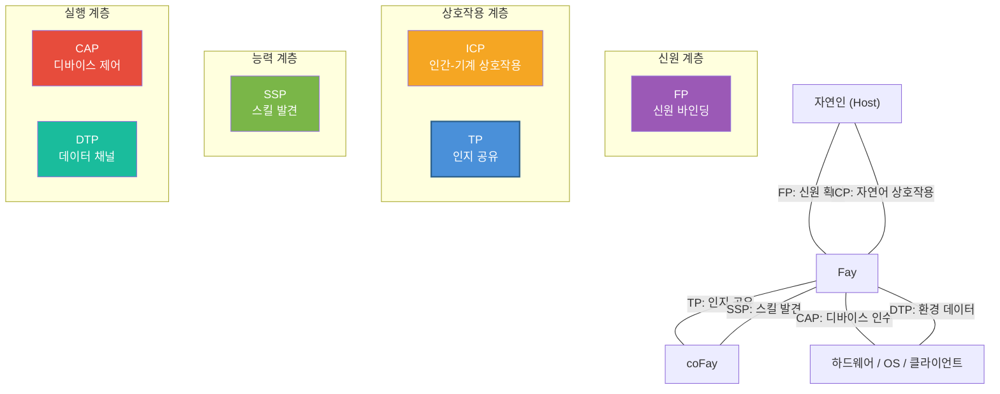

# 제5장 생태계 포지셔닝

### 5.1 iFay 6대 프로토콜 관계도

TP는 독립적으로 존재하지 않으며, iFay 생태계의 6대 프로토콜 중 하나입니다. 각 프로토콜은 고유한 역할을 담당하며, 함께 완전한 AI 에이전트 통신 프레임워크를 구성합니다.

| 프로토콜 | 전체 명칭 | 핵심 역할 | 대상 영역 |
|------|------|---------|---------|
| **ICP** | Interactive Conversation Protocol | 인간 ↔ Fay 상호작용 중간 언어 | 인간-기계 접점 |
| **TP** | Telepathy Protocol | Fay ↔ Fay 인지 공유 | Fay 간 협업 |
| **CAP** | Control Authority Protocol | Fay → 하드웨어/클라이언트 제어 인수 | 디바이스 제어 |
| **SSP** | Skill Sharing Protocol | Fay 스킬 발견 | 능력 마켓 |
| **DTP** | Data Tunnel Protocol | 하드웨어/OS → Fay 데이터 채널 | 환경 인지 |
| **FP** | Faying Protocol | 자연인 ↔ iFay 신원 바인딩 | 신원 확인 |

6대 프로토콜의 상호작용 관계는 아래 그림과 같습니다:

**프로토콜 간 협력 관계:**

- **FP → TP**: FP가 Host와 Fay의 신원 바인딩 관계를 확립하고, TP는 통신 중 FP 인가를 참조하여 Host 위임의 합법성을 검증합니다. 예를 들어, 환자의 iFay가 병원 coFay에 진료 예약 요청을 시작할 때, 병원 coFay는 FP 인가 참조를 통해 "이 iFay가 실제로 해당 환자에 의해 진료 예약을 대리하도록 인가되었음"을 확인합니다.
- **ICP → TP**: Host가 ICP를 통해 자신의 Fay에 지시를 내리고, Fay가 TP를 통해 다른 Fay에 작업을 위임하여 실행합니다. 예를 들어, 사용자가 자신의 iFay에게 "다음 주 도쿄행 항공권을 예약해줘"라고 말하면(ICP 상호작용), iFay가 이후 TP를 통해 항공사의 coFay에 연락하여 예약을 완료합니다.
- **SSP ↔ TP**: Fay가 SSP를 통해 다른 Fay의 사용 가능한 스킬을 발견한 후, TP를 통해 구체적인 협업 요청을 시작합니다. 예를 들어, iFay가 SSP를 통해 세무 계획에 능숙한 coFay를 발견한 후, TP를 통해 공유 컨텍스트를 구축하고 Host의 재무 데이터(인가 범위 내)를 공유 공간에 마운트하여 상담을 진행합니다.
- **TP → CAP**: TP 협업 작업이 하드웨어나 클라이언트를 조작해야 할 때, Fay가 CAP 자격 증명을 통해 디바이스 제어권을 획득합니다. 예를 들어, 수동 제어 중인 드론을 특정 Fay에 인계해야 할 때, 지상 운영자의 iFay가 TP를 통해 드론의 Fay와 제어권 인계를 협상한 후, CAP 프로토콜을 통해 실제 제어권 이전을 완료합니다.
- **DTP → TP**: 하드웨어와 운영체제가 DTP를 통해 Fay에 환경 데이터를 푸시하고, Fay가 이 데이터를 TP 공유 컨텍스트에 포함시켜 협업 상대가 사용할 수 있도록 합니다. 예를 들어, 스마트 홈 시스템이 DTP를 통해 iFay에 실내 온도, 습도, 공기질 데이터를 푸시하면, iFay가 이 환경 데이터를 건강 관리 coFay와의 공유 컨텍스트에 마운트하여 건강 조언 생성을 보조합니다.

### 5.2 MCP/A2A와의 비교

TP와 MCP, A2A는 경쟁 관계가 아닌 상호 보완 관계입니다. TP는 MCP 또는 A2A 위에서 실행될 수 있습니다. 다음 비교표는 여러 차원에서 세 프로토콜의 포지셔닝 차이를 보여줍니다:

| 차원 | MCP | A2A | TP |
|------|-----|-----|-----|
| **발표 주체** | Anthropic | Google | iFay 오픈소스 커뮤니티 |
| **발표 시기** | 2024 | 2025 | 2025 |
| **핵심 포지셔닝** | AI 모델과 외부 도구의 연결 프로토콜 | Agent 간 작업 위임 및 협업 프로토콜 | Fay 간 인지 공유 프로토콜 |
| **통신 방향** | 단방향 (AI → 도구) | 양방향 (Agent ↔ Agent) | 양방향 + 공유 공간 (Fay ↔ 공유 컨텍스트 ↔ Fay) |
| **신원 귀속** | 없음 (도구에 귀속 개념 없음) | 없음 (Agent는 자율 서비스 노드) | 있음 (각 Fay는 Host를 대리하여 행동) |
| **프라이버시 보호** | 체계적 메커니즘 없음 (평문 파라미터 전달) | 체계적 메커니즘 없음 | 엔드투엔드 암호화 + 선택적 공개 + Host 인가 |
| **내부 상태 공유** | 해당 없음 (도구는 무상태 함수) | 공유하지 않음 (Opaque Execution) | 인가 범위 내 선택적 공유 (Shared Context) |
| **전송 방식** | tool call에 바인딩 (JSON-RPC) | JSON-RPC over HTTP에 바인딩 | 전송 무관 (A2A/MCP/API/Prompt를 통해 전달 가능) |
| **프로토콜 협상** | 없음 | 없음 | 자적응 협상 및 번역 |
| **적용 시나리오** | AI가 외부 도구와 데이터 소스 호출 | 느슨하게 결합된 Agent 서비스 오케스트레이션 | 심층 협업, 프라이버시 위임, 인지 융합 |

세 프로토콜의 관계를 한 문장으로 요약하면: **MCP는 AI가 도구를 사용할 수 있게 하고, A2A는 Agent가 메시지를 전달할 수 있게 하며, TP는 Fay가 텔레파시로 소통할 수 있게 합니다**.

TP의 전송 무관성은 MCP 또는 A2A "위에서" 실행될 수 있음을 의미합니다. 하위 계층에서 A2A 전송을 사용할 때 TP는 신원 귀속, 프라이버시 보호, 공유 컨텍스트 능력을 추가하고, 하위 계층에서 MCP 전송을 사용할 때 TP는 단방향 도구 호출을 양방향 인지 공유로 업그레이드합니다.
