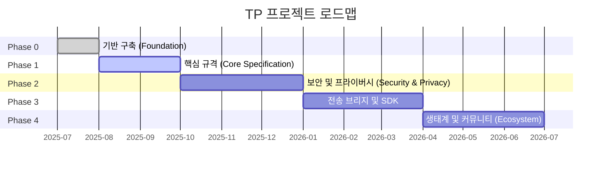

# 제7장 산출물과 로드맵

### 7.1 3단계 산출물 목록

TP 프로젝트의 모든 산출물은 우선순위에 따라 세 단계로 분류됩니다:

#### Tier 1 — 핵심 산출물 (Must-Have)

| 산출물 | 목표 단계 | 의존성 |
|--------|---------|------|
| 블루프린트 문서 (zh-CN + en) | Phase 0 | 없음 |
| TP 프로토콜 규격 초안 | Phase 1 | 블루프린트 문서 |
| JSON Schema 정의 (MessageEnvelope, Intent, Capability, Task, Context, SharedContext) | Phase 1 | 프로토콜 규격 |
| TypeScript 타입 정의 | Phase 1 | JSON Schema |
| TypeScript 참조 SDK | Phase 3 | Schema + 프로토콜 규격 |

#### Tier 2 — 중요 산출물 (Should-Have)

| 산출물 | 목표 단계 | 의존성 |
|--------|---------|------|
| MDX 사람이 읽을 수 있는 문서 | Phase 1 | JSON Schema |
| 다국어 프로토콜 문서 (9개 언어) | Phase 4 | 소스 언어 문서 |
| 개발자 가이드 (빠른 시작 + 아키텍처 개요) | Phase 1 | 블루프린트 문서 |
| SDK 사용 가이드 및 API 레퍼런스 | Phase 3 | TypeScript SDK |

#### Tier 3 — 강화 산출물 (Nice-to-Have)

| 산출물 | 목표 단계 | 의존성 |
|--------|---------|------|
| 커뮤니티 기여 가이드 및 거버넌스 문서 | Phase 0 | 없음 |
| 프로토콜 적합성 테스트 스위트 | Phase 4 | SDK + Schema |
| 예제 애플리케이션 프로젝트 | Phase 4 | SDK |

### 7.2 로드맵

#### Phase 0: Foundation (기반 구축)

Phase 0의 핵심 목표는 프로젝트의 인프라와 상위 내러티브를 확립하는 것입니다. 주요 마일스톤은 다음과 같습니다: 블루프린트 문서의 중영 이중 언어 버전 발표, 인지 공유 프로토콜로서의 TP 핵심 포지셔닝 확립, 프로젝트 디렉토리 구조 및 명명 규칙 확정, README.md, CONTRIBUTING.md, CODE_OF_CONDUCT.md 등 오픈소스 거버넌스 파일 생성, Schema 버전 관리 규범 수립(날짜 명명, 3파일 동기화, 하위 호환 규칙), 초기 agent-to-agent-protocol spec을 deprecated로 표시하고 공식적으로 telepathy-protocol spec으로 대체. Phase 0의 완료 기준은 블루프린트 문서 이중 언어 발표 및 저장소 인프라 준비 완료입니다.

#### Phase 1: Core Specification (핵심 규격)

Phase 1은 TP 프로토콜의 핵심 기술 규격에 집중합니다. 주요 마일스톤은 다음과 같습니다: TP 프로토콜 규격 초안 발표, 공유 컨텍스트 시맨틱 및 전송 무관 메시지 엔벨로프 형식 정의, JSON Schema 및 TypeScript 타입 정의 제공(MessageEnvelope, Intent, Capability, Task, Context, SharedContext 등 핵심 데이터 구조 포함), MDX 형식의 사람이 읽을 수 있는 문서 제공, 개발자 빠른 시작 가이드 발표. Phase 1의 완료 기준은 핵심 Schema 3파일(.json / .ts / .mdx)이 적합성 검증을 통과하고 규격 초안 리뷰가 완료되는 것입니다.

#### Phase 2: Security, Privacy and Shared Context (보안, 프라이버시 및 공유 컨텍스트)

Phase 2는 보안과 프라이버시 영역을 심층적으로 다룹니다. 주요 마일스톤은 다음과 같습니다: 암호화 및 자격 증명 관련 Schema 정의 제공(EncryptedPayload, CallbackCredential), 보안 규격 발표(엔드투엔드 암호화, 인증 메커니즘, Host 위임 인가 포함), 공유 컨텍스트의 완전한 생명주기 관리 정의(생성, 범위 설정, 만료, 철회), Technical Steering Committee(TSC) 거버넌스 메커니즘 수립. Phase 2의 완료 기준은 보안 Schema가 적합성 검증을 통과하고 TSC 헌장이 공식 발표되는 것입니다.

#### Phase 3: Transport Bridges and SDK (전송 브리지 및 SDK)

Phase 3은 프로토콜 규격을 실행 가능한 코드로 전환합니다. 주요 마일스톤은 다음과 같습니다: TypeScript 참조 SDK 제공(핵심 메시지 처리 로직 구현), A2A 및 MCP 프로토콜 브리지 인터페이스 구현(전송 무관성 및 프로토콜 협상 능력 검증), 자매 프로토콜(ICP, SSP, CAP, DTP, FP) 브리지 인터페이스 제공, SDK 문서 및 사용 예제 발표. Phase 3의 완료 기준은 SDK가 모든 단위 테스트 및 속성 테스트를 통과하고 브리지 인터페이스가 통합 테스트를 통과하는 것입니다.

#### Phase 4: Ecosystem and Community (생태계 및 커뮤니티)

Phase 4는 TP를 기술 프로젝트에서 개방형 생태계로 확장합니다. 주요 마일스톤은 다음과 같습니다: 9개 언어의 다국어 문서 번역 완료, 프로토콜 적합성 테스트 스위트 제공(서드파티 구현의 규격 준수 검증용), 예제 애플리케이션 프로젝트 발표(실제 비즈니스 시나리오에서의 공유 컨텍스트 활용 시연), RFC 프로세스 수립(프로토콜의 지속적 발전을 위한 커뮤니티 주도 거버넌스 메커니즘 제공). Phase 4의 완료 기준은 번역 상태 대시보드에서 모든 Tier 1 및 Tier 2 문서 번역이 완료된 것으로 표시되는 것입니다.

