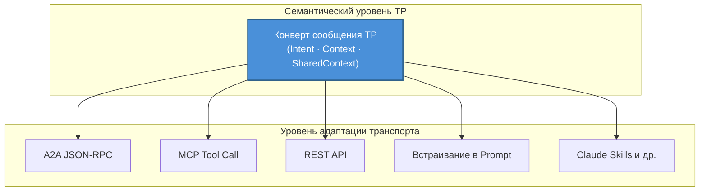
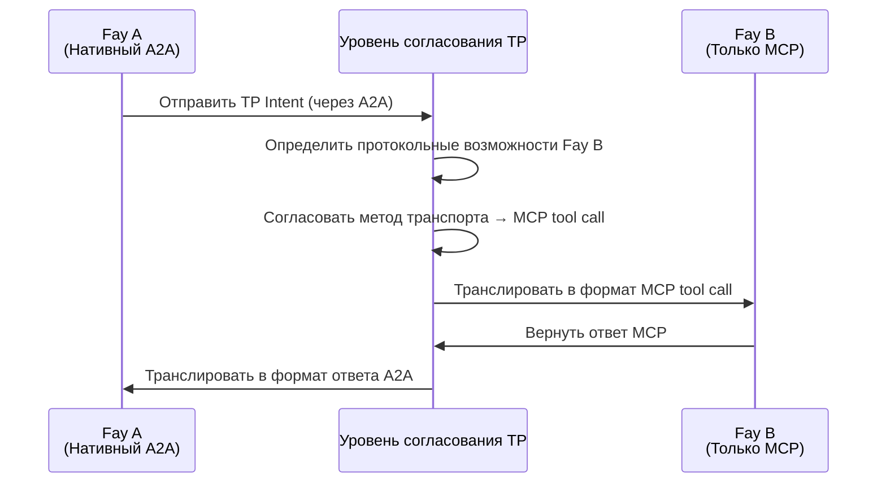

# Глава 3: Три уникальные возможности

Дизайн TP строится вокруг трёх уникальных возможностей, которые вместе составляют ключевое конкурентное преимущество TP, отличающее его от всех существующих коммуникационных протоколов.

### 3.1 Транспортный агностицизм

#### Философия проектирования

TP не заменяет ни MCP, ни A2A; вместо этого он устанавливает **единую семантическую абстракцию** поверх них.

Ключевое понимание этой философии проектирования: для когнитивного обмена важно не то, по какому каналу передаются сообщения, а какую семантику они несут. Сообщения TP могут доставляться через любой из следующих методов транспорта:

| Метод транспорта | Описание |
|---------|------|
| JSON-RPC A2A | Доставка семантики TP через стандартный канал сообщений протокола A2A |
| Tool call MCP | Инкапсуляция сообщений TP как параметров вызовов инструментов MCP |
| Традиционный REST API | Доставка конвертов сообщений TP через тела HTTP-запросов |
| Доставка через Prompt | Встраивание семантики TP в Prompts на естественном языке (деградированный режим) |
| Новые методы, такие как Claude Skills | Совместимость с новыми парадигмами взаимодействия AI, которые могут появиться в будущем |

#### Аналогия

Этот дизайн можно сравнить с отношением между HTTP и транспортным уровнем. Протокол HTTP может работать поверх TCP или поверх QUIC — HTTP заботится о семантике запрос-ответ, а не о базовом транспортном механизме. Аналогично, TP заботится о семантическом уровне когнитивного обмена, а не об уровне транспорта сообщений.

Транспортный агностицизм гарантирует, что TP не привязан к какому-либо одному базовому протоколу. Когда появляются новые методы транспорта, TP нужно лишь добавить транспортный адаптер без изменения собственных семантических определений протокола.

### 3.2 Согласование и трансляция протоколов

#### Проблемный сценарий

В реальной экосистеме AI различные Fay могут «говорить» на разных протокольных языках. Один Fay может нативно поддерживать A2A, другой понимает только формат tool call MCP, а третьи поддерживают только традиционные вызовы REST API.

Когда этим Fay с разными «родными языками» нужно сотрудничать, без единого механизма согласования и трансляции они не могут общаться — точно так же, как два человека, говорящие только на разных языках, стоят лицом к лицу и не могут вести беседу.

#### Решение TP

TP выступает как **адаптивный слой трансляции**, обеспечивая межпротокольную коммуникацию через следующие шаги:

1. **Зондирование возможностей**: TP сначала зондирует, какие транспортные протоколы поддерживает Fay-контрагент
2. **Согласование контракта**: Обе стороны договариваются о «шаблоне контракта» — определяя, использовать ли MCP, A2A, вызовы API или Prompt в качестве базового метода транспорта
3. **Семантическое отображение**: Поверх согласованного метода транспорта устанавливаются правила отображения семантики TP в формат базового протокола
4. **Прозрачная трансляция**: В последующих коммуникациях TP автоматически транслирует семантическое намерение в формат, понятный контрагенту

Ключевая ценность этого механизма: даже если Fay-контрагент ещё не «выучил» определённый протокол, TP всё равно может обеспечить плавную коммуникацию между обеими сторонами через трансляцию. Различия протоколов полностью прозрачны для логики когнитивного обмена верхнего уровня.

### 3.3 Shared Context

#### Центральный статус

Shared Context — это наиболее центральная возможность TP и фундаментальная причина названия «Telepathy». Если транспортный агностицизм решает проблему «по какому каналу общаться», а согласование протоколов решает проблему «на каком языке общаться», то Shared Context решает проблему «в чём суть коммуникации».

#### Описание механизма

Когда два Fay инициируют сессию TP, обе стороны входят в **режим Shared Context**. В этом режиме обе стороны больше не просто обмениваются сообщениями, а совместно поддерживают контролируемое когнитивное пространство.

Разделяемые когнитивные ресурсы включают:

| Тип когнитивного ресурса | Описание | Типичный сценарий |
|------------|------|---------|
| Частичная долговременная память на уровне сессии | Фрагменты знаний, релевантные текущей теме сотрудничества | Медицинский Fay делится релевантной сводкой истории болезни пациента — такой как история аллергий, записи о хронических заболеваниях и недавнее использование лекарств, позволяя консультирующему Fay понять контекст пациента без повторных расспросов |
| Состояние интерфейса представления | Интерфейс или представления данных, с которыми работают обе стороны | Несколько Fay совместно редактируют один и тот же текст контракта — юридический Fay отмечает пункты, требующие изменения, и финансовый Fay немедленно видит отмеченные позиции и оценивает финансовое воздействие, без пересылки версий документа туда-сюда |
| Правила или движки рассуждений | Логика рассуждений для текущей задачи | Юридический Fay делится применимыми правовыми нормами и цепочками рассуждений — налоговый Fay может напрямую ссылаться на эти нормы для расчёта налоговых последствий, без необходимости юридическому Fay каждый раз копировать и вставлять соответствующие статуты в сообщения |
| Контекст окружения | Динамическая информация: время, местоположение, состояние устройства | Fay на дроне делится GPS-координатами в реальном времени, уровнем заряда батареи и углом камеры с Fay наземного управления — наземный Fay может напрямую «воспринимать» состояние дрона, а не ждать периодических сообщений с отчётами о статусе |

#### Авторизация Human Prime и аудит

Объём Shared Context строго определяется **авторизацией Human Prime**. Fay не может в одностороннем порядке решать, какие когнитивные ресурсы разделять — каждое действие по разделению должно происходить в рамках, предварительно авторизованных Human Prime. Кроме того, весь доступ к Shared Context является **аудируемым**, позволяя Human Prime проверить постфактум, какая информация была разделена, кем она была получена и в какой момент времени.

Этот дизайн формирует резкий контраст с принципом Opaque Execution A2A:

| Измерение | A2A (Opaque Execution) | TP (Shared Context) |
|------|------------------------|---------------------|
| Внутреннее состояние | Не разделяется; Agent — чёрный ящик | Выборочно разделяется в авторизованных рамках |
| Глубина сотрудничества | Уровень задач (делегирование и отчётность) | Когнитивный уровень (разделяемая память и рассуждения) |
| Передача информации | Полная сериализация каждый раз | Прямой доступ в общем пространстве |
| Контроль конфиденциальности | Нет систематического механизма | Авторизация Human Prime + полный аудит |
| Применимые сценарии | Слабо связанная оркестрация сервисов | Глубокое сотрудничество и когнитивная интеграция |

Shared Context поднимает сотрудничество между Fay от «передачи сообщений» до «совместного мышления» — это ключевая ценность TP как протокола когнитивного обмена.
