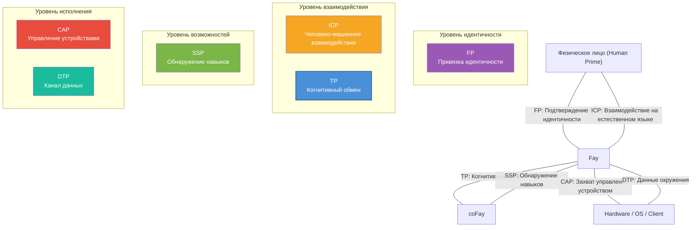

# Глава 5: Позиционирование в экосистеме

### 5.1 Диаграмма взаимосвязей шести протоколов iFay

TP не существует изолированно; это один из шести протоколов в экосистеме iFay. Каждый протокол выполняет свою функцию, и вместе они формируют полный фреймворк коммуникации AI-агентов.

| Протокол | Полное название | Основная ответственность | Домен |
|------|------|---------|---------|
| **ICP** | Interactive Conversation Protocol | Промежуточный язык для взаимодействия Человек ↔ Fay | Человеко-машинный интерфейс |
| **TP** | Telepathy Protocol | Когнитивный обмен между Fay ↔ Fay | Межфайное сотрудничество |
| **CAP** | Control Authority Protocol | Fay → Захват управления Hardware/Client | Управление устройствами |
| **SSP** | Skill Sharing Protocol | Обнаружение навыков Fay | Рынок возможностей |
| **DTP** | Data Tunnel Protocol | Канал данных Hardware/OS → Fay | Восприятие окружения |
| **FP** | Faying Protocol | Привязка идентичности Физическое лицо ↔ iFay | Подтверждение идентичности |

Взаимосвязи между шестью протоколами проиллюстрированы на следующей диаграмме:

**Отношения межпротокольного сотрудничества:**

- **FP → TP**: FP устанавливает отношение привязки идентичности между Human Prime и Fay; TP ссылается на авторизацию FP во время коммуникации для проверки легитимности делегирования Human Prime. Например, когда iFay пациента инициирует запрос на приём к coFay больницы, coFay больницы подтверждает через ссылку на авторизацию FP, что «этот iFay действительно авторизован пациентом для записи на приём.»
- **ICP → TP**: Human Prime даёт инструкции своему Fay через ICP; Fay делегирует задачи другим Fay для выполнения через TP. Например, пользователь говорит своему iFay «забронируй мне рейс в Токио на следующей неделе» (взаимодействие ICP), и iFay затем связывается с coFay авиакомпании через TP для завершения бронирования.
- **SSP ↔ TP**: Fay обнаруживает доступные навыки других Fay через SSP, затем инициирует конкретные запросы на сотрудничество через TP. Например, iFay обнаруживает coFay, специализирующийся на налоговом планировании, через SSP, затем устанавливает общий контекст через TP, монтируя финансовые данные Human Prime (в авторизованном объёме) в общее пространство для консультации.
- **TP → CAP**: Когда задача сотрудничества TP требует управления hardware или clients, Fay получает полномочия управления устройством через credentials CAP. Например, дрон с ручным управлением должен быть передан Fay для захвата управления — iFay наземного оператора согласовывает передачу управления с Fay на дроне через TP, затем завершает фактическую передачу управления через протокол CAP.
- **DTP → TP**: Hardware и операционные системы передают данные окружения Fay через DTP; Fay включают эти данные в Shared Context TP для использования сотрудничающими сторонами. Например, система умного дома передаёт данные о температуре в помещении, влажности и качестве воздуха iFay через DTP, и iFay монтирует эти данные окружения в общий контекст с coFay управления здоровьем для помощи в генерации рекомендаций по здоровью.

### 5.2 Сравнение с MCP/A2A

TP и MCP/A2A не конкурируют, а дополняют друг друга — TP может работать поверх MCP или A2A. Следующая сравнительная таблица показывает различия в позиционировании по нескольким измерениям:

| Измерение | MCP | A2A | TP |
|------|-----|-----|-----|
| **Издатель** | Anthropic | Google | Сообщество Open Source iFay |
| **Год выпуска** | 2024 | 2025 | 2025 |
| **Ключевое позиционирование** | Протокол подключения AI-моделей к внешним инструментам | Протокол делегирования задач и сотрудничества между Agents | Протокол когнитивного обмена между Fay |
| **Направление коммуникации** | Однонаправленное (AI → Инструменты) | Двунаправленное (Agent ↔ Agent) | Двунаправленное + Общее пространство (Fay ↔ Shared Context ↔ Fay) |
| **Атрибуция идентичности** | Отсутствует (инструменты не имеют понятия атрибуции) | Отсутствует (Agents — автономные сервисные узлы) | Да (каждый Fay действует от имени Human Prime) |
| **Защита конфиденциальности** | Нет систематического механизма (передача параметров открытым текстом) | Нет систематического механизма | Сквозное шифрование + Выборочное раскрытие + Авторизация Human Prime |
| **Обмен внутренним состоянием** | Не применимо (инструменты — функции без состояния) | Не разделяется (Opaque Execution) | Выборочно разделяется в авторизованных рамках (Shared Context) |
| **Метод транспорта** | Привязан к tool call (JSON-RPC) | Привязан к JSON-RPC через HTTP | Транспортно-агностичный (доставляемый через A2A/MCP/API/Prompt) |
| **Согласование протоколов** | Отсутствует | Отсутствует | Адаптивное согласование и трансляция |
| **Применимые сценарии** | AI вызывает внешние инструменты и источники данных | Слабо связанная оркестрация сервисов Agent | Глубокое сотрудничество, делегирование конфиденциальности, когнитивная интеграция |

Отношение между тремя можно резюмировать одной фразой: **MCP позволяет AI использовать инструменты, A2A позволяет Agents передавать сообщения, TP позволяет Fay достичь телепатии**.

Транспортный агностицизм TP означает, что он может «ехать» поверх MCP или A2A — когда базовый транспорт использует A2A, TP добавляет атрибуцию идентичности, защиту конфиденциальности и возможности общего контекста; когда базовый транспорт использует MCP, TP поднимает однонаправленный вызов инструментов до двунаправленного когнитивного обмена.
