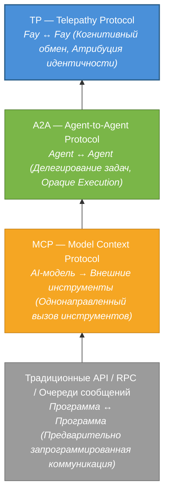
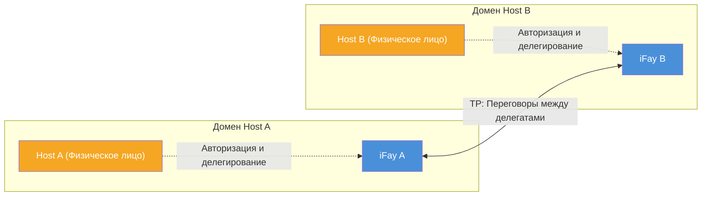

# Глава 1: Зачем нужен TP

### 1.1 Анализ уровней коммуникационных протоколов

На протяжении последних нескольких десятилетий практики программной инженерии эволюция коммуникационных протоколов неизменно вращалась вокруг центрального вопроса: **как позволить двум вычислительным сущностям обмениваться информацией более эффективно**. С ростом экосистемы AI Agent этот вопрос переживает фундаментальную смену парадигмы.

#### Традиционные API / RPC / Очереди сообщений: Предварительно запрограммированная коммуникация между программами

Традиционные коммуникационные протоколы — будь то RESTful API, gRPC или очереди сообщений (такие как Kafka, RabbitMQ) — решают проблему **предварительно запрограммированной коммуникации между программами**. Их ключевая характеристика заключается в том, что вызывающая сторона определяет цель вызова, метод вызова и параметры на этапе разработки. Контракт интерфейса фиксируется до развёртывания, оставляя крайне ограниченную гибкость во время выполнения.

Эта модель хорошо работает в детерминированных системах, но её ограничения полностью проявляются при столкновении с динамизмом и автономностью AI Agents — Agents должны обнаруживать возможности во время выполнения, согласовывать намерения и динамически компоновать сервисы, а не жёстко кодировать всё на этапе разработки.

> **Практический пример**: Agent планирования путешествий должен одновременно вызывать сервисы поиска авиабилетов, бронирования отелей, прогноза погоды и консультации по визам. При традиционной модели API разработчики должны на этапе разработки определить endpoint, формат параметров и последовательность вызовов каждого сервиса. Если пользователь на ходу меняет пункт назначения, вся цепочка вызовов может потребовать переоркестрации — что крайне сложно во время выполнения.

#### MCP (Model Context Protocol): Подключение AI-моделей к внешним инструментам

В 2024 году Anthropic выпустила Model Context Protocol (MCP), предназначенный для решения проблемы подключения AI-моделей к внешним инструментам. Основная архитектура MCP следует модели **Host → Client → Server**, предоставляя AI «механизм обнаружения набора инструментов» — модели могут динамически обнаруживать доступные инструменты во время выполнения, понимать Schema ввода/вывода инструментов и инициировать вызовы.

Однако направление коммуникации MCP является **однонаправленным**. AI-модель всегда является активной стороной, а инструменты всегда пассивны. Инструменты не отправляют информацию моделям проактивно и не ведут переговоры с другими инструментами. MCP решил проблему «как AI использует инструменты», но не затронул вопрос «как Agents сотрудничают друг с другом».

> **Практический пример**: Agent службы поддержки клиентов подключён к инструменту поиска по базе знаний и системе тикетов через MCP. Когда вопрос пользователя превышает возможности Agent службы поддержки, ему необходимо эскалировать запрос к Agent технической поддержки. Но MCP не предоставляет механизма для межагентной коммуникации — Agent службы поддержки может только вызывать инструменты, он не может «попросить коллегу о помощи».

#### A2A (Agent-to-Agent Protocol): Делегирование задач и сотрудничество между Agents

В 2025 году Google выпустила Agent-to-Agent Protocol (A2A), поднимая перспективу коммуникации от «модель и инструменты» до «Agent и Agent». A2A ввёл три ключевых концепции:

- **AgentCard** (Карта возможностей): Стандартизированное описание, через которое Agent объявляет свои возможности внешнему миру
- **Task**: Исполняемая единица работы, передаваемая между Agents
- **Message**: Носитель обмена информацией во время выполнения задач

A2A позволяет различным Agents обнаруживать возможности друг друга, делегировать задачи и сообщать о прогрессе. Однако его основной принцип проектирования — **Opaque Execution** — явно устанавливает, что Agents не делятся внутренним состоянием, памятью или деталями реализации инструментов. Каждый Agent является чёрным ящиком, предоставляющим только интерфейсы ввода/вывода.

> **Практический пример**: Agent управления проектами делегирует задачу ревью кода Agent ревью кода. При A2A Agent управления проектами должен сериализовать полный diff кода, спецификации проекта и историю ревью в сообщение. Agent ревью кода возвращает результаты, но Agent управления проектами не может «увидеть» логику рассуждений во время ревью — он видит только финальные комментарии ревью. Если нужно спросить «почему этот сегмент кода был отмечен как рискованный», требуется ещё один полный цикл обмена сообщениями.

#### TP: Уровень когнитивного обмена над MCP / A2A

Telepathy Protocol (TP) не стремится заменить ни один из вышеперечисленных протоколов. Вместо этого он устанавливает совершенно новый **уровень когнитивного обмена** поверх них.

Следующая диаграмма иллюстрирует прогрессивную взаимосвязь между этими четырьмя уровнями протоколов:

Каждый уровень протокола появился потому, что предыдущий не мог ответить на новые вопросы. Традиционные API не справляются с динамизмом AI, MCP не может поддержать сотрудничество между Agents, A2A не может обеспечить когнитивный обмен — и TP спроектирован именно для заполнения этого последнего пробела.

### 1.2 Парадигма переговоров между делегатами

#### Неявные допущения существующих протоколов

MCP, A2A и подавляющее большинство существующих коммуникационных протоколов разделяют общее неявное допущение: **коммуницирующие стороны являются независимыми, не связанными друг с другом сервисными сущностями**.

В мире MCP инструмент — это функция без состояния — неважно, кто его вызывает, и ему безразлично, кого представляет вызывающая сторона. В мире A2A Agent — это автономный сервисный узел — он принимает задачи, выполняет их и возвращает результаты, но ему безразлично, кто является принципалом за задачей, и ему не нужно защищать чьи-либо интересы.

Это допущение разумно в сценариях технических сервисов. Но когда AI Agents начинают действовать от имени реальных людей, это допущение перестаёт работать.

#### Мировоззрение iFay: У каждого Fay есть Host

В системе iFay мировоззрение принципиально иное. Каждый Fay — будь то iFay, представляющий отдельного человека, или coFay, выполняющий публичную социальную функцию — имеет чётко определённого **Host**. Fay действует от имени своего Host, защищает интересы Host и охраняет конфиденциальность Host.

Это означает, что когда два Fay общаются, фундаментально происходит не обмен данными между двумя программными сервисами, а скорее **переговоры между двумя делегатами, действующими от имени своих соответствующих Hosts** — подобно тому, как адвокаты ведут переговоры от имени своих клиентов, или секретари координируют дела от имени своих руководителей.

Эта парадигма «переговоров между делегатами» предъявляет совершенно новые требования к коммуникационным протоколам:

- **Атрибуция идентичности**: Протокол должен чётко идентифицировать, кого представляет каждая коммуницирующая сущность. Например, когда Fay записывает на приём к coFay больницы от имени пациента, coFay больницы должен подтвердить, что «этот Fay действительно авторизован пациентом для записи на приём», а не позволять кому угодно выдавать себя за Fay пациента.
- **Границы доверия**: Обмен информацией между делегатами должен происходить в рамках, авторизованных их Hosts. Например, пациент авторизует своего Fay делиться историей аллергий и текущими симптомами с больницей, но не разрешает делиться записями психологических консультаций — Fay должен строго соблюдать эту границу.
- **Защита конфиденциальности**: Чувствительные данные Hosts должны быть зашифрованы при передаче, с поддержкой выборочного раскрытия. Например, при страховом случае необходимо раскрыть только код диагноза и разбивку расходов, без раскрытия полных медицинских записей.
- **Аудируемость**: Все действия делегатов должны быть отслеживаемыми, позволяя Hosts проверять их постфактум. Например, Host может проверить «с какими Fay мой Fay делился данными за последнюю неделю и какие данные были переданы» — подобно просмотру истории транзакций банковского счёта.

### 1.3 Слепые зоны существующих протоколов

Обобщая вышеприведённый анализ, существующие протоколы имеют три фундаментальные слепые зоны при столкновении со сценариями «переговоров между делегатами»:

#### Отсутствие атрибуции идентичности

Ни MCP, ни A2A не заботятся о том, кого представляет Agent. Инструменты в MCP не имеют понятия «атрибуции»; AgentCards в A2A описывают собственные возможности Agent, а не идентичность и авторизацию стоящего за ним принципала. С точки зрения TP, **коммуникация без атрибуции идентичности является неполной** — она не может установить основу доверия и не может очертить границы ответственности.

> **Практический пример**: Представьте агента по недвижимости, представляющего покупателя, ведущего переговоры о цене с агентом продавца. При A2A агент продавца не может проверить, что «другая сторона действительно представляет покупателя с намерением покупки», и не может подтвердить, «авторизовал ли покупатель этот ценовой диапазон для переговоров». Это как незнакомец без доверенности, утверждающий, что представляет кого-то в сделке — нет основы для доверия.

#### Отсутствие защиты конфиденциальности

Существующие протоколы не имеют систематических механизмов защиты данных конфиденциальности Host. Вызовы инструментов MCP передают параметры открытым текстом; Messages A2A также не предоставляют сквозного шифрования или возможностей выборочного раскрытия. Когда Agents должны передавать медицинские записи, финансовые данные или удостоверения личности от имени своих Hosts, существующие протоколы не могут обеспечить адекватные гарантии безопасности.

> **Практический пример**: Fay соискателя отправляет резюме coFay рекрутинговой компании. Соискатель хочет раскрыть только опыт работы и навыки, но не хочет раскрывать текущую зарплату и домашний адрес. При A2A выбор — либо отправить всё (нарушение конфиденциальности), либо не отправлять ничего (невозможно завершить подачу заявки). Нет механизма для «позволить другой стороне видеть только то, что я разрешаю».

#### Отсутствие разделяемого познания

A2A явно декларирует принцип Opaque Execution — Agents не делятся внутренним состоянием. Этот дизайн разумен в сценариях слабо связанной оркестрации сервисов, но становится узким местом в сценариях, требующих глубокого сотрудничества.

Когда два Fay должны обсуждать один и тот же документ, совместно рассуждать над сложной проблемой или сотрудничать в одном представлении, «не делиться внутренним состоянием» означает, что каждый раунд взаимодействия должен сериализовать и передавать всю релевантную информацию — это не только неэффективно, но и вносит потерю информации и семантическую неоднозначность через повторную сериализацию и десериализацию.

> **Практический пример**: Два Fay архитектурного проектирования должны совместно спроектировать здание. При A2A Fay A рисует план этажа и сериализует его в сообщение для Fay B; Fay B предлагает изменения и сериализует весь чертёж обратно; Fay A вносит правки и отправляет снова... каждый раунд включает передачу полного чертежа. Но если бы обе стороны могли разделять одно и то же представление проекта (как два архитектора, стоящие перед одним чертежом), один проводит линию — и другой сразу её видит — эффективность возросла бы на порядки.

TP был создан именно для заполнения этих трёх слепых зон.
