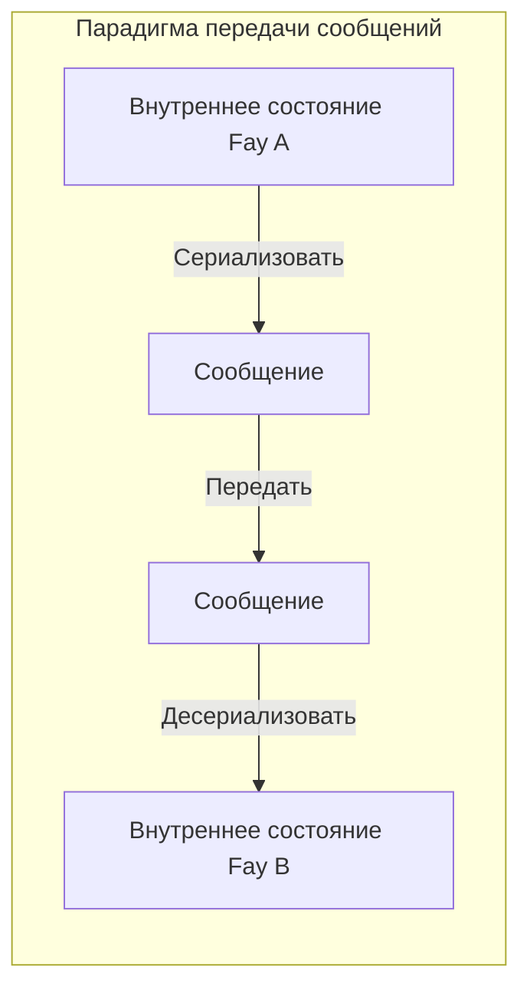
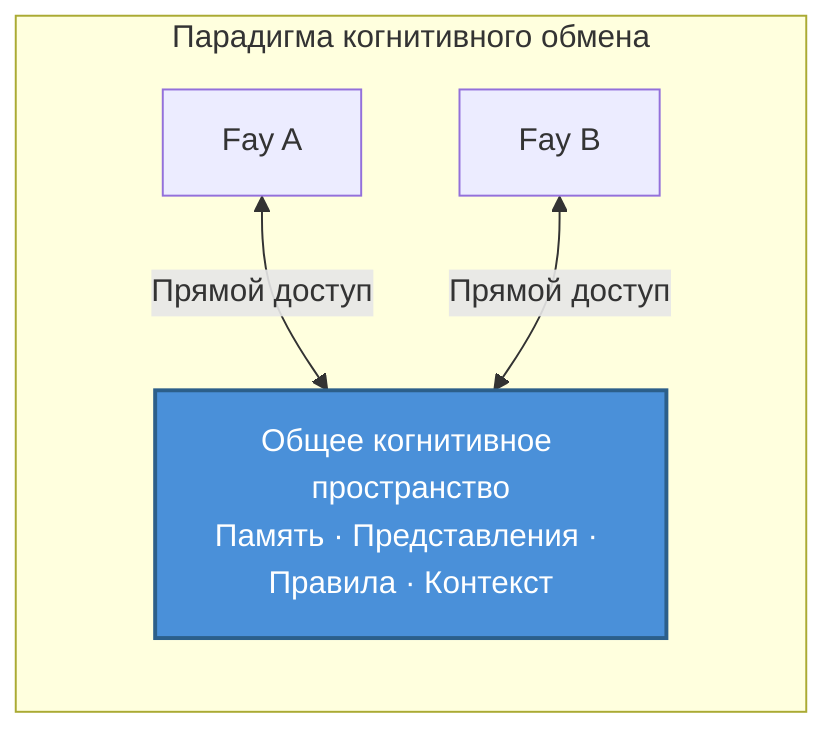

# Глава 2: Ключевое позиционирование TP

### 2.1 Протокол когнитивного обмена vs. Протокол передачи сообщений

Понимание ключевого позиционирования TP требует прежде всего различения двух принципиально разных парадигм коммуникации.

#### Парадигма передачи сообщений: Режим «эстафеты»

Традиционные коммуникационные протоколы — от HTTP до gRPC, от MCP до A2A — все фундаментально следуют одной и той же парадигме: **сериализовать → передать → десериализовать**.

Отправитель кодирует своё внутреннее состояние в формат передачи (JSON, Protobuf, XML), передаёт его по сети получателю, а получатель декодирует формат передачи обратно в своё собственное внутреннее представление. Каждая коммуникация — это полный процесс упаковки и распаковки информации.

Эта модель подобна «передаче сообщения» — посыльный записывает смысл говорящего, бежит к другому человеку и пересказывает. Информация неизбежно теряется при кодировании и декодировании: контекст утрачивается, неявные допущения опускаются, а точность выражения снижается.

#### Парадигма когнитивного обмена: Режим «телепатии»

TP предлагает принципиально иную парадигму: **установление общего когнитивного пространства в рамках авторизованных границ, где обе стороны напрямую обращаются к разделяемым когнитивным ресурсам**.

В этой модели коммуницирующие стороны больше не нуждаются в упаковке всей информации в сообщения и передаче их туда-сюда. Вместо этого они сотрудничают в контролируемом общем пространстве — разделяемые фрагменты памяти, состояния представлений, правила рассуждений и контекст окружения формируют общую когнитивную основу для обеих сторон.

Это не означает, что TP полностью устраняет передачу сообщений — установление самого общего пространства требует переговоров и синхронизации. Но как только общий контекст установлен, эффективность последующего сотрудничества резко возрастает, поскольку обеим сторонам больше не нужно повторно сериализовать и передавать когнитивные ресурсы, которые уже являются общими.

### 2.2 Интерпретация метафоры «Телепатия»

Название «Telepathy» — это не риторическое преувеличение, а точная метафора основного механизма TP.

#### Конкретный сценарий

Представьте двух людей, участвующих в удалённом совещании из разных мест. Один говорит: «Посмотрите на данные, которые я выделил красной рамкой.»

В человеческом мире, чтобы это предложение имело смысл, его должна поддерживать серия медиа-инструментов: программа демонстрации экрана передаёт экран говорящего в реальном времени на дисплей другого человека; другой человек должен найти красную рамку на своём экране; при сетевой задержке или размытии изображения он может видеть предыдущий кадр, а положение красной рамки уже могло измениться.

Весь процесс наполнен трением передачи информации: кодирование (пиксели экрана → видеопоток), передача (пропускная способность сети и задержка), декодирование (видеопоток → пиксели экрана), когнитивное выравнивание (другой человек должен найти красную рамку в своём визуальном пространстве).

Но если бы обе стороны обладали «телепатией», ситуация была бы совершенно иной — обе напрямую «видели» бы одно и то же представление, и положение красной рамки, содержание данных, даже намерение говорящего при выделении красной рамки — всё было бы мгновенно видно в общем когнитивном пространстве. Никаких потерь при кодировании, никакой задержки передачи, никаких затрат на когнитивное выравнивание.

#### Реализация в сценариях Fay-к-Fay

Среди людей «телепатия» — это концепция из научной фантастики. Но в сценариях Fay-к-Fay этот общий контекст **технически реализуем**.

Когнитивное состояние Fay — это фундаментально структурированные данные — память представляет собой индексируемый граф знаний, представления — сериализуемые деревья состояний, а правила рассуждений — разделяемые логические движки. Когда два Fay устанавливают сессию TP, они могут в рамках авторизации Host включить части своих когнитивных ресурсов в общее пространство:

- **Частичная долговременная память на уровне сессии**: Фрагменты знаний, релевантные текущей теме сотрудничества
- **Состояние интерфейса представления**: Состояние в реальном времени интерфейса или представлений данных, с которыми работают обе стороны
- **Правила или движки рассуждений**: Логика рассуждений и правила принятия решений для текущей задачи
- **Контекст окружения**: Динамическая информация об окружении, такая как время, местоположение и состояние устройства

Именно в этом происхождение названия «Telepathy Protocol» — оно поднимает коммуникацию между Fay от «передачи сообщений» до «синхронизации разумов».
