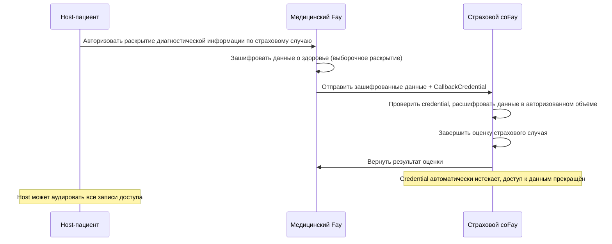
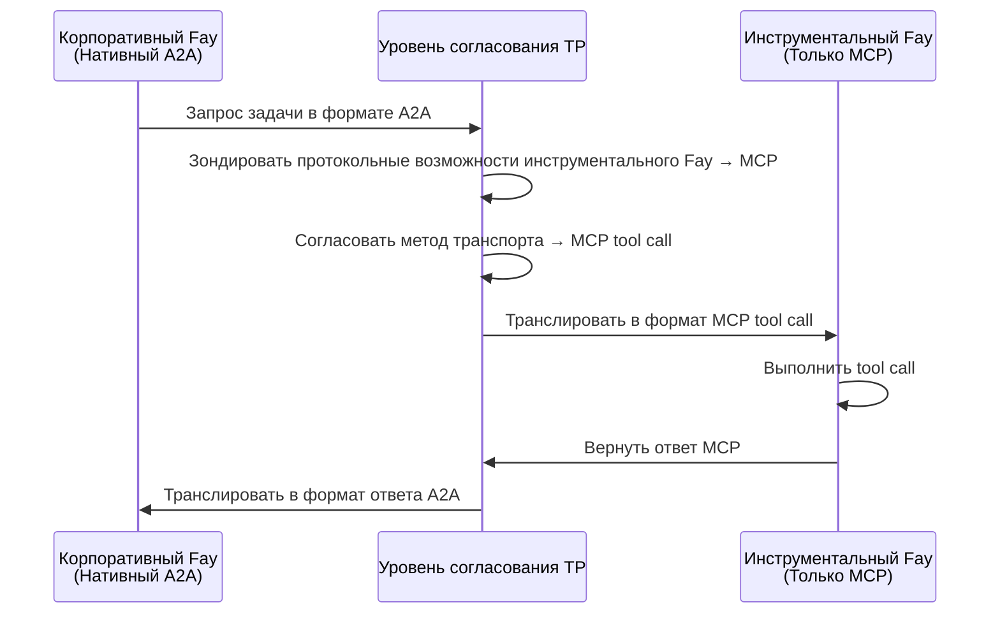
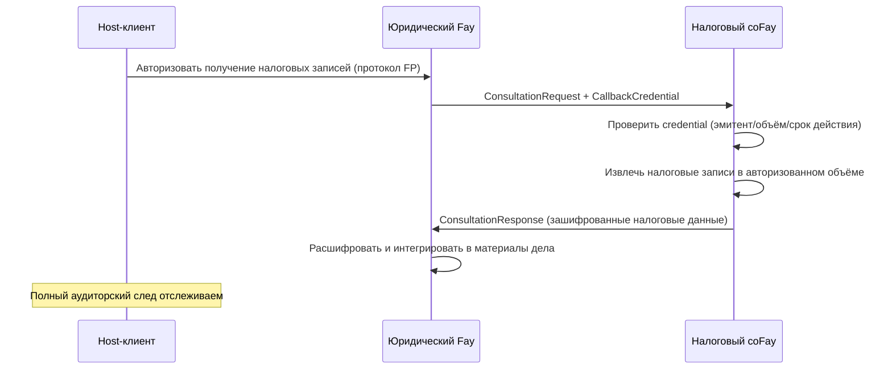
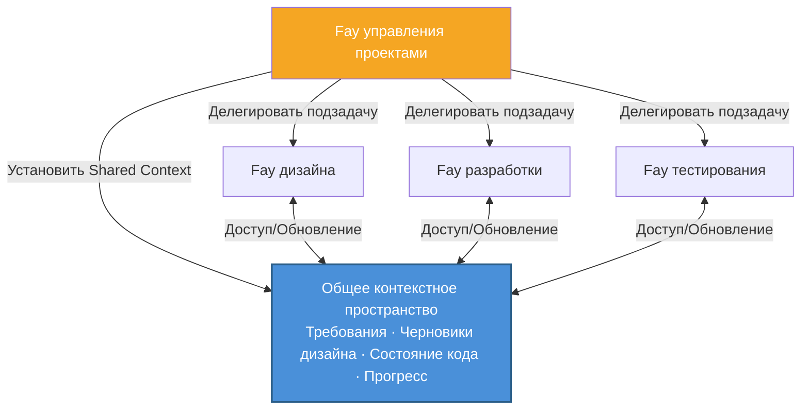
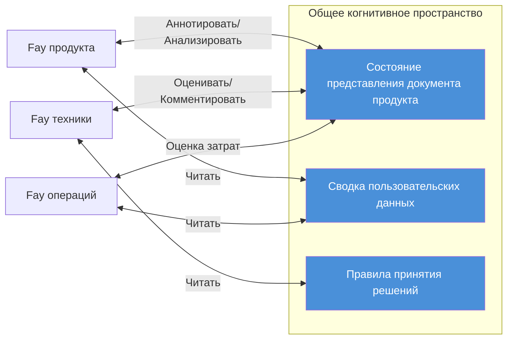

# Глава 4: Сценарии применения

Следующие пять сценариев демонстрируют практическое применение TP в различных бизнес-доменах, охватывая ключевые возможности, включая делегирование конфиденциальности, межпротокольное связывание, передачу credentials, многостороннее сотрудничество Fay и совещания с общим контекстом.

### 4.1 Консультация с делегированием конфиденциальности

**Сценарий**: Host-пациент нуждается в том, чтобы его медицинский Fay передал данные о здоровье страховому coFay для получения оценки страхового случая.

При традиционных моделях коммуникации Agent медицинский Agent должен был бы сериализовать полные медицинские записи пациента в сообщение и отправить его страховому Agent — это означает, что все данные передаются открытым текстом по сети, и получатель получает доступ к информации далеко за пределами необходимого.

При модели когнитивного обмена TP процесс принципиально иной:

1. **Авторизация Host**: Host-пациент авторизует медицинского Fay через протокол FP, явно указывая, что может быть раскрыта только диагностическая информация, относящаяся к данному страховому случаю (коды диагнозов, даты лечения, разбивка расходов), в то время как другие медицинские записи (записи психологических консультаций, результаты генетических тестов) остаются зашифрованными и невидимыми
2. **Выборочное раскрытие**: Медицинский Fay использует механизм `SelectiveDisclosure` TP для передачи авторизованных данных в зашифрованном виде страховому coFay вместе с ограниченным по времени `CallbackCredential`
3. **Контролируемый доступ**: Страховой coFay получает доступ к авторизованным данным в ограниченном объёме через callback credential, завершая оценку страхового случая
4. **Автоматическое истечение**: После завершения оценки callback credential автоматически истекает, и страховой coFay больше не может получить доступ к каким-либо данным пациента
5. **Полный аудит**: Все записи о доступе к данным фиксируются в аудиторском следе, и Host-пациент может просмотреть их в любое время

Этот сценарий воплощает принцип TP **суверенитета Host над конфиденциальностью** — объём раскрытия данных всегда определяется Host, а не собственным суждением Fay.

### 4.2 Межпротокольная трансляция

**Сценарий**: Корпоративный Fay, нативно поддерживающий A2A, должен вызвать специализированный инструментальный Fay, поддерживающий только MCP tool calls.

В мире без TP эти два Fay просто не могут общаться напрямую — они «говорят» на совершенно разных протокольных языках. Запросы A2A JSON-RPC корпоративного Fay не могут быть разобраны инструментальным Fay; интерфейс MCP tool call инструментального Fay не может быть вызван корпоративным Fay. Разработчикам пришлось бы писать выделенные адаптеры для каждой пары комбинаций протоколов.

Механизм согласования и трансляции протоколов TP фундаментально меняет эту ситуацию:

1. **Зондирование возможностей**: Корпоративный Fay инициирует запрос на коммуникацию через TP, и уровень согласования TP автоматически зондирует протокольные возможности инструментального Fay, обнаруживая, что он поддерживает только MCP tool calls
2. **Согласование контракта**: TP согласовывает метод транспорта между обеими сторонами, определяя MCP tool call как базовый транспортный канал
3. **Семантическое отображение**: TP отображает Intent, Parameters и Context из запроса задачи в формате A2A корпоративного Fay в формат ввода MCP tool call
4. **Прозрачная трансляция**: Инструментальный Fay получает стандартный запрос MCP tool call, совершенно не подозревая о существовании TP; после выполнения TP транслирует ответ MCP обратно в формат A2A для корпоративного Fay

Ключевая ценность этого сценария: **различия протоколов полностью прозрачны для бизнес-логики верхнего уровня**. Корпоративному Fay не нужно знать, какой протокол использует контрагент, и не нужно писать код адаптера для каждого протокола. Адаптивный слой трансляции TP позволяет Fay в гетерогенной протокольной экосистеме беспрепятственно сотрудничать.

### 4.3 Консультация с передачей credentials

**Сценарий**: Юридический Fay (представляющий Host-клиента) инициирует консультацию с налоговым coFay, нуждаясь в получении налоговых записей клиента для поддержки подготовки к судебному разбирательству.

Этот сценарий аналогичен реальной ситуации, когда адвокат запрашивает материалы у налогового органа от имени клиента — адвокат должен предъявить доверенность клиента, налоговый орган предоставляет материалы в ограниченном объёме после проверки авторизации, и весь процесс документируется.

Режим консультации (Consultation) и механизм callback credential (CallbackCredential) TP точно воспроизводят этот реальный процесс:

1. **Делегирование Host**: Host-клиент авторизует юридического Fay через протокол FP, разрешая ему получать налоговые записи от его имени
2. **Инициация консультации**: Юридический Fay отправляет `ConsultationRequest` налоговому coFay, сопровождаемый ограниченным по времени `CallbackCredential`, который авторизует налоговый coFay на доступ к финансовым данным клиента в ограниченном объёме
3. **Проверка credential**: Налоговый coFay проверяет действительность callback credential — проверяя идентичность эмитента, объём авторизации и срок действия
4. **Контролируемое извлечение данных**: Налоговый coFay получает доступ к налоговым записям клиента через credential, но только в рамках годов и типов налогов, указанных в `scope` credential
5. **Сквозное шифрование**: Весь процесс передачи данных использует механизм `EncryptedPayload` TP для сквозного шифрования
6. **Аудиторский след**: Все записи об использовании credentials и доступе к данным записываются в журнал аудита, и Host-клиент может просмотреть их в любое время

Этот сценарий демонстрирует, как TP оцифровывает реальный паттерн «делегат ведёт дела по доверенности» — credentials ограничены по времени, имеют определённый объём, отзываемы и аудируемы, полностью защищая интересы Host.

### 4.4 Многосторонняя коллаборативная задача Fay

**Сценарий**: Fay управления проектами разбивает сложный проект разработки продукта на несколько подзадач, делегируя их соответственно Fay дизайна, Fay разработки и Fay тестирования.

При модели Opaque Execution A2A Fay управления проектами должен сериализовать и передавать полный контекст проекта (документы требований, черновики дизайна, состояние репозитория кода, отчёты о прогрессе) при каждом взаимодействии с Fay подзадачи. По мере продвижения проекта контекст непрерывно расширяется, объём передачи информации растёт с каждым взаимодействием, и детальная информация неизбежно теряется при повторной сериализации и десериализации.

Механизм Shared Context TP фундаментально трансформирует эту модель сотрудничества:

1. **Общий контекст проекта**: Fay управления проектами устанавливает общее контекстное пространство, включая ключевые когнитивные ресурсы проекта — структурированные представления документов требований, состояния версий черновиков дизайна, сводки изменений репозитория кода, а также прогресс и зависимости каждой подзадачи
2. **Декомпозиция и делегирование задач**: Fay управления проектами использует `TaskMessage` TP для разбиения проекта на подзадачи, делегируя их Fay дизайна (UI/UX дизайн), Fay разработки (реализация кода) и Fay тестирования (верификация качества)
3. **Наследование контекста**: Каждая подзадача автоматически наследует релевантный контекст из общего пространства, устраняя необходимость для Fay управления проектами повторно передавать полную информацию о проекте каждый раз
4. **Синхронизация в реальном времени**: Когда Fay дизайна обновляет черновик дизайна, Fay разработки и Fay тестирования немедленно «воспринимают» изменение через общий контекст, не дожидаясь пересылки уведомления от Fay управления проектами
5. **Управление зависимостями**: Зависимости между подзадачами (такие как «разработка зависит от завершения дизайна», «тестирование зависит от завершения разработки») автоматически управляются через механизм `SubtaskReference` TP

Этот сценарий демонстрирует ключевое преимущество Shared Context перед передачей сообщений: **контекст проекта «живой»** — он непрерывно обновляется по мере продвижения проекта, и все участники всегда сотрудничают на основе одной и той же актуальной когнитивной базы, а не полагаются на устаревшие снимки сообщений.

### 4.5 Совещание с общим контекстом

**Сценарий**: Fay продукта, Fay техники и Fay операций должны совместно обсудить новое предложение по продукту, при этом все три стороны сотрудничают в реальном времени над одним и тем же документом продукта.

В человеческом мире удалённые совещания требуют координации множества инструментов — демонстрация экрана, мгновенные сообщения, совместная работа с документами — и информация неизбежно подвергается задержкам и потерям при переходе между различными медиа. В мире Agent использование традиционных моделей передачи сообщений делает вещи ещё сложнее — каждый Agent поддерживает свою копию документа, синхронизирует изменения через сообщения, и разрешение конфликтов и согласованность состояния становятся огромными инженерными вызовами.

Механизм Shared Context TP делает многостороннее сотрудничество Fay в реальном времени естественным и эффективным:

1. **Установление общего когнитивного пространства**: Три Fay устанавливают сессию общего контекста через TP, включая следующие когнитивные ресурсы в общее пространство:
   - Структурированное состояние представления документа продукта (главы, аннотации, комментарии)
   - Релевантные сводки пользовательских данных (анонимизированная статистика использования, анализ обратной связи)
   - Правила принятия решений (матрица приоритетов продукта, критерии оценки технической осуществимости, модель операционных затрат)

2. **Когнитивная синхронизация в реальном времени**: Когда Fay продукта аннотирует документ «этот раздел требует переработки», Fay техники и Fay операций немедленно «видят» расположение и содержание аннотации — не через уведомления сообщениями, а через прямой доступ к общему контекстному пространству. Это конкретная реализация метафоры «телепатии»

3. **Многоперспективное сотрудничество**: Три Fay анализируют и аннотируют один и тот же документ со своих профессиональных перспектив — Fay продукта фокусируется на пользовательском опыте, Fay техники оценивает сложность реализации, а Fay операций оценивает операционные затраты. Все аннотации и результаты анализа видны в реальном времени в общем пространстве

4. **Запись решений**: Все обсуждения, аннотации и решения во время совещания записываются в общем контексте, формируя отслеживаемую цепочку решений

Этот сценарий является наиболее полным воплощением философии «телепатии» TP — несколько Fay больше не нуждаются в «передаче сообщений» друг другу, а «думают вместе» в общем когнитивном пространстве. Передача информации трансформируется из последовательного процесса «кодировать → передать → декодировать» в «прямое восприятие в общем пространстве».
