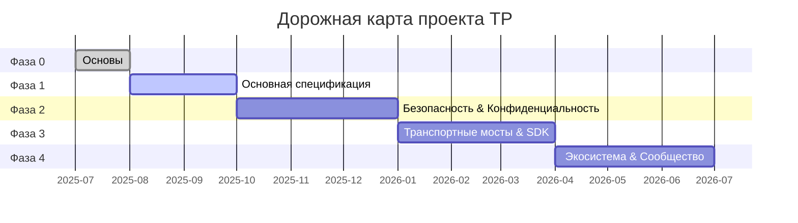

# Глава 7: Результаты и дорожная карта

### 7.1 Трёхуровневый каталог результатов

Все результаты проекта TP организованы в три уровня приоритета:

#### Уровень 1 — Основные результаты (Must-Have)

| Результат | Целевая фаза | Зависимости |
|--------|---------|------|
| Документ Blueprint (zh-CN + en) | Фаза 0 | Нет |
| Черновик спецификации протокола TP | Фаза 1 | Документ Blueprint |
| Определения JSON Schema (MessageEnvelope, Intent, Capability, Task, Context, SharedContext) | Фаза 1 | Спецификация протокола |
| Определения типов TypeScript | Фаза 1 | JSON Schema |
| Эталонный SDK на TypeScript | Фаза 3 | Schema + Спецификация протокола |

#### Уровень 2 — Важные результаты (Should-Have)

| Результат | Целевая фаза | Зависимости |
|--------|---------|------|
| Человекочитаемая документация в формате MDX | Фаза 1 | JSON Schema |
| Многоязычные документы протокола (9 языков) | Фаза 4 | Документы на исходном языке |
| Руководство разработчика (Quick Start + Обзор архитектуры) | Фаза 1 | Документ Blueprint |
| Руководство по использованию SDK и справочник API | Фаза 3 | SDK TypeScript |

#### Уровень 3 — Дополнительные результаты (Nice-to-Have)

| Результат | Целевая фаза | Зависимости |
|--------|---------|------|
| Руководство по вкладу в сообщество и документы управления | Фаза 0 | Нет |
| Набор тестов соответствия протоколу | Фаза 4 | SDK + Schema |
| Примеры проектов приложений | Фаза 4 | SDK |

### 7.2 Дорожная карта

#### Фаза 0: Основы

Основная цель Фазы 0 — установить инфраструктуру проекта и нарратив верхнего уровня. Ключевые вехи включают: публикацию документа Blueprint на китайском и английском языках, установление ключевого позиционирования TP как протокола когнитивного обмена; финализацию структуры каталогов проекта и соглашений об именовании; создание файлов управления open source, включая README.md, CONTRIBUTING.md и CODE_OF_CONDUCT.md; установление соглашений по управлению версиями Schema (именование на основе дат, синхронизация трёх файлов, правила обратной совместимости); пометку более ранней спецификации agent-to-agent-protocol как устаревшей, официально заменённой спецификацией telepathy-protocol. Критерии выхода из Фазы 0 — двуязычная публикация документа Blueprint и готовность инфраструктуры репозитория.

#### Фаза 1: Основная спецификация

Фаза 1 фокусируется на основной технической спецификации TP. Ключевые вехи включают: публикацию черновика спецификации протокола TP, определение семантики общего контекста и транспортно-агностичного формата конверта сообщений; поставку определений JSON Schema и TypeScript, покрывающих основные структуры данных, включая MessageEnvelope, Intent, Capability, Task, Context и SharedContext; поставку человекочитаемой документации в формате MDX; публикацию руководства быстрого старта для разработчиков. Критерии выхода из Фазы 1 — набор из трёх файлов основного Schema (.json / .ts / .mdx) проходит валидацию согласованности, и черновик спецификации завершает рецензирование.

#### Фаза 2: Безопасность, конфиденциальность и Shared Context

Фаза 2 углубляется в область безопасности и конфиденциальности. Ключевые вехи включают: поставку определений Schema, связанных с шифрованием и credentials (EncryptedPayload, CallbackCredential); публикацию спецификации безопасности, охватывающей сквозное шифрование, механизмы аутентификации и авторизацию, делегированную Host; определение полного управления жизненным циклом Shared Context — создание, определение области, истечение и отзыв; установление механизма управления Technical Steering Committee (TSC). Критерии выхода из Фазы 2 — Schema безопасности проходит валидацию согласованности и устав TSC официально опубликован.

#### Фаза 3: Транспортные мосты и SDK

Фаза 3 трансформирует спецификацию протокола в исполняемый код. Ключевые вехи включают: поставку эталонного SDK на TypeScript, реализующего основную логику обработки сообщений; реализацию интерфейсов протокольных мостов для A2A и MCP, валидирующих транспортный агностицизм и возможности согласования протоколов; поставку интерфейсов мостов для родственных протоколов (ICP, SSP, CAP, DTP, FP); публикацию документации SDK и примеров использования. Критерии выхода из Фазы 3 — SDK проходит все модульные тесты и тесты на основе свойств, а интерфейсы мостов проходят интеграционные тесты.

#### Фаза 4: Экосистема и сообщество

Фаза 4 расширяет TP от технического проекта до открытой экосистемы. Ключевые вехи включают: завершение перевода многоязычной документации на все 9 языков; поставку набора тестов соответствия протоколу для верификации соответствия сторонних реализаций; публикацию примеров проектов приложений, демонстрирующих общий контекст в реальных бизнес-сценариях; установление процесса RFC для обеспечения управления, движимого сообществом, для продолжающейся эволюции протокола. Критерии выхода из Фазы 4 — панель статуса переводов показывает, что все переводы документов Уровня 1 и Уровня 2 завершены.

