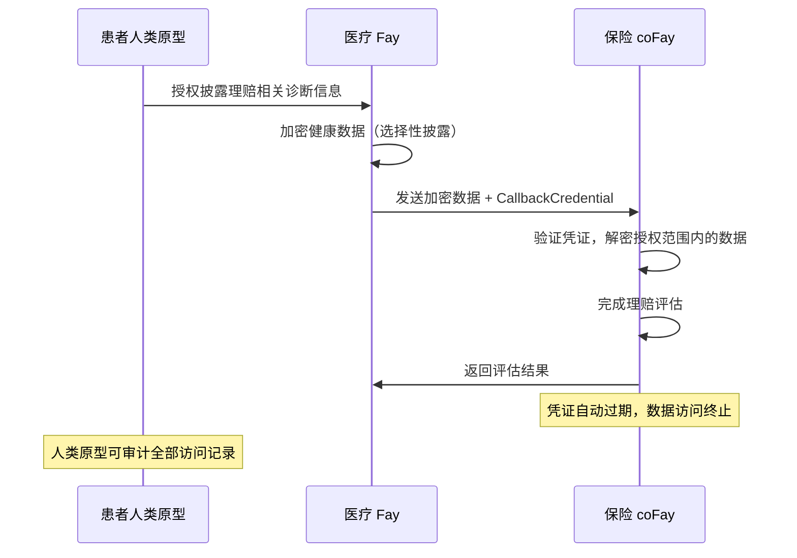
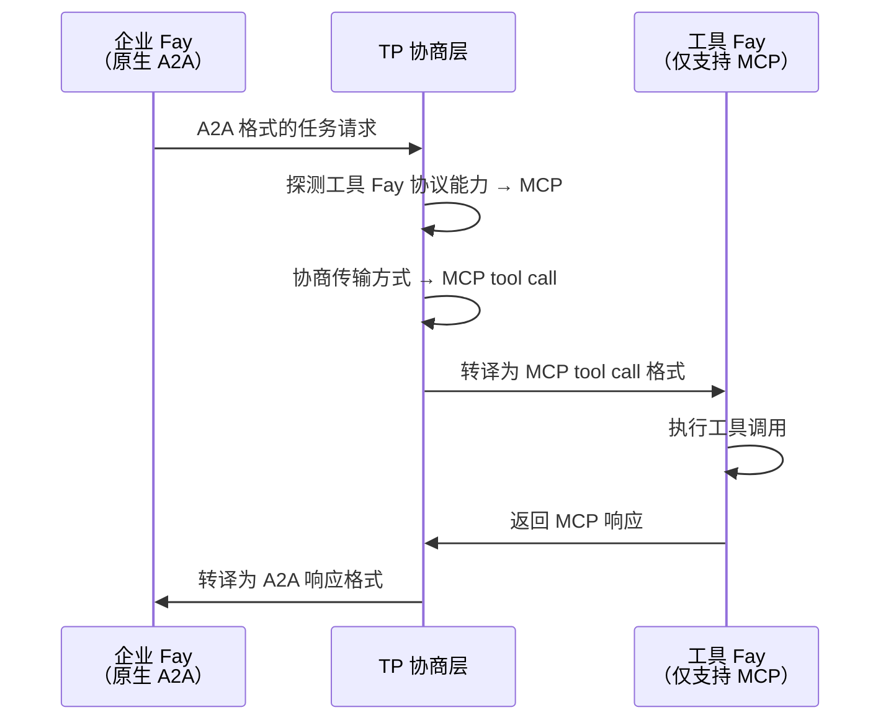
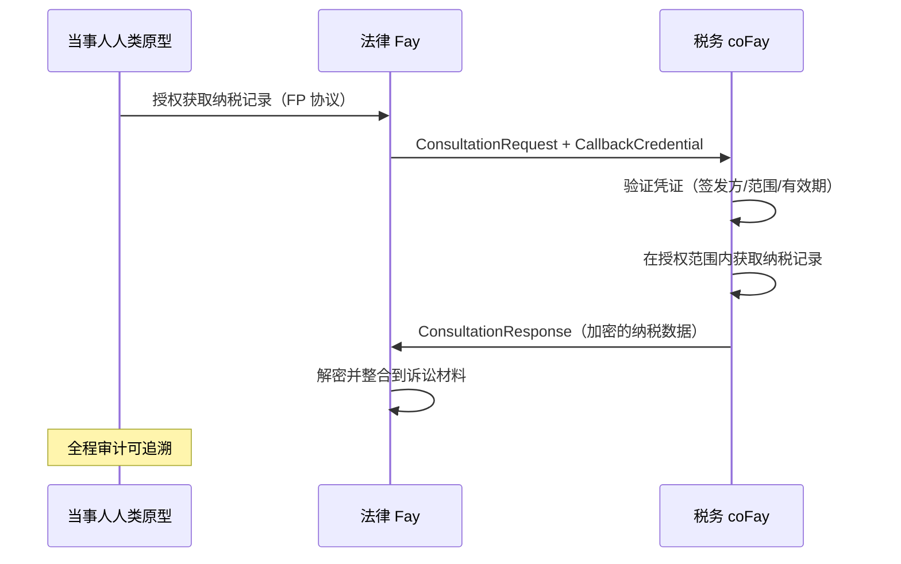
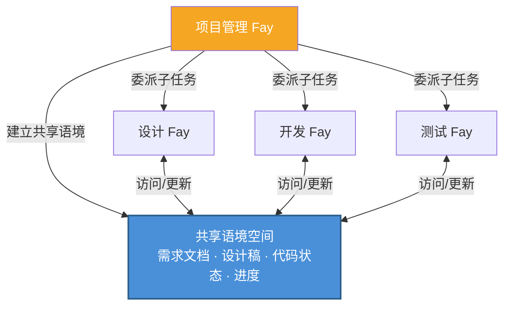
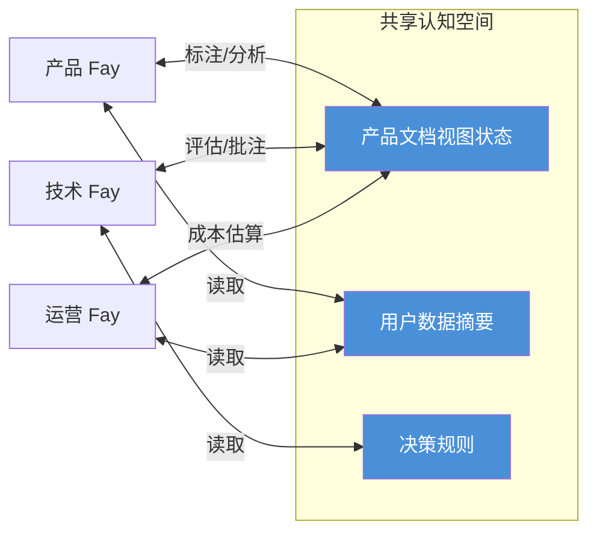

# 第四章 应用场景

以下五个场景展示了 TP 在不同业务领域中的实际应用，涵盖隐私委托、跨协议桥接、凭证传递、多 Fay 协作和共享语境会议等核心能力。

### 4.1 隐私委托咨询

**场景**：患者人类原型需要通过其医疗 Fay 向保险 coFay 提交健康数据以获取理赔评估。

在传统的 Agent 通信模式下，医疗 Agent 需要将患者的完整健康记录序列化为消息发送给保险 Agent——这意味着所有数据以明文形式在网络上传输，且接收方获得了远超必要范围的信息访问权限。

在 TP 的认知共享模式下，流程截然不同：

1. **人类原型授权**：患者人类原型通过 FP 协议向医疗 Fay 授权，明确指定仅允许披露与本次理赔相关的诊断信息（如诊断编码、治疗日期、费用明细），其余健康记录（如心理咨询记录、基因检测结果）保持加密不可见
2. **选择性披露**：医疗 Fay 使用 TP 的 `SelectiveDisclosure` 机制，将授权范围内的数据加密传输给保险 coFay，同时附带一个有时效性的 `CallbackCredential`
3. **受控访问**：保险 coFay 通过回调凭证在限定范围内访问授权数据，完成理赔评估
4. **自动过期**：评估完成后，回调凭证自动过期，保险 coFay 无法再访问任何患者数据
5. **全程审计**：所有数据访问记录均被记录在审计日志中，患者人类原型可随时查阅

这一场景体现了 TP 的**人类原型主权隐私**原则——数据的披露范围始终由人类原型决定，而非由 Fay 自行判断。

### 4.2 跨协议翻译

**场景**：一个原生支持 A2A 的企业 Fay 需要调用一个仅支持 MCP tool call 的专业工具 Fay。

在没有 TP 的世界中，这两个 Fay 根本无法直接通信——它们"说"的是完全不同的协议语言。企业 Fay 发出的 A2A JSON-RPC 请求，工具 Fay 无法解析；工具 Fay 暴露的 MCP tool call 接口，企业 Fay 也无法调用。开发者不得不为每一对协议组合编写专用的适配器。

TP 的协议协商与转译机制彻底改变了这一局面：

1. **能力探测**：企业 Fay 通过 TP 发起通信请求，TP 协商层自动探测工具 Fay 的协议能力，发现其仅支持 MCP tool call
2. **合同协商**：TP 在双方之间协商传输方式，确定使用 MCP tool call 作为底层传输通道
3. **语义映射**：TP 将企业 Fay 发出的 A2A 格式任务请求中的意图（Intent）、参数（Parameters）和上下文（Context）映射为 MCP tool call 的输入格式
4. **透明转译**：工具 Fay 收到的是标准的 MCP tool call 请求，完全无感知 TP 的存在；执行完成后，TP 将 MCP 响应转译回 A2A 格式返回给企业 Fay

这一场景的关键价值在于：**协议差异对上层业务逻辑完全透明**。企业 Fay 不需要知道对方使用什么协议，也不需要为每种协议编写适配代码。TP 的自适应转译层让异构协议生态中的 Fay 能够无缝协作。

### 4.3 凭证传递咨询

**场景**：法律 Fay（代表当事人人类原型）向税务 coFay 发起咨询，需要获取当事人的纳税记录以支持诉讼准备。

这一场景类似于现实世界中律师代表当事人向税务机关调取资料——律师需要出示当事人的授权委托书，税务机关在核实授权后提供限定范围内的资料，且整个过程有据可查。

TP 的咨询模式（Consultation）和回调凭证机制（CallbackCredential）精确地映射了这一现实流程：

1. **人类原型委托**：当事人人类原型通过 FP 协议向法律 Fay 授权，允许其代为获取纳税记录
2. **咨询发起**：法律 Fay 向税务 coFay 发送 `ConsultationRequest`，附带一个有时效性的 `CallbackCredential`，授权税务 coFay 在限定范围内访问当事人的财务数据
3. **凭证验证**：税务 coFay 验证回调凭证的有效性——检查签发方身份、授权范围、有效期
4. **受控数据获取**：税务 coFay 通过凭证访问当事人的纳税记录，但仅限于凭证 `scope` 中指定的年度和税种
5. **端到端加密**：整个数据传输过程使用 TP 的 `EncryptedPayload` 机制进行端到端加密
6. **审计追踪**：所有凭证使用和数据访问记录均被写入审计日志，当事人人类原型可随时查阅

这一场景展示了 TP 如何将现实世界中"代理人持授权书办事"的模式数字化——凭证有时效、有范围、可撤销、可审计，完整地保护了人类原型的权益。

### 4.4 多 Fay 协作任务

**场景**：项目管理 Fay 将一个复杂的产品开发项目分解为多个子任务，分别委派给设计 Fay、开发 Fay 和测试 Fay。

在 A2A 的 Opaque Execution 模式下，项目管理 Fay 每次与子任务 Fay 交互时，都需要将完整的项目上下文（需求文档、设计稿、代码仓库状态、进度报告）序列化传输。随着项目推进，上下文不断膨胀，每一轮交互的信息传输量越来越大，且在反复的序列化与反序列化过程中，细节信息不可避免地产生损耗。

TP 的共享语境机制从根本上改变了这一协作模式：

1. **共享项目上下文**：项目管理 Fay 建立一个共享语境空间，将项目的核心认知资源纳入其中——需求文档的结构化表示、设计稿的版本状态、代码仓库的变更摘要、各子任务的进度和依赖关系
2. **任务分解与委派**：项目管理 Fay 通过 TP 的 `TaskMessage` 将项目分解为子任务，分别委派给设计 Fay（UI/UX 设计）、开发 Fay（代码实现）和测试 Fay（质量验证）
3. **上下文继承**：每个子任务自动继承共享语境中的相关上下文，无需项目管理 Fay 每次都重复传递完整的项目信息
4. **实时同步**：当设计 Fay 更新了设计稿，开发 Fay 和测试 Fay 通过共享语境立即"感知"到变更，无需等待项目管理 Fay 转发通知
5. **依赖管理**：子任务之间的依赖关系（如"开发依赖设计完成"、"测试依赖开发完成"）通过 TP 的 `SubtaskReference` 机制自动管理

这一场景体现了共享语境相对于消息传递的核心优势：**项目上下文是"活的"**——它随着项目推进而持续更新，所有参与方始终基于同一份最新的认知基础进行协作，而非依赖滞后的消息快照。

### 4.5 共享语境会议

**场景**：产品 Fay、技术 Fay 和运营 Fay 需要共同讨论一个新产品方案，三方需要在同一份产品文档上进行实时协作。

在人类世界中，远程会议需要屏幕共享、即时通讯、文档协作等多种工具的配合，信息在不同媒介之间传递时不可避免地产生延迟和损耗。在 Agent 世界中，如果使用传统的消息传递模式，情况更加复杂——每个 Agent 维护自己的文档副本，通过消息同步变更，冲突解决和状态一致性成为巨大的工程挑战。

TP 的共享语境机制让多 Fay 实时协作变得自然而高效：

1. **建立共享认知空间**：三个 Fay 通过 TP 建立一个共享语境会话，将以下认知资源纳入共享空间：
   - 产品文档的结构化视图状态（章节、标注、批注）
   - 相关的用户数据摘要（脱敏后的使用统计、反馈分析）
   - 决策规则（产品优先级矩阵、技术可行性评估标准、运营成本模型）

2. **实时认知同步**：当产品 Fay 在文档上标注"这部分需要重新设计"时，技术 Fay 和运营 Fay 立即"看到"标注的位置和内容——不是通过消息通知，而是通过共享语境空间的直接访问。这正是"心灵感应"隐喻的具体实现

3. **多视角协作**：三个 Fay 从各自的专业视角对同一份文档进行分析和标注——产品 Fay 关注用户体验，技术 Fay 评估实现复杂度，运营 Fay 估算运营成本。所有标注和分析结果在共享空间中实时可见

4. **决策记录**：会议过程中的所有讨论、标注和决策均被记录在共享语境中，形成可追溯的决策链

这一场景是 TP "心灵感应"理念的最完整体现——多个 Fay 不再需要通过消息"传话"，而是在共享的认知空间中"共同思考"。信息的传递从"编码 → 传输 → 解码"的串行流程，变为"共享空间中的直接感知"。
