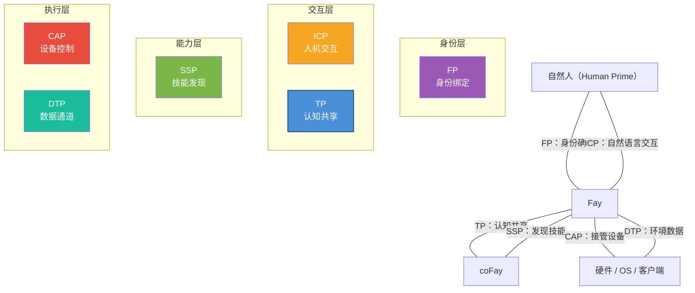

# 第五章 生态定位

### 5.1 iFay 六协议关系图

TP 并非孤立存在，它是 iFay 生态体系中六大协议之一。每个协议各司其职，共同构成了一个完整的 AI 代理通信框架。

| 协议 | 全称 | 核心职责 | 面向领域 |
|------|------|---------|---------|
| **ICP** | Interactive Conversation Protocol | 人 ↔ Fay 的交互中间语言 | 人机接触面 |
| **TP** | Telepathy Protocol | Fay ↔ Fay 的认知共享 | Fay 间协作 |
| **CAP** | Control Authority Protocol | Fay → 硬件/客户端的接管 | 设备控制 |
| **SSP** | Skill Sharing Protocol | Fay 的技能发现 | 能力市场 |
| **DTP** | Data Tunnel Protocol | 硬件/OS → Fay 的数据通道 | 环境感知 |
| **FP** | Faying Protocol | 自然人 ↔ iFay 的身份绑定 | 身份确权 |

六大协议的交互关系如下图所示：

**协议间的协作关系：**

- **FP → TP**：FP 确立人类原型与 Fay 的身份绑定关系，TP 在通信中引用 FP 授权来验证人类原型委托的合法性。例如，当患者的 iFay 向医院 coFay 发起挂号请求时，医院 coFay 通过 FP 授权引用确认"这个 iFay 确实被该患者授权代为挂号"。
- **ICP → TP**：人类原型通过 ICP 向自己的 Fay 下达指令，Fay 通过 TP 将任务委派给其他 Fay 执行。例如，用户对自己的 iFay 说"帮我预订下周去东京的机票"（ICP 交互），iFay 随后通过 TP 联系航空公司的 coFay 完成预订。
- **SSP ↔ TP**：Fay 通过 SSP 发现其他 Fay 的可用技能，然后通过 TP 发起具体的协作请求。例如，iFay 通过 SSP 发现了一个擅长税务筹划的 coFay，然后通过 TP 建立共享语境，将人类原型的财务数据（在授权范围内）挂载到共享空间中进行咨询。
- **TP → CAP**：当 TP 协作任务需要操控硬件或客户端时，Fay 通过 CAP 凭证获取设备控制权。例如，一个人工控制的无人机需要交接给某个 Fay 接管——地面操作员的 iFay 通过 TP 与无人机上的 Fay 协商控制权交接，然后通过 CAP 协议完成实际的控制权转移。
- **DTP → TP**：硬件和操作系统通过 DTP 向 Fay 推送环境数据，Fay 将这些数据纳入 TP 共享语境中供协作方使用。例如，智能家居系统通过 DTP 向 iFay 推送室内温度、湿度和空气质量数据，iFay 将这些环境数据挂载到与健康管理 coFay 的共享语境中，辅助健康建议的生成。

### 5.2 与 MCP/A2A 的对比

TP 与 MCP、A2A 并非竞争关系，而是互补关系——TP 可以运行在 MCP 或 A2A 之上。以下对比表从多个维度展示三者的定位差异：

| 维度 | MCP | A2A | TP |
|------|-----|-----|-----|
| **发布方** | Anthropic | Google | iFay 开源社区 |
| **发布时间** | 2024 | 2025 | 2025 |
| **核心定位** | AI 模型与外部工具的连接协议 | Agent 之间的任务委派与协作协议 | Fay 之间的认知共享协议 |
| **通信方向** | 单向（AI → 工具） | 双向（Agent ↔ Agent） | 双向 + 共享空间（Fay ↔ 共享语境 ↔ Fay） |
| **身份归属** | 无（工具无归属概念） | 无（Agent 是自治服务节点） | 有（每个 Fay 代表人类原型行事） |
| **隐私保护** | 无系统性机制（明文参数传递） | 无系统性机制 | 端到端加密 + 选择性披露 + 人类原型授权 |
| **内部状态共享** | 不适用（工具是无状态函数） | 不共享（Opaque Execution） | 在授权范围内选择性共享（Shared Context） |
| **传输方式** | 绑定 tool call（JSON-RPC） | 绑定 JSON-RPC over HTTP | 传输无关（可通过 A2A/MCP/API/Prompt 传递） |
| **协议协商** | 无 | 无 | 自适应协商与转译 |
| **适用场景** | AI 调用外部工具和数据源 | 松耦合的 Agent 服务编排 | 深度协作、隐私委托、认知融合 |

三者的关系可以用一句话概括：**MCP 让 AI 能用工具，A2A 让 Agent 能传话，TP 让 Fay 能心灵相通**。

TP 的传输无关性意味着它可以"骑"在 MCP 或 A2A 之上——当底层使用 A2A 传输时，TP 为其增加了身份归属、隐私保护和共享语境能力；当底层使用 MCP 传输时，TP 将单向的工具调用升级为双向的认知共享。
