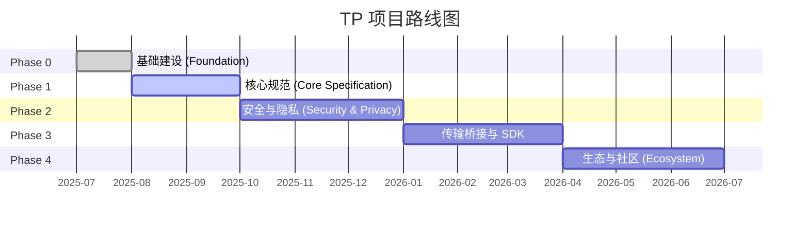

# 第七章 交付物与路线图

### 7.1 三级交付物清单

TP 项目的所有交付物按优先级分为三个层级：

#### Tier 1 — 核心交付物（Must-Have）

| 交付物 | 目标阶段 | 依赖 |
|--------|---------|------|
| 蓝图文档（zh-CN + en） | Phase 0 | 无 |
| TP 协议规范草案 | Phase 1 | 蓝图文档 |
| JSON Schema 定义（MessageEnvelope, Intent, Capability, Task, Context, SharedContext） | Phase 1 | 协议规范 |
| TypeScript 类型定义 | Phase 1 | JSON Schema |
| TypeScript 参考 SDK | Phase 3 | Schema + 协议规范 |

#### Tier 2 — 重要交付物（Should-Have）

| 交付物 | 目标阶段 | 依赖 |
|--------|---------|------|
| MDX 人类可读文档 | Phase 1 | JSON Schema |
| 多语言协议文档（9 种语言） | Phase 4 | 源语言文档 |
| 开发者指南（快速入门 + 架构概览） | Phase 1 | 蓝图文档 |
| SDK 使用指南与 API 参考 | Phase 3 | TypeScript SDK |

#### Tier 3 — 增强交付物（Nice-to-Have）

| 交付物 | 目标阶段 | 依赖 |
|--------|---------|------|
| 社区贡献指南与治理文档 | Phase 0 | 无 |
| 协议一致性测试套件 | Phase 4 | SDK + Schema |
| 示例应用项目 | Phase 4 | SDK |

### 7.2 路线图

#### Phase 0: Foundation（基础建设）

Phase 0 的核心目标是建立项目的基础设施和顶层叙事。主要里程碑包括：发布蓝图文档的中英双语版本，确立 TP 作为认知共享协议的核心定位；确定项目目录结构和命名规范；创建 README.md、CONTRIBUTING.md、CODE_OF_CONDUCT.md 等开源治理文件；建立 Schema 版本管理规范（日期命名、三文件同步、向后兼容规则）；将早期的 agent-to-agent-protocol spec 标记为 deprecated，正式由 telepathy-protocol spec 取代。Phase 0 的准出标准是蓝图文档双语发布且仓库基础设施就绪。

#### Phase 1: Core Specification（核心规范）

Phase 1 聚焦于 TP 协议的核心技术规范。主要里程碑包括：发布 TP 协议规范草案，定义共享语境语义和传输无关的消息信封格式；交付 JSON Schema 和 TypeScript 类型定义，覆盖 MessageEnvelope、Intent、Capability、Task、Context、SharedContext 等核心数据结构；交付 MDX 格式的人类可读文档；发布开发者快速入门指南。Phase 1 的准出标准是核心 Schema 三文件（.json / .ts / .mdx）通过一致性校验，且规范草案完成 review。

#### Phase 2: Security, Privacy and Shared Context（安全、隐私与共享语境）

Phase 2 深入安全和隐私领域。主要里程碑包括：交付加密和凭证相关的 Schema 定义（EncryptedPayload、CallbackCredential）；发布安全规范，涵盖端到端加密、认证机制和人类原型委托授权；定义共享语境的完整生命周期管理——创建、范围界定、过期和撤销；建立 Technical Steering Committee（TSC）治理机制。Phase 2 的准出标准是安全 Schema 通过一致性校验，且 TSC 章程正式发布。

#### Phase 3: Transport Bridges and SDK（传输桥接与 SDK）

Phase 3 将协议规范转化为可运行的代码。主要里程碑包括：交付 TypeScript 参考 SDK，实现核心消息处理逻辑；实现 A2A 和 MCP 的协议桥接接口，验证传输无关性和协议协商能力；交付姊妹协议（ICP、SSP、CAP、DTP、FP）的桥接接口；发布 SDK 文档和使用示例。Phase 3 的准出标准是 SDK 通过所有单元测试和属性测试，桥接接口通过集成测试。

#### Phase 4: Ecosystem and Community（生态与社区）

Phase 4 将 TP 从技术项目扩展为开放生态。主要里程碑包括：完成 9 种语言的多语言文档翻译；交付协议一致性测试套件，供第三方实现验证合规性；发布示例应用项目，展示共享语境在实际业务场景中的应用；建立 RFC 流程，为协议的持续演进提供社区驱动的治理机制。Phase 4 的准出标准是翻译状态仪表盘显示所有 Tier 1 和 Tier 2 文档翻译完成。

