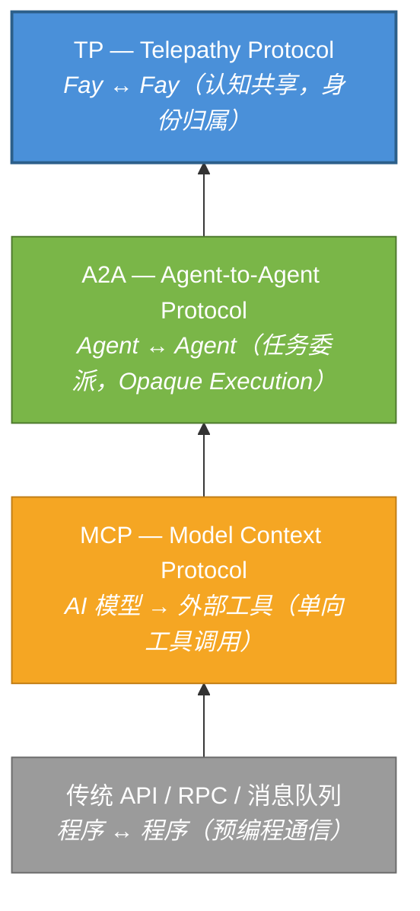
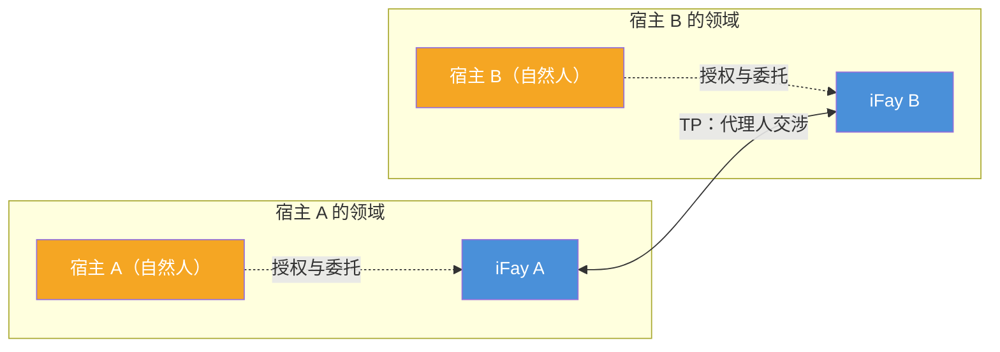

# 第一章 为什么需要 TP

### 1.1 通信协议层次分析

在过去数十年的软件工程实践中，通信协议的演进始终围绕一个核心命题展开：**如何让两个计算实体更高效地交换信息**。随着 AI Agent 生态的崛起，这一命题正在经历根本性的范式转移。

#### 传统 API / RPC / 消息队列：程序与程序的预编程通信

传统通信协议——无论是 RESTful API、gRPC 还是消息队列（如 Kafka、RabbitMQ）——解决的是**程序与程序之间的预编程通信**问题。其核心特征在于：调用方在编码阶段就已确定调用目标、调用方式和传递参数。接口契约（Interface Contract）在部署前即已固化，运行时的灵活性极为有限。

这种模式在确定性系统中运作良好，但面对 AI Agent 的动态性和自主性时，其局限性暴露无遗——Agent 需要在运行时发现能力、协商意图、动态组合服务，而非在编码时硬编码一切。

> **现实示例**：一个旅行规划 Agent 需要同时调用航班查询、酒店预订、天气预报和签证咨询等多个服务。在传统 API 模式下，开发者必须在编码时就确定每个服务的 endpoint、参数格式和调用顺序。如果用户临时改变目的地，整个调用链可能需要重新编排——而这在运行时是极其困难的。

#### MCP（Model Context Protocol）：AI 模型与外部工具的连接

2024 年，Anthropic 发布了 Model Context Protocol（MCP），旨在解决 AI 模型与外部工具之间的连接问题。MCP 的核心架构遵循 **Host → Client → Server** 模型，为 AI 提供了一套"工具箱发现机制"——模型在运行时可以动态发现可用工具、理解工具的输入输出 Schema，并发起调用。

然而，MCP 的通信方向是**单向的**。AI 模型始终是主动方，工具始终是被动方。工具不会主动向模型推送信息，也不会与其他工具协商。MCP 解决了"AI 如何使用工具"的问题，但并未触及"Agent 之间如何协作"的命题。

> **现实示例**：一个客服 Agent 通过 MCP 连接了知识库搜索工具和工单系统。当用户的问题超出客服 Agent 的能力范围时，它需要将问题转交给技术支持 Agent。但 MCP 没有提供 Agent 之间的通信机制——客服 Agent 只能调用工具，不能"找同事帮忙"。

#### A2A（Agent-to-Agent Protocol）：Agent 之间的任务委派与协作

2025 年，Google 发布了 Agent-to-Agent Protocol（A2A），将通信的视角从"模型与工具"提升到"Agent 与 Agent"。A2A 引入了三个关键概念：

- **AgentCard**（能力名片）：Agent 向外界声明自身能力的标准化描述
- **Task**（任务）：Agent 之间传递的可执行工作单元
- **Message**（消息）：任务执行过程中的信息交换载体

A2A 使得不同 Agent 能够互相发现能力、委派任务、汇报进度。但其核心设计原则——**Opaque Execution（不透明执行）**——明确规定：Agent 之间不共享内部状态、记忆或工具实现细节。每个 Agent 是一个黑盒，只暴露输入输出接口。

> **现实示例**：一个项目管理 Agent 委派代码审查任务给代码审查 Agent。在 A2A 模式下，项目管理 Agent 必须将完整的代码差异、项目规范、历史审查记录全部序列化为消息发送过去。代码审查 Agent 完成后返回结果，但项目管理 Agent 无法"看到"审查过程中的推理逻辑——它只能看到最终的审查意见。如果需要追问"为什么这段代码被标记为有风险"，又需要一轮完整的消息往返。

#### TP：在 MCP / A2A 之上的认知共享层

Telepathy Protocol（TP）并非要替代上述任何一层协议，而是在它们之上建立一个全新的**认知共享层**。

下图展示了这四层协议的递进关系：

每一层协议的出现，都是因为上一层无法回答新的问题。传统 API 无法应对 AI 的动态性，MCP 无法支撑 Agent 间协作，A2A 无法实现认知共享——而 TP 正是为填补这最后一块空白而设计的。

### 1.2 代理人交涉范式

#### 现有协议的隐含假设

MCP、A2A 以及绝大多数现有通信协议，都隐含着一个共同假设：**通信双方是独立的、无主的服务实体**。

在 MCP 的世界中，工具是一个无状态的函数——谁调用都一样，不关心调用者代表谁。在 A2A 的世界中，Agent 是一个自治的服务节点——它接受任务、执行任务、返回结果，但不关心任务背后的委托人是谁，也不需要保护任何人的利益。

这种假设在技术服务场景中是合理的。但当 AI Agent 开始代表真实的人类行事时，这种假设就不再成立了。

#### iFay 的世界观：每个 Fay 都有宿主

在 iFay 体系中，世界观截然不同。每一个 Fay（无论是代表个人的 iFay，还是承担社会公共职能的 coFay）都有明确的**宿主（Host）**。Fay 代表宿主行事，维护宿主的利益，保护宿主的隐私。

这意味着，当两个 Fay 进行通信时，本质上发生的并非两个软件服务之间的数据交换，而是**两个宿主的代理人之间的交涉**——如同律师代表当事人谈判，秘书代表老板协调事务。

这种"代理人交涉"范式对通信协议提出了全新的要求：

- **身份归属**：协议必须明确每个通信实体代表谁。例如，当一个 Fay 代表患者向医院的 coFay 预约挂号时，医院 coFay 需要确认"这个 Fay 确实被该患者授权代为预约"，而非任何人都可以冒充患者的 Fay 来操作。
- **信任边界**：代理人之间的信息共享必须在宿主授权的范围内进行。例如，患者授权其 Fay 可以向医院共享过敏史和当前症状，但不允许共享心理咨询记录——Fay 必须严格遵守这个边界。
- **隐私保护**：宿主的敏感数据在传输过程中必须受到加密保护，且支持选择性披露。例如，保险理赔时只需要披露诊断编码和费用明细，而不需要暴露完整的病历内容。
- **可审计性**：所有代理人行为必须可追溯，以便宿主事后审查。例如，宿主可以查看"我的 Fay 在过去一周内向哪些 Fay 共享了什么数据"，就像查看银行账户的交易记录一样。

### 1.3 现有协议的盲区

综合以上分析，现有协议在面对"代理人交涉"场景时，存在三个根本性的盲区：

#### 无身份归属

MCP 和 A2A 均不关心 Agent 代表谁。MCP 中的工具没有"归属"概念；A2A 中的 AgentCard 描述的是 Agent 自身的能力，而非其背后委托人的身份和授权。在 TP 的视角下，**没有身份归属的通信是不完整的**——它无法建立信任基础，也无法界定责任边界。

> **现实示例**：设想一个房产中介 Agent 代表买家与卖家的 Agent 协商价格。在 A2A 模式下，卖家 Agent 无法验证"对方真的代表一个有购买意向的买家"，也无法确认"买家是否授权了这个价格范围的谈判"。这就像一个没有出示委托书的陌生人声称代表某人来谈生意——缺乏信任基础。

#### 无隐私保护

现有协议缺乏针对宿主隐私数据的系统性保护机制。MCP 的 tool call 以明文传递参数；A2A 的 Message 同样不提供端到端加密或选择性披露能力。当 Agent 需要代表宿主传递健康记录、财务数据或身份凭证时，现有协议无法提供充分的安全保障。

> **现实示例**：一个求职者的 Fay 向招聘公司的 coFay 提交简历。求职者只想披露工作经历和技能，但不想暴露当前薪资和家庭住址。在 A2A 模式下，要么全部发送（隐私泄露），要么不发送（无法完成求职）。没有"只让对方看到我允许看到的部分"的机制。

#### 无共享认知

A2A 明确声明了 Opaque Execution 原则——Agent 之间不共享内部状态。这一设计在松耦合的服务编排场景中是合理的，但在需要深度协作的场景中却成为瓶颈。

当两个 Fay 需要就同一份文档进行讨论、共同推理一个复杂问题、或在同一个视图上协作时，"不共享内部状态"意味着每一轮交互都必须将全部相关信息序列化传输——这不仅低效，更会在反复的序列化与反序列化过程中引入信息损耗和语义歧义。

> **现实示例**：两个建筑设计 Fay 需要协作设计一栋建筑。在 A2A 模式下，Fay A 画了一版平面图，序列化为消息发给 Fay B；Fay B 提出修改意见，又把整个图纸序列化发回来；Fay A 再修改，再发……每一轮都是完整图纸的传输。而如果双方能共享同一个设计视图（就像两个建筑师站在同一张图纸前），一方画一条线，另一方立即看到——效率将提升数个量级。

TP 的诞生，正是为了填补这三个盲区。
