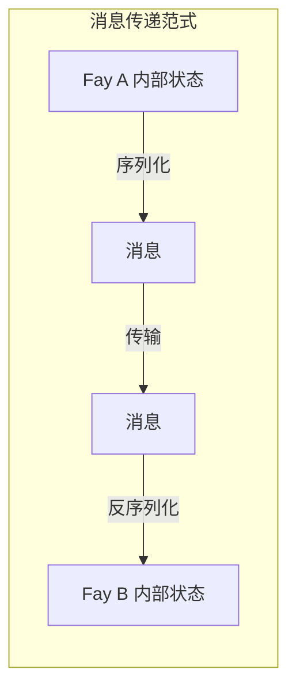
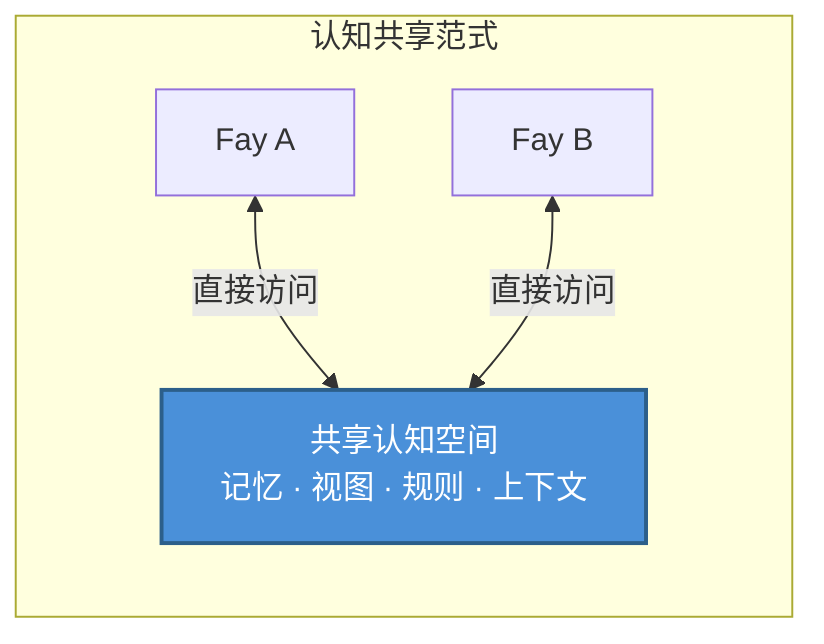

# 第二章 TP 的核心定位

### 2.1 认知共享协议 vs 消息传递协议

理解 TP 的核心定位，需要首先区分两种截然不同的通信范式。

#### 消息传递范式："传话"模式

传统通信协议——从 HTTP 到 gRPC，从 MCP 到 A2A——本质上都遵循同一种范式：**序列化 → 传输 → 反序列化**。

发送方将内部状态编码为某种线路格式（JSON、Protobuf、XML），通过网络传输到接收方，接收方再将线路格式解码为自己的内部表示。每一次通信都是一次完整的信息打包和拆包过程。

这种模式如同"传话"——信使将说话人的意思记录下来，跑到另一个人面前复述。信息在编码和解码的过程中，不可避免地会产生损耗：语境丢失、隐含假设遗漏、表达精度下降。

#### 认知共享范式："心灵感应"模式

TP 提出了一种根本不同的范式：**在授权范围内建立共享的认知空间，双方直接访问共享的认知资源**。

在这种模式下，通信双方不再需要将所有信息打包成消息来回传递。相反，它们在一个受控的共享空间中协作——共享的记忆片段、视图状态、推理规则和环境上下文构成了双方共同的认知基础。

这并不意味着 TP 完全消除了消息传输——建立共享空间本身需要协商和同步。但一旦共享语境建立，后续的协作效率将大幅提升，因为双方不再需要反复序列化和传输已经共享的认知资源。

### 2.2 "心灵感应"隐喻解读

"Telepathy（心灵感应）"这个命名并非修辞上的夸张，而是对 TP 核心机制的精确隐喻。

#### 一个具体的场景

设想两个人在不同地点参加远程会议。其中一人说："你看我用红框框住的那部分数据。"

在人类世界中，这句话要产生意义，需要一系列媒体手段的支撑：屏幕共享软件将说话人的屏幕画面实时传输到对方的显示器上；对方需要在自己的屏幕上找到红框的位置；如果网络延迟或画面模糊，对方可能看到的是上一帧的画面，红框的位置已经变了。

整个过程充满了信息传递的摩擦：编码（屏幕像素 → 视频流）、传输（网络带宽和延迟）、解码（视频流 → 屏幕像素）、认知对齐（对方需要在自己的视觉空间中定位红框）。

但如果双方拥有"心灵感应"能力，情况将截然不同——双方直接"看到"同一个视图，红框的位置、数据的内容、甚至说话人标注红框时的意图，都在共享的认知空间中即时可见。没有编码损耗，没有传输延迟，没有认知对齐的成本。

#### 在 Fay-to-Fay 场景中的实现

在人类之间，"心灵感应"是科幻概念。但在 Fay-to-Fay 的场景中，这种共享语境是**可以工程化实现的**。

Fay 的认知状态本质上是结构化的数据——记忆是可索引的知识图谱，视图是可序列化的状态树，推理规则是可共享的逻辑引擎。当两个 Fay 建立 TP 会话时，它们可以在宿主授权的范围内，将部分认知资源纳入共享空间：

- **会话级别的部分长记忆**：与当前协作主题相关的知识片段
- **视图界面状态**：双方正在操作的界面或数据视图的实时状态
- **规则或推理引擎**：用于当前任务的推理逻辑和决策规则
- **环境上下文**：时间、地点、设备状态等动态环境信息

这正是"Telepathy Protocol"命名的由来——它让 Fay 之间的通信从"传话"升级为"心灵相通"。
