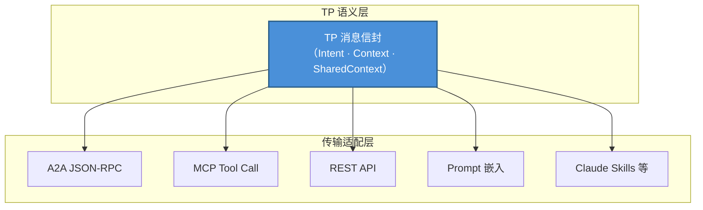
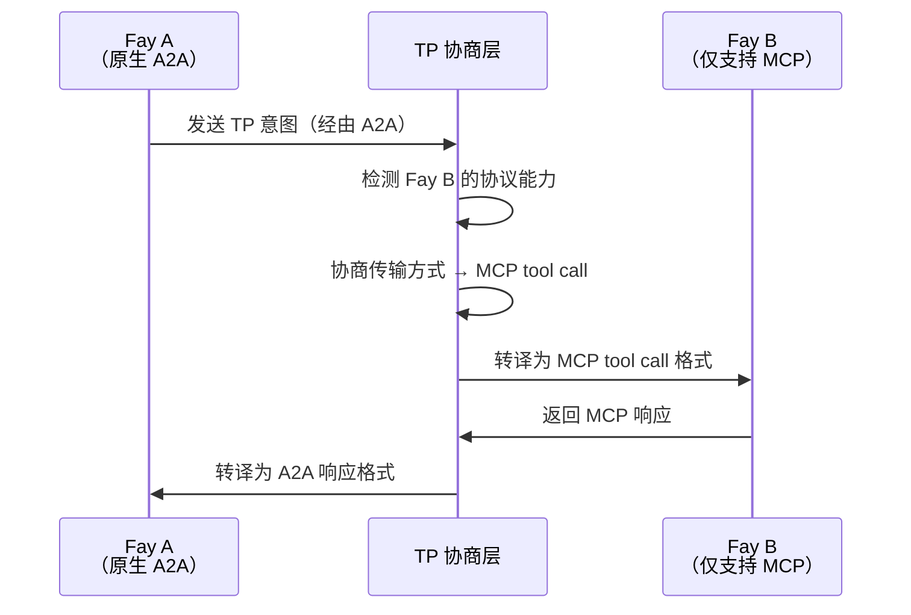

# 第三章 三大独特能力

TP 的设计围绕三大独特能力展开，它们共同构成了 TP 区别于所有现有通信协议的核心竞争力。

### 3.1 传输无关性（Transport Agnosticism）

#### 设计哲学

TP 不替代 MCP 或 A2A，而是在它们之上建立**统一的语义抽象**。

这一设计哲学的核心洞察在于：对于认知共享而言，重要的不是消息通过什么管道传输，而是消息承载了什么语义。TP 消息可以通过以下任何一种传输方式传递：

| 传输方式 | 说明 |
|---------|------|
| A2A 的 JSON-RPC | 通过 A2A 协议的标准消息通道传递 TP 语义 |
| MCP 的 tool call | 将 TP 消息封装为 MCP 工具调用的参数 |
| 传统 REST API | 通过 HTTP 请求体传递 TP 消息信封 |
| Prompt 传递 | 将 TP 语义嵌入自然语言 Prompt 中（降级模式） |
| Claude Skills 等新兴方式 | 兼容未来可能出现的新型 AI 交互范式 |

#### 类比

这种设计可以类比为 HTTP 与传输层的关系。HTTP 协议可以运行在 TCP 之上，也可以运行在 QUIC 之上——HTTP 关心的是请求-响应语义，而非底层的传输机制。同样，TP 关心的是认知共享的语义层，而非消息的传输层。

传输无关性确保了 TP 不会被绑定到任何单一的底层协议上。当新的传输方式出现时，TP 只需增加一个传输适配器，而无需修改协议本身的语义定义。

### 3.2 协议协商与转译（Protocol Negotiation）

#### 问题场景

在现实的 AI 生态中，不同的 Fay 可能"说"不同的协议语言。一个 Fay 可能原生支持 A2A，另一个可能只理解 MCP 的 tool call 格式，还有一些可能仅支持传统的 REST API 调用。

当这些"母语"不同的 Fay 需要协作时，如果没有统一的协商和转译机制，它们将无法通信——就像两个只会说不同语言的人面对面却无法交流。

#### TP 的解决方案

TP 充当**自适应的翻译层**，通过以下步骤实现跨协议通信：

1. **能力探测**：TP 首先探测对方 Fay 支持哪些传输协议
2. **合同协商**：双方约定一个"合同模板"——确定使用 MCP、A2A、API 调用还是 Prompt 作为底层传输方式
3. **语义映射**：在约定的传输方式之上，建立 TP 语义到底层协议格式的映射规则
4. **透明转译**：后续通信中，TP 自动将语义意图转译为对方能理解的格式

这种机制的关键价值在于：即使对方 Fay 尚未"学会"某种协议，TP 也能通过转译让双方顺利通信。协议的差异对上层的认知共享逻辑完全透明。

### 3.3 共享语境（Shared Context）

#### 核心地位

共享语境是 TP 最核心的能力，也是"心灵感应"命名的根本由来。如果说传输无关性解决了"通过什么管道通信"的问题，协议协商解决了"用什么语言通信"的问题，那么共享语境解决的是"通信的本质是什么"的问题。

#### 机制描述

当两个 Fay 启用 TP 会话时，双方会进入**共享语境模式**。在这一模式下，双方不再仅仅交换消息，而是共同维护一个受控的认知空间。

可共享的认知资源包括：

| 认知资源类型 | 说明 | 典型场景 |
|------------|------|---------|
| 会话级别的部分长记忆 | 与当前协作主题相关的知识片段 | 医疗 Fay 共享患者的相关病史摘要——如过敏史、慢性病记录、近期用药情况，使得会诊 Fay 无需重新询问即可了解患者背景 |
| 视图界面状态 | 双方正在操作的界面或数据视图 | 多个 Fay 协作编辑同一份合同文本——法律 Fay 标注了需要修改的条款，财务 Fay 立即看到标注位置并评估财务影响，无需来回发送文档版本 |
| 规则或推理引擎 | 用于当前任务的推理逻辑 | 法律 Fay 共享适用的法规条文和推理链——税务 Fay 可以直接引用这些法规来计算税务影响，而不需要法律 Fay 每次都把相关法条复制粘贴到消息中 |
| 环境上下文 | 时间、地点、设备状态等动态信息 | 无人机上的 Fay 共享实时 GPS 坐标、电池电量、摄像头视角给地面控制 Fay——地面 Fay 可以直接"感知"无人机的状态，而非等待定期的状态报告消息 |

#### 宿主授权与审计

共享语境的范围严格由**宿主授权**决定。Fay 不能自行决定共享哪些认知资源——每一项共享都必须在宿主预先授权的边界内进行。同时，所有对共享语境的访问均**可审计**，宿主可以事后查阅哪些信息被共享、被谁访问、在什么时间点发生。

这一设计与 A2A 的 Opaque Execution 原则形成了鲜明对比：

| 维度 | A2A（Opaque Execution） | TP（Shared Context） |
|------|------------------------|---------------------|
| 内部状态 | 不共享，Agent 是黑盒 | 在授权范围内选择性共享 |
| 协作深度 | 任务级别（委派与汇报） | 认知级别（共享记忆与推理） |
| 信息传递 | 每次完整序列化传输 | 共享空间内直接访问 |
| 隐私控制 | 无系统性机制 | 宿主授权 + 全程审计 |
| 适用场景 | 松耦合的服务编排 | 深度协作与认知融合 |

共享语境使得 Fay 之间的协作从"传话"升级为"共同思考"——这是 TP 作为认知共享协议的核心价值所在。
