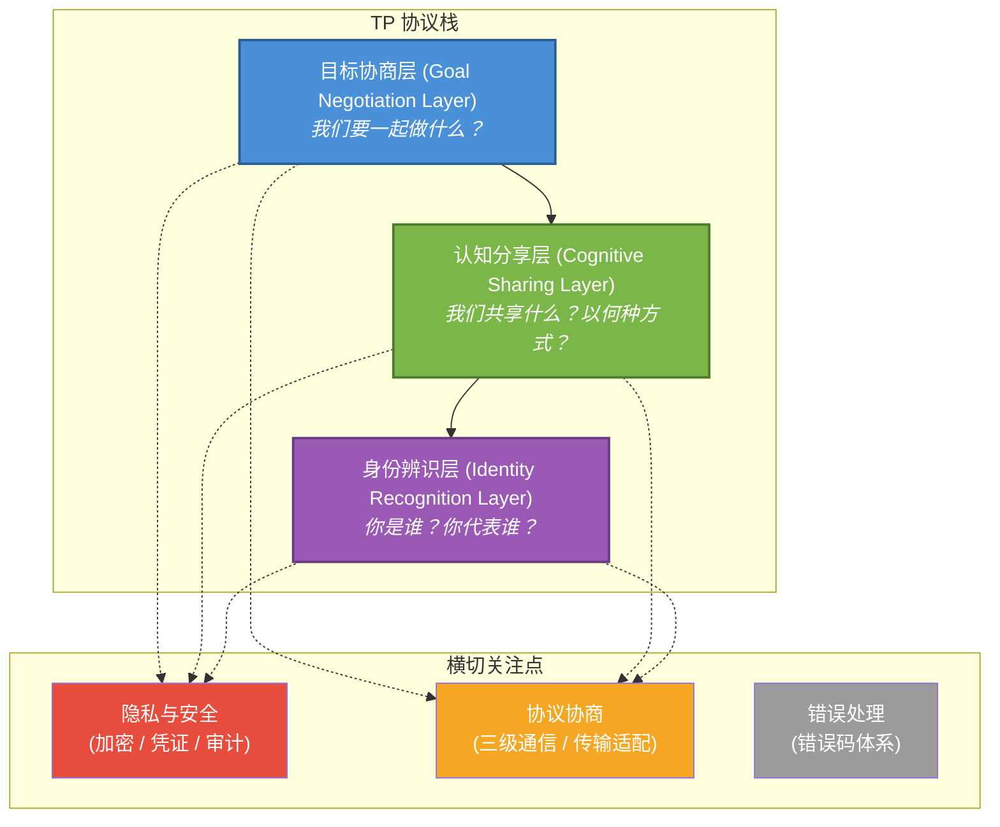
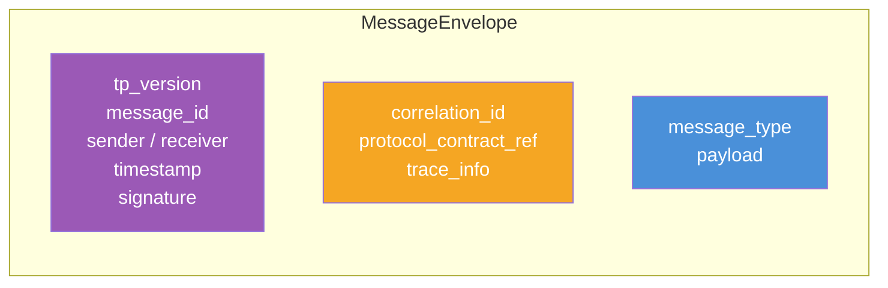
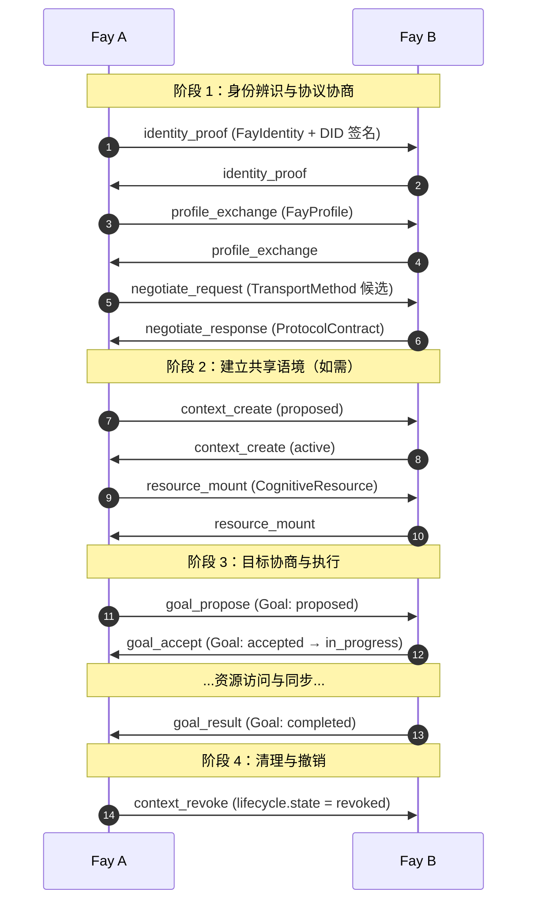
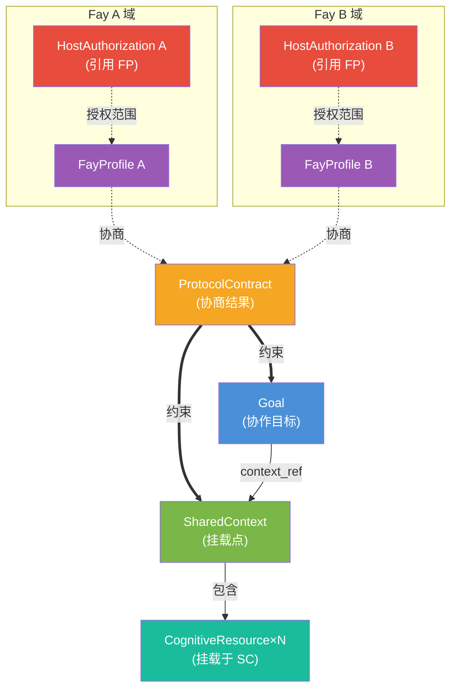

# 第 03 章 架构概览

## 3.1 三层模型

TP 的核心架构由三个语义分层组成。每一层回答一个独立的问题，三层组合起来构成 Fay 之间完整的认知协作能力。

### 3.1.1 身份辨识层（Identity Recognition Layer）

回答：**「你是谁？你代表谁？」**

- **核心数据结构**：`FayIdentity`、`DIDIdentifier`、`FayProfile`、`HostAuthorization`
- **核心契约**：每个 Fay MUST 有可加密验证的身份；每个代表人类原型行事的 iFay MUST 携带 FP 授权引用。
- **详见**：第 04 章

身份辨识层是 TP 区别于 A2A 的根本之处。A2A 中 Agent 是无主的服务节点；TP 中每个 Fay 都明确归属于某个人类原型，并在通信中持续暴露这一归属关系。

### 3.1.2 认知分享层（Cognitive Sharing Layer）

回答：**「我们共享什么？以何种方式？」**

- **核心数据结构**：`SharedContext`、`CognitiveResource`、`MountedResource`、`AccessControlList`
- **核心契约**：共享认知资源 MUST 在受控的 SharedContext 中进行；所有挂载、访问、卸载、撤销 MUST 受 ACL 与生命周期约束。
- **详见**：第 05 章

认知分享层是 TP 的灵魂——蓝图所述「心灵感应」的工程化实现。它将 Fay 之间的协作从"序列化-传输-反序列化"的传话模式，升级为在受控空间中直接访问共享资源。

### 3.1.3 目标协商层（Goal Negotiation Layer）

回答：**「我们要一起做什么？」**

- **核心数据结构**：`Goal`、`GoalDescription`、`SubGoalReference`、`GoalResult`
- **核心契约**：协作目标 MUST 经过显式协商；任何执行 MUST 在双方对 `Goal` 状态达成一致后开始。
- **详见**：第 06 章

`Goal` 统一了传统 Agent 协议中分裂的 `Intent`（意图）与 `Task`（任务）概念——意图是被讨论的目标，任务是已被接受的目标。

## 3.2 横切关注点

三个横切关注点贯穿全部三层。

### 3.2.1 隐私与安全（Privacy & Security）

- **加密**：`EncryptedPayload` 用于人类原型隐私数据传输
- **选择性披露**：`SelectiveDisclosure` 控制可见字段范围
- **回调凭证**：`CallbackCredential` 提供有时效、可撤销的访问授权
- **审计**：所有隐私数据访问与凭证使用 MUST 可审计

详见第 07 章。

### 3.2.2 协议协商（Protocol Negotiation）

- **三级通信级别**：标准化（tier_1）、AI 生成（tier_2）、自然语言兜底（tier_3）
- **传输无关性**：TP 消息可承载于 native_tp / a2a / mcp / rest / prompt
- **协议契约**：协商结果以 `ProtocolContract` 形式固化，后续通信的元数据基础

详见第 08、09 章。

### 3.2.3 错误处理（Error Handling）

- **统一错误码**：`TP-{CATEGORY}{CODE}` 格式（如 `TP-ID001`、`TP-CTX002`）
- **可恢复性分类**：可重试 / 需协商 / 终态
- **错误关联**：通过 `correlation_id` 与原请求关联

详见第 10 章。

## 3.3 消息信封（MessageEnvelope）

所有 TP 通信 MUST 通过统一的 `MessageEnvelope` 包装。信封是传输无关的——同一个信封可承载于任何受支持的传输方式（详见第 09 章）。

| 字段组 | 角色 |
|-------|------|
| 身份与签名 | `tp_version`、`message_id`、`sender`、`receiver`、`timestamp`、`signature` |
| 关联与追踪 | `correlation_id`、`protocol_contract_ref`、`trace_info` |
| 业务载荷 | `message_type`（区分载荷类型）、`payload`（具体类型由 `message_type` 决定） |

详细字段规范见第 11 章及 `schema/draft/schema.mdx` 中 `MessageEnvelope` 条目。

## 3.4 会话生命周期

一次完整的 TP 会话遵循以下阶段。每个阶段与各层的交互在后续章节详细规定。

各阶段映射到本规范的章节：

| 阶段 | 主要章节 |
|------|---------|
| 阶段 1 | §04（身份）、§08（协议协商） |
| 阶段 2 | §05（认知分享） |
| 阶段 3 | §06（目标协商） |
| 阶段 4 | §05.4（生命周期）、§07.4（审计） |

并非所有会话都包含所有阶段。最简的"通知型"会话（`goal_type = notify`）可能跳过阶段 2，仅完成阶段 1、3。

## 3.5 数据流总览

下图展示一个典型的双向协作会话中各核心数据结构的关系。

关键关系：

- 每个 `FayProfile` 必须引用其 `HostAuthorization`（iFay 必需，coFay 视场景）
- `ProtocolContract` 是会话级元数据，约束所有后续消息
- `SharedContext` 是资源挂载点，`Goal` 通过 `context_ref` 关联
- `CognitiveResource` 通过 `MountedResource` 挂载到 SharedContext

## 3.6 设计原则到架构映射

蓝图第 6 章定义了 TP 的五项设计原则。本节说明它们如何在架构中落地。

| 设计原则 | 架构落地 |
|---------|---------|
| 共享认知优于消息传递 | 认知分享层：`SharedContext` 提供长期挂载空间，避免反复序列化 |
| 传输无关性 | `MessageEnvelope` 与传输绑定层解耦（§09） |
| 自适应协议协商 | 协议协商层：`ProtocolContract` 协商三级通信能力（§08） |
| 人类原型主权隐私 | 身份层 `HostAuthorization` + 安全层 `EncryptedPayload` + `SelectiveDisclosure` |
| 可审计信任边界 | 安全层全局审计要求 + `CallbackCredential` 凭证体系 |

## 3.7 与姊妹协议的边界

TP 在 iFay 协议体系中专注于 **Fay ↔ Fay 通信**。与姊妹协议的接口点：

| 边界 | TP 中的引用 | 由谁定义 |
|------|------------|---------|
| 人类原型 → iFay 身份绑定 | `FayIdentity.host_id` | FP（Faying Protocol） |
| 人类原型 → iFay 授权 | `HostAuthorization.fp_authorization_ref` | FP |
| 人类原型 ↔ Fay 自然语言 | 不在 TP 内 | ICP（Interactive Conversation Protocol） |
| Fay → 硬件接管 | 不在 TP 内 | CAP（Control Authority Protocol） |
| 硬件 → Fay 数据流 | 可挂载为 `environment_context` 资源 | DTP（Data Tunnel Protocol） |
| Fay 技能发现 | `CapabilityDescriptor` 仅描述自身；跨 Fay 发现走 SSP | SSP（Skill Sharing Protocol） |

TP 引用其他协议的产物（如 FP 授权）但不规定其内部细节；其他协议也不规定 TP 内部行为——彼此通过 ID 与引用解耦。

## 3.8 接下来的章节

各层与横切关注点的详细规范如下：

- **§04** 身份辨识层：DID 验证细节、`FayProfile` 交换流程、`HostAuthorization` 验证
- **§05** 认知分享层：`SharedContext` 状态机、资源挂载语义、ACL 执行
- **§06** 目标协商层：`Goal` 状态机、子目标 DAG 规则、咨询模式
- **§07** 隐私与安全：加密算法选择、凭证签发与撤销、审计字段
- **§08** 协议协商：三级通信级别详细行为、`ProtocolContract` 协商流程
- **§09** 传输绑定：原生 TP / A2A / MCP / REST / Prompt 五种映射
- **§10** 错误处理：错误码全集、可恢复性分类
- **§11** 数据模型：与 schema 三件套的对应索引
- **§12** 术语表
