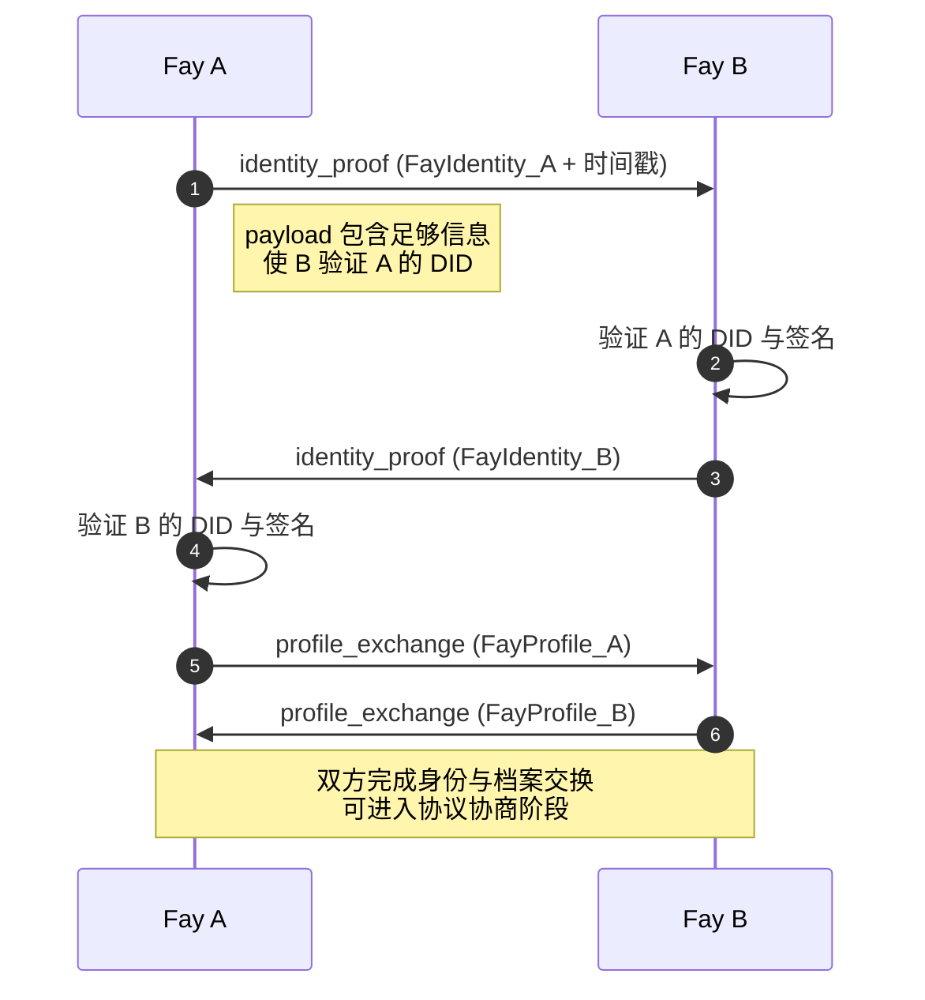

# 第 04 章 身份辨识层

## 4.1 概述

身份辨识层回答两个根本问题：**「你是谁？」** 与 **「你代表谁？」**。这两个问题缺一不可——只回答前者，TP 退化为又一个 Agent 协议；只回答后者，无法建立可加密验证的信任。

本章规定：

- Fay 身份的格式与 DID 验证（§4.2）
- `FayProfile` 在会话建立阶段的交换流程（§4.3）
- 人类原型授权（`HostAuthorization`）的验证规则（§4.4）
- 身份层错误处理（§4.5）

## 4.2 Fay 身份与 DID 验证

### 4.2.1 FayIdentity 字段约束

每个 Fay MUST 拥有全局唯一的 `FayIdentity`。完整字段定义见 `schema/draft/schema.mdx`，本节给出规范性约束。

| 字段 | 约束 |
|------|------|
| `fay_id` | MUST 全局唯一；MUST 仅包含 URI 安全字符（`[A-Za-z0-9\-._~]`）；长度 1-256 字节 |
| `fay_type` | MUST 是 `iFay` 或 `coFay` |
| `host_id` | 当 `fay_type = iFay` 时 MUST 存在；当 `fay_type = coFay` 时 MAY 存在 |
| `did` | MUST 存在；其 `proof.proof_value` MUST 对应于 `did.value` 描述的密钥 |

**约束解释**：

- `coFay` 可以无 `host_id`，因为承担社会公共职能的 coFay（如医院 coFay、社保 coFay）的所有权可能是组织级而非个人级。
- 如 coFay 提供 `host_id`，该字段 MUST 标识负责该 coFay 运维的组织或个人。

### 4.2.2 DID 方法分级

TP 支持三种 DID 方法，按信任等级递增：

| 方法 | 信任级别 | 适用场景 |
|------|---------|---------|
| `did:key` | 低 | 临时身份、离线友好、原型与实验 |
| `did:web` | 中 | 标准在线验证、生产环境通用 |
| `did:chain` | 高 | 需不可篡改审计、跨组织高信任协作 |

实现 MUST 按一致性级别支持对应的 DID 方法（见 §02.2）。

### 4.2.3 DID 签名验证

接收方收到任何 `MessageEnvelope` 后，MUST 在处理 `payload` 之前完成以下验证：

1. **签名必填检查**：`MessageEnvelope.signature` MUST 存在（`tp_core` 起即必填）。
2. **签名算法匹配**：`signature` 的算法 MUST 与 `sender.did.proof.type` 一致。
3. **签名内容**：签名 MUST 覆盖 `MessageEnvelope` 中除 `signature` 字段以外的全部内容（按 JSON Canonicalization Scheme [RFC 8785] 规范化后的字节）。
4. **公钥获取**：根据 `sender.did.method` 与 `value` 解析公钥；解析失败 MUST 返回 `TP-ID002`。
5. **签名验证**：使用解析得到的公钥验证签名；验证失败 MUST 返回 `TP-ID003`。

签名验证失败的消息 MUST 不被处理，且 MUST NOT 触发任何 `payload` 中描述的副作用。

### 4.2.4 时间戳与重放保护

为防止重放攻击：

- 接收方 MUST 验证 `MessageEnvelope.timestamp` 与本地时间的差异不超过 **±5 分钟**。
- 接收方 MUST 维护一个滑动窗口（≥ 5 分钟）的 `message_id` 缓存，对窗口内重复的 `message_id` MUST 返回 `TP-ID004`。
- 时钟漂移超过 ±5 分钟 MUST 返回 `TP-ID005`。

`tp_core` 实现 MAY 跳过 `message_id` 缓存（仅依赖时间窗口），但 SHOULD 在生产环境中实现完整重放保护。

## 4.3 FayProfile 交换流程

### 4.3.1 何时交换

`FayProfile` MUST 在以下时机交换：

- 会话建立的第一次握手（在 `negotiate_request` 之前或同时）
- `FayProfile` 的关键字段（`capabilities`、`host_authorization`、`conformance_level`）发生变更后

### 4.3.2 交换序列



### 4.3.3 identity_proof 消息

`message_type = "identity_proof"` 的消息 `payload` MUST 包含：

```json
{
  "challenge": "<base64-string>",
  "challenge_response": "<base64-string>"
}
```

| 字段 | 含义 |
|------|------|
| `challenge` | 由发起方生成的随机字节串（≥ 32 字节），用于防止预签名重放 |
| `challenge_response` | 当且仅当作为响应方时存在，是对方 `challenge` 的签名 |

首次发送 `identity_proof` 时仅含 `challenge`；响应方在自己的 `identity_proof` 中包含针对该 `challenge` 的签名响应，并附加自身的新 `challenge`。

### 4.3.4 profile_exchange 消息

`message_type = "profile_exchange"` 的消息 `payload` MUST 是一个完整的 `FayProfile` 对象。

接收方 MUST 验证：

1. `FayProfile.identity` 与 `MessageEnvelope.sender` **完全一致**——任何不一致 MUST 返回 `TP-ID006`。
2. `FayProfile.capabilities` 中的每个 `CapabilityDescriptor` 的 `version` 字段 MUST 是有效 SemVer 字符串。
3. 如 `FayProfile.identity.fay_type = iFay`，`FayProfile.host_authorization` MUST 存在且通过 §4.4 的验证。

## 4.4 人类原型授权验证

### 4.4.1 HostAuthorization 的角色

`HostAuthorization` 是 iFay 携带的「委托书」。它声明：「我（Fay）已被人类原型 X 授权，可执行 Y 类操作，分享 Z 类资源，期限不超过 D。」

接收方 MUST 在以下时机验证 `HostAuthorization`：

- 收到 `profile_exchange` 时，对 `iFay` 的 `host_authorization` 字段
- 任何 `goal_propose`、`resource_mount`、`consultation_request` 等操作消息到达时（如这些操作涉及人类原型隐私数据）

### 4.4.2 验证规则（tp_secure 及以上）

`tp_secure` 起 MUST 实现以下验证：

1. **存在性**：`fp_authorization_ref` MUST 非空。
2. **可解析性**：`fp_authorization_ref` MUST 是有效的 FP 协议授权引用 URI。
3. **可验证性**：实现 MUST 通过 FP 协议的验证端点查询该引用的状态（`active` / `revoked` / `expired`）。
4. **状态有效**：状态 MUST 为 `active`。
5. **范围匹配**：当前操作请求的资源类型与操作类型 MUST 包含在 `authorized_resource_types` 与 `authorized_operations` 内。
6. **时长合规**：会话或操作的剩余时长 MUST 不超过 `max_sharing_duration`。
7. **限制满足**：所有 `restrictions` 中的约束 MUST 被遵守。

任何一项验证失败 MUST 返回相应的 `TP-ID0XX` 错误码（详见第 10 章）。

### 4.4.3 缓存与失效

为减少 FP 查询负担：

- 实现 MAY 缓存 `fp_authorization_ref` 的验证结果。
- 缓存 TTL MUST 不超过 **60 秒**。
- 实现 MUST 监听 FP 协议的撤销通知（如 FP 提供该机制）；收到撤销通知后 MUST 立即失效缓存。
- 即使缓存命中，对**人类原型隐私数据访问**操作 SHOULD 实时验证（不使用缓存）。

### 4.4.4 coFay 的特殊情况

`coFay` 通常不携带 `host_authorization`（无个人人类原型）。但当 coFay 处理涉及他人人类原型的隐私数据时（如医院 coFay 处理患者数据），coFay 自身的 `HostAuthorization` MUST 描述其作为受托方的授权范围。

具体地，coFay 在转发或处理来自 iFay 的人类原型隐私数据时：

- coFay MUST 验证收到的 iFay 的 `HostAuthorization`（按 §4.4.2）
- coFay MUST NOT 超出该授权范围使用数据
- coFay MUST 在审计日志（详见 §07.4）中记录授权来源与使用范围

## 4.5 一致性级别声明

`FayProfile.conformance_level` 字段 MUST 在 `profile_exchange` 时声明。声明规则：

- 声明 MUST 诚实——夸大声明可能导致互操作性失败与安全漏洞（见 §02.4.2）。
- 接收方 MUST 按声明级别的能力集与对方互动；超出对方声明能力的请求 MUST 不发送。
- 一方在会话中 MAY 提升声明（增加能力），但 MUST NOT 降低（移除已宣告能力）。

## 4.6 端到端示例

下面是一个完整的身份辨识阶段示例。Fay A（iFay，患者）与 Fay B（coFay，医院）建立会话。

### 4.6.1 A 发送 identity_proof

```json
{
  "tp_version": "1.0.0",
  "message_id": "01902c4f-1a2b-7000-8000-000000000001",
  "sender": {
    "fay_id": "fay:patient-zhang-3389",
    "fay_type": "iFay",
    "host_id": "host:zhang-san-natural-person",
    "did": {
      "method": "did:web",
      "value": "did:web:zhang-3389.fay.example.com",
      "proof": {
        "type": "Ed25519Signature2020",
        "created": "2026-05-27T08:30:00.000Z",
        "verification_method": "did:web:zhang-3389.fay.example.com#key-1",
        "proof_value": "<base64-signature>"
      }
    }
  },
  "receiver": {
    "fay_id": "fay:hospital-shanghai-east",
    "fay_type": "coFay",
    "did": {
      "method": "did:web",
      "value": "did:web:hospital-east.shanghai.gov.cn",
      "proof": { /* ... */ }
    }
  },
  "timestamp": "2026-05-27T08:30:00.000Z",
  "message_type": "identity_proof",
  "payload": {
    "challenge": "Y2hhbGxlbmdlLWZyb20tZmF5LWE="
  },
  "signature": "<base64-envelope-signature>"
}
```

### 4.6.2 B 响应 identity_proof（带挑战签名）

```json
{
  "tp_version": "1.0.0",
  "message_id": "01902c4f-1a2b-7000-8000-000000000002",
  "sender": { /* fay:hospital-shanghai-east 完整 FayIdentity */ },
  "receiver": { /* fay:patient-zhang-3389 完整 FayIdentity */ },
  "timestamp": "2026-05-27T08:30:01.500Z",
  "correlation_id": "01902c4f-1a2b-7000-8000-000000000001",
  "message_type": "identity_proof",
  "payload": {
    "challenge": "Y2hhbGxlbmdlLWZyb20tZmF5LWI=",
    "challenge_response": "<base64-signature-of-challenge-from-A>"
  },
  "signature": "<base64-envelope-signature>"
}
```

### 4.6.3 A 发送 profile_exchange

```json
{
  "tp_version": "1.0.0",
  "message_id": "01902c4f-1a2b-7000-8000-000000000003",
  "sender": { /* fay:patient-zhang-3389 */ },
  "receiver": { /* fay:hospital-shanghai-east */ },
  "timestamp": "2026-05-27T08:30:02.000Z",
  "message_type": "profile_exchange",
  "payload": {
    "identity": { /* 同 sender */ },
    "capabilities": [
      {
        "capability_id": "cap:health-record-disclosure",
        "name": "选择性健康记录披露",
        "version": "1.0.0",
        "input_schema": { /* ... */ },
        "output_schema": { /* ... */ },
        "access_level": "host_delegated"
      }
    ],
    "sharing_willingness": {
      "shareable_resource_types": ["memory_fragment", "view_state"],
      "preferred_mode": "delegated_access",
      "max_concurrent_contexts": 3
    },
    "status": {
      "availability": "online",
      "current_contexts": 0,
      "last_active": "2026-05-27T08:30:02.000Z"
    },
    "host_authorization": {
      "fp_authorization_ref": "fp:auth:zhang-san:hospital-east:claim-2026-001",
      "authorized_resource_types": ["memory_fragment"],
      "authorized_operations": ["read", "disclose_diagnosis"],
      "max_sharing_duration": "PT2H",
      "restrictions": [
        {
          "restriction_type": "no_psychological_records",
          "description": "不允许披露心理咨询记录"
        }
      ]
    },
    "conformance_level": "tp_secure"
  },
  "signature": "<base64-envelope-signature>"
}
```

接收方（Fay B）的处理流程：

1. 验证 `MessageEnvelope` 签名（§4.2.3）
2. 验证 `payload.identity == sender`（§4.3.4）
3. 由于 `payload.identity.fay_type = "iFay"`，验证 `host_authorization`（§4.4.2）：
   - 调用 FP 端点查询 `fp:auth:zhang-san:hospital-east:claim-2026-001` 状态 → `active`
   - 记录授权范围：`memory_fragment` + `read/disclose_diagnosis` + 不超过 2 小时
4. 接受 A 的 `profile_exchange`，进入协议协商阶段

## 4.7 身份层错误码

身份层错误码使用 `TP-ID0XX` 前缀，详见第 10 章。常见错误：

| 错误码 | 触发条件 |
|-------|---------|
| `TP-ID001` | `FayIdentity` 字段缺失或格式错误 |
| `TP-ID002` | DID 公钥解析失败 |
| `TP-ID003` | 签名验证失败 |
| `TP-ID004` | 检测到重放（重复 `message_id`） |
| `TP-ID005` | 时间戳超出允许窗口 |
| `TP-ID006` | `payload.identity` 与 `sender` 不一致 |
| `TP-ID007` | `HostAuthorization` 字段缺失（iFay 必需） |
| `TP-ID008` | `fp_authorization_ref` 无效或已撤销 |
| `TP-ID009` | 操作超出 `HostAuthorization` 范围 |
| `TP-ID010` | 一致性级别声明与对方期望不匹配 |
